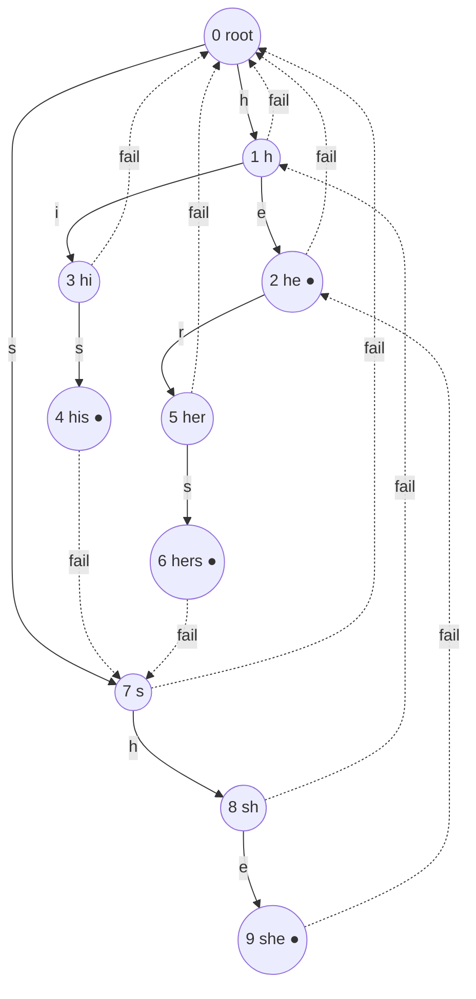

# Aho-Corasick

## Prerequisites

- [Trie](../data-structures/trie.md) [Must read] - Aho-Corasick *is* a trie augmented with failure links and output links; you must know trie node structure, `is_end`, and the child-walk before the failure-link machinery makes sense.
- [String Matching](./string-matching.md) [Must read] - the failure link here is KMP's failure function generalized from a single pattern (a line) to many patterns (a trie); read KMP first to see the one-pattern case this generalizes.
- [BFS](./bfs.md) [Must read] - failure links are built in strict BFS (level) order over the trie; you need to know why BFS visits nodes in non-decreasing depth order to see why that order is mandatory here.
- [Queue](../data-structures/queue.md) [Should read] - the BFS construction is queue-driven; the mechanics are the same FIFO frontier expansion as plain BFS.

## Table of Contents

- [Prerequisites](#prerequisites)
- [Table of Contents](#table-of-contents)
- [What it is](#what-it-is)
- [Intuition](#intuition)
- [How it works](#how-it-works)
- [Correctness / invariant](#correctness--invariant)
- [Complexity derivation](#complexity-derivation)
- [Constraints & approach](#constraints--approach)
- [When to use / when not](#when-to-use--when-not)
- [Comparison](#comparison)
- [Graph/tree assumptions](#graphtree-assumptions)
- [Edge cases](#edge-cases)
- [Implementation](#implementation)
- [What the interviewer probes for](#what-the-interviewer-probes-for)
- [Practice problems](#practice-problems)
  - [Implement Aho-Corasick / Multi-pattern string matching](#1-implement-aho-corasick--multi-pattern-string-matching)
  - [Short Encoding of Words (LC 820)](#2-short-encoding-of-words-lc-820--trie-suffix-links-not-aho-corasick-but-the-neighbor-to-not-confuse)
  - [Stream of Characters (LC 1032)](#3-stream-of-characters-lc-1032--suffix-link-style-online-matching)
  - [Word Filter / Multi-keyword Content Moderation](#4-word-filter--multi-keyword-content-moderation)

## What it is

**Aho-Corasick** finds every occurrence of **any of `k` patterns** (total length `Σm`) inside a text `T` (length `n`) in a single left-to-right pass, in **O(n + Σm + matches)** - a hard, deterministic bound, not an average case. It builds a **trie** of all `k` patterns, then augments every node with a **failure link** (where to fall back to on a mismatch, generalizing KMP's failure function from one string to a whole trie) and an **output link** (a shortcut to the nearest ancestor-in-failure-chain that itself ends a pattern, so every match at a position is reported without walking the full failure chain).

Mental model: **KMP generalized from a line to a trie.** KMP's failure function answers "if pattern `P` mismatches at position `j`, what's the longest suffix of what I've matched that is also a prefix of `P`?" - a question about one string. Aho-Corasick asks the same question but for **every node of a trie holding many patterns at once**: "if I mismatch at this trie node, what's the longest suffix of the path I've walked that is also *some prefix in the trie*?" One structure answers that question for all `k` patterns simultaneously, so the whole text is scanned exactly once regardless of how many patterns you're hunting for.

> **Takeaway (say this out loud):** "Aho-Corasick is KMP's failure function generalized to a trie - build the trie of all patterns, add failure links via BFS in level order, chain output links so every match at a position surfaces in O(1) amortized, and scan the text once: O(n + Σm + matches), no probability, no per-pattern rescans."

**Complexity:** O(Σm · σ) time and space to build (σ = alphabet size, or O(Σm) with a hash-map/dict child representation), O(n + matches) to scan the text - **O(n + Σm + matches)** total. Space O(Σm) for the trie plus O(Σm) for failure/output links.

## Intuition

Why not just run KMP `k` times, once per pattern? Because that's O(k·n) - you re-read the whole text once per pattern, and the patterns' shared structure ("comp" and "computer" and "computation" all start the same way) is thrown away every time you restart. The fix mirrors the fix trie already made for prefix storage: **store all patterns in one trie so shared prefixes cost one walk, not `k` walks.**

But a trie alone only tells you "does this path exist" - it has no notion of *falling back* on a mismatch. That's the missing piece KMP solved for a single string: when you mismatch partway through, don't restart from the root, fall back to the longest already-matched suffix that is still a valid prefix. Aho-Corasick's **failure link** is exactly that idea lifted onto a trie: for a trie node `u` reached by walking string `s` from the root, `fail(u)` points to the trie node reached by walking the **longest proper suffix of `s` that is also some prefix present in the trie**. On a mismatch while scanning the text, instead of restarting at the root, jump to `fail(u)` and keep going - the text pointer never rewinds, exactly like KMP.

The second piece is specific to the multi-pattern setting and is the classic trap: a single position in the text can be the end of **several** patterns at once (if you inserted both `"he"` and `"she"`, the text `"...she..."` ends a match for both at the same position, since `"he"` is a suffix of the path to `"she"`'s node). Naively, to report every match at a position you'd walk the **entire failure chain** from the current node back to the root, checking `is_end` at every step - and if patterns are deeply nested suffixes of each other, that walk can cost O(m) per position, degrading the whole scan to O(n·m). The fix is the **output link** (a.k.a. **dictionary link**): precompute, for every node, a pointer to the *nearest* ancestor in its failure chain that is itself a pattern end (or `None`). Chasing output links instead of the raw failure chain visits only the nodes that actually produce a match, and the total number of output-link hops across the whole scan is bounded by the total number of matches - not by `m` per position.

The senior framing: **failure links generalize KMP's fallback; output links generalize "keep finding overlapping matches" from a single string to arbitrarily many nested patterns.** Skipping output links doesn't just miss the optimization - it can silently produce the wrong asymptotic complexity while still returning a correct answer, which is why this is the trap graders single out.

## How it works

Three phases: **(1)** build the trie of all patterns, **(2)** compute failure and output links via BFS in strictly increasing depth order, **(3)** scan the text once using the automaton.

**Patterns:** `{"he", "she", "his", "hers"}`. Build the trie first (root `0`):

```
Trie over {he, she, his, hers} (● marks a pattern end / is_end):

        (0) root
       /  |    \
      h   s     ...
      |   |
     (1) (5)
     / \   \
    e   i   h
    |   |   |
   (2)● (3)●(6)
    |          \
    r           e
    |           |
   (4)         (7)●
    |
   (5)●

Node table (depth, path string):
0: ""        (root)
1: "h"
2: "he"  ●
3: "hi"
4: "his" ●
5: "her"
6: "sh"
7: "she" ●
8: "hers" ● (child of 5 via 'e' - wait, fix indices below)
```

The ASCII above is schematic; here is the exact, unambiguous trie used for the trace (nodes numbered in insertion order):

```
0 (root)
├─ h → 1
│      ├─ e → 2 ●("he")
│      │      └─ r → 5
│      │             └─ s → 6 ●("hers")
│      └─ i → 3
│             └─ s → 4 ●("his")
└─ s → 7
       └─ h → 8
              └─ e → 9 ●("she")
```

**Step 2 - failure links via BFS.** The rule: `fail(root) = root`. For a node `u` at depth `d` reached from parent `p` via character `c` (`u = p.children[c]`), process nodes **in BFS order** (all depth-1 nodes before any depth-2 node, etc.) so that `fail(p)` is already finalized when you compute `fail(u)`:

- If `fail(p).children[c]` exists, `fail(u) = fail(p).children[c]`.
- Otherwise, walk up the failure chain of `p` (`fail(p)`, `fail(fail(p))`, …) until a node with a `c`-child is found, or the root is reached (root has an implicit self-loop for missing children).

Depth-1 nodes (`1` = "h", `7` = "s") always fail to the root - a single character has no proper non-empty suffix. Depth-2 and beyond use the rule above:

```
fail(1 "h")  = root (0)                       - trivial, depth 1
fail(7 "s")  = root (0)                       - trivial, depth 1
fail(2 "he") : parent=1("h"), fail(1)=root. root.children['e']? no → fail(2)=root
fail(3 "hi") : parent=1("h"), fail(1)=root. root.children['i']? no → fail(3)=root
fail(8 "sh") : parent=7("s"), fail(7)=root. root.children['h']? yes(node 1) → fail(8)=1
fail(5 "her"): parent=2("he"),fail(2)=root. root.children['r']? no → fail(5)=root
fail(4 "his"): parent=3("hi"),fail(3)=root. root.children['s']? yes(node 7) → fail(4)=7
fail(9 "she"): parent=8("sh"),fail(8)=1("h"). node1.children['e']? yes(node2) → fail(9)=2
fail(6 "hers"):parent=5("her"),fail(5)=root. root.children['s']? yes(node 7) → fail(6)=7
```

The important one is `fail(9 "she") = 2 ("he")` - drawn as a **dashed back-edge** in the diagram below, because `"he"` is the longest proper suffix of `"she"` that is also a path in the trie, and node 2 is itself a pattern end. That single failure link is what lets the scanner discover `"he"` inside `"she"` without rescanning any text character.



**Output links** chase the failure chain to the nearest pattern-end ancestor: `out(9 "she") = 9` itself (`"she"` is a pattern end) **and** `out(9)`'s failure-chain continues to `out(2 "he") = 2` - so matching at node 9 must report **both** `"she"` and `"he"`. Precompute `output(u) = u` if `u.is_end`, else `output(fail(u))` (memoized bottom-up in the same BFS pass) - this is exactly the "nearest ancestor in failure chain that is a pattern end" shortcut, avoiding a full chain walk per text position.

**Step 3 - scan `T = "ushershe"`.** Walk the trie with the text; on a missing edge, follow `fail` (never rewinding the text pointer); at every node visited, follow the **output chain** to report all matches ending here.

```
T:  u  s  h  e  r  s  h  e
    0  1  2  3  4  5  6  7   (index of char just consumed)

pos0 'u': root.children['u']? no → stay at root
pos1 's': root.children['s']? yes → node 7 ("s")
pos2 'h': node7.children['h']? yes → node 8 ("sh")
pos3 'e': node8.children['e']? yes → node 9 ("she") ●
          output chain: 9("she") → fail(9)=2("he") ● → fail(2)=root(stop)
          REPORT "she" ending at text[1..3], REPORT "he" ending at text[2..3]
pos4 'r': node9.children['r']? no. fail(9)=2("he"). node2.children['r']? yes → node 5 ("her")
pos5 's': node5.children['s']? yes → node 6 ("hers") ●
          output chain: 6("hers") → fail(6)=7("s"), not end → stop
          REPORT "hers" ending at text[2..5]
pos6 'h': node6.children['h']? no. fail(6)=7("s"). node7.children['h']? yes → node 8 ("sh")
pos7 'e': node8.children['e']? yes → node 9 ("she") ●
          output chain: 9→"she", fail→2→"he"
          REPORT "she" ending at text[4..6], REPORT "he" ending at text[5..6]
```

Total matches found: `"she"` at 1, `"he"` at 2, `"hers"` at 2, `"she"` at 4, `"he"` at 5 - all five in one linear pass, and the text pointer (`pos`) never moved backward. Note pos6→7 landed on node 9 a second time via the **same trie edges**, showing patterns re-occurring cost no extra structure - the automaton is stateless per step beyond "current node."

## Correctness / invariant

**Scan invariant:** at every point in the scan, after consuming `T[0..i-1]`, the current automaton node `u` is the trie node reached by walking the **longest suffix of `T[0..i-1]` that is a path from the trie root** (i.e., the longest suffix of the text-so-far that is a prefix of some pattern). This is the direct generalization of KMP's scan invariant (`T[i-j..i-1] == P[0..j-1]`) from one pattern's prefix to *any* pattern's prefix in the trie.

- **Maintenance on a matching edge:** if `u.children[T[i]]` exists, moving to it extends the matched suffix by one character - the invariant holds with the new, longer suffix.
- **Maintenance on a mismatch:** if `u.children[T[i]]` doesn't exist, `u`'s failure link `fail(u)` is, by construction, the node for the **next-longest** suffix of the matched string that is also a trie prefix. Trying `fail(u).children[T[i]]` (repeating up the failure chain until a match or the root) is correct by the identical argument KMP uses for `lps[j-1]`: any valid fallback suffix of the current match is itself a suffix of the current match, so it must appear somewhere on the failure chain, and the failure chain is a strictly-decreasing sequence of depths, so this terminates at the root.
- **Match reporting is complete via output links:** a match of pattern `P` ends at position `i` iff `P` is a suffix of `T[0..i]` **and** `P` is in the trie - equivalently, iff `P`'s trie node lies on the failure chain of the current node `u` (including `u` itself) and is a pattern end. The output link is defined exactly to enumerate this set: `output(u)` is `u` (if `u` is an end) followed by `output(fail(u))`, so walking the output chain from `u` visits **precisely** the pattern-end nodes on `u`'s failure chain, in order from longest match to shortest. No pattern end on the failure chain is skipped (every node visits its own `output`, chained down to `root`, where the chain terminates), and no spurious pattern is reported (only real trie nodes with `is_end = true` appear).

**Why BFS order for building failure links is not optional.** Computing `fail(u)` for a node at depth `d` requires `fail(parent(u))` to already be correct, and possibly requires walking `fail(parent(u))`'s own failure chain - all of which live at depth `< d`. If you computed failure links in DFS order (or arbitrary order), a node's failure link could be requested before its dependency is finalized, silently reading a stale/uninitialized value. BFS visits all depth-`d` nodes only after all depth-`(d-1)` nodes are finalized, which is exactly the dependency order the recurrence needs - the same reason topological order matters for a DAG recurrence.

## Complexity derivation

**Build the trie: O(Σm) time and space** (or O(Σm · σ) with fixed alphabet-sized arrays per node). Each of the `k` patterns of length `m_i` contributes at most `m_i` new nodes/edges; summed over all patterns, that's `Σm` total node creations - a direct extension of a single trie's O(L) insert cost to `k` inserts.

**Build failure + output links: O(Σm · σ) worst case, O(Σm) amortized with the standard BFS trick.** The naive failure-link computation (walking up the failure chain redundantly for every node) can look like it costs more per node, but the **standard implementation avoids ever walking the chain explicitly** by using a different recurrence during BFS: for node `u` = `p.children[c]`, for every character `c'` in the alphabet, define `goto(u, c')` directly as either `u.children[c']` (if it exists) or `goto(fail(u), c')` - and since `fail(u)` is already fully resolved (BFS order), this is an O(1) table lookup per `(node, character)` pair, giving O(Σm · σ) total for building the full transition table, or **O(Σm)** if you keep the sparse "walk fail on mismatch" version and rely on the amortized argument below.

**Scan the text: O(n + matches).** Two sub-arguments, mirroring KMP's amortized proof:
1. **Trie/failure traversal is O(n) amortized.** Define potential `Φ = depth(current node)`. Each successful child-edge transition raises `Φ` by 1 (at most `n` times total, once per text character). Each failure-link hop strictly decreases `Φ` (the failure link always points to a strictly shallower node), and `Φ ≥ 0` always. So total failure-hops across the entire scan ≤ total depth-increases ≤ `n` - the exact "descent can't exceed ascent" argument from KMP and the Z-algorithm, lifted onto the trie's depth instead of a single index `j`.
2. **Output-link chasing is O(matches) total, not O(n · chain-length).** Every output-link hop corresponds to reporting exactly one match (that's the shortcut's entire purpose: only chase links that produce output). So the total work spent walking output chains across the whole scan equals the total number of matches reported - it cannot be inflated by deep nesting of patterns, because each hop is charged to a match it produces, not to a text position.

```
Total = O(Σm)        [trie + failure/output link build]
      + O(n)         [amortized failure-chain traversal while scanning]
      + O(matches)   [output-link chases, charged one-to-one to reported matches]
      = O(n + Σm + matches)
```

**The trap made concrete.** If you skip output links and instead walk the *raw* failure chain at every text position to collect all matches (checking `is_end` node by node up to the root each time), the cost per position is bounded by the **failure-chain depth**, which can be Θ(m) when patterns nest inside each other (e.g., inserting `"a"`, `"aa"`, `"aaa"`, …, `"a"*m` creates a failure chain of length `m` at the deepest node). Scanning a text of `n` a's then costs Θ(n·m) - the naive-multi-pattern blowup Aho-Corasick exists to avoid. Output links collapse this because they jump straight to the *next relevant* node, skipping every non-matching ancestor in O(1) amortized per match, not per position.

**Cache behavior.** The trie is pointer-chasing by nature - each `children` lookup (whether an array or a hash map) is a separate memory location, likely a cache miss, especially once the trie is large and no longer fits in L2. This is structurally the same as any trie/BST traversal: O(L) asymptotically clean, but each step is a scattered dereference rather than the sequential access pattern of an array scan. An array-of-`σ`-children representation trades memory for slightly better locality per node (contiguous slot lookup) versus a hash-map-of-children representation, which is leaner in memory but adds hashing overhead per hop - the same trie-variant trade-off as in the [Trie](../data-structures/trie.md#variants) article, inherited wholesale by Aho-Corasick.

## Constraints & approach

| Input constraints                                              | Expected complexity     | What it tells you                                                                                                                                                       |
| ---------------------------------------------------------------- | ------------------------ | -------------------------------------------------------------------------------------------------------------------------------------------------------------------- |
| `k = 1` pattern (single pattern only)                            | O(n + m)                | Aho-Corasick degenerates exactly to KMP (a trie with one path *is* a line); building the automaton for one pattern is overkill - use [KMP](./string-matching.md) directly. |
| `k` patterns, `Σm ≤ 10⁵`, `n ≤ 10⁶`                             | O(n + Σm + matches)      | The textbook case - build the automaton once (O(Σm)), stream the text once (O(n)). This is where Aho-Corasick is the *only* deterministic linear option.               |
| `k` patterns, `Σm` and `n` both large, only need **existence** (yes/no any pattern occurs) | O(n + Σm)                | Skip full output-link chaining if you don't need every match - a single `is_end`-or-`output != null` boolean check per position suffices; no need to enumerate all matches. |
| `Σm ≤ 10⁵` but patterns are **added/removed online** (streaming pattern set) | rebuild cost dominates    | Aho-Corasick's automaton is built once for a **fixed** pattern set; frequent pattern-set changes force a full rebuild (O(Σm) each time) - if patterns churn per query, a different structure (suffix automaton, or per-query Rabin-Karp) may fit better. |
| `k ≤ 10`, `Σm` small, `n ≤ 10⁵`                                  | O(n + k·m) also fine      | At tiny `k`, [Rabin-Karp](./rabin-karp.md)'s multi-pattern hash-set approach or even `k` independent KMP passes are simpler to hand-code under interview pressure and asymptotically comparable; Aho-Corasick's setup cost only pays off once `k` or reuse-across-many-texts is large. |
| Same automaton queried against **many separate texts**          | O(Σm) build once, O(nᵢ) per text | Build the automaton once, reuse it for every text - this amortizes the O(Σm) build cost across all queries, the strongest argument for Aho-Corasick in a long-lived service (e.g., a spam filter checking many messages against one fixed keyword list). |

The senior reading: the constraint that most cleanly selects Aho-Corasick is **"many patterns, one or more texts, need every occurrence, need a hard bound"** - not probabilistic, not per-pattern rescans. When `k = 1`, it's just KMP wearing a trie; don't build the machinery for one pattern.

## When to use / when not

**Reach for Aho-Corasick when:**

- You must search for **many patterns simultaneously** against a text (or stream of texts) and need **every occurrence**, with a **deterministic** worst-case bound - not the average-case guarantee [Rabin-Karp](./rabin-karp.md) gives via hashing. If a contest setter can craft adversarial input, Aho-Corasick doesn't degrade; Rabin-Karp's multi-pattern hash-set approach can (rare hash collisions aside, but its *design point* is probabilistic).
- The **same set of patterns** will be checked against **many different texts** - build the automaton once, amortizing the O(Σm) setup over every subsequent scan. This is precisely the shape of a **spam/profanity filter** or **IDS signature matcher**: the keyword/signature list is fixed and large; the text stream is what varies.
- You need the trie's shared-prefix win **plus** KMP's non-rewinding scan - Aho-Corasick is the only structure that gives both at once for multiple patterns.

**Do not use Aho-Corasick when:**

- There's only **one** pattern - building a trie-plus-failure-links automaton for a single string is pure overhead; use [KMP](./string-matching.md) (O(n + m), O(m) space) or the [Z-algorithm](./z-algorithm.md) directly. Aho-Corasick with `k = 1` computes exactly what KMP computes, with extra bookkeeping.
- Patterns are added or removed **frequently relative to how often you scan** - each pattern-set change forces an O(Σm) rebuild of the whole automaton (trie + failure + output links); if you're churning patterns per query, the amortization argument that justifies Aho-Corasick's setup cost breaks down. Consider a suffix automaton over the text instead, or accept the rebuild cost if the pattern set changes rarely.
- You only need a **probabilistic, average-case-fast** multi-pattern check and don't want trie-construction complexity - [Rabin-Karp](./rabin-karp.md)'s hash-set variant (O(n + k·m) average) is simpler to hand-roll under interview time pressure when patterns are the same length, at the cost of giving up the deterministic guarantee.

**At scale in real systems.** Aho-Corasick is the classic engine behind **network intrusion-detection systems** (Snort, early Suricata rule matching) and **antivirus signature scanners**, where a fixed, large dictionary of attack/malware signatures (`Σm` can be in the millions of bytes) is matched against a high-throughput packet or file stream - build the automaton once at rule-load time, then stream packets through it at line rate. The failure mode at scale: the automaton's memory footprint (O(Σm · σ) with array-based children, or O(Σm) with hash-map children at extra per-hop cost) can exceed cache and even RAM budgets when the signature set grows into the millions of patterns over large alphabets (byte-level, `σ = 256`) - production systems switch to a **compressed/hash-map trie** representation (per-node hash map instead of a 256-slot array) to trade a small constant-factor slowdown per hop for an order-of-magnitude memory reduction, exactly the array-vs-hash-map trie trade-off inherited from the base [Trie](../data-structures/trie.md#comparison) structure.

## Comparison

| Algorithm         | Preprocess         | Search / per-char cost      | Space        | Worst case            | Pick it when…                                                                                          |
| ------------------ | ------------------ | ---------------------------- | ------------- | ----------------------- | -------------------------------------------------------------------------------------------------------- |
| **Aho-Corasick**   | O(Σm) or O(Σm·σ)   | O(1) amortized + O(matches)  | O(Σm) / O(Σm·σ) | O(n + Σm + matches)    | Many patterns, one or more texts, need every match, need a **hard** deterministic guarantee. Crossover vs Rabin-Karp: worth the trie-build cost once `k` is large or the automaton is reused across texts. |
| KMP                | O(m)                | O(1) amortized               | O(m)          | O(n + m)               | Exactly **one** pattern; Aho-Corasick with `k=1` collapses to this - don't pay trie overhead for one string. |
| Z-algorithm        | O(n + m)            | O(1) amortized               | O(n + m)      | O(n + m)               | One pattern, easier to derive than KMP's failure function; doesn't generalize to multi-pattern the way KMP's failure function does. |
| Rabin-Karp (multi) | O(k·m)              | O(1) avg, O(m) worst per hit | O(k) hashes   | O(n·m) adversarial     | Few patterns, same length, probabilistic guarantee acceptable, want a simpler hand-rolled solution than a trie. |
| Naive per-pattern scan | -               | O(m) per pattern per position | O(1)         | O(k·n·m)               | `k` tiny, `n,m` tiny; never at contest/production scale with `k ≥ 10` and `n ≥ 10⁵`.                       |

The senior read: Aho-Corasick's row is the only one whose search cost genuinely **scales with the number of matches, not the number of patterns** - once built, checking one more pattern costs nothing extra per text character; every rival above pays per-pattern at query time in some form (Rabin-Karp's per-pattern hash lookup, or literally re-running per pattern). That's the crossover condition: build cost O(Σm) is worth paying exactly when `k` is large enough, or the automaton is reused across enough texts, that per-pattern-per-text costs would dominate otherwise.

## Graph/tree assumptions

> **Family note.** Aho-Corasick's core construction - failure links computed level-by-level so each node's link depends only on already-finalized shallower nodes - is fundamentally a **BFS over the trie**, not a divide-and-conquer recurrence or a KMP-identical single recurrence. That's why this article uses the **Traversal** family block (BFS/DFS/topological-sort/Dijkstra family) rather than repurposing `string-matching.md`'s "Loop/recurrence invariant" heading: the *mechanism that builds the failure links* is a graph/tree traversal with an explicit visited-order requirement, which is a materially different thing from KMP's single linear scan. The failure-function *concept* is still KMP's, generalized - the construction *procedure* is BFS, and BFS is what this heading is for.

**The tree:** the trie itself, rooted at the empty string, each edge labeled by one character, each node representing one prefix across all inserted patterns.

**Visited-state:** each trie node is visited exactly once by the BFS that computes failure links - there is no revisiting, because the trie has no cycles (it's a tree) and BFS naturally processes each node once when it's dequeued.

**Directed/weighted:** the trie's tree edges are unweighted and directed away from the root (parent → child); the **failure links** are a *separate*, unweighted directed edge set overlaid on the same node set, each pointing from a node to a strictly shallower node (drawn as dashed back-edges in the diagram in [How it works](#how-it-works)). The BFS traverses the tree edges to establish visiting order; the failure-link edges are *computed*, not traversed, during that BFS pass - each node reads `fail(parent)` (already computed, because BFS guarantees the parent - being one level shallower - was dequeued first) to compute its own failure link in O(1) amortized (or O(σ) with the transition-table trick).

**Queue vs stack vs PQ - why queue (BFS), not stack (DFS) or a priority queue:** a **queue** enforces strict non-decreasing depth order, which is exactly the dependency the failure-link recurrence needs (`fail(u)` depends only on nodes of depth `< depth(u)`). A **stack** (DFS) would process a child before some other node at a shallower depth is finalized, violating the dependency and risking reading an unset failure link. A **priority queue** is unnecessary machinery here - there's no weight or priority to optimize, only "process shallower nodes first," which a plain FIFO queue gives for free by construction (enqueue children immediately after dequeuing a node, exactly like textbook BFS level-order traversal).

## Edge cases

- **Duplicate patterns inserted twice.** Inserting `"he"` twice creates no new nodes (the trie walk finds existing edges) but naive match-counting logic can double-report the same match at the same position if you don't dedupe pattern IDs at the `is_end` node. Store a **set** of pattern indices ending at each node (or a count), not a boolean, if the patterns list can contain duplicates.
- **One pattern is a substring of another ("he" and "she", used in the worked trace).** This is the entire reason output links exist, not an exotic edge case - the moment any pattern is a proper suffix of another pattern's path, a single text position ends multiple matches, and skipping the output-link chain either misses matches or costs O(m) per position. Test with a nested set like `{"a", "ba", "aba"}` to confirm all matches surface.
- **Empty pattern in the input list (CP-flavored trap).** An empty string inserted into the trie marks the **root** as `is_end`, and if not special-cased, the scanner reports a "match" at every text position (length 0) - this silently corrupts match counts and offsets. Decide the contract explicitly (usually: reject/skip empty patterns before insertion) and guard it, exactly as the [Trie](../data-structures/trie.md#gotchas--edge-cases) article flags for plain tries.
- **All patterns share no structure at all (disjoint first characters).** Every failure link resolves to the root; the automaton degenerates to `k` independent tries hanging off one root, each behaving like an isolated KMP-equivalent chain. Aho-Corasick is still correct and still O(n + Σm + matches) - just without the prefix-sharing win, so its main advantage over `k` separate KMP passes shrinks to "one pass over the text" rather than also "one pass over shared prefixes."
- **Case sensitivity / alphabet size blowup (CP-flavored trap).** Using a fixed 256-slot (byte) or larger (Unicode) child array per node when the alphabet is mostly unused per node wastes O(Σm · σ) memory needlessly; for large alphabets or huge pattern sets, a hash-map-of-children (or normalizing to lowercase / a restricted alphabet first) avoids this the same way it does for a [plain trie](../data-structures/trie.md#complexity-summary). Confusing "case-insensitive matching" with "different alphabet size" is a common bug: normalize the case *before* insertion and before scanning, or `"He"` and `"he"` silently fail to match.
- **Overlapping matches at adjacent positions (off-by-one in reporting).** A match "ends" at the current scan index `i` (0-indexed, inclusive) and starts at `i - len(pattern) + 1`; getting this arithmetic wrong (common when mixing 0- and 1-indexed conventions between the trie-build phase and the scan phase) silently shifts every reported position by one - verify against the worked trace's exact indices before trusting output on a new implementation.

**Common misconceptions:**
- *"The failure link points to the parent, or to the root - it's basically a simple fallback."* No - `fail(u)` points to whatever trie node represents the longest proper suffix of `u`'s path that is *also a prefix in the trie*, which can be a node anywhere else in the tree, at any shallower depth, reached via a completely different root-to-node path (see `fail(9 "she") = 2 ("he")` in the worked trace - node 2 isn't an ancestor of node 9 in the tree at all).
- *"Once you have failure links, you're done - just check `is_end` at the current node."* Checking only the current node misses every match that ends at the same position but corresponds to a **shorter** pattern nested via the failure chain (e.g., matching `"she"` also implicitly matches `"he"` at the same text position). That's precisely what the output link exists to surface; skipping it under-reports matches silently.

## Implementation

**Pseudocode** (CLRS style - explicit BFS queue for failure-link construction, 1-indexed conceptually but node references are used directly rather than array indices):

```
AC-BUILD-TRIE(patterns)
1   root ← new AC-NODE()                         ▷ root.children = {}, root.fail = NIL, root.output = {}
2   for each pattern P in patterns
3       node ← root
4       for each character c in P
5           if c ∉ node.children
6               node.children[c] ← new AC-NODE()
7           node ← node.children[c]
8       node.is_end ← TRUE
9       node.patterns ← node.patterns ∪ {P}        ▷ handles duplicate/nested patterns
10  return root

AC-BUILD-FAILURE-LINKS(root)
1   Q ← empty queue
2   for each character c such that root.children[c] exists
3       root.children[c].fail ← root               ▷ depth-1 nodes fail to root
4       ENQUEUE(Q, root.children[c])
5   while Q is not empty
6       u ← DEQUEUE(Q)                              ▷ BFS: u's depth is finalized-order safe
7       for each character c such that u.children[c] exists
8           v ← u.children[c]
9           f ← u.fail
10          while f ≠ root and c ∉ f.children
11              f ← f.fail                           ▷ walk up u's failure chain
12          if c ∈ f.children and f.children[c] ≠ v
13              v.fail ← f.children[c]
14          else
15              v.fail ← root
16          v.output ← v.is_end ? v : v.fail.output   ▷ chain output links, O(1) since v.fail is finalized
17          ENQUEUE(Q, v)
18  return root

AC-SEARCH(root, T)
1   node ← root
2   matches ← empty list
3   for i = 1 to T.length
4       c ← T[i]
5       while node ≠ root and c ∉ node.children
6           node ← node.fail                         ▷ follow failure link, i never rewinds
7       if c ∈ node.children
8           node ← node.children[c]
9       out ← node.output
10      while out ≠ NIL                               ▷ chase output chain, O(1) amortized per match
11          for each pattern P in out.patterns
12              report match of P ending at i
13          out ← out.output
14  return matches
```

**Python** (idiomatic, from scratch - no external libraries, dict-of-children nodes, `collections.deque` for the BFS):

```python
from __future__ import annotations
from collections import deque
from dataclasses import dataclass, field


@dataclass
class ACNode:
    children: dict[str, "ACNode"] = field(default_factory=dict)
    fail: "ACNode | None" = None
    output: "ACNode | None" = None      # nearest pattern-end ancestor in the failure chain
    patterns: list[str] = field(default_factory=list)  # patterns ending exactly here

    @property
    def is_end(self) -> bool:
        return bool(self.patterns)


class AhoCorasick:
    """Multi-pattern matcher: trie + BFS failure links + output links.
    Build: O(sum of pattern lengths). Search: O(n + matches)."""

    def __init__(self, patterns: list[str]) -> None:
        self.root = ACNode()
        for p in patterns:
            if p:                       # guard: skip empty patterns (edge case)
                self._insert(p)
        self._build_failure_links()

    def _insert(self, pattern: str) -> None:
        node = self.root
        for ch in pattern:
            node = node.children.setdefault(ch, ACNode())
        node.patterns.append(pattern)   # list, not bool: handles duplicate inserts

    def _build_failure_links(self) -> None:
        """BFS in strictly increasing depth order - required, not incidental:
        fail(child) depends on fail(parent) already being resolved."""
        queue: deque[ACNode] = deque()
        for child in self.root.children.values():
            child.fail = self.root
            child.output = child if child.is_end else None
            queue.append(child)

        while queue:
            u = queue.popleft()
            for ch, v in u.children.items():
                f = u.fail
                while f is not self.root and ch not in f.children:
                    f = f.fail
                if ch in f.children and f.children[ch] is not v:
                    v.fail = f.children[ch]
                else:
                    v.fail = self.root
                # chain output link: nearest pattern-end ancestor, O(1) since v.fail is finalized
                v.output = v if v.is_end else v.fail.output
                queue.append(v)

    def search(self, text: str) -> list[tuple[int, str]]:
        """Return (end_index, pattern) for every match, end_index inclusive, 0-indexed."""
        matches: list[tuple[int, str]] = []
        node = self.root
        for i, ch in enumerate(text):
            while node is not self.root and ch not in node.children:
                node = node.fail                      # follow failure link; i never rewinds
            node = node.children.get(ch, self.root)

            out = node.output                          # chase output chain, not the raw fail chain
            while out is not None:
                for pattern in out.patterns:
                    matches.append((i, pattern))
                out = out.output
        return matches
```

**Contest velocity note.** For a quick existence check ("does *any* pattern occur?") with no need to enumerate every match, skip building/using `output` chains entirely and just check `node.is_end` (or walk `node.fail` once) at each step - the full output-link machinery only pays for itself when you must report every match at every position, including nested ones.

## What the interviewer probes for

- **"Why BFS and not DFS to build failure links?"** - Because `fail(u)` for a node `u` at depth `d` can depend on `fail(parent(u))` (depth `d-1`) and, transitively, on that node's own failure chain - all guaranteed to live at depth `< d`. BFS visits nodes in strictly non-decreasing depth order, so every dependency is finalized before it's read. DFS would process some depth-`d` node before a different depth-`(d-1)` node elsewhere in the trie is finalized, risking an uninitialized or stale failure link.
- **"What breaks if you skip output links and just walk the raw failure chain to collect matches?"** - Still correct, but the per-position cost becomes the failure-chain length, which is Θ(m) when patterns nest (e.g., `"a"`, `"aa"`, …, `"a"*m`). Scanning `n` characters then costs Θ(n·m) instead of O(n + matches) - correct answer, wrong asymptotic complexity. This is the single most common implementation bug graders look for.
- **"How is this related to KMP?"** - Aho-Corasick's failure link is KMP's failure function generalized from a single string to a trie of many strings: `k = 1` pattern makes the trie a straight line and the failure links collapse exactly to KMP's `lps` array. The scan-never-rewinds property and the amortized "descent can't exceed ascent" cost argument both carry over unchanged.
- **"What if two patterns are anagram-equivalent or one is a repeated prefix of another?"** - Doesn't matter to correctness; the trie merges shared prefixes structurally (same as a plain trie) and the `patterns` list at each `is_end` node handles duplicates and multiple patterns terminating at the same node. Only the *reporting* logic (using a list/set instead of a boolean) needs to account for it.
- **"Space cost at scale?"** - O(Σm · σ) with fixed-alphabet-array children, or O(Σm) with hash-map children at a constant-factor slowdown per hop. For a byte-level alphabet (σ = 256) and millions of signature bytes (network IDS, antivirus), the array form can blow past memory budgets; production systems use hash-map or compressed-trie children, trading hop speed for an order-of-magnitude memory cut.
- **"Multi-pattern search — Aho-Corasick vs Rabin-Karp's hash-set trick — when does each win?"** - Rabin-Karp's multi-pattern variant is simpler to hand-code (hash all patterns into a set, one rolling-hash pass) and is fine average-case when patterns share a length and adversarial input isn't a concern. Aho-Corasick pays a real build cost (O(Σm)) but gives a hard deterministic bound immune to hash-collision attacks, and amortizes beautifully when the same automaton is reused across many texts - the crossover a senior candidate should name explicitly rather than just picking one.

## Practice problems

### 1. Implement Aho-Corasick / Multi-pattern string matching

**Problem.** Given a list of `k` pattern strings and a text `T`, report every occurrence of every pattern in `T` (start index and which pattern). Constraints: `k ≤ 10⁴` patterns, total pattern length `Σm ≤ 10⁵`, `|T| ≤ 10⁶` - ruling out running `k` independent KMP scans (`O(k · n)` would be `10¹⁰`, far too slow) and demanding a single-pass multi-pattern structure.

**Approach.** This *is* the algorithm this article teaches: build the trie of all `k` patterns, compute failure links via BFS, chain output links, then scan `T` once. The output-link chase at each position is what keeps the total match-reporting cost proportional to the number of matches rather than to `k` or `m` per position.

```python
def multi_pattern_search(text: str, patterns: list[str]) -> dict[str, list[int]]:
    ac = AhoCorasick(patterns)               # see Implementation
    results: dict[str, list[int]] = {p: [] for p in patterns}
    for end_idx, pattern in ac.search(text):
        results[pattern].append(end_idx - len(pattern) + 1)   # convert end → start index
    return results
```

**Complexity.** O(Σm) build, O(n + matches) search - O(n + Σm + matches) total. Space O(Σm).

**Duplicate problems:**
- Multi-String Matching / Word Break II variants that ask "which dictionary words appear in this text" (various online-judge phrasings) - identical mechanic, same automaton reused verbatim.
- Detect all forbidden substrings in a document (content-moderation-flavored judge problems) - same build-once-scan-once shape; only the reporting format differs.

### 2. Short Encoding of Words (LC 820) - trie suffix links, *not* Aho-Corasick (but the neighbor to not confuse)

**Problem.** Given a list of words, find the length of the shortest reference string `S` such that every word is a suffix of `S` (joined by `#` separators), e.g. `["time", "me", "bell"]` → `"time#bell#"` (length 10), since `"me"` is already a suffix of `"time"`.

**Approach.** Build a trie of the **reversed** words; a word is redundant (not needed as its own suffix in `S`) exactly when another word's reversed trie path extends past it (i.e., it's not a leaf in the reversed trie). Sum `len(word) + 1` only over words that ARE leaves. This problem is included specifically to contrast with Aho-Corasick: it uses a *plain* trie (reversed) with no failure/output links at all - the "suffix" relationship it exploits is between whole words via trie structure, not the failure-link fallback Aho-Corasick needs for streaming text matches. A candidate who reaches for full Aho-Corasick machinery here has over-engineered; recognizing when the plain trie suffices *is* the skill being tested.

```python
def minimum_length_encoding(words: list[str]) -> int:
    words = list(set(words))                 # dedupe first
    root: dict = {}
    node_of_word = {}
    for word in words:
        node = root
        for ch in reversed(word):
            node = node.setdefault(ch, {})
        node_of_word[word] = node

    return sum(
        len(word) + 1
        for word in words
        if not node_of_word[word]            # leaf in the reversed trie → not a suffix of another word
    )
```

**Complexity.** O(Σm) time and space, where `Σm` = total character count.

**Duplicate problems:** none close - included as a **contrast** problem to sharpen the "is this Aho-Corasick or just a trie?" recognition signal, not padding.

### 3. Stream of Characters (LC 1032) - suffix-link-style online matching

**Problem.** Design a class that processes a stream of characters one at a time and, after each character, reports whether any word from a fixed dictionary now ends at the current stream position (`query(letter) -> bool`). Constraints: up to `4·10⁴` calls to `query`, dictionary of up to `2000` words.

**Approach.** Build Aho-Corasick's trie and failure/output links once over the dictionary at construction time; maintain the **current automaton node** as state across calls (this is the online/streaming use of the exact same automaton from the worked trace - one character arrives at a time instead of a whole text at once). Each `query(letter)` does exactly the inner-loop work of `AC-SEARCH`'s per-character step: follow failure links on mismatch, then check `node.output` (or, since we only need yes/no here, just `node.is_end` or `node.output is not None`) - no full chain walk needed for existence-only queries.

```python
class StreamChecker:
    def __init__(self, words: list[str]) -> None:
        self.ac = AhoCorasick(words)
        self.node = self.ac.root

    def query(self, letter: str) -> bool:
        while self.node is not self.ac.root and letter not in self.node.children:
            self.node = self.node.fail
        self.node = self.node.children.get(letter, self.ac.root)
        return self.node.output is not None
```

**Complexity.** O(Σm) one-time build; O(1) amortized per `query` call (same amortized failure-chain argument as the full scan, just one character at a time). Space O(Σm).

**Duplicate problems:**
- Implement Aho-Corasick / Multi-pattern string matching (problem 1) - literally the same automaton; this problem is the *online* (one-char-at-a-time) framing of the identical structure, exercising state retention across calls instead of a single batch scan.

### 4. Word Filter / Multi-keyword Content Moderation

**Problem.** Given a large, fixed list of banned words (`k` up to `10⁵`, total length `Σm` up to `10⁶`) and a stream of user-submitted messages (each up to `10³` characters, potentially millions of messages over the service's lifetime), determine for each message whether it contains **any** banned word, and which ones. Constraints reflect a real content-moderation service: the banned list changes rarely; messages arrive continuously.

**Approach.** Build the Aho-Corasick automaton **once** from the banned-word list at service startup; reuse it for every incoming message, amortizing the O(Σm) build cost across potentially millions of scans - the "same automaton, many texts" case this article's Constraints & approach table calls out as the strongest argument for Aho-Corasick over per-message alternatives. Each message scan is O(message length + matches in that message), independent of `k`.

```python
class ContentModerator:
    def __init__(self, banned_words: list[str]) -> None:
        self.ac = AhoCorasick(banned_words)     # built once, reused for every message

    def check(self, message: str) -> list[str]:
        """Return the distinct banned words found in this message."""
        found = {pattern for _end_idx, pattern in self.ac.search(message)}
        return sorted(found)
```

**Complexity.** O(Σm) one-time build; O(len(message) + matches) per message. Space O(Σm) for the shared automaton.

**Duplicate problems:**
- Implement Aho-Corasick / Multi-pattern string matching (problem 1) - same build+scan mechanic; this problem's distinct lesson is **reuse across many independent scans**, not the single-text case.
- Any "detect forbidden substrings across a corpus of documents" judge problem - identical build-once-scan-many shape with a different domain label.
