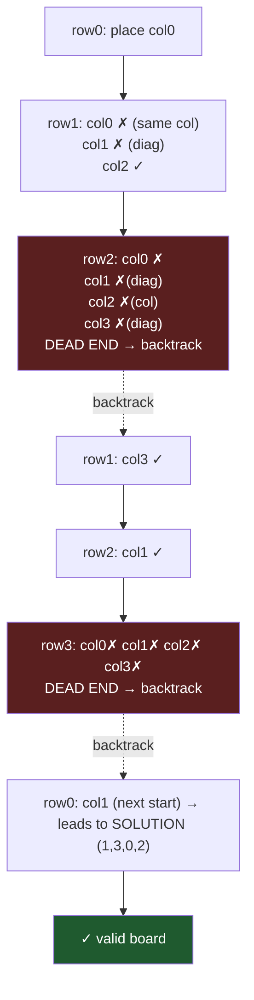

# Backtracking

## Prerequisites

- [Recursion](./recursion.md) [Must read] - backtracking _is_ recursion with an undo step; you must be fluent in base case / recursive case and the call stack before this makes sense.
- [DFS](./dfs.md) [Must read] - backtracking is DFS over an implicit state-space tree; the traversal mechanics are identical, only the tree is built on the fly.
- [Subsets & Permutations](../patterns/subsets-permutations.md) - the canonical paste-and-adapt templates for the most common backtracking shapes.

## Table of Contents

- [What it is](#what-it-is)
- [Intuition](#intuition)
- [How it works](#how-it-works)
- [Correctness / invariant](#correctness--invariant)
- [Complexity derivation](#complexity-derivation)
- [Constraints & approach](#constraints--approach)
- [When to use / when not](#when-to-use--when-not)
- [Comparison](#comparison)
- [State & recurrence](#state--recurrence)
- [Edge cases](#edge-cases)
- [Implementation](#implementation)
- [What the interviewer probes for](#what-the-interviewer-probes-for)
- [Practice problems](#practice-problems)

## What it is

Backtracking is a **systematic, depth-first search of a state-space tree** that builds a solution one choice at a time and **abandons a partial candidate the moment it cannot possibly lead to a valid complete one** (a _prune_). It is brute force with a steering wheel: the same exhaustive enumeration, but whole subtrees are cut off the instant a constraint is violated.

**Mental model:** exploring a maze with a ball of string. You walk forward making choices; at every dead end you reel the string back to the last junction (_undo the choice_) and try the next door. The string is the call stack; reeling back is the "backtrack".

- **Time:** `O(b^d)` worst case (`b` = branching factor, `d` = depth) — but pruning is the whole point, so the _effective_ cost is far below the bound on real inputs.
- **Space:** `O(d)` for the recursion stack plus the current partial candidate (the output itself is not counted as working space).

> **Takeaway (say it out loud):** "Backtracking is DFS that builds candidates incrementally and undoes the last choice when it hits a wall — choose, explore, un-choose."

## Intuition

Brute force generates _every_ complete candidate and then tests it. That wastes enormous work: if the first two queens already attack each other, no arrangement of the remaining queens can save it, yet brute force still enumerates all of them.

Backtracking's insight: **test the constraint as you build, not after.** Because a partial solution that already violates a constraint can never be extended into a valid one, you can reject it _immediately_ and skip its entire subtree. The earlier and cheaper the check, the more of the tree disappears.

That single idea — _validity is checked incrementally, and invalidity is monotone (a bad prefix stays bad)_ — is what turns a hopeless `O(n^n)` enumeration into something that finishes. The "undo" step exists only so one mutable state object can be reused across the whole search instead of copying it at every node.

## How it works

Trace **4-Queens**: place one queen per row on a 4×4 board so no two share a column or diagonal. State = `cols`, the column chosen in each placed row so far. A column `c` is safe in row `r` if no earlier queen shares that column or either diagonal (`|r - r'| == |c - c'|`).

We DFS row by row. At each row, try columns left→right; on a conflict, prune; on success, recurse to the next row; on return, **remove the queen** (backtrack) and try the next column.



Step-by-step on the left branch:

| Row | Try | Check vs `cols` so far | Action | `cols` after |
| --- | --- | ---------------------- | ------ | ------------ |
| 0 | col0 | nothing placed | place | `[0]` |
| 1 | col0 | same column as row0 | prune | `[0]` |
| 1 | col1 | `|1-0|==|1-0|` → diagonal | prune | `[0]` |
| 1 | col2 | safe | place | `[0,2]` |
| 2 | col0..3 | every column attacked | **dead end** | `[0,2]` → pop → `[0]` |
| 1 | col3 | safe | place | `[0,3]` |
| 2 | col1 | safe | place | `[0,3,1]` |
| 3 | col0..3 | all attacked | **dead end** | pop back up to row0 |

Starting row0 at col0 yields no solution; the search returns all the way up and tries col1, which leads to the valid board `(1,3,0,2)`. **The invariant — "every queen in `cols` is mutually non-attacking" — holds at every node**, because we never place a conflicting queen and we always pop on the way back.

Watch the invariant hold *line by line* in the trace above:

- After **row1→col2** (`cols = [0,2]`): both queens non-attacking — invariant holds, so we're allowed to descend.
- At **row2, dead end**: every column is attacked, so _no_ child can extend `[0,2]` while keeping the invariant. We pop `2` → `cols = [0]`, which restores the parent's valid state exactly — invariant re-established by the undo.
- The undo is what _keeps_ the invariant true on the way back up: without the `pop`, `cols` would carry row2's abandoned junk into the row1→col3 branch and silently break it. **Every backtrack edge in the diagram is the invariant being repaired.**

## Correctness / invariant

**Invariant:** at every node of the search, the current partial candidate is **valid** (satisfies all constraints checkable so far). Equivalently: `cols` only ever contains mutually non-attacking queens.

- **Maintained:** we only descend after `is_safe` confirms the new choice keeps the candidate valid; we only ascend after popping the choice we made, restoring the parent's exact state.
- **Completeness (we find every solution):** the recursion enumerates the full tree _except_ pruned subtrees, and a pruned subtree provably contains no valid leaf (its root is already invalid, and invalidity is monotone — extending an invalid prefix cannot make it valid). So no solution is ever skipped.
- **Soundness (no false positives):** the base case (`row == n`) is reached only through a chain of `is_safe` checks, so any candidate reported complete is genuinely valid.

The "prove it" one-liner: *pruning is sound because the constraint is **monotone** — once a partial assignment violates it, no extension repairs it, so the discarded subtree contains nothing we wanted.*

## Complexity derivation

Let `b` = branching factor (choices per step) and `d` = depth (steps to a complete candidate). The state-space tree has `O(b^d)` nodes; we touch each once, and do `O(work)` per node for the validity check.

- **N-Queens:** depth `n`, at most `n` columns per row → `O(n^n)` naive nodes, but the column/diagonal constraint prunes to roughly `O(n!)` placements, each `is_safe` costing `O(n)` → about `O(n! · n)`. The bound is loose; pruning makes it run for `n` up to ~13 in an interview.
- **Permutations:** `n` choices, then `n-1`, … → `n!` leaves, `O(n · n!)` total.
- **Subsets / combinations:** binary choice (include/exclude) at each of `n` elements → `2^n` leaves, `O(n · 2^n)` to materialize each.

**Space:** the recursion depth is `d`, and the working candidate is `O(d)`, so auxiliary space is `O(d)` — independent of the number of solutions. (Storing all solutions is separate output space, not counted as the algorithm's working set.) This `O(depth)` space is backtracking's quiet advantage over BFS-style enumeration, which would hold a whole frontier.

The general recurrence: `T(d) = b · T(d-1) + O(check)`, `T(0) = O(1)` → `T(d) = O(b^d · check)`. The art is shrinking the _effective_ `b` (prune early) and `check` (incremental validity), not the asymptotic bound.

**The senior point: pruning changes the _base of the exponent_, not the complexity class.** A prune that rejects a fraction of children at every level multiplies the surviving branching factor by that fraction — you go from `b^d` to `b_eff^d` with `b_eff < b`, which is still exponential but with a dramatically smaller base. N-Queens is the textbook case: the naive bound is `O(n^n)`, the constraint-respecting bound is `O(n!)`, but the _empirical_ node count grows like roughly `2.5^n` — far under `n!` — because the diagonal constraints kill most of the `n!` permutations early too. So three different numbers all describe the "same" algorithm: `n^n` (no pruning), `n!` (column-distinct only), `~2.5^n` (all constraints, measured). When an interviewer asks "what's the complexity of N-Queens," the senior answer is *"`O(n!)` as a provable bound, but it runs far faster because diagonal pruning collapses the effective branching factor — the bound is loose by design."* Naming that gap is the differentiator; quoting `O(n!)` flat is the junior answer.

## Constraints & approach

The single most useful contest read: **backtracking lives in the small-`n`, exponential corner.** If `n` is tiny, an exponential search is _expected_; if `n` is large, the constraint is telling you to find polynomial structure (DP, greedy) instead.

| Input size | Expected complexity | Approach |
| ---------- | ------------------- | -------- |
| `n ≤ 12–15` | `O(n!)` / `O(b^n)` | Backtracking / permutations / N-Queens — exponential is fine. |
| `n ≤ 20–24` | `O(2^n)` | Subsets, bitmask backtracking, meet-in-the-middle (split to `2^(n/2)`). |
| `n ≤ 40` | `O(2^(n/2))` | Meet-in-the-middle — pure `2^n` is too slow, split and combine. |
| `n ≤ 500` | `O(n^3)` | DP / Floyd-Warshall — backtracking blows up; look for overlapping subproblems. |
| `n ≤ 10^5` | `O(n log n)` | Greedy / sorting / binary search — _not_ backtracking. |

**What the constraint rules out / invites:** `n ≤ 20` with "count/return _all_ valid configurations" → backtracking _invited_. The same prompt with `n = 10^5` → backtracking _ruled out_; the answer wants a formula or DP. If the problem only asks for the **optimal value** (not all configurations) and `n` is large, that's the tell to switch from enumerate-all (backtracking) to optimize (DP/greedy).

## When to use / when not

**Reach for backtracking when** the problem asks you to **enumerate or count all valid configurations** (every subset, every permutation, every board), or to find one configuration satisfying a set of constraints, **and `n` is small** (≤ ~20). The signature words: "all combinations", "all paths", "place / arrange / partition subject to constraints".

**Prefer an alternative when:**

- The problem asks for an **optimal value over overlapping subproblems**, not the configurations themselves → **dynamic programming** ([dynamic-programming.md](./dynamic-programming.md)). If subtrees recompute identical states, DP/memoization collapses the exponential tree to polynomial; backtracking re-explores them.
- A provably correct local choice exists → **greedy**. No need to explore alternatives you'll never take.
- You're traversing an _explicit_ graph, not building candidates → plain **[DFS](./dfs.md)**. Backtracking is DFS over an _implicit_ tree with an undo step; if the graph already exists and you just need to visit it, you don't need the undo machinery.

**Real system:** constraint solvers and SAT/CSP engines (Sudoku solvers, regex backtracking matchers like PCRE, type-class resolution in compilers, and SQL query planners exploring join orders) are production backtracking — they search a space of choices and prune the impossible.

## Comparison

| Approach | Time (typical) | Space | Key assumption / when it wins |
| -------- | -------------- | ----- | ----------------------------- |
| **Backtracking** | `O(b^d)`, pruned | `O(d)` | Enumerate _all_ valid configs; small `n`; constraints prune hard. |
| Plain DFS | `O(V+E)` | `O(V)` | Graph already explicit; just visit nodes, no undo/constraint pruning. |
| Dynamic programming | `O(states · transition)` | `O(states)` | Overlapping subproblems; want optimal _value_, not all configs. |
| Greedy | `O(n log n)` | `O(1)` | A locally optimal choice is provably globally optimal — no search needed. |
| Brute force | `O(b^d)`, no prune | `O(d)` | Tiny `n` and no cheap incremental constraint to prune on. |

The cell that matters in an interview: backtracking vs DP. **Same exponential tree; DP wins when nodes repeat (memoize them), backtracking wins when every path is genuinely distinct and you must report each.**

## State & recurrence

> Family: **Recursive/build** — backtracking is defined by its state, its base case, and the choose→explore→un-choose recurrence. It does not use a closed-form recurrence like divide-and-conquer; the "recurrence" is the per-choice loop.

**State definition.** Pick the minimal data that (a) fully describes a partial candidate and (b) lets `is_valid` run cheaply. For N-Queens: `cols` (column per placed row) — and, to make `is_safe` O(1), three boolean sets: `used_cols`, `used_diag` (`r - c`), `used_anti_diag` (`r + c`). For subsets: `(start_index, current_subset)`. For permutations: `(used_mask, current_perm)`.

**Base case.** The point where the partial candidate is complete — `row == n` (all queens placed), `index == len(nums)` (every element decided), `len(perm) == n`. At the base case you record/count the candidate and return.

**The recurrence (the heart):**

```
backtrack(state):
    if is_complete(state): record(state); return
    for choice in candidates(state):       # branch
        if is_valid(state, choice):         # prune
            apply(choice)                   # choose
            backtrack(state)                # explore
            undo(choice)                    # un-choose  ← the backtrack
```

**State-space size = the complexity.** Count the leaves of this tree: `n!` for permutations, `2^n` for subsets, the constraint-pruned count for N-Queens. If two different choice-sequences reach the **same** state, you have overlapping subproblems → **add memoization and you've turned backtracking into top-down DP.** That's the bridge: backtracking + a memo table on the state = DP.

**Memo vs tabulation note:** backtracking is inherently top-down (memoization-shaped). If the state graph is a DAG with repeated states, memoize on the state key. If you can order states by dependency, you can flip to bottom-up tabulation and drop the recursion stack — but pure backtracking (distinct paths, no overlap) gains nothing from a memo and should stay as-is.

**Encode the state as an integer bitmask — the senior representation.** The three sets in N-Queens (`used_col`, `used_diag`, `used_anti`) are really three _bitsets_; a single `int` per set turns every membership test and update into one bit operation, and — crucially — makes the whole state a **hashable scalar you can memoize on**. The mapping:

| Conceptual state | Set form | Bitmask form |
| ---------------- | -------- | ------------ |
| Columns used | `set[int]` | `cols: int` — bit `c` set ⟺ column `c` taken |
| ↘ diagonals (`r-c`) | `set[int]` | `diag: int` — shift left by 1 per row to track |
| ↙ diagonals (`r+c`) | `set[int]` | `anti: int` — shift right by 1 per row |
| Permutation "used" | `[bool]` | `used_mask: int` — bit `i` set ⟺ `nums[i]` consumed |

Why it's the senior move, not just a micro-opt:

- **`is_valid` becomes one AND.** `available = ~(cols | diag | anti) & full_mask` gives _every_ legal column at once; no per-column loop. `p = available & -available` isolates the lowest legal bit (the classic "lowest set bit" trick); `available &= available - 1` clears it to iterate.
- **It unlocks bitmask DP.** Once the state is an `int`, `@lru_cache` on `used_mask` collapses overlapping subproblems for free — this is exactly how Travelling-Salesman-on-`n≤20`, assignment problems, and "partition into `k` equal subsets" are solved. The bitmask is the bridge from backtracking to `O(2^n · n)` DP.
- **Trap:** the diagonal masks must **shift each level** (`diag` shifts left, `anti` shifts right as you descend a row) so the same bit means "attacked _this_ row." Tracking raw `r-c` in a static set is correct but doesn't compose with the shift trick — mixing the two is a subtle bug.

The full bitmask N-Queens implementation is in [Implementation](#implementation) below.

## Edge cases

- **Empty input** (`n == 0`, `nums == []`): the base case fires immediately. For subsets, the correct answer is `[[]]` (one subset: the empty set), **not** `[]` — a classic off-by-one in the result shape. Guard: `if not nums: return [[]]` only if your loop doesn't already produce it.
- **Single element:** trivially one path; useful to confirm the base case and the undo both fire exactly once.
- **Duplicates in input** (`[1, 1, 2]` for subsets/permutations): naive backtracking emits duplicate results. **Sort first, then skip a choice equal to its predecessor at the same tree level** (`if i > start and nums[i] == nums[i-1]: continue`). Forgetting the `i > start` guard wrongly skips legitimate uses of the repeated value — the senior trap here.
- **Forgetting to undo** (`pop`/un-mark): the single most common backtracking bug. State leaks from one branch into its siblings, silently corrupting every result after the first. Every `apply` must have a matching `undo` on the same code path.
- **Mutating shared state in the result:** appending `path` (a reference) instead of `path[:]` (a copy) means every recorded solution points at the _same_ list, which is empty by the time recursion unwinds. Always snapshot: `result.append(path[:])`.
- **Overflow on counting** (CP): if you only need the _count_ of configurations and it's huge, accumulate `count % (10**9 + 7)` — don't build the configs at all.
- **Recursion depth limit** (CP/large input): Python caps recursion at ~1000 frames by default, so a backtracking depth `> 1000` throws `RecursionError` _before_ your logic is wrong. Raise it with `sys.setrecursionlimit(10**6)` — but know that very deep Python recursion is also slow and stack-heavy; if depth is genuinely large, convert to an explicit stack of `(state, next_choice_index)` frames. The trap: the crash looks like a logic bug but is a depth limit.
- **Symmetry breaking** (CP pruning trap): when solutions come in symmetric families (N-Queens boards have a mirror; subsets have no order), exploring all symmetric copies multiplies work for nothing. Fix N-Queens search ~in half by forcing the first queen into the left half of row 0 (`for c in range(n // 2)`) and reflecting the results. Missing this isn't _wrong_ — it just doubles your runtime, and an interviewer probing optimization expects you to name it.

## Implementation

**Pseudocode (CLRS-style) — N-Queens, count all solutions:**

```
SOLVE-N-QUEENS(n)
cols ← empty array of length n
used-col, used-diag, used-anti ← empty sets
solutions ← empty list
PLACE-QUEEN(0)
return solutions

PLACE-QUEEN(row)
if row = n                              ▷ all rows filled — complete board
    append COPY(cols) to solutions
    return
for c ← 0 to n - 1                       ▷ try each column in this row
    if c ∉ used-col and (row - c) ∉ used-diag and (row + c) ∉ used-anti
        cols[row] ← c                    ▷ choose
        insert c into used-col
        insert (row - c) into used-diag
        insert (row + c) into used-anti
        PLACE-QUEEN(row + 1)             ▷ explore
        remove c from used-col           ▷ un-choose (backtrack)
        remove (row - c) from used-diag
        remove (row + c) from used-anti
```

**Python (idiomatic, O(1) safety check via diagonal sets):**

```python
from typing import List

def solve_n_queens(n: int) -> List[List[int]]:
    """Return every column-assignment (one queen per row) that is conflict-free."""
    solutions: List[List[int]] = []
    cols: List[int] = [-1] * n
    used_col: set[int] = set()
    used_diag: set[int] = set()       # r - c is constant on a ↘ diagonal
    used_anti: set[int] = set()       # r + c is constant on a ↙ diagonal

    def backtrack(row: int) -> None:
        if row == n:                  # base case: complete board
            solutions.append(cols[:]) # snapshot — never append the live list
            return
        for c in range(n):
            if c in used_col or (row - c) in used_diag or (row + c) in used_anti:
                continue              # prune: column or diagonal attacked
            cols[row] = c             # choose
            used_col.add(c); used_diag.add(row - c); used_anti.add(row + c)
            backtrack(row + 1)        # explore
            used_col.remove(c); used_diag.remove(row - c); used_anti.remove(row + c)  # un-choose

    backtrack(0)
    return solutions
```

**Python (contest velocity — bitmask, counts solutions ~5× faster):** the version you'd actually type in a contest. The three sets collapse to three ints; `available` holds every legal column at once; `p & -p` peels the lowest set bit. The diagonal masks shift each level so a set bit always means "attacked in _this_ row."

```python
def count_n_queens(n: int) -> int:
    """Count conflict-free placements using bitmask state — no per-column scan."""
    full = (1 << n) - 1                       # n low bits set = all columns

    def backtrack(cols: int, diag: int, anti: int) -> int:
        if cols == full:                      # base case: every column filled
            return 1
        available = ~(cols | diag | anti) & full   # bits = legal columns this row
        count = 0
        while available:                      # iterate set bits, cheapest first
            p = available & -available        # lowest set bit = one candidate column
            available ^= p                    # clear it (we're handling it now)
            # choose p, recurse: diag shifts ↘, anti shifts ↙ for the next row
            count += backtrack(cols | p, (diag | p) << 1, (anti | p) >> 1)
        return count                          # undo is implicit — locals, not shared state
    return backtrack(0, 0, 0)
```

Note there's **no explicit undo here** — the state (`cols, diag, anti`) is passed _by value_ as function arguments, so each recursive call gets its own copy and the parent's is untouched on return. That's the other way to "backtrack": instead of mutate-then-undo on shared state, pass immutable state down. Cleaner, sometimes slower (copies), and it's why the bitmask form has no `pop`.

**Subsets with dedup (sorted-skip idiom):**

```python
def subsets_with_dup(nums: List[int]) -> List[List[int]]:
    nums.sort()                       # bring duplicates adjacent
    res, path = [], []

    def backtrack(start: int) -> None:
        res.append(path[:])           # every node is a valid subset
        for i in range(start, len(nums)):
            if i > start and nums[i] == nums[i - 1]:
                continue              # skip duplicate at the SAME tree level
            path.append(nums[i])      # choose
            backtrack(i + 1)          # explore
            path.pop()                # un-choose
    backtrack(0)
    return res
```

## What the interviewer probes for

- **"How is this different from plain DFS?"** — Backtracking is DFS over an _implicit_ state-space tree (built as you go) with an explicit **undo** after each recursive call so one mutable state is reused. Plain DFS walks an _explicit_ graph and typically marks visited nodes globally rather than un-marking them. The undo is the distinguishing machinery.
- **"Can you make this faster than the worst-case bound?"** — Prune earlier and cheaper. Order choices to hit constraints sooner (most-constrained-variable heuristic in CSPs), make `is_valid` incremental and O(1) (the diagonal-set trick), and add constraint propagation (forward-checking). The asymptotic bound stays, but the effective tree shrinks dramatically.
- **"When would you add memoization?"** — When two distinct choice-sequences reach the **same state**, the subtree below is recomputed. Memoizing on the state key collapses overlapping subproblems and turns the search into top-down DP — e.g. word-break, where many prefixes lead to the same suffix.
- **"Why is the prune correct — couldn't you cut a valid solution?"** — No, because constraint violation is **monotone**: extending an invalid prefix never makes it valid. The pruned subtree's root is already invalid, so every leaf below it is too. (Cover this whenever you recommend a prune.)
- **"Iterative version / stack overflow?"** — Backtracking can be made iterative with an explicit stack holding `(state, next_choice_index)` frames, which avoids deep-recursion limits (Python's default ~1000). In interviews the recursive form is preferred for clarity unless depth is genuinely a risk.

## Practice problems

Each problem below exercises a **distinct** backtracking technique — incremental construction, grid/in-place marking, partition validation, and balanced-choice pruning.

### Combinations — `C(n, k)`

Given `n` and `k`, return all `k`-length combinations of `1..n`. Constraints: `1 ≤ k ≤ n ≤ 20`, so `C(n,k)` results — squarely in backtracking range. Technique: **incremental construction with a moving `start` index** so each element is only used after the previous, preventing reordered duplicates.

```python
def combine(n: int, k: int) -> List[List[int]]:
    res, path = [], []
    def backtrack(start: int) -> None:
        if len(path) == k:                # base case: full combination
            res.append(path[:]); return
        # prune: not enough numbers left to fill k slots
        for i in range(start, n - (k - len(path)) + 2):
            path.append(i)
            backtrack(i + 1)              # i+1: no reuse, no reorder
            path.pop()
    backtrack(1)
    return res
```

**Complexity:** `O(k · C(n,k))` time, `O(k)` space. Pattern: subsets-of-fixed-size — see [Subsets & Permutations](../patterns/subsets-permutations.md).

### Word Search (grid backtracking)

Given an `m×n` board of letters and a `word`, return whether the word can be traced through adjacent (up/down/left/right) cells, each used at most once. Constraints: `m, n ≤ 6`, `word ≤ 15` — small enough for DFS from every cell. Technique: **backtracking on a grid with in-place visited marking** (mutate the cell, restore on return) — no separate visited array needed.

```python
def exist(board: List[List[str]], word: str) -> bool:
    rows, cols = len(board), len(board[0])
    def dfs(r: int, c: int, i: int) -> bool:
        if i == len(word): return True                    # matched all chars
        if not (0 <= r < rows and 0 <= c < cols) or board[r][c] != word[i]:
            return False                                   # prune: off-grid or mismatch
        board[r][c], tmp = "#", board[r][c]                # choose: mark visited
        found = (dfs(r+1, c, i+1) or dfs(r-1, c, i+1) or
                 dfs(r, c+1, i+1) or dfs(r, c-1, i+1))
        board[r][c] = tmp                                  # un-choose: restore
        return found
    return any(dfs(r, c, 0) for r in range(rows) for c in range(cols))
```

**Complexity:** `O(m · n · 4^L)` time (`L` = word length), `O(L)` recursion space. Pattern: grid DFS + backtrack.

### Palindrome Partitioning

Partition a string `s` so every substring is a palindrome; return all such partitions. Constraints: `s ≤ 16`, so up to `2^(n-1)` cut-point choices. Technique: **backtracking over cut positions with a validity check (palindrome) gating each choice** — prune any cut that produces a non-palindromic prefix.

```python
def partition(s: str) -> List[List[str]]:
    res, path = [], []
    def is_pal(sub: str) -> bool:
        return sub == sub[::-1]
    def backtrack(start: int) -> None:
        if start == len(s):                # base case: consumed whole string
            res.append(path[:]); return
        for end in range(start + 1, len(s) + 1):
            piece = s[start:end]
            if is_pal(piece):              # prune: only cut on palindromes
                path.append(piece)
                backtrack(end)
                path.pop()
    backtrack(0)
    return res
```

**Complexity:** `O(n · 2^n)` time, `O(n)` recursion depth. Pattern: partition + constraint-gated choice.

### Generate Parentheses

Generate all valid combinations of `n` pairs of parentheses. Constraints: `1 ≤ n ≤ 8` → Catalan(`n`) results. Technique: **choice-counting prune** — track open/close counts and only branch where the partial string can still become valid (`open < n`, `close < open`), so no invalid string is ever built.

```python
def generate_parenthesis(n: int) -> List[str]:
    res = []
    def backtrack(s: str, open_n: int, close_n: int) -> None:
        if len(s) == 2 * n:                # base case: full-length string
            res.append(s); return
        if open_n < n:                     # can still open
            backtrack(s + "(", open_n + 1, close_n)
        if close_n < open_n:               # can close only if unmatched open exists
            backtrack(s + ")", open_n, close_n + 1)
    backtrack("", 0, 0)
    return res
```

**Complexity:** `O(4^n / √n)` time (Catalan number), `O(n)` space. Pattern: prune-by-counter — distinct from the index/grid/partition techniques above.
