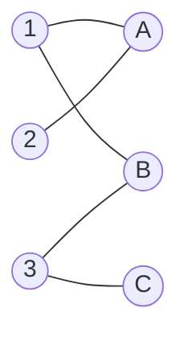

# Bipartite Matching

## Prerequisites

[Maximum Flow](./maximum-flow.md) [Must read] - the max-flow reduction is the fastest correct way to compute bipartite matching; read the family survey first
[Breadth-First Search (BFS)](./bfs.md) [Must read] - both the flow reduction and Hopcroft-Karp find augmenting paths via BFS
[Depth-First Search (DFS)](./dfs.md) [Must read] - the classic augmenting-path algorithm (Kuhn's) finds one augmenting path per DFS

## Table of Contents

- [What it is](#what-it-is)
- [Intuition](#intuition)
- [How it works](#how-it-works)
- [Correctness / invariant](#correctness--invariant)
- [Complexity derivation](#complexity-derivation)
- [Constraints &amp; approach](#constraints--approach)
- [When to use / when not](#when-to-use--when-not)
- [Comparison](#comparison)
- [Graph/tree assumptions](#graphtree-assumptions)
- [Edge cases](#edge-cases)
- [Implementation](#implementation)
- [What the interviewer probes for](#what-the-interviewer-probes-for)
- [Practice problems](#practice-problems)

## What it is

**Bipartite matching** finds the largest set of edges in a bipartite graph (nodes split into two disjoint sides, edges only crossing sides) such that no two edges share an endpoint - the maximum set of "compatible pairs" you can form simultaneously.

Time: **O(E·√V)** (Hopcroft-Karp) or **O(VE)** (Kuhn's augmenting-path method). Space: **O(V + E)**.

> **Soundbite:** Bipartite matching is speed-dating with a stopwatch - pair up as many left-right couples as possible, no one double-booked, and an augmenting path is how you politely break up one couple to make two new ones.

## Intuition

Picture jobs on the left, applicants on the right, an edge if an applicant is qualified for a job. A **matching** is an assignment of applicants to jobs where nobody is double-booked. The greedy approach - assign applicants to the first job they're qualified for, in order - gets stuck: applicant A might grab job 1 (their only option), leaving applicant B unable to take job 1 even though B could have taken job 2, freeing job 1 for A's replacement.

The fix is the **augmenting path**: a path that starts at an unmatched left node, alternates unmatched-edge / matched-edge / unmatched-edge / ..., and ends at an unmatched right node. Flip every edge on this path from matched to unmatched and vice versa - the matching size grows by exactly 1, because the path had one more unmatched edge than matched edge. Kuhn's algorithm is just: **for every left node, try to find an augmenting path from it (via DFS), and if found, flip it.** Repeat until no left node can find one. This is the same "find a path, push along it, repeat" loop that max-flow uses - because bipartite matching *is* a max-flow problem in disguise (see [Maximum Flow](./maximum-flow.md)).

## How it works

**Step-by-step trace** on a small bipartite graph. Left = {1, 2, 3}, Right = {A, B, C}. Edges: 1-A, 1-B, 2-A, 3-B, 3-C.



**Process left node 1.** No one is matched yet. DFS from 1: try edge 1-A. A is unmatched → match 1-A. Matching = {1-A}.

**Process left node 2.** DFS from 2: try edge 2-A. A is matched (to 1). Try to **re-route** A's current partner: is there an augmenting path from 1 using a different edge? DFS from 1 (excluding 1-A, already tried): try 1-B. B is unmatched → match 1-B, which frees A for 2. New matching = {1-B, 2-A}. Matching size grew from 1 to 2.

**Process left node 3.** DFS from 3: try edge 3-B. B is matched (to 1). Try to re-route 1: DFS from 1 (excluding 1-B): try 1-A. A is matched (to 2). Try to re-route 2: DFS from 2 (excluding 2-A): no other edges from 2. Dead end - 1 cannot free B via this branch. Backtrack to 3: try edge 3-C. C is unmatched → match 3-C directly. New matching = {1-B, 2-A, 3-C}. Matching size = 3 (perfect matching - every left node matched).

Each successful DFS from a left node is exactly one **augmenting path search**; a failed DFS (node 3 trying to reroute through 1→A→2 and finding no free node) still terminates in O(V+E) - it just doesn't grow the matching that round, and the algorithm records that left node as done and moves to the next.

## Correctness / invariant

**Invariant:** after processing left nodes `1..k`, the current matching is a **maximum matching restricted to the subgraph induced by left nodes `1..k`** and all right nodes.

**Why augmenting paths preserve optimality (Berge's theorem):** a matching `M` is maximum if and only if there is no augmenting path with respect to `M`. An augmenting path alternates unmatched/matched/unmatched/.../unmatched edges, starting and ending at unmatched nodes - it necessarily has one more unmatched edge than matched edge. XOR-ing the path into the matching (flip every edge's status) removes `k` matched edges and adds `k+1` unmatched edges that were on the path, so `|M|` grows by exactly 1. Kuhn's algorithm's correctness rests entirely on this: at termination, no left node can find an augmenting path, which by Berge's theorem means the current matching is maximum - not just locally best, but globally optimal.

## Complexity derivation

**Kuhn's algorithm: O(V·E).** There are at most `V` left nodes to process (each contributes at most one augmentation attempt in the outer loop). Each attempt runs one DFS, which in the worst case visits every edge once: O(E). Total: O(V) attempts × O(E) per attempt = **O(V·E)**.

**Hopcroft-Karp: O(E·√V).** Instead of one augmenting path per phase, Hopcroft-Karp finds a **maximal set of vertex-disjoint shortest augmenting paths** in each phase (via one BFS to compute levels, then one DFS pass to extract disjoint paths) - the same "blocking flow" idea Dinic's algorithm uses on general flow networks. Two facts combine to give the bound: **(1)** each phase takes O(E) (one BFS + one DFS pass). **(2)** the number of phases is O(√V), because after √V phases the shortest augmenting path length must exceed √V, and a graph with `V` nodes can have at most O(√V) vertex-disjoint paths of length > √V (each consumes > √V distinct nodes, and there are only V nodes total). Combined: O(√V) phases × O(E) per phase = **O(E√V)**.

## Constraints & approach

| Input size (V = nodes, E = edges)                | Expected complexity  | Which approach                         | Notes                                                                                                                |
| ------------------------------------------------ | -------------------- | -------------------------------------- | -------------------------------------------------------------------------------------------------------------------- |
| V ≤ 500, E ≤ 10⁵                              | O(VE) ≈ 5×10⁷     | Kuhn's DFS-augmenting                  | Simple to code under contest time pressure; fast enough                                                              |
| V ≤ 10⁴, E ≤ 10⁵–10⁶                       | O(E√V) ≈ 10⁸      | Hopcroft-Karp                          | Kuhn's O(VE) would be too slow (≈10⁹–10¹⁰); the √V factor is required                                          |
| V ≤ 10⁵+, dense                                | O(E√V), still large | Hopcroft-Karp, or reconsider the model | At this scale, verify the problem actually needs*exact* max matching vs. an approximation or a different reduction |
| Weighted bipartite matching (assignment problem) | O(V³)               | Hungarian algorithm, not covered here  | Unweighted matching algorithms don't apply - weights require a different method entirely                             |

**What the constraint rules out:** any V beyond ~10⁴ with a dense edge set rules out Kuhn's O(VE) - the quadratic-ish blowup times E is too slow. **What it invites:** V, E ≤ 500 invites the simpler Kuhn's DFS approach since implementation speed beats the asymptotic gap at that size; large sparse graphs invite Hopcroft-Karp or the max-flow reduction via Dinic (both O(E√V) on unit-capacity graphs).

## When to use / when not

**Reach for bipartite matching when:**

- The problem is phrased as "assign," "pair up," "match," or "schedule" between two distinct groups with a compatibility/eligibility relation - jobs-to-workers, classes-to-rooms, tasks-to-servers.
- You need the *maximum* number of simultaneous pairs, not just any valid pairing - greedy pairing is provably suboptimal (see Intuition), so this is the correct tool the moment "maximum" appears.
- The graph is genuinely bipartite - two disjoint sides, no edges within a side. If edges can exist within a side, this reduces to **general graph matching** (Blossom algorithm), which is a different, harder problem.

**Do not use bipartite matching when:**

- The graph isn't bipartite - Kuhn's alternating-path argument and Hopcroft-Karp's phase structure both rely on the two-coloring; on a general graph, odd cycles ("blossoms") break the alternating-path argument, and Edmonds' Blossom algorithm (O(V³)) is required instead.
- Edges have weights and you want the maximum-*weight* matching, not maximum-*cardinality* - that's the assignment problem, solved by the Hungarian algorithm (O(V³)), a different technique entirely despite the superficial similarity.
- V and E are small enough that the max-flow reduction's constant factors don't matter - in that regime, just building a `FlowNetwork` and calling Edmonds-Karp (already implemented if you have flow code handy) is less code to write from scratch than a fresh Kuhn's/Hopcroft-Karp implementation.

**Real-world usage:** the assignment-problem family (of which bipartite matching is the unweighted case) underlies real scheduling systems - CPU task-to-core assignment, ride-share driver-to-rider pairing at small batch sizes, and university course-to-classroom allocation. At scale (millions of nodes, e.g. large-scale ad-matching or ride-hailing dispatch), exact Hopcroft-Karp is too slow; production systems switch to approximate or streaming matching heuristics that trade a few percent of match quality for sub-linear update time.

## Comparison

| Approach                     | Time             | Space  | Key constraint                         | Pick it when…                                                                                                                |
| ---------------------------- | ---------------- | ------ | -------------------------------------- | ----------------------------------------------------------------------------------------------------------------------------- |
| Kuhn's (DFS augmenting path) | O(VE)            | O(V+E) | Unweighted, bipartite                  | Small graph (V ≤ 500) - simplest to implement correctly under time pressure                                                  |
| Hopcroft-Karp                | O(E√V)          | O(V+E) | Unweighted, bipartite                  | Larger graph where O(VE) is too slow - the asymptotically optimal unweighted algorithm                                        |
| Max-flow reduction (Dinic)   | O(E√V) unit-cap | O(V+E) | Unweighted, bipartite, modeled as flow | You already have flow code and don't want a second matching-specific implementation                                           |
| Hungarian algorithm          | O(V³)           | O(V²) | **Weighted** bipartite           | The problem asks for maximum/minimum*total weight*, not just count - a different problem, not a faster solution to this one |

**Crossover:** Kuhn's O(VE) and Hopcroft-Karp's O(E√V) cross over around V ≈ 1,000–10,000 depending on graph density; below that, Kuhn's simplicity wins in practice despite the weaker asymptotic bound, since constant factors and implementation risk dominate at small V.

## Graph/tree assumptions

**Bipartite, unweighted, undirected input** (typically modeled as directed left→right for the algorithm's bookkeeping). The two-coloring (left set, right set) is assumed given or trivially derivable - if it isn't, a 2-coloring BFS/DFS check ([Graph Coloring](../patterns/graph-coloring.md)) must run first, and if the graph fails 2-coloring, it isn't bipartite and this entire family of algorithms doesn't apply.

**Visited-state per phase, not globally.** Kuhn's DFS marks right-side nodes as "visited this attempt" to avoid infinite alternation loops within a single augmenting-path search - the visited set is reset before each left node's attempt, unlike a standard graph DFS where visited is global for the whole traversal.

**DFS for one path at a time (Kuhn's) vs. BFS+DFS for many disjoint paths at once (Hopcroft-Karp).** This mirrors the Edmonds-Karp-vs-Dinic split on general flow networks exactly: augment one path per pass (simple, more passes) vs. batch multiple vertex-disjoint shortest paths per phase (more setup per pass, far fewer phases).

## Edge cases

**1. Empty graph or no edges at all.** Matching size = 0; every algorithm here should terminate immediately with an empty matching rather than erroring - explicitly guard the DFS/BFS entry point against an empty adjacency list.

**2. One side much larger than the other.** Iterate over the **smaller** side as the "left" set driving the augmenting-path search - this bounds the outer loop by `min(|L|, |R|)` rather than the larger side, a constant-factor win that's easy to miss and worth mentioning in an interview.

**3. Perfect matching doesn't exist.** The algorithm still terminates correctly and returns the maximum matching size (which will be less than `min(|L|, |R|)`) - do not assume a perfect matching and index-error on an unmatched node; always check "is this node matched" before dereferencing its partner.

**4. Isolated nodes (no edges at all on one node).** Trivially excluded from any matching; skip them in the outer loop rather than attempting a DFS that will immediately fail - a minor optimization but signals attention to the edge case.

**5. CP-flavored trap: forgetting to reset the "visited this attempt" array per left node.** The single most common bug in a from-scratch Kuhn's implementation: reusing a global visited array across different left nodes' augmenting-path searches silently blocks valid re-routes, undercounting the matching. The visited array must be freshly cleared before every outer-loop iteration.

**6. CP-flavored trap: 1-indexed vs 0-indexed node IDs when the two sides share an ID space.** If left and right nodes are both numbered `1..n` independently, storing them in the same adjacency/visited array without an offset (e.g. `right_id + left_n`) causes silent cross-contamination between the two sides - a bug that produces a plausible-looking but wrong matching count rather than a crash.

## Implementation

### Pseudocode (CLRS-style)

```
KUHN-MAX-BIPARTITE-MATCHING(L, R, adj)
  match_R[r] ← NIL for every r ∈ R      ▷ which left node currently owns each right node
  result ← 0
  for each l ∈ L
      visited[r] ← FALSE for every r ∈ R
      if TRY-KUHN(l, adj, visited, match_R)
          result ← result + 1
  return result, match_R

TRY-KUHN(l, adj, visited, match_R)
  for each r ∈ adj[l]
      if not visited[r]
          visited[r] ← TRUE
          if match_R[r] = NIL or TRY-KUHN(match_R[r], adj, visited, match_R)
              match_R[r] ← l
              return TRUE
  return FALSE
```

### Python (idiomatic)

```python
def max_bipartite_matching(left_n: int, adj: dict[int, list[int]]) -> tuple[int, dict[int, int]]:
    """Kuhn's algorithm. adj[l] = list of right-side node ids l is compatible with."""
    match_right: dict[int, int] = {}

    def try_kuhn(l: int, visited: set[int]) -> bool:
        for r in adj.get(l, []):
            if r in visited:
                continue
            visited.add(r)
            if r not in match_right or try_kuhn(match_right[r], visited):
                match_right[r] = l
                return True
        return False

    matched = 0
    for l in range(left_n):
        if try_kuhn(l, visited=set()):
            matched += 1

    return matched, match_right
```

**Hopcroft-Karp note:** the from-scratch Hopcroft-Karp implementation (BFS layering + phase-restricted DFS over free nodes) is substantially more code than Kuhn's for a `log(V)`-factor speedup; in a contest, write Kuhn's first and upgrade only if profiling shows it's the bottleneck. In a system-design or take-home context where correctness and V is large, implement Hopcroft-Karp or reduce to Dinic on the unit-capacity flow network from [Maximum Flow](./maximum-flow.md).

## What the interviewer probes for

**"Why can't you just greedily assign each left node to its first available right node?"**
Greedy commits early and can block a better global assignment - a left node might take the *only* right node another left node could ever reach, when a different (still-valid) assignment would have freed that right node for the blocked node. The fix (augmenting paths) is exactly what separates a correct algorithm from a greedy heuristic that merely looks plausible.

**"What if the graph isn't bipartite - two people on the same side might be compatible too?"**
Kuhn's and Hopcroft-Karp both rely on the alternating-path argument holding over a strict two-coloring; a same-side edge creates an odd cycle that breaks the alternation, and you'd need the general **Blossom algorithm** (O(V³)) instead - much more complex because it has to detect and "shrink" these odd cycles.

**"How would you extend this to maximum-*weight* matching?"**
That's the assignment problem - swap to the Hungarian algorithm (O(V³)), which uses potentials/reduced costs rather than plain augmenting paths; cardinality-maximizing and weight-maximizing are genuinely different objectives requiring different machinery, not a parameter tweak on Kuhn's.

**"Your graph has 10⁵ nodes - is Kuhn's still fine?"**
No - O(VE) at that scale is likely too slow; switch to Hopcroft-Karp for the O(E√V) bound, or model it as a unit-capacity flow network and run Dinic, which achieves the same O(E√V) bound via level graphs and blocking flow.

## Practice problems

### 1. Maximum Bipartite Matching (canonical, CSES "School Dance")

**Problem.** Given `n` boys and `m` girls with a list of compatible pairs, find the maximum number of pairs that can dance simultaneously, each person paired at most once. n, m ≤ 500, pairs ≤ 1000.

**Approach.** Direct application of Kuhn's algorithm: for each boy, DFS for an augmenting path through currently-matched girls, incrementing the match count on success. Small constraints make Kuhn's O(VE) comfortably fast without needing Hopcroft-Karp.

```python
def school_dance(n_boys: int, adj: dict[int, list[int]]) -> int:
    matched, _ = max_bipartite_matching(n_boys, adj)
    return matched
```

**Complexity.** O(V·E) time, O(V + E) space.

**Duplicate problems:**

- Job Assignment (CSES "Task Assignment" variants) - identical reduction: workers on the left, tasks on the right, edge if qualified.
- Any "maximum number of one-to-one compatible pairs" problem framed as two groups with a compatibility list.

---

### 2. Minimum Vertex Cover in a Bipartite Graph (König's theorem application)

**Problem.** Given a bipartite graph, find the minimum number of vertices that touch every edge (a vertex cover). n, m ≤ 500.

**Approach.** This is a *distinct technique layered on top* of matching, not a repeat: König's theorem states that in a bipartite graph, the size of the **minimum vertex cover** equals the size of the **maximum matching**. For the size alone, run max matching and return it directly. To recover the actual cover *set* (not just its size): (1) find all left nodes unmatched, (2) alternate-path DFS from them to mark every reachable node, (3) the cover = unmarked left nodes + marked right nodes. Recognizing that a "minimum cover" question is secretly a matching question is the core insight - the code below solves the size variant only.

```python
def min_vertex_cover_size(left_n: int, adj: dict[int, list[int]]) -> int:
    matched, _ = max_bipartite_matching(left_n, adj)
    return matched  # König's theorem: min vertex cover size == max matching size
```

**Complexity.** O(V·E) time (dominated by the matching computation), O(V + E) space.

**Duplicate problems:**

- Maximum Independent Set in a bipartite graph - complement of vertex cover (`|V| - min_vertex_cover`), same underlying matching computation.

---

### 3. Assignment Problem with Costs (Hungarian algorithm territory, contrast case)

**Problem.** `n` workers, `n` tasks, a cost matrix `cost[i][j]` for assigning worker `i` to task `j`. Find the assignment minimizing total cost. n ≤ 200.

**Approach.** Deliberately **not** solvable by Kuhn's or Hopcroft-Karp - those only maximize the *count* of matched pairs, ignoring weights entirely. This problem needs the Hungarian algorithm (O(V³)), which maintains a system of "potentials" (dual values) and repeatedly finds augmenting paths in a way that preserves optimality with respect to total cost, not just cardinality. Included here specifically to draw the line: recognizing when a problem has *drifted* from cardinality-matching into weighted-assignment territory is itself the interview-tested skill.

```python
# Sketch only - full Hungarian algorithm is out of scope for this article.
# Signal to recognize: cost matrix + "minimize/maximize total cost" => Hungarian,
# not Kuhn's/Hopcroft-Karp, even though the input still "looks bipartite."
def hungarian_min_cost_assignment(cost: list[list[float]]) -> float:
    raise NotImplementedError("O(V^3) potential-based algorithm - see Hungarian algorithm literature")
```

**Complexity.** O(V³) time, O(V²) space (for the full Hungarian algorithm; not implemented above).

**Duplicate problems:**

- Minimum Cost Bipartite Matching (general) - same recognition signal: weights present → Hungarian, not Kuhn's.
