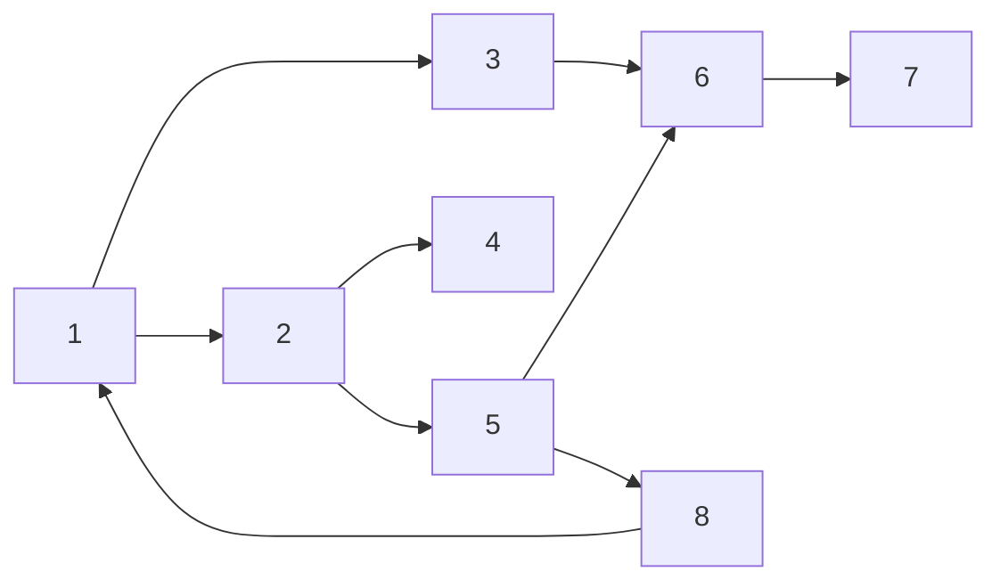

# DFS

## Prerequisites

[Stack](../data-structures/stack.md) [Must read] - iterative DFS uses an explicit stack; recursive DFS uses the call stack implicitly
[Graph](../data-structures/graph.md) [Must read] - adjacency list vs matrix representation shapes DFS performance
<!-- [Recursion](./recursion.md) [Must read] - recursive DFS is a direct application of recursive thinking -->

## Table of Contents

- [What it is](#what-it-is)
- [Intuition](#intuition)
- [How it works](#how-it-works)
- [Correctness / invariant](#correctness--invariant)
- [Complexity derivation](#complexity-derivation)
- [Constraints & approach](#constraints--approach)
- [When to use / when not](#when-to-use--when-not)
- [Comparison](#comparison)
- [Graph/tree assumptions](#graphtree-assumptions)
- [Edge cases](#edge-cases)
- [Implementation](#implementation)
- [What the interviewer probes for](#what-the-interviewer-probes-for)
- [Practice problems](#practice-problems)

## What it is

DFS explores as far as possible down each branch before backtracking — it uses a stack (call stack or explicit) and discovers structure: components, cycles, topological order.

The algorithm visits a vertex, immediately recurses into an unvisited neighbor, and only backtracks when no unvisited neighbors remain. A vertex's **discovery time** is stamped when first reached; its **finish time** is stamped when all reachable descendants are exhausted. These two timestamps are the key to every structural insight DFS provides.

**Time:** O(V + E). **Space:** O(V) worst case (path graph fills the recursion stack).

> **Soundbite:** "DFS is a timestamp machine — it stamps every vertex twice, and those two numbers tell you everything about the graph's structure."

## Intuition

Going deep before going wide means DFS discovers the *shape* of the graph — not the shortest distance from a source, but the parent-child relationships, the back edges that signal cycles, and the finish ordering that gives topological sort for free on a DAG.

The key insight is the **parenthesis theorem**: if you write `(u` when you discover vertex u and `)u` when you finish it, you get a fully nested sequence of parentheses. Every vertex's discovery-to-finish interval is either completely contained inside another vertex's interval (ancestor–descendant relationship) or completely disjoint (neither is an ancestor of the other). There is no partial overlap. This nesting structure is why DFS can classify every edge unambiguously.

**Edge classification** falls out of vertex color at the moment each edge is examined:

- **Tree edge** — leads to a WHITE (undiscovered) vertex. Forms the DFS forest.
- **Back edge** — leads to a GRAY (in-progress, on the stack) vertex. Signals a cycle in a directed graph.
- **Forward edge** — leads to a BLACK (finished) descendant (directed graphs only).
- **Cross edge** — leads to a BLACK vertex that is neither ancestor nor descendant (directed graphs only).

In an **undirected** graph, DFS produces only tree edges and back edges — forward and cross edges cannot exist because every undirected edge is examined from both directions, and the second examination always finds a non-white vertex.

A junior sees DFS as "just graph traversal." A senior recognizes that the gray-white-black coloring and the discovery/finish timestamps are what unlock cycle detection, topological sort, SCC decomposition, and articulation-point finding — all in a single O(V + E) pass.

## How it works

### Worked trace — directed graph (8 vertices)

Graph edges: 1→2, 1→3, 2→4, 2→5, 3→6, 5→6, 6→7, 5→8, 8→1.



DFS from vertex 1, adjacency lists in numeric order. Colors: W=WHITE, G=GRAY, B=BLACK.

| Step | Event                        | Stack (top→bot)    | d/f assigned | Edge type     |
|------|------------------------------|--------------------|--------------|---------------|
| 1    | Discover 1                   | [1]                | d[1]=1       | —             |
| 2    | Discover 2 (1→2)             | [2,1]              | d[2]=2       | tree          |
| 3    | Discover 4 (2→4)             | [4,2,1]            | d[4]=3       | tree          |
| 4    | Finish 4 (no neighbors)      | [2,1]              | f[4]=4       | —             |
| 5    | Discover 5 (2→5)             | [5,2,1]            | d[5]=5       | tree          |
| 6    | Examine 5→6, discover 6      | [6,5,2,1]          | d[6]=6       | tree          |
| 7    | Discover 7 (6→7)             | [7,6,5,2,1]        | d[7]=7       | tree          |
| 8    | Finish 7                     | [6,5,2,1]          | f[7]=8       | —             |
| 9    | Finish 6                     | [5,2,1]            | f[6]=9       | —             |
| 10   | Discover 8 (5→8)             | [8,5,2,1]          | d[8]=10      | tree          |
| 11   | Examine 8→1; 1 is GRAY       | [8,5,2,1]          | —            | **back edge** |
| 12   | Finish 8                     | [5,2,1]            | f[8]=11      | —             |
| 13   | Finish 5                     | [2,1]              | f[5]=12      | —             |
| 14   | Examine 2→5; 5 is BLACK      | [2,1]              | —            | forward       |
| 15   | Finish 2                     | [1]                | f[2]=13      | —             |
| 16   | Discover 3 (1→3)             | [3,1]              | d[3]=14      | tree          |
| 17   | Examine 3→6; 6 is BLACK      | [3,1]              | —            | cross         |
| 18   | Finish 3                     | [1]                | f[3]=15      | —             |
| 19   | Finish 1                     | []                 | f[1]=16      | —             |

**Discovery/finish timestamps:**

| Vertex | d  | f  | Interval  |
|--------|----|----|-----------|
| 1      | 1  | 16 | (1, 16)   |
| 2      | 2  | 13 | (2, 13)   |
| 3      | 14 | 15 | (14, 15)  |
| 4      | 3  | 4  | (3, 4)    |
| 5      | 5  | 12 | (5, 12)   |
| 6      | 6  | 9  | (6, 9)    |
| 7      | 7  | 8  | (7, 8)    |
| 8      | 10 | 11 | (10, 11)  |

**Parenthesis notation:**
```
(1 (2 (4)4 (5 (6 (7)7 )6 (8 )8 )5 )2 (3 )3 )1
```

Observe: interval (3,4) for vertex 4 is nested inside (2,13) — 4 is a descendant of 2. Intervals (2,13) and (14,15) are disjoint — 2 and 3 are unrelated in the DFS tree. Interval (10,11) for vertex 8 is nested inside (5,12) for vertex 5 — 8 is a descendant of 5.

**Back edge 8→1:** d[1]=1 < d[8]=10 < f[8]=11 < f[1]=16 — vertex 1 is a proper ancestor of 8, confirming the cycle 1→2→5→8→1.

**Stack state at step 11 (the back edge moment):**
```
Stack: [8, 5, 2, 1]   ← vertex 1 is in the stack = GRAY = ancestor of 8
GRAY set = {1, 2, 5, 8}
```

The GRAY set is exactly the current ancestor chain, confirming the stack = ancestor-path invariant.

## Correctness / invariant

### White-gray-black coloring invariant

At every point during DFS, the set of GRAY vertices is exactly the set of vertices currently on the call stack (or explicit stack). This set always forms a simple path from some DFS root to the currently active vertex — because DFS recurses depth-first, the in-progress vertices are always an ancestor chain, never a set of siblings.

**Formal invariant:** When `DFS-VISIT(u)` is executing, every vertex on the path from the DFS root to u is GRAY. Every vertex not yet discovered is WHITE. Every vertex whose subtree is fully explored is BLACK.

### Parenthesis theorem (CLRS Theorem 22.7)

For any two vertices u and v, exactly one of three conditions holds:
1. Intervals [d[u], f[u]] and [d[v], f[v]] are **entirely disjoint** — neither is an ancestor of the other.
2. [d[u], f[u]] is **entirely contained** within [d[v], f[v]] — u is a descendant of v.
3. [d[v], f[v]] is **entirely contained** within [d[u], f[u]] — v is a descendant of u.

**Proof sketch:** When DFS first discovers u (setting d[u]), suppose v is discovered later (d[v] > d[u]). There are two cases:
- DFS discovers v while still inside `DFS-VISIT(u)` (before f[u] is set). Then v is a descendant of u, so DFS must finish v (set f[v]) before it can return to u and set f[u]. Hence d[u] < d[v] < f[v] < f[u] — containment.
- DFS discovers v only after u has finished (d[v] > f[u]). Then the two intervals are disjoint.

No other case is possible — intervals cannot "overlap" without one being contained in the other.

**Corollary:** v is a descendant of u if and only if d[u] < d[v] < f[v] < f[u].

### Cycle detection correctness

**Directed:** A directed graph has a cycle if and only if DFS produces at least one back edge. When DFS examines edge u→v and finds v is GRAY, the parenthesis theorem guarantees d[v] < d[u] — so v is an ancestor of u, and the path v → ... → u → v is a cycle. Conversely, if there is a cycle v₁ → v₂ → ... → vₖ → v₁, then when DFS processes the last edge vₖ → v₁, vertex v₁ will still be GRAY (it was discovered first and hasn't finished), so a back edge is detected.

**Undirected:** A back edge {u, v} where v is a visited non-parent vertex signals a cycle. (See Edge cases for the parent-tracking requirement.)

## Complexity derivation

### Time: O(V + E)

Each vertex undergoes exactly three color transitions: WHITE → GRAY (once, on discovery) → BLACK (once, on finish). The `DFS-VISIT` procedure body executes exactly once per vertex. Inside `DFS-VISIT(u)`, every outgoing edge from u is examined exactly once when iterating over `G.Adj[u]`.

Summing over all vertices: total work = O(V) for vertex processing + Σ_{u ∈ V} |Adj(u)| for edge scanning. For a directed graph Σ|Adj(u)| = |E|. For an undirected graph each edge {u,v} appears in both Adj(u) and Adj(v), so Σ|Adj(u)| = 2|E| — still O(E).

**Total: O(V + E).** This is a tight worst-case bound, not an amortized one. There is no sequence of DFS calls where some are "cheap" offsetting expensive ones — a single DFS run always costs exactly O(V + E).

### Space: O(V)

The recursion stack (or explicit stack for iterative DFS) holds at most one path from the DFS root to the current vertex. In the worst case — a directed path graph v₁ → v₂ → ... → vₙ — DFS descends all the way to vₙ before backtracking, holding all V vertices on the stack simultaneously.

**Adjacency matrix penalty:** If the graph is represented as a V×V matrix, scanning u's neighbors takes O(V) per vertex regardless of actual degree, making DFS O(V²). Adjacency list is mandatory for sparse graphs where E ≪ V².

**Amortized vs worst-case:** The O(V+E) time is worst-case per run. If you ask "amortized cost per DFS call when running DFS repeatedly on the same graph (re-initializing each time)," the answer is still O(V+E) per run — initialization touches every vertex. There is no sub-linear amortized benefit from repeated runs unless you maintain partial visited state across runs (incremental DFS).

### Cache behavior

DFS via adjacency list is **cache-hostile**: the adjacency list for each vertex is a separate heap allocation (or a slice of a larger array at a non-contiguous offset). Following an edge means chasing a pointer to a neighbor's adjacency list — a likely cache miss. The recursion call stack itself is contiguous memory, but the *graph traversal pattern* is scattered across heap-allocated neighbor lists, producing irregular memory access.

**Contrast with BFS:** BFS processes vertices level by level and tends to access nearby nodes in memory in bursts, which improves cache locality slightly — but both algorithms are fundamentally pointer-chasing on graph adjacency lists and neither achieves the sequential cache behavior of array algorithms.

**In practice:** On a graph stored as a CSR (Compressed Sparse Row) matrix — the format used in high-performance graph libraries — adjacency lists are laid out contiguously in one big array, and DFS becomes more cache-friendly because the neighbor scan `G.Adj[u]` is a contiguous slice. Python's dict-of-lists representation does not have this property.

## Constraints & approach

| Input size / condition        | Time budget     | Correct approach                                                              | Ruled out / notes                                         |
|-------------------------------|-----------------|-------------------------------------------------------------------------------|-----------------------------------------------------------|
| V + E ≤ 10⁵ (sparse graph)   | O(V + E)        | DFS (adjacency list) — components, cycles, topo sort                         | Matrix rep → O(V²); use adjacency list                    |
| V + E ≤ 10⁵, DAG             | O(V + E)        | DFS post-order for topo sort; or Kahn's (BFS-based) for in-degree tracking   | Must be DAG; back edge detection mandatory                |
| V + E ≤ 10⁵, directed         | O(V + E)        | Cycle detection: DFS with GRAY/WHITE/BLACK — one pass                        | Simple boolean `visited` insufficient; need GRAY state    |
| V ≤ 10⁵, recursive DFS       | O(V + E) time   | **Use iterative DFS** — Python default recursion limit is 1000               | `sys.setrecursionlimit` is a contest hack, not production |
| V + E ≤ 10⁶ (dense graph)    | O(V + E)        | DFS still works; watch adjacency list memory vs matrix                        | —                                                         |
| V ≤ 20 (exponential state)   | O(2ᵛ × V)       | DFS + bitmask visited for implicit state graphs (Hamiltonian path, TSP)      | Plain DFS without bitmask revisits states                 |
| Shortest path (unweighted)   | O(V + E)        | BFS — DFS does not give shortest path                                         | DFS finds *a* path, not the *shortest* path               |
| Shortest path (weighted, ≥0) | O((V+E) log V)  | Dijkstra                                                                      | DFS ignores weights                                       |
| Negative weights              | O(V × E)        | Bellman-Ford                                                                   | DFS and Dijkstra both fail on negative cycles             |

## When to use / when not

### Use DFS when

- You need to **discover graph structure**: connected components, strongly connected components (Tarjan and Kosaraju both use DFS — see [SCC](./strongly-connected-components.md)), bipartite check, cycle detection, articulation points, bridges.
- You need **topological ordering** of a DAG — DFS post-order gives it in one pass. See [Topological Sort](./topological-sort.md).
- You are solving via **backtracking** — exhaustive search with pruning is DFS on an implicit tree. See [Backtracking](./backtracking.md) and the [Backtracking pattern](../patterns/backtracking.md).
- You need to **reach all nodes** and the path taken matters (maze solving, finding whether any path exists, computing path-dependent properties like longest path in a DAG).
- The graph is sparse — O(V + E) with adjacency list is effectively O(V) when E ≈ V.

### Do not use DFS when

- You need the **shortest path** on an unweighted graph. BFS guarantees minimum-hop paths. DFS finds a path but it may be the longest possible one. This is the most common DFS misuse in interviews.
- You need the **shortest path** on a weighted graph. Use Dijkstra (non-negative weights) or Bellman-Ford (any weights).
- You need **level-by-level exploration** (minimum depth, word ladder, spreading process). BFS gives level structure naturally; DFS does not.
- The graph is very deep and you are using recursive DFS without a recursion-limit increase — switch to iterative DFS. The iterative pattern: push the source onto an explicit stack; while the stack is non-empty, pop a vertex, skip if visited, mark visited, process, push all unvisited neighbors. Note: iterative DFS with a stack produces a **different traversal order** than recursive DFS (neighbors are pushed in forward order but popped in reverse), and it does not naturally produce discovery/finish timestamps — if you need timestamps for topological sort or cycle detection, use the recursive form or maintain explicit entry/exit state on the stack entries.

### Real-world usage

Compilers and linkers use DFS post-order to determine link order: the finish order of a DFS on the dependency graph is a valid topological order, ensuring dependencies are linked before dependents. The mark phase of mark-and-sweep garbage collection is a DFS from root objects — every live object is reachable and gets marked. Maze solvers, Sudoku backtracking engines, and SAT solvers all run DFS on implicit state graphs.

**At-scale failure mode:** At n > 10⁴–10⁵ nodes, recursive DFS stack-overflows on the default Python thread stack (~1 MB, recursion limit 1000). A path graph of 10⁵ nodes will crash a recursive DFS. Production graph processing systems (web crawlers, static analyzers, package managers) use iterative DFS with a heap-allocated explicit stack to avoid this.

See also the [Tree/Graph Traversal pattern](../patterns/tree-graph-traversal.md) for the template-first view.

## Comparison

| Algorithm               | Time             | Space  | Shortest path?        | Finds cycles?                 | Topo order?  | Key constraint                         |
|-------------------------|------------------|--------|-----------------------|-------------------------------|--------------|----------------------------------------|
| **DFS**                 | O(V + E)         | O(V)   | No                    | Yes (GRAY = back edge)        | Yes (post-order, DAG only) | None — any graph              |
| BFS                     | O(V + E)         | O(V)   | Yes (unweighted)      | Yes (visited check)           | No           | None — any graph                       |
| Topological Sort (DFS)  | O(V + E)         | O(V)   | No                    | Detects (back edge → no topo) | Yes          | Must be a DAG                          |
| Topological Sort (Kahn) | O(V + E)         | O(V)   | No                    | Detects (leftover nodes)      | Yes          | Must be a DAG                          |
| Dijkstra                | O((V+E) log V)   | O(V)   | Yes (weighted)        | No                            | No           | Non-negative edge weights              |
| Bellman-Ford            | O(V × E)         | O(V)   | Yes (weighted)        | Yes (negative cycle)          | No           | Any weights, including negative        |
| Backtracking (DFS)      | O(bᵈ)            | O(d)   | No                    | Via visited set               | No           | Implicit tree; b = branching, d = depth|

**When each wins:**
- **DFS over BFS:** when you need post-order finish times (topo sort, SCC, articulation points) or when the graph is narrow-but-deep and BFS's wide frontier would consume more memory.
- **BFS over DFS:** whenever minimum-hop distance is the question. BFS is also more cache-friendly in practice since it processes vertices level by level.
- **Topological Sort:** only meaningful on a DAG. DFS-based (post-order) and Kahn's are interchangeable in correctness; Kahn's is easier to reason about when you need to detect cycles incrementally or process in streaming order.
- **Dijkstra/Bellman-Ford:** the only correct choices for weighted shortest path. DFS ignores weights entirely.

See [BFS](./bfs.md) for the breadth-first counterpart.

## Graph/tree assumptions

### Visited state

DFS requires a mechanism to avoid revisiting vertices. Two options:

- **Boolean `visited` array:** sufficient for simple reachability, connected components, and undirected cycle detection (with parent tracking). Cannot distinguish a finished (safe) ancestor from an in-progress (cycle-signaling) ancestor.
- **Three-color array (WHITE/GRAY/BLACK):** mandatory for directed cycle detection and for computing discovery/finish timestamps. A node that is GRAY is currently on the stack — finding a GRAY neighbor means you've found your own ancestor, which is a back edge and a cycle. A BLACK node is finished and safe to revisit (no cycle signaled).

### Directed vs undirected

| Property                | Directed                                       | Undirected                                          |
|-------------------------|------------------------------------------------|-----------------------------------------------------|
| Edge types possible     | Tree, back, forward, cross                     | Tree, back only                                     |
| Cycle detection         | GRAY neighbor = back edge = cycle              | Visited non-parent neighbor = cycle                 |
| Parent tracking needed? | No — GRAY check is sufficient                  | **Yes** — must track parent to avoid false positive |
| Topological sort        | Valid on DAG                                   | Not applicable                                      |
| SCCs                    | Meaningful (Tarjan, Kosaraju use DFS)          | Use connected components instead                    |

### Weighted graphs

DFS ignores edge weights — it processes all edges with equal cost. A weighted graph is fine for DFS when the task is structural (reachability, cycle detection, component discovery). For any distance-optimal task, the graph representation must be weighted and an appropriate algorithm (Dijkstra, Bellman-Ford) must be used.

### Stack vs queue vs priority queue

| Data structure        | Algorithm | Explores            | Guarantees                    |
|-----------------------|-----------|---------------------|-------------------------------|
| Stack (LIFO)          | DFS       | Deepest-first       | Visits all; no distance bound |
| Queue (FIFO)          | BFS       | Level-by-level      | Minimum-hop shortest path     |
| Priority queue (min-heap) | Dijkstra | Cheapest-first  | Minimum-cost shortest path    |

Swapping a DFS stack for a FIFO queue gives BFS. This is the mechanical reason DFS and BFS share the same O(V+E) time complexity but differ in traversal order and optimality guarantees.

## Edge cases

### 1. Disconnected graph — the outer loop is mandatory

A single DFS call from one source discovers only the connected component containing that source. To guarantee all vertices are visited, wrap `DFS-VISIT` in an outer loop:

```
for each u ∈ G.V
    if color[u] = WHITE
        DFS-VISIT(G, u)
```

This is the most common silent DFS bug. It produces a correct result on connected graphs and a silently wrong result on disconnected ones — no error, just missing components.

### 2. Directed vs undirected cycle detection — the parent trap (senior trap)

**Directed:** A back edge (u → v where v is GRAY) is a cycle. The GRAY check is both necessary and sufficient.

**Undirected:** The naive check "if neighbor is visited → cycle" fires on the **parent** of the current node. Every undirected edge {u, v} appears in both adjacency lists. When DFS is at v (reached from u), it sees u as a visited neighbor — but this is the edge you just came from, not a cycle. **A junior writes `if neighbor in visited → cycle` and gets false positives on every edge of the graph.**

The fix: track the parent and skip it.

```
DFS-UNDIRECTED(G, u, parent)
    color[u] ← GRAY
    for each v ∈ G.Adj[u]
        if v = parent          ▷ skip the edge we arrived on
            continue
        if color[v] = GRAY
            report cycle       ▷ genuine back edge
        if color[v] = WHITE
            DFS-UNDIRECTED(G, v, u)
    color[u] ← BLACK
```

**Multigraph edge case:** If the graph has parallel edges between u and v, parent tracking by vertex identity fails — both parallel edges are skipped, missing the cycle they form. Track the edge index (or edge object) instead.

### 3. Stack overflow on large graphs

Python's default recursion limit is 1000. A path graph of 10⁵ nodes crashes recursive DFS. In production, always use iterative DFS with an explicit stack. `sys.setrecursionlimit(200_000)` is a contest hack — the OS thread stack is still bounded (~1–8 MB depending on the OS) and will crash on sufficiently deep graphs regardless.

### 4. Topological sort on a graph with cycles

DFS-based topological sort appends each vertex on finish and reverses at the end. On a cyclic directed graph, this produces an ordering — but it is meaningless because a valid topological order does not exist. Always check for back edges (GRAY neighbor in directed DFS) before trusting the topological order output. Missing this check is a common interview mistake.

### 5. DFS on trees (no visited set needed)

On a tree (connected, acyclic), DFS simplifies: no visited set is needed if you pass the parent and skip it. Pre-order (action on discovery), in-order (action between left and right subtrees), and post-order (action on finish) tree traversals are all specializations of DFS.

### 6. CP-flavored trap — implicit graph state explosion

In competitive programming, DFS often runs on an implicit graph (states as nodes, transitions as edges). A common trap is an exponential state space disguised as a small input: a 20×20 grid with per-cell visited state has up to 2^400 possible (position, visited_set) states. Plain DFS without memoization or bitmask encoding will TLE or MLE. Bitmask DP or meet-in-the-middle is required.

## Implementation

### Pseudocode (CLRS-style)

**DFS — outer loop, handles disconnected graphs**

```
DFS(G)
    for each u ∈ G.V
        color[u] ← WHITE
        π[u]     ← NIL
    time ← 0
    for each u ∈ G.V
        if color[u] = WHITE
            DFS-VISIT(G, u)
```

**DFS-VISIT — recursive descent, stamps discovery/finish times**

```
DFS-VISIT(G, u)
    time     ← time + 1
    d[u]     ← time           ▷ discovery timestamp
    color[u] ← GRAY           ▷ u is in-progress on the stack
    for each v ∈ G.Adj[u]
        if color[v] = WHITE
            π[v] ← u          ▷ tree edge; record DFS-tree parent
            DFS-VISIT(G, v)
        else if color[v] = GRAY
            record back edge (u, v)   ▷ cycle in directed graph
    color[u] ← BLACK          ▷ u fully explored
    time     ← time + 1
    f[u]     ← time           ▷ finish timestamp
```

**ITERATIVE-DFS — explicit stack, avoids call-stack overflow**

```
ITERATIVE-DFS(G, s)
    for each u ∈ G.V
        color[u] ← WHITE
    S ← empty stack
    PUSH(S, (s, iterator over G.Adj[s]))
    color[s] ← GRAY
    while S ≠ ∅
        u, nbr_iter ← TOP(S)         ▷ peek, do not pop
        v ← NEXT(nbr_iter)           ▷ advance neighbor iterator
        if v = NIL                   ▷ iterator exhausted
            POP(S)
            color[u] ← BLACK         ▷ u is finished
        else if color[v] = WHITE
            color[v] ← GRAY
            PUSH(S, (v, iterator over G.Adj[v]))
        else if color[v] = GRAY
            record back edge (u, v)  ▷ cycle
```

> The iterator-per-vertex approach preserves the exact same finish-time ordering as the recursive version. A simpler "push all neighbors at once" variant traverses vertices in a different order and does not correctly compute finish times — use the iterator approach when finish-time semantics matter.

**TOPOLOGICAL-SORT via DFS post-order**

```
TOPOLOGICAL-SORT(G)
    result ← empty list
    for each u ∈ G.V
        color[u] ← WHITE
    for each u ∈ G.V
        if color[u] = WHITE
            DFS-TOPO(G, u, result)
    return REVERSE(result)

DFS-TOPO(G, u, result)
    color[u] ← GRAY
    for each v ∈ G.Adj[u]
        if color[v] = GRAY
            error "cycle — not a DAG"
        if color[v] = WHITE
            DFS-TOPO(G, v, result)
    color[u] ← BLACK
    APPEND(result, u)              ▷ post-order append on finish
```

### Python — recursive DFS with timestamps

```python
import sys
from typing import Optional

# sys.setrecursionlimit(200_000)  # needed for n > ~1000; iterative DFS is preferred in production

def dfs_full(
    graph: dict[int, list[int]],
    n: int,
) -> tuple[dict[int, int], dict[int, int], list[tuple[int, int]]]:
    """
    Full DFS on a directed graph with n vertices (0-indexed).
    Returns discovery times, finish times, and back edges (cycle witnesses).
    """
    WHITE, GRAY, BLACK = 0, 1, 2
    color = [WHITE] * n
    parent: list[Optional[int]] = [None] * n
    d: dict[int, int] = {}
    f: dict[int, int] = {}
    back_edges: list[tuple[int, int]] = []
    clock = [0]  # mutable counter in closure

    def visit(u: int) -> None:
        clock[0] += 1
        d[u] = clock[0]
        color[u] = GRAY
        for v in graph.get(u, []):
            if color[v] == WHITE:
                parent[v] = u
                visit(v)
            elif color[v] == GRAY:
                back_edges.append((u, v))  # back edge → cycle
        color[u] = BLACK
        clock[0] += 1
        f[u] = clock[0]

    for u in range(n):
        if color[u] == WHITE:
            visit(u)

    return d, f, back_edges
```

### Python — iterative DFS (production-safe, explicit stack)

```python
def dfs_iterative(
    graph: dict[int, list[int]],
    n: int,
) -> list[int]:
    """
    Iterative DFS returning vertices in post-order (finish order).
    Reverse for topological sort on a DAG.
    Uses (vertex, neighbor_iterator) pairs to replicate recursive semantics exactly.
    """
    WHITE, GRAY, BLACK = 0, 1, 2
    color = [WHITE] * n
    post_order: list[int] = []

    for start in range(n):
        if color[start] != WHITE:
            continue
        stack = [(start, iter(graph.get(start, [])))]
        color[start] = GRAY

        while stack:
            u, neighbors = stack[-1]
            try:
                v = next(neighbors)
                if color[v] == WHITE:
                    color[v] = GRAY
                    stack.append((v, iter(graph.get(v, []))))
                # color[v] == GRAY here → back edge (cycle); handle if needed
            except StopIteration:
                stack.pop()
                color[u] = BLACK
                post_order.append(u)  # finished — valid post-order

    return post_order  # reverse for topological sort
```

### Python — undirected cycle detection (parent tracking)

```python
def has_cycle_undirected(graph: dict[int, list[int]], n: int) -> bool:
    """
    Detect a cycle in an undirected graph.
    Parent tracking is mandatory to avoid false positives on the traversal edge.
    """
    visited = [False] * n

    def dfs(u: int, parent: int) -> bool:
        visited[u] = True
        for v in graph.get(u, []):
            if not visited[v]:
                if dfs(v, u):
                    return True
            elif v != parent:
                return True  # visited non-parent neighbor → genuine cycle
        return False

    return any(dfs(u, -1) for u in range(n) if not visited[u])
```

## What the interviewer probes for

**"Recursive vs iterative DFS — do they produce the same result?"**
They visit the same vertices, but not necessarily in the same order. A naive iterative DFS that pushes all neighbors at once reverses the neighbor traversal order (LIFO means the last-pushed neighbor is explored first). More critically, that simple push-all variant does not correctly compute finish times — a vertex can be pushed multiple times before being processed. The iterator-per-vertex approach (see pseudocode) replicates recursive semantics exactly. For reachability only, the order difference usually doesn't matter; for topological sort and SCC, it does.

**"How do you detect a cycle in a directed vs undirected graph?"**
Directed: a GRAY neighbor is a back edge — a cycle exists. The GRAY distinction is essential; a simple `visited` boolean cannot tell you whether a neighbor is currently on the stack (GRAY = cycle) or already finished (BLACK = no cycle from this edge). Undirected: track the parent and skip it; a visited non-parent neighbor is a cycle. **A junior misses the parent check and gets false positives on every edge.** Follow-up on multigraphs: track edge index, not vertex identity.

**"How does DFS give topological order?"**
Append each vertex to a list on finish (post-order), then reverse the list. Intuitively: vertex u finishes only after all vertices reachable from u have finished. So in the reversed finish order, u appears before everything it depends on — exactly what topological order requires. See [Topological Sort](./topological-sort.md).

**"Stack overflow on a large graph — what do you do in production?"**
Switch to iterative DFS with an explicit stack. `sys.setrecursionlimit` is not a production solution — the OS thread stack is bounded (~1–8 MB) and a path graph of 10⁶ nodes will crash it. In production, the explicit stack is heap-allocated and grows as needed. This is standard in web crawlers, dependency analyzers, and build systems.

**"Can DFS find shortest paths?"**
No. DFS finds *a* path to a target, but it may be the longest possible path. The first time DFS reaches a target, it has followed one branch as deeply as possible — there may be a 2-hop path it hasn't tried yet. BFS guarantees minimum hops on unweighted graphs because it explores all k-hop neighbors before any (k+1)-hop neighbors.

**"What are the edge types in DFS, and when do forward/cross edges appear?"**
Forward edges (to a BLACK descendant) and cross edges (to a BLACK non-ancestor) only appear in directed-graph DFS. In an undirected graph, every non-tree edge is a back edge — no forwards or cross edges exist. This is because in an undirected graph, any edge {u,v} seen for the second time (v already visited) must be the reverse of a tree edge, which makes it a back edge by definition.

## Practice problems

### Problem 1 — Number of Islands (LeetCode 200)

**Problem:** Given an m × n binary grid where `'1'` is land and `'0'` is water, count the number of islands. An island is a maximal group of horizontally or vertically adjacent land cells. `1 ≤ m, n ≤ 300`.

**Approach:** Model the grid as an implicit graph — each `'1'` cell is a vertex, edges connect 4-adjacent land cells. The answer is the number of connected components. For each unvisited land cell, run DFS from it, marking all reachable land cells as visited in-place (overwrite `'1'` with `'0'`), then increment the island count. The outer loop over all cells handles the disconnected-graph case — each DFS call discovers exactly one island.

This is the canonical application of DFS connected-components, matching the outer-loop pattern from the Correctness section. The "mark in-place" trick avoids a separate `visited` array at the cost of mutating the input — a trade-off worth mentioning.

```python
def numIslands(grid: list[list[str]]) -> int:
    if not grid:
        return 0
    m, n = len(grid), len(grid[0])
    count = 0

    def dfs(r: int, c: int) -> None:
        if r < 0 or r >= m or c < 0 or c >= n or grid[r][c] != '1':
            return
        grid[r][c] = '0'  # mark visited in-place
        for dr, dc in ((1, 0), (-1, 0), (0, 1), (0, -1)):
            dfs(r + dr, c + dc)

    for r in range(m):
        for c in range(n):
            if grid[r][c] == '1':
                dfs(r, c)
                count += 1
    return count
```

**Time:** O(m × n) — each cell visited at most once. **Space:** O(m × n) worst-case recursion depth (all land). Use iterative DFS in production for large grids.

**Duplicate problems:**
- Max Area of Island (LC 695) — same flood-fill DFS, return max component size instead of count; identical mechanics.
- Number of Provinces (LC 547) — same connected-components DFS on an n×n adjacency matrix instead of a grid.
- Surrounded Regions (LC 130) — DFS from border 'O' cells to mark safe regions; unreached 'O' cells are captured; same flood-fill structure.
- Count Sub Islands (LC 1905) — intersect two grids' connected components; DFS with a per-cell condition check.

---

### Problem 2 — Course Schedule / Directed Cycle Detection (LeetCode 207)

**Problem:** There are `numCourses` courses labeled 0 to numCourses−1. Given a list of prerequisite pairs `[a, b]` (to take course a, you must first complete course b), determine whether you can finish all courses. `1 ≤ numCourses ≤ 2000`, up to 5000 pairs.

**Approach:** Build a directed graph: edge b → a means "b must come before a." The courses can all be completed if and only if this graph is a DAG — no directed cycle exists. Use DFS with WHITE/GRAY/BLACK coloring: if DFS ever encounters a GRAY vertex while exploring from some vertex u, then u's ancestor is also reachable from u — a cycle exists.

The three-color scheme is essential here. A simple boolean `visited` cannot distinguish a finished (safe, BLACK) vertex from one that is currently on the DFS stack (GRAY, cycle-signaling). A junior using two colors will produce false positives (reporting a cycle on any multi-path DAG where a vertex is reachable via two routes).

```python
def canFinish(numCourses: int, prerequisites: list[list[int]]) -> bool:
    graph: dict[int, list[int]] = {i: [] for i in range(numCourses)}
    for a, b in prerequisites:
        graph[b].append(a)

    WHITE, GRAY, BLACK = 0, 1, 2
    color = [WHITE] * numCourses

    def dfs(u: int) -> bool:
        """Returns True if no cycle found from u."""
        color[u] = GRAY
        for v in graph[u]:
            if color[v] == GRAY:
                return False   # back edge → cycle
            if color[v] == WHITE and not dfs(v):
                return False
        color[u] = BLACK
        return True

    return all(dfs(u) for u in range(numCourses) if color[u] == WHITE)
```

**Time:** O(V + E). **Space:** O(V + E) for the graph, O(V) for color array and recursion stack.

**Duplicate problems:**
- Course Schedule II (LC 210) — same DFS; additionally collect post-order to return the valid topological ordering.
- Find Eventual Safe States (LC 802) — safe nodes are those not on any cycle and not leading to one; equivalent to BLACK vertices after DFS completes without back-edge detection.
- Detect Cycle in Directed Graph (classic interview variant) — exactly this problem without the course framing; the three-color solution is identical.

---

### Problem 3 — Clone Graph (LeetCode 133)

**Problem:** Given a reference to a node in an undirected connected graph where each node has an integer value and a list of neighbors, return a **deep copy** (clone) of the entire graph. Node values are unique and in range [1, n]. `1 ≤ n ≤ 100`.

**Approach:** DFS from the given node, keeping a `visited` dictionary mapping original node → its clone. The critical correctness point: **insert the clone into `visited` before recursing into its neighbors**. If you wait until after, a cycle in the graph brings DFS back to the same node before its clone is registered, triggering a second clone creation and breaking the cycle's back-reference.

This is the "register before recurse" pattern — the same discipline required when building any recursive data structure with cycles. It appears in copy-on-write systems, object serialization, and any deep-copy algorithm on cyclic structures.

```python
from typing import Optional

class Node:
    def __init__(self, val: int = 0, neighbors: Optional[list['Node']] = None):
        self.val = val
        self.neighbors = neighbors if neighbors is not None else []

def cloneGraph(node: Optional[Node]) -> Optional[Node]:
    if not node:
        return None
    visited: dict[Node, Node] = {}

    def dfs(orig: Node) -> Node:
        if orig in visited:
            return visited[orig]         # already cloned; return existing clone
        clone = Node(orig.val)
        visited[orig] = clone            # register BEFORE recursing — handles cycles
        clone.neighbors = [dfs(nb) for nb in orig.neighbors]
        return clone

    return dfs(node)
```

**Time:** O(V + E) — each node cloned once, each neighbor link followed once. **Space:** O(V) for the `visited` map and recursion stack.

**Duplicate problems:**
- Copy List with Random Pointer (LC 138) — same "register before recurse" DFS pattern on a linked list with arbitrary forward/back pointers; the visited-map discipline is identical.
- Clone N-ary Tree (LC 1490) — same clone-on-visit DFS on a tree (no cycles), but the pattern and visited-first discipline are the same; simpler because trees cannot cycle.
