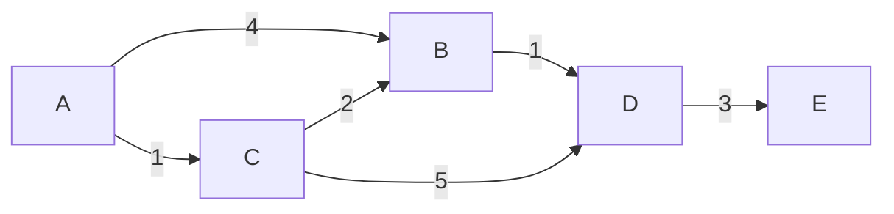

# Dijkstra

## Prerequisites

[BFS](./bfs.md) [Must read]
[Heap](../data-structures/heap.md) [Must read]

## Table of Contents

- [What it is](#what-it-is)
- [Intuition](#intuition)
- [How it works](#how-it-works)
- [Correctness / invariant](#correctness--invariant)
- [Complexity derivation](#complexity-derivation)
- [Constraints & approach](#constraints--approach)
- [When to use / when not](#when-to-use--when-not)
- [Comparison](#comparison)
- [Graph/tree assumptions](#graphtree-assumptions)
- [Edge cases](#edge-cases)
- [Implementation](#implementation)
- [What the interviewer probes for](#what-the-interviewer-probes-for)
- [Practice problems](#practice-problems)

## What it is

Dijkstra's algorithm finds the shortest path from a single source to every other vertex in a graph with **non-negative edge weights**, by repeatedly finalizing the closest not-yet-finalized vertex and relaxing its outgoing edges.

Mental model: **BFS, but the "next ring" is chosen by cost, not by hop count.** BFS expands the frontier one hop at a time using a FIFO queue because every edge costs the same; Dijkstra expands the frontier by *distance*, using a min-heap to always pop the cheapest frontier node next. The moment you replace "1 hop = 1 unit of cost" with "each edge has its own cost", the queue has to become a priority queue - that single substitution is the entire algorithm.

Time: **O((V + E) log V)** with a binary heap. Space: **O(V + E)** - O(V) for the distance array and finalized set, plus up to O(E) for stale heap entries (see [Complexity derivation](#complexity-derivation) for why the heap grows past O(V)).

> **Soundbite:** Dijkstra is greedy BFS with a price tag on every edge - always finalize the cheapest unfinalized node next, and that greedy choice is provably safe as long as no edge weight is negative.

## Intuition

The key claim is: once you pop the minimum-distance node from the frontier, its tentative distance is *final* - no cheaper path to it will ever be found later. Why can you trust that claim? Because every edge weight is **non-negative**. If node `u` is the cheapest thing left in the frontier, then any other path to `u` would have to leave the finalized region, cross the frontier, and take at least one more edge - and since edges never subtract distance, that alternative path can only be *longer*, never shorter. Popping the minimum is safe precisely because "one more edge" can never make things cheaper.

This is the same wavefront picture as BFS - a growing "finalized" region and an expanding frontier - except the wavefront no longer moves in neat concentric rings of equal radius. It moves outward in order of *cost*, so the frontier is a heap ordered by tentative distance rather than a queue ordered by insertion time. Every time you finalize a node, you "relax" its neighbors: for each outgoing edge `(u, v)` with weight `w`, if going through `u` gives a cheaper route to `v` than what's currently known, you update `v`'s tentative distance and push it (or re-push it) onto the heap.

The reason this breaks the instant you allow a negative edge: the "any alternative path is at least as long" argument relies on edges never helping you go backward in cost. A negative edge can make a longer-looking path (in edge count) actually cheaper in total weight, which means a node you already finalized could later be reached more cheaply through that negative edge - but you've already locked in its distance and moved on. There is no cheap patch for this inside Dijkstra's greedy structure; you need Bellman-Ford's repeated-relaxation approach instead.

## How it works

Trace Dijkstra from source `A` on this weighted directed graph:

```
Edges: A→B (4), A→C (1), C→B (2), B→D (1), C→D (5), D→E (3)
```



Initialize `dist[A]=0`, everything else `∞`. Min-heap starts with `(0, A)`.

| Step | Pop (dist, node) | Finalized? | Relax edges                                  | Heap after push                          | dist[] snapshot                  |
| ---- | ----------------- | ---------- | --------------------------------------------- | ----------------------------------------- | --------------------------------- |
| 1    | (0, A)             | A          | A→B: 0+4=4 < ∞ → update B; A→C: 0+1=1 < ∞ → update C | [(1,C), (4,B)]                        | A:0, B:4, C:1, D:∞, E:∞           |
| 2    | (1, C)             | C          | C→B: 1+2=3 < 4 → update B; C→D: 1+5=6 < ∞ → update D | [(3,B), (4,B)stale, (6,D)]            | A:0, B:3, C:1, D:6, E:∞           |
| 3    | (3, B)             | B          | B→D: 3+1=4 < 6 → update D                     | [(4,B)stale, (4,D), (6,D)stale]       | A:0, B:3, C:1, D:4, E:∞           |
| 4    | (4, B) **stale**   | -          | B already finalized at dist 3 - **skip, do not re-relax** | [(4,D), (6,D)stale]              | (unchanged)                       |
| 5    | (4, D)             | D          | D→E: 4+3=7 < ∞ → update E                     | [(6,D)stale, (7,E)]                   | A:0, B:3, C:1, D:4, E:7           |
| 6    | (6, D) **stale**   | -          | D already finalized at dist 4 - **skip**      | [(7,E)]                                   | (unchanged)                       |
| 7    | (7, E)             | E          | E has no outgoing edges                        | []                                         | A:0, B:3, C:1, D:4, E:7 (final)   |

Notice step 4 and step 6: because a plain binary heap (`heapq`) has no `decrease-key`, updating a node's distance means pushing a *second*, cheaper entry rather than mutating the existing one. The stale `(4, B)` and `(6, D)` entries are left behind in the heap; when they're eventually popped, the algorithm checks "is this node already finalized with a smaller distance?" and discards them. This is exactly the invariant from [How it works](#how-it-works): once a node is popped with its true minimum distance and finalized, later pops of that node are noise to be ignored, never re-processed.

## Correctness / invariant

**Invariant:** At any point during execution, for every finalized vertex `u`, `dist[u]` equals the true shortest-path distance from the source to `u`. For every vertex still in the frontier (in the heap but not finalized), `dist[u]` is the length of the shortest path found *so far* using only finalized vertices as intermediates - which may still improve.

**Proof sketch (by induction on the order of finalization):**

- *Base case:* The source is finalized first with `dist[source] = 0`, which is trivially its true shortest distance (no negative weights means 0 is a lower bound achieved by the empty path).
- *Inductive step:* Suppose every vertex finalized so far has its correct shortest distance. Let `u` be the next vertex popped (the minimum tentative distance in the heap). Suppose for contradiction that `dist[u]` is *not* the true shortest distance - i.e., some shorter path `P` to `u` exists. `P` must leave the finalized region at some point, crossing an edge `(x, y)` where `x` is finalized and `y` is not. By the inductive hypothesis, `dist[x]` is already correct, so when `x` was finalized, the edge `(x, y)` was relaxed, giving `dist[y] ≤ dist[x] + w(x, y)` ≤ (the length of the prefix of `P` up to `y`). Since all remaining edge weights on `P` from `y` to `u` are **non-negative**, the total length of `P` is at least `dist[y]`. But `u` was chosen as the *minimum* tentative distance in the heap, so `dist[u] ≤ dist[y] ≤ length(P)` - contradicting that `P` is shorter than `dist[u]`. Hence no shorter path exists; `dist[u]` is correct.
- *Termination:* Each vertex is finalized at most once (guarded by the visited/finalized check), and there are `V` vertices, so the loop terminates after at most `V` finalizations plus the discarded stale-entry pops.

**Where the proof breaks with negative weights:** the step "all remaining edge weights on `P` are non-negative, so `length(P) ≥ dist[y]`" is the load-bearing line. A negative edge later on `P` could make `length(P) < dist[y]`, which means `u` might legitimately be reachable more cheaply through a path that hasn't been explored yet - but `u` has already been finalized and will never be revisited. This is **the finalized-node assumption**: Dijkstra assumes that once popped, a node's distance can only get worse from any unexplored path, which is only true when edges can't make things cheaper later.

## Complexity derivation

Let `V` = vertices, `E` = edges, using a binary min-heap.

- **Heap operations:** every relaxation that improves a distance pushes a new `(dist, node)` pair. In the worst case, every edge causes one push, so the heap holds up to `O(E)` entries over the algorithm's life. Each push/pop is `O(log E) = O(log V)` (since `E ≤ V²`, `log E = O(log V)`).
- **Total pops:** up to `O(E)` pops (one real pop per finalization, plus stale pops discarded in `O(log V)` each) → `O(E log V)`.
- **Total pushes:** up to `O(E)` pushes (one per successful relaxation) → `O(E log V)`.
- **Edge scanning:** every vertex, when finalized, scans its adjacency list once - `O(V + E)` total for the scanning itself (dominated by the heap terms).

Summing: **O((V + E) log V)**, which simplifies to **O(E log V)** for connected graphs where `E ≥ V - 1`.

**Space:** `O(V)` for the `dist[]` array and the finalized/visited set, plus `O(E)` for the heap in the worst case (every edge can produce a stale entry before being superseded) - commonly stated as `O(V + E)`, or `O(V)` if you use a heap variant with true decrease-key (Fibonacci heap) that never grows the heap past `V` entries. **The algorithm is iterative** - no recursion, so there is no call-stack term to add; this is one of the rare shortest-path algorithms where the space bound has no hidden recursive depth to account for.

> **Cache behavior:** Dijkstra is cache-hostile at scale. Each heap pop jumps to an arbitrary node's adjacency list (pointer-chasing through scattered heap-allocated memory), and each relaxation triggers a heap push that reorders a binary-heap array stored separately from the graph itself - two independent memory regions being hammered in an interleaved, unpredictable pattern. Contrast with a prefix-sum scan or heapsort's in-place array, both of which touch memory sequentially or within a tight local window; Dijkstra's access pattern defeats hardware prefetching almost entirely on large sparse graphs.

## Constraints & approach

| Input size                         | Expected complexity      | Approach                                                                                     |
| ----------------------------------- | ------------------------- | ---------------------------------------------------------------------------------------------- |
| V, E ≤ 10⁵, non-negative weights   | O((V+E) log V)             | Binary heap Dijkstra - the default; `heapq` in Python is fast enough.                          |
| V ≤ 10³, dense (E ≈ V²)             | O(V²)                      | Array-based Dijkstra (no heap): scan all unfinalized nodes for the min each round - the O(log V) heap overhead isn't worth it when E ≈ V², since you're touching almost every edge anyway. |
| V, E ≤ 10⁶–10⁷                     | O((V+E) log V), tight      | Binary heap still works but constant factors (cache misses, Python overhead) start to bite; a Fibonacci heap improves the *asymptotic* to O(E + V log V) but its constants make it rarely worth implementing outside theory. |
| Any negative edge weight            | rules Dijkstra out         | The finalized-node proof requires non-negative weights; switch to <!-- [Bellman-Ford](./bellman-ford.md) [Must read] - the standard fallback when weights can be negative; O(VE) instead of O(E log V), and it also detects negative cycles Dijkstra can't even recognize. --> |
| Need shortest paths between **all** pairs | O(V³) or O(V·E log V) | Floyd-Warshall (dense, O(V³)) or run Dijkstra from every source (sparse, O(V·E log V)) - the constraint "all pairs" changes the algorithm choice entirely, not just the constant. |
| Unweighted, or all weights equal    | O(V + E)                   | Plain BFS - Dijkstra still works but the `log V` factor is pure waste since a FIFO queue already gives correct ordering when every edge costs the same. |

**What the constraint tells you:** "non-negative weights" is the single word that invites Dijkstra; its absence rules it out immediately, no partial credit. Once weights are confirmed non-negative, the next question is density - sparse graphs favor the heap version, dense graphs favor the simpler O(V²) array scan because the heap's log factor stops paying for itself once you're touching a near-quadratic number of edges anyway.

## When to use / when not

**Reach for Dijkstra when:**

- You need single-source shortest paths and can guarantee **all edge weights are non-negative** - this is the load-bearing precondition, not a footnote.
- The graph is weighted with genuinely different edge costs - road networks with distances, network links with latencies, currency-exchange graphs with conversion rates.
- You need shortest path to **one target**, and can stop early the moment that target is popped from the heap (a common competitive-programming optimization that avoids computing distances to unreachable-but-irrelevant nodes).

**Do not use Dijkstra when:**

- **Any edge can be negative** - even one negative edge invalidates the finalized-node proof. Use [Bellman-Ford](./bellman-ford.md) instead (see the HTML-comment link above pending that page - it will supersede this once written), which relaxes all edges `V-1` times instead of trusting a greedy pop order, at the cost of O(VE) instead of O(E log V).
- **All edges cost the same** - plain BFS gives the identical answer in O(V+E), without the heap's log-factor overhead. Reaching for Dijkstra on an unweighted graph is a tell that a candidate doesn't recognize BFS is a special case.
- You need **all-pairs** shortest paths on a dense graph - Floyd-Warshall's O(V³) beats running Dijkstra V times when the graph is dense enough that V·E log V ≥ V³.
- You have a good admissible heuristic and a known single target - A* explores far fewer nodes in practice by biasing the priority queue toward the goal, though its worst-case bound without a heuristic degrades to Dijkstra's.

**Real-world usage:** Dijkstra (or a heuristic-augmented variant) is the backbone of road-network routing (Google Maps' fastest-route computation runs a heavily optimized contraction-hierarchy variant built on Dijkstra's core idea) and of link-state routing protocols like OSPF, where every router runs Dijkstra locally against its view of the network topology to compute next-hops. At scale, a naive Dijkstra on a road graph with 10⁷+ nodes is too slow for real-time queries - production routers precompute contraction hierarchies or use bidirectional Dijkstra (searching from both source and destination simultaneously) to cut the practical search space by orders of magnitude.

## Comparison

| Algorithm      | Time            | Space  | Edge weights?         | Shortest path?       | Pick it when…                                                                                     |
| -------------- | ---------------- | ------ | ----------------------- | ---------------------- | ---------------------------------------------------------------------------------------------------- |
| **Dijkstra**   | O((V+E) log V)   | O(V+E) | Non-negative only       | Yes                    | Weighted graph, all weights ≥ 0 - the default weighted-shortest-path algorithm.                     |
| BFS            | O(V + E)         | O(V)   | Unweighted (all = 1)    | Yes                    | Every edge costs exactly the same - Dijkstra's heap becomes pure overhead once weights are uniform. |
| Bellman-Ford   | O(V·E)           | O(V)   | Any, incl. negative     | Yes (or detects neg. cycle) | Any edge might be negative, or you must detect a negative cycle - accept the O(VE) cost for correctness. |
| Floyd-Warshall | O(V³)            | O(V²)  | Any, incl. negative (no neg. cycle) | Yes, all-pairs | You need **every** pair's shortest path and V is small enough (≲ 500–1000) that O(V³) fits the time budget. |
| A*             | O(E) best-case, O((V+E) log V) worst-case | O(V) | Non-negative      | Yes (with admissible heuristic) | You have a real distance heuristic (Euclidean/Manhattan on a grid or map) and only need one source-target pair - explores far fewer nodes than blind Dijkstra in practice. |

**Crossover with BFS:** the instant every edge weight becomes 1, Dijkstra's O((V+E) log V) is strictly worse than BFS's O(V+E) - the priority queue's log factor buys nothing because a FIFO queue already pops in increasing-distance order when all edges are equal. **Crossover with Bellman-Ford:** Dijkstra wins by a full log-vs-linear-in-E factor whenever weights are confirmed non-negative; the moment even a single negative edge is possible, Dijkstra's answer can be silently wrong rather than slow, which is a worse failure mode than Bellman-Ford's higher cost - always verify the non-negative precondition before choosing Dijkstra in a system where inputs aren't controlled.

## Graph/tree assumptions

**Visited/finalized state.** Dijkstra needs a "finalized" set distinct from "discovered" - a node can be discovered (has a finite tentative `dist[]`) long before it is finalized (its `dist[]` is provably final). This is a strictly stronger notion than BFS's single visited flag: BFS finalizes a node the instant it's enqueued (mark-on-enqueue), because with uniform weights the first discovery *is* the shortest path. Dijkstra cannot finalize on discovery - a node can be discovered multiple times at decreasing tentative distances before its true minimum is popped - so the finalized check happens at **pop time**, using either a boolean `finalized[]` array or by comparing the popped `(dist, node)` pair against the current best-known `dist[node]` and skipping if it's stale (the lazy-deletion trick from the [heap](../data-structures/heap.md) article, since `heapq` has no decrease-key).

**Directed vs undirected, weighted.** Dijkstra works on both directed and undirected graphs unchanged - undirected edges are simply relaxed in both directions when building the adjacency list. The algorithm is fundamentally **weighted**: it degrades to correct-but-wasteful BFS on unweighted graphs and produces silently wrong distances on graphs with any negative edge, because it depends on weights being non-negative to justify finalizing greedily (see [Correctness / invariant](#correctness--invariant)).

**Queue vs stack vs priority queue.** This is the defining choice across the Traversal family: a stack gives DFS (dives deep, no shortest-path guarantee), a plain FIFO queue gives BFS (shortest path only when all edges cost 1), and a **min-heap keyed on tentative distance** gives Dijkstra (shortest path for any non-negative weights). The data structure *is* the algorithm here - swapping BFS's `deque.popleft()` for a `heapq.heappop()` keyed on distance, plus relaxation instead of blind neighbor-enqueue, is the entire delta between the two algorithms. A 0-1 BFS (weights restricted to {0, 1}) sits in between: it uses a deque and gets Dijkstra's correctness in BFS's O(V+E) time, by exploiting that only two "priority buckets" ever exist.

**Why a plain heap isn't quite enough - the decrease-key gap.** The textbook description says "decrease the key of `v` in the priority queue when a cheaper path is found." Python's `heapq`, Java's default `PriorityQueue`, and most standard-library heaps **do not support decrease-key** in better than O(n) (it would require finding the element first). The universal workaround, used in essentially every real Dijkstra implementation, is **lazy deletion**: push a new `(new_dist, v)` entry instead of mutating the old one, leaving the stale entry in the heap, and when a stale entry is eventually popped, check it against the current best `dist[v]` and discard it if it doesn't match (or is worse). This is why the heap can hold up to O(E) entries instead of O(V) - a fact that has to be accounted for in the complexity derivation above and is easy to gloss over when reciting "O((V+E) log V)" from memory without understanding why the log is on `E`-scaled heap size, not `V`.

## Edge cases

**1. Disconnected graph.** Nodes unreachable from the source are never popped from the heap; their `dist[]` stays `∞`. This is correct behavior, not a bug - always check for `∞` (or a sentinel) before using a distance, and don't assume every node gets finalized.

**2. Single node, no edges.** `dist[source] = 0`, the heap pops it once, finds no neighbors, and terminates immediately. Correct trivially.

**3. Negative edge weight (the critical trap).** A single negative edge - even one, even far from the source - can make Dijkstra return a *wrong but plausible-looking* answer, because a node can be finalized before the negative edge is discovered to offer a cheaper route. This is the most senior-level trap in the entire topic: unlike most bugs, this one produces no crash, no exception, no obviously wrong output - just a distance that's too large, silently. **Guard for it explicitly**: validate that all weights are non-negative before running Dijkstra in any system where inputs aren't fully trusted, and reach for Bellman-Ford the moment negativity is possible.

**4. Stale heap entries (re-processing a popped node).** Because of the lazy-deletion workaround above, the same node can be popped from the heap multiple times with different (decreasing) distances. **Failing to check `if popped_dist > dist[node]: continue` and re-relaxing a stale entry's neighbors** re-does work harmlessly in a correct implementation (it just wastes time, since the stale distance can't improve anything), but omitting the check entirely and *trusting the popped distance blindly to update `dist[node]`* corrupts the answer - a later, smaller-index-but-larger-distance stale pop could overwrite an already-correct smaller value if relaxation isn't written as a strict `<` comparison. Always relax with a strict improvement check, and always skip a pop that's worse than the current known best.

**5. Duplicate/parallel edges and self-loops.** Multiple edges between the same pair of nodes are handled correctly by relaxation as long as you don't special-case "already has an edge to `v`" - just relax against every edge independently and let the `min` comparison sort it out. Self-loops with non-negative weight are harmless (relaxing `u→u` can never improve `dist[u]` since weight ≥ 0); a self-loop with negative weight is actually a negative cycle of length 1 and breaks Dijkstra exactly like any other negative edge.

**6. CP-flavored trap: overflow on distance accumulation.** When edge weights are large (up to 10⁹) and paths can have up to 10⁵ edges, summed distances can reach ~10¹⁴, which overflows a 32-bit integer but not Python's arbitrary-precision `int` - a trap mainly for C++/Java ports of a Python-first solution. Initialize "infinity" sentinels large enough that `INF + weight` doesn't wrap around or accidentally compare as smaller than a real distance.

## Implementation

### Pseudocode (CLRS-style)

```
DIJKSTRA(G, w, s)
  ▷ Initialize
  for each vertex v ∈ G.V
      dist[v] ← ∞
      finalized[v] ← FALSE
  dist[s] ← 0
  Q ← empty min-priority-queue keyed on dist[·]
  INSERT(Q, s, 0)
  while Q ≠ ∅
      (u, d) ← EXTRACT-MIN(Q)          ▷ pop the smallest tentative distance
      if finalized[u]
          continue                      ▷ stale entry left by lazy decrease-key - discard
      finalized[u] ← TRUE
      for each edge (u, v) ∈ G.Adj[u] with weight w(u, v)
          if not finalized[v] and dist[u] + w(u, v) < dist[v]
              dist[v] ← dist[u] + w(u, v)   ▷ RELAX
              INSERT(Q, v, dist[v])         ▷ push new entry; old stale entry stays in Q
  return dist
```

**Note on decrease-key:** CLRS's textbook version assumes a priority queue with a true `DECREASE-KEY` operation (achievable with a Fibonacci heap in O(1) amortized). The pseudocode above uses the **lazy re-insertion** form that every practical binary-heap implementation actually uses, with the `finalized[]` check standing in for decrease-key - this is the form to memorize, because it's what you'll actually write.

### Python (idiomatic)

```python
import heapq
from typing import Optional

def dijkstra(
    graph: dict[int, list[tuple[int, int]]],
    source: int,
    target: Optional[int] = None,
) -> dict[int, float]:
    """
    Single-source shortest paths via Dijkstra's algorithm.
    graph: adjacency list as {node: [(neighbor, weight), ...]}
    Assumes all weights are non-negative - see Edge cases for why this matters.
    Returns dist[v] = shortest distance from source to v (float('inf') if unreachable).
    """
    dist: dict[int, float] = {source: 0}
    finalized: set[int] = set()
    heap: list[tuple[int, int]] = [(0, source)]   # (distance, node)

    while heap:
        d, u = heapq.heappop(heap)
        if u in finalized:
            continue                               # stale entry - already finalized cheaper
        finalized.add(u)
        if u == target:
            break                                   # early exit for single-target queries

        for v, weight in graph.get(u, []):
            if v in finalized:
                continue
            new_dist = d + weight
            if new_dist < dist.get(v, float("inf")):
                dist[v] = new_dist
                heapq.heappush(heap, (new_dist, v))  # lazy "decrease-key": push, don't mutate

    return dist


def dijkstra_with_path(
    graph: dict[int, list[tuple[int, int]]],
    source: int,
    target: int,
) -> tuple[float, list[int]]:
    """Dijkstra with path reconstruction via a parent map."""
    dist: dict[int, float] = {source: 0}
    parent: dict[int, Optional[int]] = {source: None}
    finalized: set[int] = set()
    heap: list[tuple[int, int]] = [(0, source)]

    while heap:
        d, u = heapq.heappop(heap)
        if u in finalized:
            continue
        finalized.add(u)

        for v, weight in graph.get(u, []):
            new_dist = d + weight
            if new_dist < dist.get(v, float("inf")):
                dist[v] = new_dist
                parent[v] = u
                heapq.heappush(heap, (new_dist, v))

    if target not in dist:
        return float("inf"), []
    path: list[int] = []
    node: Optional[int] = target
    while node is not None:
        path.append(node)
        node = parent[node]
    path.reverse()
    return dist[target], path
```

**Contest note:** for dense graphs (`E ≈ V²`, `V ≤ ~2000`), skip the heap entirely and use the O(V²) array-scan version - each round, linearly scan all unfinalized nodes for the minimum `dist[]`. It avoids the O(log V) per-operation constant and the O(E)-sized heap memory, and is often *faster in practice* at that density despite the worse asymptotic complexity, because the heap's pointer-chasing cache misses outweigh the saved comparisons.

## What the interviewer probes for

**"Does Dijkstra work with negative weights?"** No - a finalized node's distance is assumed final, but a negative edge encountered later could offer a cheaper route to an already-finalized node, and Dijkstra never revisits it. Use Bellman-Ford (O(VE)) instead, which relaxes every edge V-1 times rather than trusting a greedy pop order.

**"Why do you need a `finalized[]`/visited check when popping, if you already check distances before pushing?"** Because `heapq` has no decrease-key: updating a node's distance means pushing a second entry rather than mutating the first, so the heap can contain multiple stale entries for the same node. Without the pop-time check, a stale entry could be mistaken for a fresh discovery and its neighbors re-relaxed - harmless for correctness if relaxation strictly checks `<`, but it silently turns O(E) work into up to O(E log V) wasted heap churn, and skipping the check while *also* writing "blind overwrite" relaxation logic (rather than a strict improvement check) can corrupt the answer.

**"What's the actual heap size in the worst case - V or E?"** E, not V. Every successful relaxation pushes a new entry without removing the old one, so the heap can hold up to one entry per edge. This is why the complexity is stated as O((V+E) log V) rather than O((V+E) log V) written carelessly as "O(E log V) ≈ O(E log E)" without noticing `log E = O(log V)` only because `E ≤ V²`.

**"How would you speed this up for a single source-target query on a huge graph?"** Two standard techniques: (1) early exit - stop the moment the target is popped and finalized, skipping the rest of the graph; (2) bidirectional Dijkstra - run the search simultaneously from source and target on the graph and its reverse, stopping when the two frontiers meet, which empirically explores a much smaller region on large sparse graphs like road networks.

**"Dijkstra vs A* - what's the actual difference?"** A* is Dijkstra with a heuristic `h(v)` added to the priority: pop by `dist[v] + h(v)` instead of `dist[v]` alone. If `h` is admissible (never overestimates true remaining distance), A* still finds the optimal path but explores far fewer nodes by biasing the search toward the target. Setting `h(v) = 0` for all v makes A* degenerate exactly into Dijkstra - it's a generalization, not a different algorithm.

**"Can Dijkstra be implemented without a heap?"** Yes - the O(V²) array-scan version: each round, linearly scan all unfinalized nodes to find the minimum `dist[]`, finalize it, relax its edges, repeat V times. This is actually preferred on dense graphs (E close to V²) since the heap's log-factor overhead isn't worth paying when you're already touching almost every edge each round.

## Practice problems

### 1. Network Delay Time (LC 743)

**Problem:** Given a directed, weighted graph of `n` nodes (labeled 1 to n) and a list of travel times as directed edges `(u, v, w)`, find how long it takes for a signal sent from node `k` to reach all `n` nodes. Return the maximum of the shortest distances from `k`, or -1 if any node is unreachable. Constraints: `n ≤ 100`, `edges ≤ 6000`, weights are positive integers - small enough that any correct Dijkstra runs comfortably.

**Worked examples:**
- **Example 1**
  - **Input:** times = [[2,1,1],[2,3,1],[3,4,1]], n = 4, k = 2 | **Output:** 2
  - **Explanation:** from node 2, node 1 and node 3 are reached at time 1, and node 4 (via node 3) is reached at time 2 - the maximum of all shortest distances.
- **Example 2**
  - **Input:** times = [[1,2,1]], n = 2, k = 1 | **Output:** 1
  - **Explanation:** node 2 is reached directly in 1 unit of time; both nodes are covered.

**Constraints:** `1 ≤ k ≤ n ≤ 100`, `1 ≤ times.length ≤ 6000`, `1 ≤ wᵢ ≤ 100`.

**Approach:** This is textbook single-source Dijkstra with no twist: run Dijkstra from `k`, then check whether every node received a finite distance (if not, some node is unreachable, return -1), and return the max of all distances (the last node to receive the signal is the bottleneck).

```python
import heapq
from collections import defaultdict

def network_delay_time(times: list[list[int]], n: int, k: int) -> int:
    graph: dict[int, list[tuple[int, int]]] = defaultdict(list)
    for u, v, w in times:
        graph[u].append((v, w))

    dist: dict[int, int] = {k: 0}
    heap: list[tuple[int, int]] = [(0, k)]
    finalized: set[int] = set()

    while heap:
        d, u = heapq.heappop(heap)
        if u in finalized:
            continue
        finalized.add(u)
        for v, w in graph[u]:
            nd = d + w
            if nd < dist.get(v, float("inf")):
                dist[v] = nd
                heapq.heappush(heap, (nd, v))

    if len(dist) < n:
        return -1
    return max(dist.values())
```

**Complexity:** O((V + E) log V) time, O(V + E) space.

**Duplicate problems:**
- Path with Maximum Probability (LC 1514) - contrast only, not a true dup: same single-source Dijkstra structure with the comparison flipped to a max-heap and "relaxation" multiplying probabilities instead of adding weights, but the max-combining variant is treated as its own full entry below (Swim in Rising Water) rather than a duplicate of this sum-based entry.
- Cheapest Flights Within K Stops (LC 787) - same graph shape but needs the state-augmented variant below; not a pure duplicate, listed here to contrast.

---

### 2. Swim in Rising Water (LC 778)

**Problem:** Given an `n×n` grid where `grid[i][j]` is the elevation at that cell, you start at `(0,0)` at time 0. At time `t`, you can move to an adjacent cell if its elevation is ≤ `t`, and the water level rises so every cell's effective wait time is `max(elevation)` along your path. Find the minimum time to reach `(n-1, n-1)`. Constraints: `n ≤ 50`.

**Worked examples:**
- **Example 1**
  - **Input:** grid = [[0,2],[1,3]] | **Output:** 3
  - **Explanation:** the path (0,0)→(0,1)→(1,1) has max elevation 3; the path (0,0)→(1,0)→(1,1) also has max elevation 3 - both routes bottleneck at the highest cell they must cross.
- **Example 2**
  - **Input:** grid = [[0,1,2,3,4],[24,23,22,21,5],[12,13,14,15,16],[11,17,18,19,20],[10,9,8,7,6]] | **Output:** 16
  - **Explanation:** the optimal path snakes through the grid staying below elevation 16 as long as possible, bottlenecking at cell value 16 on the way to (4,4).

**Constraints:** `n == grid.length == grid[i].length`, `1 ≤ n ≤ 50`, `0 ≤ grid[i][j] < n²`, every value in `grid` is unique.

**Approach:** This is Dijkstra with the combining function changed from **sum** to **max**: instead of minimizing the sum of edge weights along a path, minimize the *maximum* node elevation encountered along the path (a "minimax path" problem). The greedy argument still transfers: replacing the running max with `max(current, next_elevation)` can only stay the same or increase, exactly like adding a non-negative weight can only stay the same or increase - so popping the minimum-max-so-far node from the heap is still safe to finalize. This combining-function swap (sum → max, sum → product) is the single most common "disguised Dijkstra" twist in interviews - recognize it whenever a problem asks for the "bottleneck" or "minimum of the maximum" along a path. It is **not** a duplicate of plain sum-based Dijkstra (problem 1): the relaxation rule and the greedy-safety argument both change shape (max instead of add), even though the pop-the-cheapest-frontier-node skeleton is identical - which is why it earns its own full entry rather than a dup-line.

```python
import heapq

def swim_in_water(grid: list[list[int]]) -> int:
    n = len(grid)
    dist = [[float("inf")] * n for _ in range(n)]
    dist[0][0] = grid[0][0]
    heap: list[tuple[int, int, int]] = [(grid[0][0], 0, 0)]   # (max_elevation_so_far, r, c)
    directions = [(0, 1), (0, -1), (1, 0), (-1, 0)]

    while heap:
        d, r, c = heapq.heappop(heap)
        if (r, c) == (n - 1, n - 1):
            return d
        if d > dist[r][c]:
            continue                                # stale entry, same lazy-deletion pattern
        for dr, dc in directions:
            nr, nc = r + dr, c + dc
            if 0 <= nr < n and 0 <= nc < n:
                nd = max(d, grid[nr][nc])           # combining function: max, not sum
                if nd < dist[nr][nc]:
                    dist[nr][nc] = nd
                    heapq.heappush(heap, (nd, nr, nc))

    return -1
```

**Complexity:** O(n² log n) time (grid has n² cells, each heap operation is O(log(n²)) = O(log n)), O(n²) space.

**Duplicate problems:**
- Path with Maximum Probability (LC 1514) - same "swap the combining function" trick as this entry (max-combining instead of sum), but multiplying probabilities with a max-heap instead of taking the max elevation; ruled not distinct from this entry's max-combining mechanic, so it's folded in here rather than given its own full entry.
- Path With Minimum Effort (LC 1631) - identical minimax-Dijkstra on a grid, minimizing the maximum absolute difference between adjacent cells instead of the maximum elevation.

---

### 3. Cheapest Flights Within K Stops (LC 787)

**Problem:** Given `n` cities connected by flights with prices, and a source, destination, and a maximum number of stops `k`, find the cheapest price to fly from source to destination using at most `k` stops (`k+1` edges). Return -1 if impossible. Constraints: `n ≤ 100`, `k ≤ n-1`, prices are positive.

**Worked examples:**
- **Example 1**
  - **Input:** n = 4, flights = [[0,1,100],[1,2,100],[2,0,100],[1,3,600],[2,3,200]], src = 0, dst = 3, k = 1 | **Output:** 700
  - **Explanation:** with at most 1 stop, the path 0→1→3 costs 100+600=700; the cheaper path 0→1→2→3 needs 2 stops, which exceeds the budget.
- **Example 2**
  - **Input:** n = 3, flights = [[0,1,100],[1,2,100],[0,2,500]], src = 0, dst = 2, k = 1 | **Output:** 200
  - **Explanation:** with 1 stop allowed, 0→1→2 costs 100+100=200, cheaper than the direct 0→2 edge at 500.

**Constraints:** `1 ≤ n ≤ 100`, `0 ≤ flights.length ≤ (n × (n-1) / 2)`, `0 ≤ src, dst ≤ n-1`, `0 ≤ k ≤ n-1`.

**Approach:** Why plain Dijkstra needs modification here - this is the twist that trips people up: plain Dijkstra's finalize-once invariant is built on "the cheapest path to a node, period" - but here we need "the cheapest path to a node **using at most k edges**", which is a fundamentally different quantity. A node might have a cheaper overall path that uses too many stops, and a more expensive path that fits the stop budget - Dijkstra's greedy finalization would lock in the globally cheapest path and discard the stop-constrained one, giving a wrong answer. The fix: **augment the state from `node` to `(node, stops_used)`**, and relax by stop-count layer rather than by pure distance, so a node can be legitimately "revisited" at a higher stop count if that's cheaper within the budget. In practice this is solved either with a Bellman-Ford-style layered relaxation (exactly `k+1` rounds, since Bellman-Ford's repeated-relaxation structure naturally handles the "at most k edges" constraint that Dijkstra's greedy pop order cannot) or with a modified Dijkstra where the heap state includes stop count and a node can be popped multiple times at different stop counts.

```python
def find_cheapest_price(n: int, flights: list[list[int]], src: int, dst: int, k: int) -> int:
    # Bellman-Ford-style layered relaxation - exactly k+1 rounds of edges.
    # This is the natural fix because Dijkstra's greedy finalize-once model
    # cannot represent "cheapest path using at most k edges" - only Bellman-Ford's
    # bounded-round relaxation does.
    INF = float("inf")
    dist = [INF] * n
    dist[src] = 0

    for _ in range(k + 1):
        new_dist = dist[:]
        for u, v, w in flights:
            if dist[u] != INF and dist[u] + w < new_dist[v]:
                new_dist[v] = dist[u] + w
        dist = new_dist

    return -1 if dist[dst] == INF else dist[dst]
```

**Complexity:** O(K · E) time (K+1 rounds, each scanning all edges), O(V) space. Note this is deliberately *not* Dijkstra's complexity - the stop constraint forces a Bellman-Ford-shaped bound instead.

**Duplicate problems:**
- Path With Minimum Effort (LC 1631) - superficially similar grid-Dijkstra, but does NOT have this twist (no stop limit), so plain Dijkstra with a "minimize max edge" combining function applies directly - a useful contrast for recognizing when the constraint does vs doesn't break Dijkstra's assumptions.

