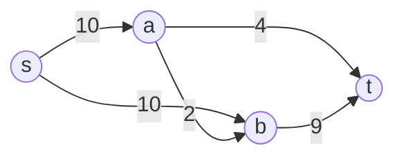
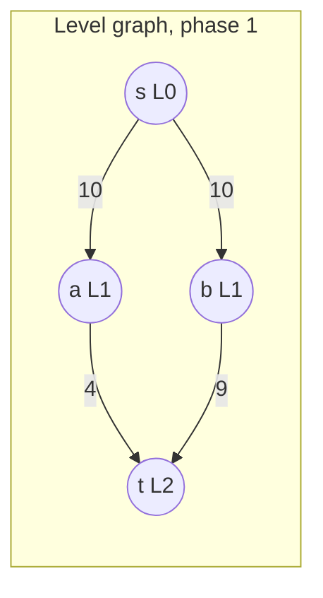

# Dinic

## Prerequisites

[Ford-Fulkerson](./ford-fulkerson.md) [Must read] - Dinic is a disciplined Ford-Fulkerson: same residual graph and augmenting-path mechanics, a completely different strategy for finding paths
[Edmonds-Karp](./edmonds-karp.md) [Must read] - Dinic generalizes Edmonds-Karp's "always BFS, shortest path" idea from one path per phase to *all* shortest paths per phase at once
[Breadth-First Search (BFS)](./bfs.md) [Must read] - builds the level graph each phase
[Depth-First Search (DFS)](./dfs.md) [Must read] - finds the blocking flow within a level graph

## Table of Contents

- [What it is](#what-it-is)
- [Intuition](#intuition)
- [How it works](#how-it-works)
- [Correctness / invariant](#correctness--invariant)
- [Complexity derivation](#complexity-derivation)
- [Constraints & approach](#constraints--approach)
- [When to use / when not](#when-to-use--when-not)
- [Comparison](#comparison)
- [Graph/tree assumptions](#graphtree-assumptions)
- [Edge cases](#edge-cases)
- [Implementation](#implementation)
- [What the interviewer probes for](#what-the-interviewer-probes-for)
- [Practice problems](#practice-problems)

## What it is

Dinic's algorithm computes maximum flow by alternating two phases: build a **level graph** via one BFS from the source (layering every node by its shortest-path distance), then find a **blocking flow** - many augmenting paths at once, all restricted to that level graph - via one DFS pass with a "current arc" pointer. Repeat until the sink is unreachable in the level graph.

Time: **O(V²E)** in general, **O(E√V)** on unit-capacity graphs (e.g. bipartite matching). Space: **O(V + E)**.

> **Soundbite:** Dinic doesn't find one shortest path per BFS like Edmonds-Karp - it finds *all* shortest paths per BFS, draining the entire level graph in one DFS sweep before rebuilding it, which is what turns O(VE²) into O(V²E) and, on unit-capacity graphs, all the way down to O(E√V).

## Intuition

Edmonds-Karp's fix over plain Ford-Fulkerson was "always augment along a shortest path" - but it still does that **one path at a time**, running a fresh BFS after every single augmentation even though most of that BFS's layering information is still valid. Dinic's insight: if you're going to compute shortest-path distances anyway, don't throw that layering away after pushing one path - **reuse it to push every shortest augmenting path you can find**, and only recompute it once all of them are exhausted.

Concretely: BFS from the source labels every reachable node with its distance (level). Keep only the edges that go from level `i` to level `i+1` - these form the **level graph**, a DAG that contains every shortest s→t path currently available. Now run DFS inside this level graph, pushing flow along any s→t path it finds, and keep going until DFS can't reach `t` anymore - this exhausts *all* the level graph's augmenting capacity in one pass, called a **blocking flow** (a flow that saturates at least one edge on every root-to-sink path, so no more flow can be pushed without changing levels). Rebuild the level graph from scratch (a fresh BFS) and repeat.

Why does batching help? Because the number of *phases* (level-graph rebuilds) is bounded by O(V) - the shortest s→t distance strictly increases every phase (same monotone-distance argument [Edmonds-Karp](./edmonds-karp.md) uses, just applied per-phase instead of per-augmentation) - while each phase does a full O(VE) sweep instead of one O(E) BFS. Trading "many cheap phases" for "few expensive phases" is a net win because a blocking flow can retire many augmenting paths in the cost of essentially one graph traversal, rather than paying a fresh O(E) BFS for every single one.

## How it works

**Same network used throughout the max-flow family, so the trace is directly comparable to [Ford-Fulkerson](./ford-fulkerson.md)'s and [Edmonds-Karp](./edmonds-karp.md)'s:**

```
Edges (u → v : capacity):
s → a : 10
s → b : 10
a → b : 2
a → t : 4
b → t : 9
```



**Phase 1 - build the level graph.** BFS from `s`: `level[s]=0`, `level[a]=1`, `level[b]=1`, `level[t]=2` (reached via either `a` or `b`). Keep only edges `u→v` with `level[v] = level[u]+1`: `s→a`, `s→b`, `a→t`, `b→t` survive. (`a→b` does **not** survive - both endpoints are at level 1, so it's a same-level edge, not a level-advancing one - this is the pruning that keeps DFS from wasting time on dead-end lateral moves.)



**Phase 1 - blocking flow via DFS with current-arc pointers.** Each node keeps a pointer into its adjacency list marking the next edge worth trying (the "current arc"), so a dead edge is never rescanned within this phase.

- DFS from `s`: current arc at `s` is `s→a`. Descend to `a`. Current arc at `a` is `a→t`. Descend to `t` - reached! Path `s→a→t`, bottleneck = min(10,4) = 4. Push 4. `a→t` residual drops to 0 - advance `a`'s current arc past it (it's dead for the rest of this phase; DFS will never look at it again this phase, only after the graph is rebuilt).
- DFS from `s` again (still same phase, same level graph): current arc at `s` is still `s→a` (its residual 6 > 0, not dead). Descend to `a`. Current arc at `a` has advanced past `a→t` (dead) - no more level-respecting edges from `a`. Dead end - retreat, and because `a` has no more live edges *this phase*, advance `s`'s current arc past `s→a` too (it can't lead anywhere further this phase).
- DFS from `s`: current arc now `s→b`. Descend to `b`. Current arc at `b` is `b→t`. Descend to `t` - reached! Path `s→b→t`, bottleneck = min(10,9) = 9. Push 9. `b→t` saturates - advance `b`'s current arc past it.
- DFS from `s`: current arc `s→b` still has residual 1 > 0. Descend to `b`. No live current arc left at `b` - dead end, retreat, advance `s`'s pointer past `s→b`.
- DFS from `s`: no arcs left at `s` at all. **Blocking flow for this phase = 4 + 9 = 13.**

**Phase 2 - rebuild level graph.** BFS from `s` in the updated residual graph: `s→a` has residual 6 (still an edge), `s→b` has residual 1 (still an edge), but `a→t` and `b→t` are both saturated (residual 0) - the only forward options from `a` and `b` are the reverse edges back to `s` (not useful) and `a→b` (residual 2, but `b` is already at the same BFS wave as `a`, so this doesn't reach a new level either). `t` is unreached by any forward path. **BFS cannot reach `t` → algorithm terminates.**

**Max flow = 13** - matching [Ford-Fulkerson](./ford-fulkerson.md) and [Edmonds-Karp](./edmonds-karp.md) exactly, as the max-flow min-cut theorem guarantees for every member of this family; Dinic reached it in **one phase** here (one BFS + one DFS sweep that itself found 2 augmenting paths), where Edmonds-Karp needed 2 separate BFS calls to find the same 2 paths - the batching is the entire point.

## Correctness / invariant

Dinic inherits the full residual-graph / augmenting-path correctness argument from [Ford-Fulkerson](./ford-fulkerson.md) - every push preserves capacity and conservation, and termination happens exactly when no augmenting path remains, at which point the max-flow min-cut theorem certifies optimality.

**Two invariants Dinic adds on top:**

1. **The level graph contains only shortest-path edges.** By construction (BFS layering, keep only `level[v] = level[u]+1` edges), any s→t path within the level graph is a shortest path in the current residual graph. Pushing flow only along such edges guarantees every augmentation this phase is along a currently-shortest path - the same guarantee Edmonds-Karp gives per-augmentation, but Dinic gives it for the *entire phase* at once.

2. **A blocking flow saturates every s→t path in the level graph.** The DFS-with-current-arc procedure doesn't stop after one path - it keeps pushing until DFS, starting fresh from `s`, cannot reach `t` at all through any live edge. At that point, at least one edge on *every* level-respecting s→t path is saturated (that's the definition of "blocking" - not maximum flow overall, just maximum flow restricted to this level graph). This is what justifies discarding the level graph and rebuilding: nothing more can be pushed through it without violating the level structure.

**Why phases terminate in O(V) steps - the strict-increase argument.** Let `d(t)` be the shortest s→t distance in the residual graph at the start of a phase. Claim: after computing a blocking flow and rebuilding the level graph, the new `d(t)` is **strictly greater** than before (or `t` becomes unreachable and the algorithm halts). Proof sketch: any edge added to the residual graph this phase is a reverse edge of an edge that was saturated - and a reverse edge `v→u` where `(u,v)` was on a shortest path always points from a higher level to a lower level (backward), so it can never be used to shorten a future shortest path forward. Since no new "shortcut" edges are created, and the old shortest path's edges are now saturated (blocking flow guarantees this), any new s→t path must be strictly longer. Since `d(t)` is bounded between 1 and `V-1`, it can increase at most O(V) times before exceeding `V-1` (at which point no path exists) - bounding the number of phases to **O(V)**.

## Complexity derivation

**Time: O(V²E).**

**Step 1 - number of phases is O(V).** Shown above: `d(t)` strictly increases every phase and is bounded by `V-1`, so there are at most O(V) phases.

**Step 2 - each phase (one blocking flow) costs O(VE).** Building the level graph is one BFS: O(V+E). The blocking-flow DFS is the more subtle part - naively, a DFS that finds one path, pushes flow, and restarts from `s` from scratch every time could re-walk the same dead branches repeatedly, costing O(VE) *per path* and O(V²E) per phase. The **current-arc optimization** fixes this: each node's adjacency pointer only ever moves forward within a phase, never resets until the level graph is rebuilt. So across the whole phase, total pointer advancement is O(E) (each edge is "given up on" at most once), and every successful path push does O(V) work to walk from `s` to `t` (at most `V` edges on a simple path) plus O(1) amortized to retract dead branches. With at most O(E) total edge-retirements and at most O(V) length per successful augmenting path, and at most O(E) successful augmentations bounded by edge saturations, the whole blocking-flow DFS for one phase costs **O(VE)**.

**Combined: O(V) phases × O(VE) per phase = O(V²E).**

**The unit-capacity specialization: O(E√V).** When every edge has capacity 1 (the case that matters for bipartite matching - see [Bipartite Matching](./bipartite-matching.md)), a stronger bound applies via the same argument [Bipartite Matching](./bipartite-matching.md#complexity-derivation) uses for Hopcroft-Karp: **(1)** each phase still costs O(E) (a blocking flow on a unit-capacity graph pushes at most one unit per edge, so the DFS work is linear, not O(V) per path times many paths). **(2)** the number of phases collapses from O(V) to **O(√V)**, because after √V phases the shortest augmenting-path length must already exceed √V - and a graph with `V` nodes can contain at most O(√V) vertex-disjoint paths of length greater than √V (each such path consumes more than √V distinct nodes, and there are only `V` nodes total to go around, so the remaining flow value still to be pushed is bounded by O(√V), and each remaining phase pushes at least 1 more unit of flow along a still-shorter-than-everything-else path). This is exactly the phase-count argument that gives Hopcroft-Karp its O(√V) phase bound - Dinic **is** Hopcroft-Karp's phase structure, generalized from bipartite unit-capacity graphs to arbitrary flow networks; the proof transfers directly rather than needing to be re-derived. Combined: O(√V) phases × O(E) per phase = **O(E√V)**.

**Space: O(V + E)** for the residual graph, BFS's level array and queue (O(V)), and the current-arc pointers (one per node, O(V)).

**Cache behavior.** The level-graph BFS is a sequential sweep over adjacency lists - cache-friendly, similar to any BFS. The blocking-flow DFS's current-arc pointers are the structural win here: without them, a naive re-DFS-from-scratch per augmenting path re-touches the same early nodes' full adjacency lists repeatedly, thrashing cache on graphs with high-degree nodes near the source; the pointer ensures each adjacency-list slot is dereferenced at most once per phase, turning what would be repeated random-ish re-scans into one monotonic sweep per node.

## Constraints & approach

| Input size / capacity shape                          | Expected complexity | Use Dinic?               | Notes                                                                                             |
| ------------------------------------------------------ | --------------------- | ---------------------------- | ----------------------------------------------------------------------------------------------- |
| V, E ≤ 2000, general capacities                        | O(V²E) ≈ 8×10⁹ worst case, far faster in practice | Yes, or Edmonds-Karp | Worst case looks large but blocking-flow phases rarely hit the theoretical max in typical graphs |
| V, E ≥ 10⁴, dense (E ≈ V²)                            | O(V²E) still tractable relative to O(VE²) | Yes                     | Dinic's O(V²E) beats Edmonds-Karp's O(VE²) once E grows past V - the standard large-graph choice |
| Unit-capacity bipartite matching (V, E up to 10⁵–10⁶) | O(E√V)               | Yes                          | This is the canonical use case - reduces to the same O(E√V) bound as Hopcroft-Karp                |
| Small graph (V, E ≤ 200), simple to code under pressure | O(VE²) Edmonds-Karp is simpler to implement correctly | No, prefer Edmonds-Karp | Dinic's current-arc bookkeeping is real implementation overhead not worth it at tiny scale        |
| Need min-cut, not just the flow value                  | Same as general case | Yes                          | Same residual-graph reachability trick as Ford-Fulkerson/Edmonds-Karp applies unchanged           |

**What rules Dinic out:** tiny graphs where Edmonds-Karp's simpler one-path-per-BFS code is less implementation risk for the same practical runtime, and problems needing a *different* objective entirely (min-cost flow, weighted matching) where Dinic's plain blocking-flow machinery doesn't apply without extension. **What it invites:** any graph large or dense enough that O(VE²) is a real bottleneck, and - decisively - any unit-capacity flow formulation (bipartite matching chief among them), where the O(E√V) bound is asymptotically the best available via a flow-based method.

## When to use / when not

**Reach for Dinic when:**

- The graph is large or dense enough that Edmonds-Karp's O(VE²) becomes the bottleneck - Dinic's O(V²E) wins once `E` grows past `V` (see the Comparison table's crossover), and its constant factor in practice is usually much better than the worst-case bound suggests because blocking flows retire many augmenting paths per phase.
- The problem is **unit-capacity bipartite matching** (or reduces to a unit-capacity flow network) - Dinic's O(E√V) specialization matches Hopcroft-Karp's bound, making it the standard flow-based choice for matching at scale (see [Bipartite Matching](./bipartite-matching.md)).
- You need a general-purpose max-flow implementation that will not become the asymptotic bottleneck as graph size grows, and you're willing to pay the extra implementation complexity of level graphs and current-arc DFS upfront.

**Do not use Dinic when:**

- The graph is small (a few hundred nodes/edges) and you want the least implementation risk under time pressure - Edmonds-Karp's plain BFS-augmentation loop is simpler to get right, and the runtime difference is negligible at that scale.
- The problem needs **min-cost flow**, not just max-flow - Dinic's blocking-flow machinery answers "how much" but not "at what cost"; that requires a cost-aware augmenting-path algorithm (e.g. successive shortest paths with potentials, SPFA/Bellman-Ford-based), a genuinely different technique.
- Capacities are irrational or otherwise non-integer in a way that breaks the finite-augmentation guarantee - the same termination caveat [Ford-Fulkerson](./ford-fulkerson.md) documents applies here too, since Dinic still relies on integer (or rational) capacities for the blocking-flow-per-phase argument to terminate in finitely many pushes.

**Real-world usage:** Dinic (and push-relabel variants built on similar layering ideas) is the workhorse behind production flow solvers - network bandwidth/traffic engineering systems, and image-segmentation pipelines that formulate foreground/background separation as a min-cut computation on pixel-adjacency graphs, routinely use Dinic or a push-relabel derivative because the plain Edmonds-Karp bound doesn't scale to graphs with millions of nodes. At scale, even O(V²E) becomes a real ceiling past roughly V ~ 10⁵–10⁶ with dense connectivity - production systems either exploit unit-capacity/planar structure (the O(E√V) or planar-specific bounds) or switch to push-relabel (O(V²√E)), which trades Dinic's phase-based batching for a different amortized argument that parallelizes better on some hardware.

## Comparison

| Algorithm      | Time                     | Space  | Path-finding strategy               | Pick it when…                                                                                            |
| -------------- | -------------------------- | ------ | -------------------------------------- | ----------------------------------------------------------------------------------------------------------- |
| Ford-Fulkerson | O(E·\|max_flow\|)         | O(V+E) | DFS, any augmenting path              | Small graph, small guaranteed-small integer capacities - simplicity wins and the bound never bites          |
| Edmonds-Karp   | O(VE²)                    | O(V+E) | BFS, one shortest augmenting path/pass | Capacities are large or unknown and the graph is small-to-medium - the safe, predictable default            |
| Dinic          | O(V²E), O(E√V) unit-cap  | O(V+E) | BFS level graph + DFS blocking flow (all shortest paths/phase) | Graph is large/dense, or the problem is unit-capacity bipartite matching - worth the extra complexity |

**Crossover vs Edmonds-Karp:** Dinic's O(V²E) beats Edmonds-Karp's O(VE²) exactly when `E > V` (moderately dense graphs and beyond) - at `E ≈ V` the two bounds coincide, and below that, Edmonds-Karp's simpler implementation is the better trade. On unit-capacity graphs specifically, Dinic's O(E√V) strictly dominates both Edmonds-Karp's O(VE²) and generic Dinic's own O(V²E), which is why the unit-capacity case gets called out separately rather than folded into the general bound.

## Graph/tree assumptions

**Directed, weighted (capacity) graph** - identical assumption to every member of the max-flow family: every edge carries a non-negative capacity, and the residual graph is built the same way (forward residual = capacity − flow, backward residual = flow).

**Level graph via BFS - a fresh visited/level state every phase.** Unlike a standard single-pass BFS, Dinic's `level[]` array is recomputed from scratch at the start of every phase (not maintained incrementally) - each phase's BFS assigns `level[s] = 0` and layers outward, and only edges `u→v` with `level[v] = level[u] + 1` are kept as "live" for that phase's DFS. This is a directed acyclic subgraph of the residual graph by construction (levels strictly increase along a kept edge, so no cycle can form), which is exactly what makes a bounded-length DFS traversal correct and efficient.

**Blocking flow via DFS with the current-arc optimization - the queue-vs-stack choice that defines this family.** Ford-Fulkerson uses unrestricted DFS (any path, any length); Edmonds-Karp uses BFS (shortest path, one at a time); Dinic uses **both**: BFS to build the level graph, then DFS restricted to that level graph, with one crucial addition - each node keeps a persistent pointer (the "current arc") into its adjacency list that only ever advances forward within a phase, never resets on backtrack. Without the current-arc pointer, a naive re-DFS-per-path would re-walk already-dead edges on every restart, degrading the per-phase cost from O(VE) to O(V·E) *per path* rather than per phase - the pointer is not a minor optimization, it is the specific mechanism that makes the O(V²E) bound achievable rather than merely aspirational.

## Edge cases

**1. No augmenting path from source to sink (from the very first phase).** BFS fails to reach `t` on phase 1 - the algorithm returns max flow = 0 immediately, same as every other family member. Always check BFS's reachability result before attempting to build a level graph or run DFS on it.

**2. Disconnected graph.** Identical handling to Ford-Fulkerson/Edmonds-Karp - `t` unreachable at any phase (including the first) means the current flow is final; never assume connectivity.

**3. Same-level edges dropped correctly.** The `a→b` edge in the worked example (both endpoints at level 1) must **not** survive into the level graph - a common implementation bug is keeping any edge with `level[v] ≥ level[u]` instead of the strict `level[v] = level[u] + 1`, which lets DFS wander sideways or even backward within a phase and breaks the shortest-path guarantee the whole complexity proof depends on.

**4. Forgetting to advance (or incorrectly resetting) the current-arc pointer.** If the pointer resets to the start of the adjacency list on every DFS restart within a phase (instead of persisting forward), the blocking-flow DFS silently degrades to the naive O(V) × O(E)-per-restart behavior, and the implementation is no longer "Dinic" in the complexity sense even though it produces the correct flow value - a subtle bug that costs performance but not correctness, making it easy to miss in testing.

**5. Unit-capacity graphs where a general-purpose (non-unit-aware) implementation is used.** The O(E√V) bound is a property of the *algorithm applied to unit-capacity input*, not something you need special-case code to unlock - a correct generic Dinic implementation automatically achieves O(E√V) when capacities happen to all be 1. The trap is believing you need a "different" implementation for the bipartite-matching case; you don't, you need the same code with the unit-capacity flow network from [Bipartite Matching](./bipartite-matching.md) as input.

**6. CP-flavored trap: rebuilding the level graph as a new data structure instead of relabeling in place.** Allocating a fresh adjacency-list/edge-list structure every phase (rather than reusing arrays and just recomputing `level[]` and resetting current-arc pointers) adds an avoidable O(E) allocation cost per phase - fine at small V, E but a real constant-factor tax at competitive-programming scale (V, E ~ 10⁵) where Dinic is chosen specifically to squeeze out the constant factor.

**Common misconceptions:**

- **"Dinic always beats Edmonds-Karp in practice."** Not necessarily at small scale - Dinic's per-phase O(VE) work and level-graph bookkeeping carry real constant-factor overhead that a handful of cheap Edmonds-Karp BFS calls can beat outright on small, sparse graphs; the asymptotic win only materializes once E grows past V by enough to matter.
- **"Blocking flow means maximum flow."** A blocking flow only saturates every path *within the current level graph* - it is a local maximum relative to that layering, not the graph's true maximum flow. The algorithm needs to rebuild the level graph and find more blocking flows until the sink becomes unreachable before the true max flow is reached.
- **"The current-arc pointer is just a minor speed tweak."** It is not optional for the stated complexity bound - without it, the per-phase cost degrades from O(VE) to something asymptotically worse (repeated re-scanning of dead edges), so an implementation missing it is not "a slightly slower Dinic," it no longer achieves the O(V²E) guarantee at all.

## Implementation

### Pseudocode (CLRS-style)

```
DINIC(G, s, t)
  for each edge (u, v) ∈ G.E
      f[u, v] ← 0
      f[v, u] ← 0
  max_flow ← 0
  while BFS-LEVEL-GRAPH(Gf, s, t) = TRUE     ▷ level[t] is finite
      for each vertex v ∈ G.V
          arc[v] ← FIRST edge in adj[v]       ▷ reset current-arc pointer for this phase
      while (pushed ← DFS-BLOCKING(s, t, ∞)) > 0
          max_flow ← max_flow + pushed
  return max_flow

BFS-LEVEL-GRAPH(Gf, s, t)
  level[v] ← −1 for every v ∈ G.V
  level[s] ← 0
  Q ← empty queue
  ENQUEUE(Q, s)
  while Q ≠ ∅
      u ← DEQUEUE(Q)
      for each v such that cf(u, v) > 0
          if level[v] = −1
              level[v] ← level[u] + 1
              ENQUEUE(Q, v)
  return (level[t] ≠ −1)

DFS-BLOCKING(u, t, f_in)
  if u = t
      return f_in
  while arc[u] has a next edge (u, v)          ▷ current-arc: resumes where it left off
      if level[v] = level[u] + 1 and cf(u, v) > 0
          bottleneck ← DFS-BLOCKING(v, t, MIN(f_in, cf(u, v)))
          if bottleneck > 0
              f[u, v] ← f[u, v] + bottleneck
              f[v, u] ← f[v, u] − bottleneck
              return bottleneck
      ADVANCE arc[u] to next edge               ▷ this edge is dead for the rest of the phase
  return 0                                       ▷ no live edge left at u this phase
```

### Python (idiomatic)

```python
from collections import deque


class DinicFlowNetwork:
    """Max-flow via Dinic's algorithm: BFS level graph + DFS blocking flow
    with the current-arc optimization, built from scratch (no flow libraries)."""

    def __init__(self, n: int) -> None:
        self.n = n
        self.to: list[int] = []          # edge endpoint list (each edge and its reverse)
        self.cap: list[int] = []         # residual capacity per edge id
        self.adj: list[list[int]] = [[] for _ in range(n)]  # node -> list of edge ids
        self.level: list[int] = [-1] * n
        self.it: list[int] = [0] * n     # current-arc pointer per node

    def add_edge(self, u: int, v: int, capacity: int) -> None:
        self.adj[u].append(len(self.to))
        self.to.append(v)
        self.cap.append(capacity)
        self.adj[v].append(len(self.to))
        self.to.append(u)
        self.cap.append(0)               # reverse edge starts at 0 residual capacity

    def _bfs_level_graph(self, s: int, t: int) -> bool:
        self.level = [-1] * self.n
        self.level[s] = 0
        queue: deque[int] = deque([s])
        while queue:
            u = queue.popleft()
            for edge_id in self.adj[u]:
                v = self.to[edge_id]
                if self.cap[edge_id] > 0 and self.level[v] == -1:
                    self.level[v] = self.level[u] + 1
                    queue.append(v)
        return self.level[t] != -1

    def _dfs_blocking(self, u: int, t: int, pushed: int) -> int:
        if u == t:
            return pushed
        # current-arc: resume from self.it[u], never rescan edges already found dead
        while self.it[u] < len(self.adj[u]):
            edge_id = self.adj[u][self.it[u]]
            v = self.to[edge_id]
            if self.level[v] == self.level[u] + 1 and self.cap[edge_id] > 0:
                bottleneck = self._dfs_blocking(v, t, min(pushed, self.cap[edge_id]))
                if bottleneck > 0:
                    self.cap[edge_id] -= bottleneck
                    self.cap[edge_id ^ 1] += bottleneck   # paired reverse edge
                    return bottleneck
            self.it[u] += 1   # this edge is dead for the rest of the phase - never retry it
        return 0

    def max_flow(self, s: int, t: int) -> int:
        total = 0
        while self._bfs_level_graph(s, t):
            self.it = [0] * self.n        # reset current-arc pointers, once per phase
            while True:
                pushed = self._dfs_blocking(s, t, float("inf"))
                if pushed == 0:
                    break
                total += pushed
        return total
```

**Contest note:** the `edge_id ^ 1` trick (pairing edge `2k` with reverse edge `2k+1`) is the standard competitive-programming idiom for O(1) reverse-edge lookup without a dict - add edges in pairs and the paired reverse edge id is always the current one XOR 1. This is what most fast Dinic implementations use instead of the `dict[tuple, int]` capacity map shown in Ford-Fulkerson/Edmonds-Karp, because Dinic is usually reached for exactly when performance at scale matters.

## What the interviewer probes for

**"What's the one-line difference between Edmonds-Karp and Dinic?"**
Edmonds-Karp finds one shortest augmenting path per BFS and repeats BFS after every single augmentation. Dinic finds a **blocking flow** - all shortest augmenting paths at once - per BFS-built level graph, only rebuilding the level graph once that entire batch is exhausted. Same "always shortest path" discipline, batched instead of one-at-a-time.

**"Why is the number of phases bounded by O(V)?"**
The shortest s-t distance in the residual graph strictly increases after each blocking flow (never stays the same, never decreases) - because a blocking flow saturates every path at the current shortest distance, and no new residual edge created this phase can shorten a future path (all new reverse edges point backward across levels). Since the distance is capped at `V-1`, it can strictly increase at most O(V) times.

**"Why does the current-arc optimization matter for the complexity bound, not just performance?"**
Without it, each DFS restart within a phase would re-scan from the beginning of every node's adjacency list, making even a single phase cost O(V) per augmenting path found rather than O(E) amortized across the whole phase - degrading the claimed O(VE) per-phase bound to something much worse. The pointer is why the stated O(V²E) bound is actually achievable in an implementation, not just a theoretical ceiling.

**"How does Dinic get O(E√V) specifically on unit-capacity graphs, and is that a separate proof?"**
No separate proof needed - it's the same phase-count argument [Bipartite Matching](./bipartite-matching.md) uses for Hopcroft-Karp: on unit-capacity graphs, once √V phases have passed, the shortest remaining augmenting path already exceeds √V in length, and a graph with V nodes can only support O(√V) vertex-disjoint paths that long. Dinic's level-graph/blocking-flow structure **is** Hopcroft-Karp's structure, generalized to non-bipartite, non-unit-capacity graphs - the bound transfers because the argument only depends on path length and node count, not on the graph being bipartite.

**"When would you reach for push-relabel instead?"**
When you need a bound that doesn't depend on phases at all - push-relabel (O(V²√E) with the highest-label variant) reformulates the problem as local "height" relabeling and excess-pushing rather than global phase-by-phase augmentation, which can parallelize better and avoids Dinic's full level-graph rebuild every phase; it's a legitimate alternative at very large scale but substantially more intricate to implement correctly from scratch.

## Practice problems

### 1. Maximum Flow (canonical, CSES "Download Speed" / general max-flow template)

**Problem.** Given a directed graph with edge capacities, a source, and a sink, compute the maximum flow from source to sink. n ≤ 500 nodes, m ≤ 1000 edges, capacities up to 10⁹.

**Approach.** Direct Dinic application: repeatedly build the level graph via BFS, drain it via blocking-flow DFS with current-arc pointers, until BFS can't reach the sink. At this scale Edmonds-Karp would also pass, but Dinic is the natural default once you have it implemented, since it strictly dominates on denser inputs.

```python
def download_speed(n: int, edges: list[tuple[int, int, int]]) -> int:
    net = DinicFlowNetwork(n + 1)
    for u, v, cap in edges:
        net.add_edge(u, v, cap)
    return net.max_flow(1, n)
```

**Complexity.** O(V²E) time, O(V + E) space.

**Duplicate problems:**
- Police Chase (CSES) - min-cut via the same max-flow computation; answer is the saturated crossing edges, not the flow value itself.
- Any "maximum number of edge/vertex-disjoint paths" problem - set capacities to 1 and read off the flow value as the disjoint-path count.

---

### 2. Maximum Bipartite Matching at scale (canonical, CSES "School Dance" generalized to large n)

**Problem.** Given `left_n` nodes on one side and `right_n` on the other with a compatibility list, find the maximum matching. Unlike the small-n version solvable by Kuhn's O(VE), assume n, m up to 10⁵ - large enough that Kuhn's or Edmonds-Karp's bounds become risky.

**Approach.** Model as a unit-capacity flow network (super-source → left nodes → right nodes → super-sink, all capacity 1) and run Dinic. Because every edge has capacity 1, Dinic automatically achieves the O(E√V) bound - the same asymptotic guarantee as Hopcroft-Karp, without writing a separate matching-specific algorithm.

```python
def max_bipartite_matching(left_n: int, right_n: int, edges: list[tuple[int, int]]) -> int:
    SOURCE, SINK = 0, left_n + right_n + 1
    net = DinicFlowNetwork(left_n + right_n + 2)
    for l in range(1, left_n + 1):
        net.add_edge(SOURCE, l, 1)
    for r in range(1, right_n + 1):
        net.add_edge(left_n + r, SINK, 1)
    for l, r in edges:
        net.add_edge(l, left_n + r, 1)
    return net.max_flow(SOURCE, SINK)
```

**Complexity.** O(E√V) time (unit-capacity specialization), O(V + E) space - see [Bipartite Matching](./bipartite-matching.md) for the shared O(√V) phase-count proof.

**Duplicate problems:**
- Job Assignment / Task-Worker compatibility problems at scale - identical unit-capacity reduction.
- Any "maximum number of one-to-one pairs" problem large enough that Kuhn's O(VE) risks TLE.

---

### 3. Minimum Vertex Cover via Max Flow (König's theorem, large-graph variant)

**Problem.** Given a bipartite graph, find the minimum vertex cover size (fewest vertices touching every edge). n, m up to 10⁵ - large enough that a direct Kuhn's-based matching computation (O(VE)) is too slow, but the underlying insight (König's theorem: min vertex cover = max matching, in bipartite graphs) still applies.

**Approach.** This exercises a genuinely different skill from problems 1-2: recognizing that "minimum vertex cover" is secretly a matching question (via König's theorem), then choosing the flow-based matching computation (Dinic, unit-capacity) specifically because the graph is too large for Kuhn's DFS-based approach. The reduction is identical to problem 2's; the distinct technique is applying König's theorem on top of the flow result rather than reading off the answer directly.

```python
def min_vertex_cover_size(left_n: int, right_n: int, edges: list[tuple[int, int]]) -> int:
    # König's theorem: min vertex cover size == max matching size, in bipartite graphs
    return max_bipartite_matching(left_n, right_n, edges)
```

**Complexity.** O(E√V) time (dominated by the Dinic matching computation), O(V + E) space.

**Duplicate problems:**
- Maximum Independent Set in a bipartite graph - complement of vertex cover (`|V| - min_vertex_cover`), same underlying Dinic computation.
- Any "minimum number of items to hit every constraint pair" problem phrased as a bipartite compatibility graph.
