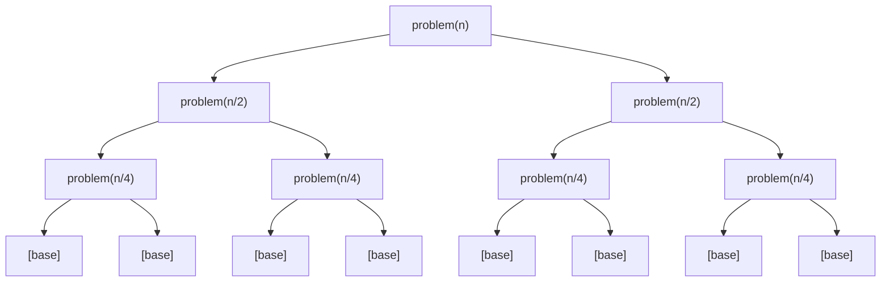

# Divide and Conquer

## Prerequisites

- **Big-O Notation** [Must read] - D&C complexity derives from recurrences; you can't read a Master-theorem result without it. <!-- not-yet-written target — wire to `algorithms/big-o-notation.md` once that page exists -->
- [Recursion](./recursion.md) [Must read] - every D&C algorithm is recursive; base cases, call stacks, and the mental model of "trust the recursion" are assumed.
- [Array](../data-structures/array.md) [Should read] - most worked examples operate on arrays; indexing and slicing conventions are assumed.

## Table of Contents

- [What it is](#what-it-is)
- [Intuition](#intuition)
- [How it works](#how-it-works)
- [Correctness / invariant](#correctness--invariant)
- [Complexity derivation](#complexity-derivation)
- [Constraints & approach](#constraints--approach)
- [When to use / when not](#when-to-use--when-not)
- [Comparison](#comparison)
- [Loop/recurrence invariant](#looprecurrence-invariant)
- [Edge cases](#edge-cases)
- [Implementation](#implementation)
- [What the interviewer probes for](#what-the-interviewer-probes-for)
- [Practice problems](#practice-problems)
  - [Count Inversions](#1-count-inversions)
  - [Maximum Subarray (D&C)](#2-maximum-subarray-dc)
  - [Closest Pair of Points](#3-closest-pair-of-points)
  - [Karatsuba Multiplication](#4-karatsuba-multiplication)

---

## What it is

**Divide and conquer** solves a problem by splitting it into **strictly smaller subproblems of the same kind**, solving each recursively, and **combining** their results — with each subproblem solved entirely independently before the combine step touches it.

Mental model: **the general contractor**. A GC doesn't lay every brick. They split the job into independent scopes (foundation, framing, electrical), hand each to a specialist, then assemble the finished house from the completed pieces. Each specialist can start the moment their scope is handed off; the GC only acts twice — when splitting and when assembling.

> **Takeaway (say this out loud):** "Split into independent subproblems, trust recursion, combine — all the insight lives in the combine; the Master Theorem gives you the complexity from the recurrence."

**Complexity:** determined by the recurrence T(n) = aT(n/b) + f(n), solved by the Master Theorem. The canonical landing point is **O(n log n)** when a = b and combine costs O(n) (merge sort, inversion count, closest pair); O(log n) when a = 1 (binary search); and O(n^log_b a) when the subproblem fan-out dominates (Karatsuba: O(n^1.585)). Time and space are both problem-dependent — space is at minimum O(log n) for the recursion stack.

---

## Intuition

Three ideas make D&C work:

**1. Subproblems are the same shape.** The recursive call gets a problem that looks exactly like the original, just smaller. This is what makes trusting the recursion safe: the invariant that "recursion correctly solves any input of size < n" lets you build the size-n solution on top without understanding the deeper stack frames.

**2. Independence.** The left half is solved before the right half is even started (or, in a parallel model, both run at the same time). No subproblem's answer depends on another's in-progress work. This independence is why D&C parallelizes naturally and why correctness arguments are clean.

**3. The combine step is cheap relative to the problem size.** If combining costs O(n) and the recursion halves the problem each time, you get log n levels of O(n) work — O(n log n) total. If the combine is O(1) (as in binary search), the levels contribute a geometric series that sums to O(n). If the combine is expensive (O(n²)), the subproblems must shrink fast enough to overcome it. The Master Theorem formalizes exactly this competition between "how many subproblems" and "how expensive is the combine."

> **Junior vs. senior trap:** a junior candidate says "split in half, recurse, combine" and stops. The senior question is always "what's the combine doing, and does it dominate?" Two algorithms can have identical D&C structure (a = 2, b = 2, combine O(n)) and the same O(n log n) result — but Karatsuba's algebraic trick reduces a = 4 to a = 3, shifting the answer from O(n²) to O(n^1.585). The combine step is where the algorithmic insight lives; the split is usually trivial.

---

## How it works

Every D&C algorithm has the same three-step skeleton:

```
1. DIVIDE   — split the input into a subproblems of size n/b each
2. CONQUER  — recurse on each subproblem (base case: solve directly when small)
3. COMBINE  — merge the a subproblem answers into the answer for the original input
```

The generic call tree for splitting into **two equal halves** (a = 2, b = 2):



At **every level**, the total input size across all subproblems is still `n`. The difference between algorithms is what the **combine step costs**:

| Algorithm | a | b | Combine cost | T(n) result |
|-----------|---|---|--------------|-------------|
| Binary search | 1 | 2 | O(1) | O(log n) |
| Merge sort | 2 | 2 | O(n) | O(n log n) |
| Strassen matrix multiply | 7 | 2 | O(n²) | O(n^2.81) |
| Karatsuba multiply | 3 | 2 | O(n) | O(n^1.585) |

**Concrete trace — counting inversions in `[3, 1, 2]`:**

An inversion is a pair `(i, j)` where `i < j` but `arr[i] > arr[j]`. Brute force is O(n²); D&C counts them in O(n log n) by augmenting the merge step. The invariant at each call: *"the returned sorted array is correct, and `count` holds the exact number of inversions within that subarray."*

```
Step 1 — DIVIDE to singletons (each singleton has 0 inversions):

         [3, 1, 2]
        /          \
    [3, 1]         [2]          ← invariant holds: [2] sorted, count=0
    /    \
  [3]   [1]                    ← invariant holds: singletons, count=0 each

Step 2 — CONQUER left [3,1]: merge [3] and [1]
  Compare 3 vs 1: 1 goes first → 3 is still unplaced, so cross-inversions = 1
  Sorted: [1, 3],  count = 0 + 0 + 1 = 1
  Invariant check: [1,3] is sorted ✓, count=1 = exact inversions in [3,1] ✓

Step 3 — CONQUER right [2]: already a singleton
  Sorted: [2], count = 0
  Invariant check: [2] is sorted ✓, count=0 ✓

Step 4 — COMBINE [1,3] and [2]:
  Compare 1 vs 2: 1 goes first. No right element jumped it → cross += 0
  Compare 3 vs 2: 2 goes first. 3 is still unplaced → cross += 1  (3>2 is an inversion)
  Place 3.
  Sorted: [1, 2, 3],  cross = 1
  Invariant check: [1,2,3] is sorted ✓
                   total = left_count(1) + right_count(0) + cross(1) = 2
                   Actual inversions in [3,1,2]: (3,1) and (3,2) → 2 ✓
```

The key insight the combine step exploits: when a right-half element `r` beats remaining left elements `l₁, l₂, …, lₖ` (all > r), that's **k inversions in one O(1) count** — the sorted order of the left half makes this safe. The invariant is what licenses the bulk count; without it (unsorted left half), you'd have to check each pair individually.

This is the canonical D&C trace to have ready in an interview: it shows a non-trivial combine step that adds a counting payload without changing the merge-sort structure, and the invariant is the thing the interviewer will probe.

---

## Correctness / invariant

**The D&C correctness argument is always the same shape** — strong induction on problem size:

1. **Base case:** when the input is small enough (size 1, or some threshold), solve it directly. This is trivially correct.
2. **Inductive step:** assume the algorithm is correct for all inputs of size < n. The divide step produces subproblems of size strictly less than n (because b > 1). By the inductive hypothesis, the recursive calls return correct answers. The combine step then merges correct answers into a correct answer for the size-n input — provided you prove the combine is correct given correct sub-answers.

The proof obligation for any D&C algorithm is therefore **just the combine step** — everything else follows from induction. This is why D&C algorithms are often easier to prove correct than iterative ones: there is no loop invariant to maintain across iterations; the invariant is just "the recursion is correct on smaller inputs."

---

## Complexity derivation

D&C algorithms satisfy the **recurrence**:

```
T(n) = a · T(n/b) + f(n)
```

- `a` = number of subproblems
- `b` = factor by which the input shrinks
- `f(n)` = cost of divide + combine

**The Master Theorem** gives a closed form in three cases. Let c = log_b(a):

| Case | Condition | Result | Intuition |
|------|-----------|--------|-----------|
| 1 | f(n) = O(n^(c−ε)) for some ε > 0 | T(n) = Θ(n^c) | leaves dominate; recursion tree fans out faster than f grows |
| 2 | f(n) = Θ(n^c · log^k n) | T(n) = Θ(n^c · log^(k+1) n) | leaves and combine cost are tied each level |
| 3 | f(n) = Ω(n^(c+ε)) and regularity | T(n) = Θ(f(n)) | top level dominates; combine is the bottleneck |

**Worked examples:**

_Merge sort:_ T(n) = 2T(n/2) + O(n). Here a = 2, b = 2, c = log₂2 = 1. f(n) = O(n) = O(n¹). Case 2 with k = 0: T(n) = Θ(n log n). ✓

_Binary search:_ T(n) = 1·T(n/2) + O(1). a = 1, b = 2, c = log₂1 = 0. f(n) = O(1) = O(n⁰). Case 2: T(n) = Θ(log n). ✓

_Karatsuba:_ T(n) = 3T(n/2) + O(n). a = 3, b = 2, c = log₂3 ≈ 1.585. f(n) = O(n) = O(n¹) < O(n^c). Case 1: T(n) = Θ(n^log₂3) ≈ Θ(n^1.585). Beats the naïve O(n²) long multiplication. ✓

**The regularity condition for Case 3:** Case 3 requires not just that f(n) is polynomially larger than n^c, but also that `a·f(n/b) ≤ κ·f(n)` for some κ < 1 and all large n — informally, the top-level combine cost must dominate the sum of all sub-level combine costs, not just each individually. This fails when f(n) oscillates or has non-smooth growth; in practice it holds for all standard polynomial or polylogarithmic f(n), so it rarely blocks real use.

**When the Master Theorem doesn't apply:** when subproblems have unequal sizes (quicksort's average case: T(n) = T(n/4) + T(3n/4) + O(n) — use the Akra-Bazzi method), or when the recurrence has a non-standard structure (T(n) = T(n−1) + O(1) is decrease-by-one, not divide-by-factor). Fall back to the **substitution method** (guess + induction) or the **recursion tree** (draw levels, sum each row, identify the dominant term).

---

## Constraints & approach

| Input size | Expected complexity | Approach |
|------------|--------------------|--------------------|
| n ≤ 20 | O(2ⁿ) or O(n!) | Backtracking/brute force — D&C won't help, problem is inherently exponential |
| n ≤ 500 | O(n²) or O(n² log n) | Naïve D&C or DP; if D&C reduces to O(n log n) that's a bonus |
| n ≤ 10⁵ | O(n log n) | D&C sweet spot — merge-sort-style or recursion on halves |
| n ≤ 10⁶ | O(n log n) tight | D&C fine, but watch constant: recursive call overhead can bite; iterative merge may be faster |
| n ≤ 10⁹ | O(log n) | D&C that discards a branch each call (binary search, fast exponentiation) |

**What the constraint rules out:** if n ≤ 10⁵ and you see "find max across all pairs," an O(n²) brute force is borderline — D&C that solves it in O(n log n) (like closest-pair-of-points) is the signal. If n ≤ 10⁹ and you need a result, only log-time D&C (binary search on answer, matrix exponentiation) fits.

**What invites D&C:**
- Problem statement is defined on a range or array and "the answer depends only on the two halves plus how they interact at the boundary" — classic D&C.
- Multiplying or transforming large numbers/polynomials — Karatsuba, FFT.
- Geometric problems where a divide at the median collapses O(n²) to O(n log n) — closest pair, computational geometry.

---

## When to use / when not

**Reach for D&C when:**
- The problem has **optimal substructure** and subproblems are **independent** (no overlap). Independence is what separates D&C from DP — if the same subproblem recurs across branches, memoize it (DP); if each branch is truly disjoint, D&C is cleaner.
- Brute force is O(n²) or worse but the problem decomposes into halves with a cheap combine — strong signal for O(n log n) D&C.
- You need parallelism: independent subproblems map directly to parallel workers.

**Don't use D&C when:**
- Subproblems **overlap** — memoization (DP) will cache results that D&C recomputes.
- The recursion depth hits Python's stack limit (default ~1000). Either increase it (`sys.setrecursionlimit`) or convert to iterative bottom-up.
- The problem is inherently sequential (each step depends on the previous result) — no useful split exists.

**Alternatives and when they win:**
- **Dynamic programming** — when subproblems repeat; D&C pays exponential time redoing the same work.
- **Greedy** — when a single locally optimal choice per step provably yields the global optimum; simpler and O(n) or O(n log n) without the recursion overhead.
- **Iterative sweep** — for problems where D&C's combine step turns out to be as expensive as the iterative version (finding array max — just scan left to right).

Real-world usage: D&C is the backbone of production sorting (`Timsort` in Python, `pdqsort` in Rust), FFT-based signal processing, and database external merge-sort for out-of-core data that won't fit in memory.

---

## Comparison

| Paradigm | Time (canonical example) | Space | Key constraint it assumes | Switch away from D&C when… |
|----------|--------------------------|-------|--------------------------|----------------------------|
| **Divide & Conquer** | O(n log n) — merge sort | O(log n) stack + combine buffer | subproblems are **disjoint** (no shared state between branches) | subproblems overlap → DP; problem is inherently sequential → greedy/scan |
| Dynamic Programming | O(n·states) — 0/1 knapsack O(n·W) | O(states) | **overlapping** subproblems + optimal substructure | subproblems are disjoint → D&C is simpler and avoids the memo table |
| Greedy | O(n log n) — interval scheduling | O(1) to O(n) | greedy-choice property provable by exchange argument | locally best ≠ globally best → need D&C or DP |
| Brute Force | O(n²) to O(n!) — all pairs | O(1) | nothing | n is large enough that quadratic is too slow → D&C often gives O(n log n) |
| Decrease & Conquer | O(log n) — binary search; O(n) — quickselect | O(log n) stack | one branch can be **discarded** after each split (a = 1) | both branches must be solved → full D&C (a ≥ 2) |

*Decrease & Conquer* is the special case `a = 1`: only one subproblem is ever pursued, giving O(log n) or O(n) instead of O(n log n). Binary search and quickselect are the canonical examples — they discard half the input each step, which is safe only because the invariant proves the answer can't be in the discarded half.

---

## Loop/recurrence invariant

D&C algorithms belong to the **Search/divide** family. The invariant lives in the recurrence, not a loop:

**Recurrence invariant:** at every recursive call `solve(lo, hi)`, the algorithm returns the correct answer for the subproblem on the range `[lo, hi]`. This invariant holds because:

1. The base case (`hi - lo ≤ threshold`) solves the subproblem directly and correctly.
2. The inductive step splits `[lo, hi]` into `[lo, mid]` and `[mid+1, hi]` (both strictly shorter), invokes `solve` on each (correct by the invariant), and combines the two correct sub-answers into the correct answer for `[lo, hi]` — provided the combine function is correct.

**What changes between D&C algorithms is the combine step** — the invariant argument above is algorithm-independent. Proving a new D&C algorithm correct means: (a) pick the right notion of "correct answer for a subrange", (b) verify the base case, (c) verify the combine.

**Search-space shrink (for decrease-and-conquer variants):** for binary search, the invariant is "if the target exists, it lies in `[lo, hi]`." Each step cuts this range in half, so after O(log n) steps the range is a singleton — either the target or proof of absence.

---

## Edge cases

**1. Empty or single-element input.**  
Base case must handle these before attempting to split. Splitting an array of size 0 or 1 into halves is a common off-by-one bug: `mid = lo + (hi - lo) // 2` when `lo == hi` gives `mid == lo`, and the recursive calls on `[lo, lo]` and `[lo+1, lo]` can infinite-loop if not guarded.

```python
if lo >= hi:
    return base_answer
```

**2. Odd-length arrays and integer midpoint overflow.**  
`mid = (lo + hi) // 2` overflows in languages with fixed-width integers when `lo + hi > INT_MAX`. Use `mid = lo + (hi - lo) // 2`. Python integers are unbounded, but the habit matters in C++/Java interviews.

**3. Unbalanced splits → O(n²) depth.**  
Quicksort is D&C but degrades to O(n²) recursion depth on already-sorted input with a naïve pivot. The fix (random pivot, median-of-3) is specific to that algorithm, but the lesson is general: a D&C that splits unevenly doesn't guarantee O(log n) depth.

**4. Stack overflow on large n.**  
Python's default recursion limit is 1000. A D&C on n = 10⁵ hits depth log₂(10⁵) ≈ 17 — fine. But if your split is unbalanced, depth can reach n and crash. Either fix the split or convert to iterative bottom-up (merge sort's iterative form, for example).

**5. Combine step assumes sorted / processed sub-answers.**  
A classic mistake: the combine step runs before the recursive calls finish (wrong order), or it assumes an invariant the subproblem doesn't guarantee.

```python
# WRONG: combine fires before right subtree is recursed
def broken(arr, lo, hi):
    mid = lo + (hi - lo) // 2
    left = broken(arr, lo, mid)
    result = combine(left, arr[mid+1:hi+1])  # right half not yet sorted!
    right = broken(arr, mid+1, hi)           # too late
    return result

# CORRECT: both recursive calls complete before combine
def correct(arr, lo, hi):
    mid = lo + (hi - lo) // 2
    left  = correct(arr, lo, mid)
    right = correct(arr, mid+1, hi)          # right fully solved first
    return combine(left, right)              # now safe to combine
```

Always verify: "what exactly does the recursive call return, and does my combine assume exactly that?" The invariant is the contract between the recursion and the combine.

---

## Implementation

### Generic skeleton

**Pseudocode:**

```
function DIVIDE_AND_CONQUER(A, lo, hi)
1.  if hi - lo ≤ THRESHOLD then
2.      return BASE_CASE(A, lo, hi)          ▷ solve directly when small enough
3.  mid ← lo + ⌊(hi - lo) / 2⌋
4.  left  ← DIVIDE_AND_CONQUER(A, lo, mid)      ▷ conquer left half
5.  right ← DIVIDE_AND_CONQUER(A, mid + 1, hi)  ▷ conquer right half
6.  return COMBINE(left, right)              ▷ merge sub-answers
```

### Concrete: Count Inversions (augmented merge sort)

This is the paradigm in non-trivial form. The combine step does real work — counting cross-inversions — on top of the standard merge. The pseudocode makes the counting explicit:

**Pseudocode:**

```
function MERGE_COUNT(A, lo, hi) → (sorted_array, count)
1.  if lo ≥ hi then
2.      return ⟨[A[lo]], 0⟩               ▷ singleton: sorted, 0 inversions
3.  mid ← lo + ⌊(hi - lo) / 2⌋
4.  ⟨L, lc⟩ ← MERGE_COUNT(A, lo, mid)
5.  ⟨R, rc⟩ ← MERGE_COUNT(A, mid + 1, hi)
6.  ▷ Merge L and R, counting cross-inversions
7.  merged ← [], cross ← 0, i ← 1, j ← 1
8.  while i ≤ |L| and j ≤ |R| do
9.      if L[i] ≤ R[j] then
10.         append L[i] to merged; i ← i + 1
11.     else
12.         cross ← cross + (|L| − i + 1)  ▷ all remaining L[i..] beat R[j]
13.         append R[j] to merged; j ← j + 1
14. append remaining L[i..] and R[j..] to merged
15. return ⟨merged, lc + rc + cross⟩
```

**Python:**

```python
def count_inversions_impl(arr: list[int]) -> tuple[list[int], int]:
    if len(arr) <= 1:
        return arr, 0
    mid = len(arr) // 2
    left,  lc = count_inversions_impl(arr[:mid])
    right, rc = count_inversions_impl(arr[mid:])
    merged, cross = [], 0
    i = j = 0
    while i < len(left) and j < len(right):
        if left[i] <= right[j]:
            merged.append(left[i]); i += 1
        else:
            cross += len(left) - i      # bulk count: all left[i:] > right[j]
            merged.append(right[j]); j += 1
    merged.extend(left[i:]); merged.extend(right[j:])
    return merged, lc + rc + cross

def count_inversions(nums: list[int]) -> int:
    _, total = count_inversions_impl(nums)
    return total
```

**Contest note:** no stdlib shortcut applies to the D&C paradigm itself — `bisect`, `heapq`, and `Counter` target specific sub-problems (binary search, priority queues, frequency counts). For contest use, the above `count_inversions_impl` is what you'd actually submit; the generic skeleton is a mental model, not contest code.

---

## What the interviewer probes for

**"When would you use D&C over DP?"**  
The dividing line is **subproblem overlap**. D&C solves each subproblem exactly once because the subproblems are disjoint — the left half of the array and the right half share no elements. DP is needed when the same subproblem recurs across branches (e.g., Fibonacci: `fib(n-1)` and `fib(n-2)` both call `fib(n-3)`). Applying D&C to overlapping subproblems gives exponential time; DP caches them to polynomial. If subproblems are disjoint, D&C is simpler and avoids the memo table overhead.

**"How do you prove a D&C algorithm correct?"**  
Strong induction on problem size: (1) base case is trivially correct; (2) assume correct for all inputs of size < n; (3) divide produces subproblems of size < n (correct by hypothesis); (4) prove the combine step produces the correct answer given correct sub-answers. The only non-trivial obligation is (4) — the combine.

**"What's the Master Theorem, and when does it not apply?"**  
The Master Theorem solves T(n) = aT(n/b) + f(n) in closed form across three cases based on how f(n) compares to n^log_b(a). It doesn't apply when: subproblems have different sizes (quicksort's average case uses the Akra-Bazzi method instead), the recurrence has extra terms (T(n) = T(n-1) + O(1) is decrease-and-conquer, not a Master-Theorem form), or regularity conditions fail in case 3.

**"Can D&C always be parallelized?"**  
Yes, trivially, when subproblems are truly independent — the left branch and right branch can run on separate threads with no synchronization until the combine step. This is the theoretical basis for parallel merge sort and parallel FFT. The combine step is sequential (or can itself be parallelized if it has the same structure), so Amdahl's law applies to the combine fraction.

**"What's the difference between D&C and decrease-and-conquer?"**  
In D&C, all `a` subproblems are solved and their results combined. In decrease-and-conquer (a = 1), only one subproblem is pursued — the other branches are discarded. Binary search is decrease-and-conquer: after comparing mid, exactly one half is kept. This gives O(log n) instead of O(n log n) but requires that discarding branches is provably safe.

**"D&C is elegant but is the recursion overhead a concern at large n?"**  
Recursion depth for balanced D&C is O(log n) — about 17 for n = 10⁵, which is fine on any stack. The overhead isn't depth; it's **function-call cost per node**: each recursive call allocates a frame, passes arguments, and jumps. For cache-sensitive workloads on large n (n ≥ 10⁶), iterative bottom-up implementations (merge sort's iterative form) can be 2–3× faster than recursive ones purely from reduced frame allocation and better cache locality — the iterative version processes subarrays in ascending size order, keeping the working set small. Python amplifies this because CPython's function-call overhead is high; at n = 10⁶, prefer `sorted()` (Timsort, iterative merge runs) over a recursive merge sort.

---

## Practice problems

### 1. Count Inversions

Given an integer array `nums`, count the number of inversions: pairs `(i, j)` with `i < j` and `nums[i] > nums[j]`. An array is sorted iff it has zero inversions.

**Constraints:** `1 ≤ n ≤ 5 × 10⁴`, values fit in 32-bit int. Expected O(n log n).

**Approach:** Augment merge sort. During the merge of two sorted halves, whenever an element from the right half is placed before an element from the left half, all remaining elements in the left half form inversions with it — count them in O(1) per right-half element. Total: O(n log n), same as merge sort. This is the canonical D&C problem that adds a counting payload to the combine step without changing the algorithm's structure.

```python
def count_inversions(nums: list[int]) -> int:
    def merge_count(arr: list[int]) -> tuple[list[int], int]:
        if len(arr) <= 1:
            return arr, 0
        mid = len(arr) // 2
        left,  lc = merge_count(arr[:mid])
        right, rc = merge_count(arr[mid:])
        merged, cross = [], 0
        i = j = 0
        while i < len(left) and j < len(right):
            if left[i] <= right[j]:
                merged.append(left[i]); i += 1
            else:
                cross += len(left) - i   # all remaining left > right[j]
                merged.append(right[j]); j += 1
        merged.extend(left[i:]); merged.extend(right[j:])
        return merged, lc + rc + cross

    _, total = merge_count(nums)
    return total
```

**Time:** O(n log n) — same as merge sort. **Space:** O(n) auxiliary.

*Pattern:* [Merge Sort](./merge-sort.md) — D&C with a combine payload.

---

### 2. Maximum Subarray (D&C)

Given an integer array `nums`, find the contiguous subarray with the largest sum and return its sum. Values may be negative.

**Constraints:** `1 ≤ n ≤ 10⁵`. Expected O(n log n) for D&C; O(n) with Kadane's.

**Approach:** D&C version — at each split, the max subarray lies entirely in the left half, entirely in the right half, or crosses the midpoint. The first two are recursive calls. The crossing case is computed greedily in O(n): walk left from mid to find the best left extension, walk right from mid+1 to find the best right extension, sum them. This shows how D&C handles "boundary-crossing" cases — a technique that reappears in closest-pair-of-points and segment-tree range queries. Note: Kadane's O(n) greedy is faster for this specific problem; D&C here is a teaching case and an interview probe.

```python
def max_subarray_dc(nums: list[int]) -> int:
    def helper(lo: int, hi: int) -> int:
        if lo == hi:
            return nums[lo]
        mid = lo + (hi - lo) // 2
        left_max  = helper(lo, mid)
        right_max = helper(mid + 1, hi)

        # best subarray crossing mid
        left_cross = right_cross = float("-inf")
        total = 0
        for i in range(mid, lo - 1, -1):
            total += nums[i]
            left_cross = max(left_cross, total)
        total = 0
        for i in range(mid + 1, hi + 1):
            total += nums[i]
            right_cross = max(right_cross, total)

        return max(left_max, right_max, left_cross + right_cross)

    return helper(0, len(nums) - 1)
```

**Time:** T(n) = 2T(n/2) + O(n) → O(n log n). **Space:** O(log n) stack.

*Pattern:* Divide & Conquer — cross-boundary combine; contrast with Kadane's O(n) greedy.

---

### 3. Closest Pair of Points

Given `n` points in the 2D plane, find the pair with the smallest Euclidean distance.

**Constraints:** `2 ≤ n ≤ 10⁵`. Naïve O(n²) is too slow; expected O(n log n).

**Approach:** Sort by x. Divide at the median x; the closest pair is either in the left half, the right half, or straddles the dividing line. Recurse on both halves to get δ = min of the two half-distances. Then check only points within δ of the dividing line — the geometric argument proves at most 7 points can fall within a δ×2δ strip on one side, so the strip check is O(n) total per level. Result: T(n) = 2T(n/2) + O(n log n) → O(n log² n); with presorted y-coordinate, the strip check drops to O(n) → O(n log n). This is the canonical example where D&C achieves a better-than-obvious complexity via geometric bounding.

```python
import math
from functools import cmp_to_key

def closest_pair(points: list[tuple[int, int]]) -> float:
    def dist(p: tuple, q: tuple) -> float:
        return math.hypot(p[0] - q[0], p[1] - q[1])

    def brute(pts: list) -> float:
        best = float("inf")
        for i in range(len(pts)):
            for j in range(i + 1, len(pts)):
                best = min(best, dist(pts[i], pts[j]))
        return best

    def rec(pts: list) -> float:  # pts sorted by x
        if len(pts) <= 3:
            return brute(pts)
        mid = len(pts) // 2
        mid_x = pts[mid][0]
        delta = min(rec(pts[:mid]), rec(pts[mid:]))
        strip = [p for p in pts if abs(p[0] - mid_x) < delta]
        strip.sort(key=lambda p: p[1])
        for i in range(len(strip)):
            j = i + 1
            while j < len(strip) and strip[j][1] - strip[i][1] < delta:
                delta = min(delta, dist(strip[i], strip[j]))
                j += 1
        return delta

    pts = sorted(points)
    return rec(pts)
```

**Time:** O(n log² n) as written (strip sort per level); O(n log n) with pre-sorted y. **Space:** O(n log n).

*Pattern:* D&C with geometric bounding — the strip argument is the combine step.

---

### 4. Karatsuba Multiplication

Multiply two n-digit numbers faster than the O(n²) long-multiplication algorithm.

**Constraints:** numbers up to 10³ digits. Expected O(n^log₂3) ≈ O(n^1.585).

**Approach:** Split each n-digit number at the midpoint into high and low halves: x = x₁·10^(n/2) + x₀, y = y₁·10^(n/2) + y₀. Naïve expansion needs 4 multiplications of n/2-digit numbers → T(n) = 4T(n/2) + O(n) → O(n²). Karatsuba's insight: compute only 3 products — `z0 = x₀·y₀`, `z2 = x₁·y₁`, `z1 = (x₀+x₁)·(y₀+y₁) - z0 - z2` — and reconstruct `x·y = z2·10^n + z1·10^(n/2) + z0`. This reduces the recurrence to T(n) = 3T(n/2) + O(n) → O(n^log₂3). The combine step is the algebraic trick; the D&C structure is what makes it recursive.

```python
def karatsuba(x: int, y: int) -> int:
    if x < 10 or y < 10:
        return x * y
    n = max(len(str(x)), len(str(y)))
    half = n // 2
    base = 10 ** half

    x1, x0 = divmod(x, base)
    y1, y0 = divmod(y, base)

    z0 = karatsuba(x0, y0)
    z2 = karatsuba(x1, y1)
    z1 = karatsuba(x0 + x1, y0 + y1) - z0 - z2

    return z2 * base * base + z1 * base + z0
```

**Time:** O(n^log₂3) ≈ O(n^1.585) — better than O(n²) long multiplication. **Space:** O(log n) stack (each level halves digit count).

*Pattern:* D&C algebraic trick — reducing 4 recursive calls to 3 via a linear identity, which shifts the Master Theorem case.
