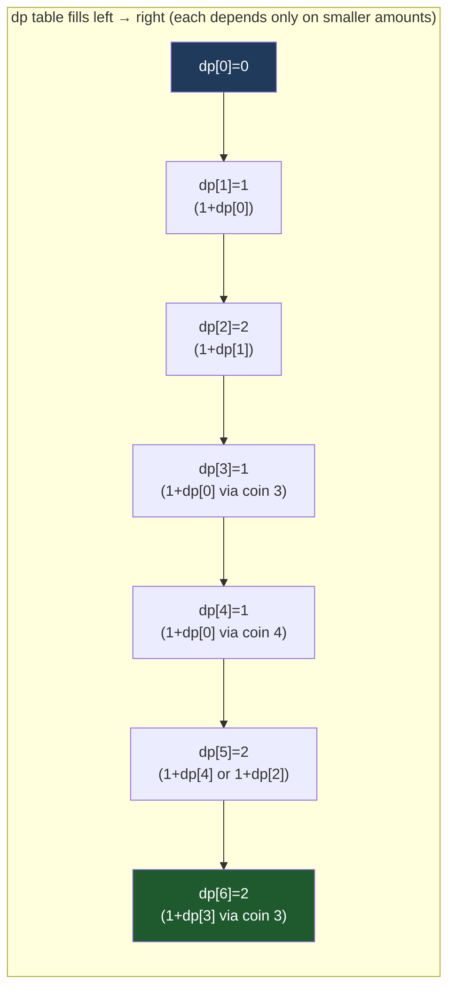

# Dynamic Programming

## Prerequisites

- [Recursion](./recursion.md) [Must read] - DP is recursion whose repeated subproblems are cached; you must be fluent in base case / recursive case and the call tree before memoization makes sense.
- [Backtracking](./backtracking.md) [Must read] - the bridge: when a backtracking search revisits the same state via different paths, memoizing that state _is_ top-down DP. DP is "backtracking with a memo".
- [Arrays](../data-structures/array.md) [Must read] - the table (1D/2D array) is DP's working memory; indexing and iteration order on it are the whole game in tabulation.
- [DP Patterns](../patterns/dp-patterns.md) - the catalog of recurring DP shapes (knapsack, LCS, interval, digit) once the mechanic here clicks.

## Table of Contents

- [What it is](#what-it-is)
- [Intuition](#intuition)
- [How it works](#how-it-works)
- [Correctness / invariant](#correctness--invariant)
- [Complexity derivation](#complexity-derivation)
- [Constraints & approach](#constraints--approach)
- [When to use / when not](#when-to-use--when-not)
- [Comparison](#comparison)
- [State & recurrence](#state--recurrence)
- [Edge cases](#edge-cases)
- [Implementation](#implementation)
- [What the interviewer probes for](#what-the-interviewer-probes-for)
- [Practice problems](#practice-problems)

## What it is

Dynamic programming solves a problem by **breaking it into overlapping subproblems, solving each subproblem exactly once, and reusing the stored answer** instead of recomputing it. It applies precisely when two properties hold together: **optimal substructure** (the optimal answer is built from optimal answers to subproblems) and **overlapping subproblems** (the same subproblem recurs many times in the naive recursion).

**Mental model:** a naive recursive solution is a tree that recomputes the same branches over and over; DP is that tree with a **memo pad clipped to it** — the first time you compute `f(state)` you write it down, and every later request reads the pad instead of re-descending. The exponential tree collapses into a polynomial-sized _graph_ of distinct states.

- **Time:** `O(number of distinct states × cost per transition)` — that product _is_ the complexity, always.
- **Space:** `O(number of states)` for the table (often reducible to `O(one row / a few variables)` by rolling).

> **Takeaway (say it out loud):** "DP = recursion + a memo. It works when the problem has optimal substructure and overlapping subproblems — count the distinct states, multiply by the transition cost, that's your complexity."

## Intuition

Plain recursion on a problem like "fewest coins to make amount `N`" recomputes `f(amount)` for the same amount through countless different coin orderings — the call tree is exponential, but it's exponential _wastefully_: there are only `N+1` genuinely different subproblems (`f(0), f(1), …, f(N)`), each computed thousands of times.

DP's insight is brutally simple: **if a subproblem's answer doesn't depend on _how_ you reached it, compute it once and remember it.** `f(amount)` is the same number regardless of which path of coin choices led there — so cache it on `amount`. The first call fills the cache; all repeats are free lookups.

That's the whole idea. The two "flavors" (top-down memoization, bottom-up tabulation) are just _when_ you fill the cache — lazily on first request, or eagerly in dependency order — but both rest on the same fact: **a state's answer is path-independent, so it deserves to be computed exactly once.** If a problem _lacks_ that path-independence (the answer depends on the route taken, not just the state), DP does not apply — that's when you fall back to full search (backtracking).

## How it works

Trace **Coin Change**: coins `[1, 3, 4]`, target `amount = 6`, find the minimum number of coins. State: `dp[a]` = fewest coins to make exactly `a`. Recurrence: `dp[a] = 1 + min(dp[a - c]) over each coin c ≤ a`. Base: `dp[0] = 0`.

We fill bottom-up, `a` from `0` to `6`. Each cell asks "what's the best I can do by adding one more coin to a smaller, already-solved amount?"



Step-by-step:

| `a` | candidates `1 + dp[a-c]` for c in {1,3,4} | `dp[a]` | winning coin |
| --- | ----------------------------------------- | ------- | ------------ |
| 0 | base case | 0 | — |
| 1 | `1+dp[0]=1` | **1** | 1 |
| 2 | `1+dp[1]=2` | **2** | 1 |
| 3 | `1+dp[2]=3`, `1+dp[0]=1` | **1** | 3 |
| 4 | `1+dp[3]=2`, `1+dp[1]=2`, `1+dp[0]=1` | **1** | 4 |
| 5 | `1+dp[4]=2`, `1+dp[2]=3`, `1+dp[1]=2` | **2** | 1 or 4 |
| 6 | `1+dp[5]=3`, `1+dp[3]=2`, `1+dp[2]=3` | **2** | 3 |

Answer `dp[6] = 2` (coins `3 + 3`). **The invariant — "`dp[a]` is the true minimum for amount `a`" — holds at every cell**, because when we compute `dp[a]` every `dp[a-c]` it reads is already final (we filled left-to-right, and `a-c < a`). Notice the overlap the table eliminates: `dp[2]` is read while computing `dp[3]`, `dp[5]`, `dp[6]` — naive recursion would recompute it each time; the table computes it once.

## Correctness / invariant

**Invariant:** at the moment `dp[a]` is finalized, it equals the true optimum for subproblem `a`, **and** every subproblem it depends on (`dp[a-c]`) is already finalized.

The two pillars DP rests on, stated as the correctness argument:

- **Optimal substructure:** the optimal solution for `a` contains within it optimal solutions for the smaller amounts. _Proof by exchange:_ if `dp[a]` used a _suboptimal_ `dp[a-c]`, we could swap in the optimal `dp[a-c]` and get a strictly better `dp[a]` — contradicting that `dp[a]` was optimal. So the recurrence's `min` over optimal children yields the optimal parent.
- **Overlapping subproblems → correctness of caching:** because `dp[a]` is path-independent (depends only on `a`, not the route), computing it once and reusing it cannot give a wrong answer. The cached value is _the_ answer.
- **Acyclic dependency:** `dp[a]` depends only on `dp[a-c]` with `c > 0`, so every dependency is strictly smaller — the dependency graph is a DAG, and a topological fill order (here, increasing `a`) guarantees every read hits a finalized cell. **If the dependency graph had a cycle, no fill order would work and plain DP would not apply.**

The "prove it" one-liner: *DP is correct because the problem has optimal substructure (optimal parents are built from optimal children, by an exchange argument) and the state dependencies form a DAG (so a topological fill order makes every subproblem final before it's used).*

## Complexity derivation

The master formula, no exceptions: **`time = (number of distinct states) × (cost to compute one state from its children)`**.

- **Coin Change:** states = amounts `0..N` → `N+1` states. Each state loops over `K` coins → `O(K)` transition. Total `O(N·K)`. Space `O(N)` for the table.
- **0/1 Knapsack** (`n` items, capacity `W`): states = `(item index, remaining capacity)` → `n·W` states, `O(1)` transition (take or skip) → `O(n·W)` time, `O(n·W)` space (rollable to `O(W)`).
- **LCS** (strings length `m`, `n`): states `(i, j)` → `m·n`, `O(1)` transition → `O(m·n)`.

**Why memo and tabulation share the same time bound:** both visit each distinct state once and pay the transition once. Top-down memoization _lazily_ visits only the **reachable** states (can be fewer than the full table); tabulation eagerly fills **all** of them. So memo is never asymptotically worse and is sometimes better when much of the table is unreachable — but tabulation has lower constant factors (no recursion overhead, no hash lookups) and no stack-depth risk.

**The pseudo-polynomial trap (senior insight).** Coin Change and Knapsack are `O(N·K)` and `O(n·W)` — these look polynomial but `N` and `W` are _numeric values_, not input _sizes_. A capacity `W = 10^9` takes `log W ≈ 30` bits to write down, yet the table is `10^9` cells. So the runtime is exponential **in the input's bit-length** — this is **pseudo-polynomial**, and it's exactly why Knapsack is NP-hard despite the "polynomial-looking" DP. The tell: when `W` or `amount` can be up to `10^9`, the DP table is infeasible and you need a different approach (meet-in-the-middle, or it's genuinely intractable). Quoting `O(n·W)` without flagging that `W` is a _value_ is the junior answer.

## Constraints & approach

DP's home is the **mid-range** — too big for exhaustive search, with structure (overlapping subproblems) that polynomial DP exploits. The constraint tells you the _dimension count_ of your state.

| Input size | Expected complexity | Approach |
| ---------- | ------------------- | -------- |
| `n ≤ 20` | `O(2^n · n)` | **Bitmask DP** — state is a subset; TSP, assignment, "partition into k subsets". |
| `n ≤ 100` | `O(n^3)` or `O(n^2 · m)` | **Interval / 2D DP** — matrix-chain, LCS variants, edit distance with extra axis. |
| `n ≤ 1000–5000` | `O(n^2)` | **2D DP** — LCS, edit distance, longest palindromic substring, classic grid. |
| `n ≤ 10^5` | `O(n log n)` or `O(n)` | **1D DP** — LIS (with binary search), Kadane, house robber, 1D coin change. |
| value `W, amount ≤ 10^9` | — | **DP table infeasible** — pseudo-polynomial blows up; meet-in-the-middle or rethink. |

**What the constraint rules out / invites:** `n ≤ 20` with "all subsets / visit-all" → bitmask DP _invited_; the `2^n` is expected. `n ≤ 5000` with "two sequences / a grid" → 2D DP. The moment a _value_ (capacity, amount) reaches `10^9` while `n` stays small, the DP-over-value table is _ruled out_ — that's the constraint screaming "the value axis is too big, this isn't standard knapsack DP." Conversely `n ≤ 10^5` with "longest/optimal _contiguous_ or _increasing_" → 1D DP, often with a binary-search or monotonic trick to hit `O(n log n)`.

## When to use / when not

**Reach for DP when** the problem asks for an **optimum (min/max/count) over choices** _and_ exhibits both optimal substructure and overlapping subproblems — the giveaway phrases are "minimum/maximum number of …", "number of ways to …", "longest/shortest … subsequence/path", with choices that compound. If a naive recursion would recompute the same `(state)` many times, DP is the fix.

**Prefer an alternative when:**

- A **provably correct greedy choice** exists → **[greedy](./greedy.md)**, `O(n log n)` and `O(1)` space. DP explores all choices; greedy commits to the locally best one. Use greedy only when an exchange argument proves the local choice is globally safe (coin change with _canonical_ denominations is greedy; arbitrary denominations need DP — that's the classic trap).
- The problem wants **all configurations**, not an optimum/count → **[backtracking](./backtracking.md)**. DP collapses the tree by forgetting _how_ you reached a state; if you must report each full configuration, you can't forget the path.
- Subproblems **don't overlap** (every recursive branch is distinct) → plain divide-and-conquer / recursion; a memo would never hit, just wasting space.
- The state dependency graph has a **cycle** → DP's fill order can't exist; you need fixed-point iteration (Bellman-Ford-style relaxation) instead.

**Real system:** DP is the engine behind `diff` (Myers / LCS), spell-checkers and DNA alignment (edit distance / Needleman-Wunsch), `git`'s delta encoding, and query optimizers picking join orders — anywhere "best combination over compounding choices" appears at scale.

## Comparison

| Approach | Time | Space | Key assumption / when it wins |
| -------- | ---- | ----- | ----------------------------- |
| **DP (memo / tabulation)** | `O(states · transition)` | `O(states)` | Optimal substructure **and** overlapping subproblems; want optimum/count. |
| Backtracking | `O(b^d)` pruned | `O(d)` | Want _all_ configurations; no usable subproblem overlap. |
| Greedy | `O(n log n)` | `O(1)` | A local choice is provably globally optimal (exchange argument holds). |
| Divide & conquer | `O(n log n)` typ. | `O(log n)` | Subproblems **don't** overlap — no caching to gain. |
| Brute-force recursion | `O(b^d)` | `O(d)` | Tiny input, or as the starting point you then memoize into DP. |

The cells that matter in interviews: **DP vs greedy** (does a safe local choice exist? if yes → greedy; if you must compare alternatives → DP) and **DP vs backtracking** (do you want the optimum, or every configuration? optimum → DP forgets the path; all configs → backtracking keeps it).

## State & recurrence

> Family: **Recursive/build** — DP is fully specified by four things: the **state**, the **recurrence** (transition), the **base case**, and the **fill order**. Get those right and the code writes itself; get the state wrong and nothing else can save it.

This is the section to write most carefully — defining the state correctly is 80% of solving a DP.

**1. State.** The minimal set of variables that uniquely identifies a subproblem _and_ captures everything future decisions need to know. "What do I need to remember to make the next choice?" Coin Change: just `amount`. Knapsack: `(item_index, remaining_capacity)` — you need both, because the best you can do depends on which items remain _and_ how much room is left. **Under-specifying the state is the #1 DP bug** — if two genuinely different situations map to the same state key, the cache returns a wrong answer.

**2. Recurrence (transition).** How an optimal state is built from optimal smaller states. `dp[a] = min over coins c of (1 + dp[a-c])`. This _is_ the optimal-substructure claim made concrete.

**3. Base case.** The smallest states with a direct answer — `dp[0] = 0`, `dp[i][0] = 0`. Wrong base cases silently corrupt everything above them.

**4. Fill order (tabulation only).** A topological order of the state DAG so each cell's dependencies are ready when read. For Coin Change, increasing `amount`; for 2D grid DP, usually row-by-row.

**Memoization vs tabulation — the senior contrast.** Same states, same recurrence, opposite direction:

| | Top-down (memoization) | Bottom-up (tabulation) |
| --- | --- | --- |
| Direction | Recurse from the goal, cache on the way down | Iterate from base cases up to the goal |
| Fill order | Implicit — recursion discovers it | Explicit — _you_ must order the loops correctly |
| States visited | Only **reachable** ones (can be sparse) | **All** of them |
| Overhead | Recursion + hash/dict lookups (higher constant) | Plain array writes (lower constant) |
| Risk | Stack overflow on deep recursion | None — but may compute unreachable states |
| Space-rolling | Awkward | Natural — drop to `O(one row)` when `dp[i]` needs only `dp[i-1]` |

**The bridge from backtracking:** a backtracking search that revisits the same `(state)` through different choice-paths becomes top-down DP the instant you slap `@lru_cache` on the recursive function — that single decorator _is_ memoization. (See [Backtracking › State & recurrence](./backtracking.md#state--recurrence) for the same idea from the search side.) Tabulation is then the optimization step: unroll the recursion into an explicit table, drop the stack, and roll the space.

**Space optimization (the senior move):** when `dp[i]` reads only `dp[i-1]` (and maybe `dp[i-2]`), you don't need the whole table — keep one or two rows/variables and roll them. Fibonacci `O(n)` table → `O(1)` two variables; Knapsack `O(n·W)` → `O(W)` one row (iterate capacity _backwards_ for 0/1 to avoid reusing an item — the off-by-one trap below).

## Edge cases

- **Empty input** (`amount == 0`, empty string): the base case _is_ the answer — `dp[0] = 0`, `LCS("", y) = 0`. A missing base case here returns garbage; always seed it explicitly.
- **Unreachable / impossible target** (Coin Change `[2]`, amount `3`): no combination works. Initialize the table to a sentinel (`float('inf')`) and return `-1` if `dp[amount]` is still infinite. The trap: using `inf` then doing `1 + inf` — fine in Python, but in C++/Java `1 + INT_MAX` **overflows** to a negative number and corrupts the `min`. Guard with `if dp[a-c] != INF`.
- **Single element / single coin:** trivial but flushes out base-case and loop-bound off-by-ones; always test it.
- **0/1 vs unbounded iteration order** (the senior CP trap): in the space-rolled 1D Knapsack, iterating capacity **forward** lets you reuse an item (unbounded knapsack); iterating **backward** uses each item at most once (0/1). Same code, opposite loop direction, completely different problem — get the direction wrong and the answer is silently incorrect.
- **Integer overflow on counting DP** (CP): "number of ways" answers explode; accumulate every transition `% (10**9 + 7)`, and keep the modulo _inside_ the recurrence, not just at the end.
- **Deep recursion in top-down** (CP): memoized recursion on `n = 10^5` blows Python's ~1000-frame stack. Either `sys.setrecursionlimit(...)` or — better — convert to bottom-up tabulation, which has no stack at all.

## Implementation

**Pseudocode (CLRS-style) — bottom-up Coin Change:**

```
MIN-COINS(coins, amount)
let dp[0..amount] be a new array
dp[0] ← 0
for a ← 1 to amount
    dp[a] ← ∞                          ▷ assume impossible until proven otherwise
for a ← 1 to amount
    for each c in coins
        if c ≤ a and dp[a - c] + 1 < dp[a]
            dp[a] ← dp[a - c] + 1       ▷ relax: one more coin onto a solved subproblem
if dp[amount] = ∞
    return -1                            ▷ target unreachable
return dp[amount]
```

**Python — top-down (memoization), the backtracking→DP form:**

```python
from functools import lru_cache
from typing import List

def coin_change_topdown(coins: List[int], amount: int) -> int:
    @lru_cache(maxsize=None)              # ← the memo that turns search into DP
    def best(rem: int) -> float:
        if rem == 0:
            return 0                      # base case
        if rem < 0:
            return float("inf")           # overshot — dead branch
        return min((1 + best(rem - c) for c in coins), default=float("inf"))

    ans = best(amount)
    return ans if ans != float("inf") else -1
```

**Python — bottom-up (tabulation), idiomatic and stack-safe:**

```python
def coin_change(coins: List[int], amount: int) -> int:
    dp = [0] + [float("inf")] * amount    # dp[0]=0, rest impossible
    for a in range(1, amount + 1):
        for c in coins:
            if c <= a and dp[a - c] + 1 < dp[a]:
                dp[a] = dp[a - c] + 1
    return dp[amount] if dp[amount] != float("inf") else -1
```

**Python — 0/1 Knapsack with rolled space (the `O(W)` senior version):** note the **backward** capacity loop that makes it 0/1, not unbounded.

```python
def knapsack_01(weights: List[int], values: List[int], W: int) -> int:
    dp = [0] * (W + 1)                    # dp[w] = best value with capacity w
    for wt, val in zip(weights, values):
        for w in range(W, wt - 1, -1):    # BACKWARD → each item used at most once
            dp[w] = max(dp[w], dp[w - wt] + val)
    return dp[W]
```

The pseudocode is a contract (`for a ← 1 to amount`, `▷ relax`, explicit `∞`); the Python is the reference — `lru_cache`, comprehensions, `zip`, the rolled 1D array. They look different on purpose.

## What the interviewer probes for

- **"Memoization or tabulation — which, and why?"** — Same complexity; pick by constraints. Tabulation when recursion depth would overflow the stack or you want to roll space to `O(row)`; memoization when the state space is sparse (many states unreachable) or the recurrence is far easier to express top-down. Lead with "they're equivalent in big-O" then name the deciding factor.
- **"Can you reduce the space?"** — Yes, whenever `dp[i]` depends only on a bounded window of previous rows. Fibonacci → two variables, Knapsack → one row (iterate backward for 0/1), 2D grid where row `i` needs only row `i-1` → two rows. State the dependency window, then keep only that.
- **"Why is greedy wrong here?"** — Greedy commits to a locally optimal coin/choice and can't undo it; for arbitrary coin denominations (`[1,3,4]`, amount 6) greedy takes `4+1+1=3` coins but the optimum is `3+3=2`. DP is needed precisely because no safe local choice exists — give the concrete counterexample.
- **"This DP is `O(n·W)` — is that polynomial?"** — No, it's _pseudo_-polynomial: `W` is a numeric value needing `log W` bits, so the runtime is exponential in input size. That's why knapsack is NP-hard. Flag this whenever a value (not a count) is a table dimension.
- **"What if the subproblems form a cycle?"** — Then no fill order exists and plain DP fails; you need iterative relaxation to a fixed point (Bellman-Ford for shortest paths with cycles). DP requires a DAG of state dependencies.

## Practice problems

Each problem below exercises a **distinct** DP shape — 1D linear, sequence-alignment 2D, unbounded-vs-0/1, and binary-search-accelerated.

### House Robber (1D linear DP)

Rob houses along a street for maximum money, but you cannot rob two adjacent houses. Constraints: `n ≤ 100`, values up to `10^4` — trivially in range for `O(n)`. Technique: **1D DP with a two-variable rolling window** — at each house, choose `max(skip = prev, rob = prev2 + value)`; only the last two results matter, so space is `O(1)`.

```python
def rob(nums: List[int]) -> int:
    prev2 = prev = 0                      # best up to i-2, i-1
    for n in nums:
        prev2, prev = prev, max(prev, prev2 + n)   # skip vs rob
    return prev
```

**Complexity:** `O(n)` time, `O(1)` space. Pattern: linear DP with space-rolling.

### Edit Distance (2D sequence alignment)

Find the minimum insert/delete/replace operations to turn string `a` into `b`. Constraints: `len ≤ 500` → `O(m·n)` table is fine. Technique: **2D DP on `(i, j)` prefixes** — if `a[i]==b[j]` carry the diagonal; else `1 + min(insert, delete, replace)`. The canonical alignment recurrence behind `diff` and spell-checkers.

```python
def min_distance(a: str, b: str) -> int:
    m, n = len(a), len(b)
    dp = [[0] * (n + 1) for _ in range(m + 1)]
    for i in range(m + 1): dp[i][0] = i           # delete all of a's prefix
    for j in range(n + 1): dp[0][j] = j           # insert all of b's prefix
    for i in range(1, m + 1):
        for j in range(1, n + 1):
            if a[i-1] == b[j-1]:
                dp[i][j] = dp[i-1][j-1]            # match: free
            else:
                dp[i][j] = 1 + min(dp[i-1][j],     # delete
                                   dp[i][j-1],     # insert
                                   dp[i-1][j-1])   # replace
    return dp[m][n]
```

**Complexity:** `O(m·n)` time and space (rollable to `O(n)`). Pattern: 2D alignment — see [DP Patterns](../patterns/dp-patterns.md).

### Coin Change II — count ways (unbounded knapsack, order matters)

Count the number of distinct combinations of coins that sum to `amount` (unlimited supply of each coin). Constraints: `amount ≤ 5000`. Technique: **unbounded knapsack with the coin loop _outside_ the amount loop** — iterating coins on the outer loop counts _combinations_ (not permutations), the subtle ordering that distinguishes this from the min-coins variant.

```python
def change(amount: int, coins: List[int]) -> int:
    dp = [1] + [0] * amount               # one way to make 0: use nothing
    for c in coins:                       # coin OUTSIDE → combinations, not permutations
        for a in range(c, amount + 1):    # forward → unlimited reuse of coin c
            dp[a] += dp[a - c]
    return dp[amount]
```

**Complexity:** `O(amount · K)` time, `O(amount)` space. Pattern: counting DP, loop-order = combinations vs permutations trap.

### Longest Increasing Subsequence (DP → binary-search acceleration)

Find the length of the longest strictly increasing subsequence. Constraints: `n ≤ 10^5` — `O(n^2)` DP is too slow, must hit `O(n log n)`. Technique: **patience-sorting DP** — maintain `tails[k]` = smallest tail of any increasing subsequence of length `k+1`; binary-search the insertion point for each number. The DP recurrence is implicit in the monotone `tails` array.

```python
import bisect

def length_of_lis(nums: List[int]) -> int:
    tails: List[int] = []
    for n in nums:
        i = bisect.bisect_left(tails, n)  # first tail ≥ n
        if i == len(tails):
            tails.append(n)               # extends the longest run
        else:
            tails[i] = n                  # tightens an existing length
    return len(tails)
```

**Complexity:** `O(n log n)` time, `O(n)` space — the `bisect` is what beats the naive `O(n^2)` DP. Pattern: DP + binary search; cross-link [Binary Search](./binary-search.md).
