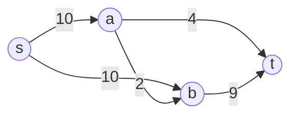

# Edmonds-Karp

## Prerequisites

[Ford-Fulkerson](./ford-fulkerson.md) [Must read] - Edmonds-Karp is Ford-Fulkerson with one specific rule (BFS augmenting paths); read the base method and residual-graph mechanics first
[Breadth-First Search (BFS)](./bfs.md) [Must read] - the augmenting-path search is a plain BFS over the residual graph

## Table of Contents

- [What it is](#what-it-is)
- [Intuition](#intuition)
- [How it works](#how-it-works)
- [Correctness / invariant](#correctness--invariant)
- [Complexity derivation](#complexity-derivation)
- [Constraints & approach](#constraints--approach)
- [When to use / when not](#when-to-use--when-not)
- [Comparison](#comparison)
- [Graph/tree assumptions](#graphtree-assumptions)
- [Edge cases](#edge-cases)
- [Implementation](#implementation)
- [What the interviewer probes for](#what-the-interviewer-probes-for)
- [Practice problems](#practice-problems)

## What it is

Edmonds-Karp is Ford-Fulkerson with the augmenting path chosen by **BFS** - i.e., always the shortest path (fewest edges) from source to sink in the residual graph. That one rule turns Ford-Fulkerson's capacity-dependent runtime into a strict, capacity-independent polynomial bound.

Time: **O(V·E²)**. Space: **O(V + E)** for the residual graph.

> **Soundbite:** Edmonds-Karp is Ford-Fulkerson that always grabs the *shortest* leaky path first - that one discipline caps the number of augmentations at O(VE), no matter how big the capacities are.

## Intuition

Ford-Fulkerson's weakness is that DFS can pick a long, low-bottleneck augmenting path over and over, driving the iteration count up to the *value* of the max flow - which can be astronomically larger than the graph itself. Edmonds-Karp's fix is almost embarrassingly simple: **always use BFS**, so the augmenting path found is always one with the fewest edges among all available augmenting paths.

Why does that help? Because of the **monotone-distance lemma**: once you push flow along the shortest s-t path and update the residual graph, the shortest-path distance from `s` to any node can never *decrease* on subsequent iterations - it only stays the same or grows. Since the shortest s-t distance is bounded by `V-1`, and it can only increase a bounded number of times, this pins down how many times each edge can be the "bottleneck" edge on a shortest path across the whole run: at most O(V) times per edge. With `E` edges, that's O(VE) total augmentations - regardless of how large the capacities are. This is the key insight that decouples the runtime from the numeric magnitude of the input, which is exactly what Ford-Fulkerson's DFS-based approach fails to guarantee.

## How it works

**Step-by-step trace** on the same network used in Ford-Fulkerson, to highlight the difference in path choice:

```
Edges (u → v : capacity):
s → a : 10
s → b : 10
a → b : 2
a → t : 4
b → t : 9
```



**Iteration 1.** BFS explores level by level: `s` → {a, b} → {t via a, t via b}. Both `s→a→t` and `s→b→t` are 2-edge paths; with edges added to the adjacency list in the order `s→a`, `s→b`, BFS visits `a` before `b` and finds `s → a → t` first. Bottleneck = min(10, 4) = 4. Push 4 units.
- Residual: `s→a` now 6, reverse `a→s` cap 4; `a→t` now 0, reverse `t→a` cap 4.
- Flow so far: 4.

**Iteration 2.** BFS again finds the shortest path: `s → b → t` (still 2 edges - the shortest available). Bottleneck = min(10, 9) = 9. Push 9 units.
- Residual: `s→b` now 1, reverse `b→s` cap 9; `b→t` now 0, reverse `t→b` cap 9.
- Flow so far: 13.

**Iteration 3.** BFS searches for a path from `s` to `t`. `a→t` and `b→t` are both saturated (residual 0). The only remaining edges from `a` are to `b` (residual 2) and back to `s` (reverse, cap 4 - useless, goes backward). From `b`, only back-edges remain. No forward path to `t` exists. **BFS reports no path - terminate.**

**Max flow = 13** (same answer as Ford-Fulkerson - the *value* found is always correct regardless of path-selection strategy; only the *number of iterations* to get there differs, and on adversarial graphs that difference is large).

**Level graph observation:** at each iteration, note the BFS layer distances from `s` - iteration 1 finds paths at distance 2, and there is no valid path at any distance afterward. On larger adversarial graphs, this distance strictly increases across iterations (never decreases), which is the empirical signature of the monotone-distance lemma.

## Correctness / invariant

Edmonds-Karp inherits Ford-Fulkerson's correctness argument in full - max-flow min-cut theorem, valid-flow invariant maintained by the bottleneck push, and termination at the point no augmenting path remains. Edmonds-Karp adds exactly one new invariant that makes the *complexity* bound provable:

**The monotone-distance lemma.** Let `dist(v)` be the shortest-path distance (in edges) from `s` to `v` in the residual graph at any point during the algorithm. As the algorithm proceeds through iterations, `dist(v)` is non-decreasing for every node `v` - it never gets shorter. Intuitively: BFS always saturates at least one edge on the shortest path; saturating an edge can only remove options, pushing future shortest paths to be as long or longer, never shorter, because any new residual reverse-edge created goes "backward" along the path just used and cannot shorten a future forward path to `v`.

This lemma is the load-bearing piece for the O(VE) bound on the number of augmentations, derived next.

## Complexity derivation

**Time: O(VE²).**

**Step 1 - bound the number of augmentations to O(VE).** Call an edge `(u,v)` "critical" on a given augmenting path if it is the bottleneck (its residual capacity determines how much flow gets pushed, and it becomes fully saturated - residual capacity 0 - after the push). Every augmentation has at least one critical edge.

Fix an edge `(u,v)`. Claim: it can become critical at most O(V) times over the entire run. Each time `(u,v)` is critical on a shortest augmenting path, `(u,v)` lies on that path, so `dist(v) = dist(u) + 1` at that moment (call this value `dist(u) = k`). For `(u,v)` to become critical *again* later, the edge must first be "un-saturated" - which only happens if flow is pushed back through the reverse edge `(v,u)`, and that requires `(v,u)` to lie on some later shortest path, i.e. `dist(u) = dist(v) + 1` at that later point. Chain the two equalities: at the first critical moment `dist(v) = k+1`; by the monotone-distance lemma `dist(v)` at the later moment is ≥ `k+1`; so the later `dist(u) = dist(v) + 1 ≥ k+2` - at least 2 more than its value the first time. Since `dist(u)` is bounded between 0 and `V-1`, and it jumps by ≥2 between consecutive critical moments for the same edge, edge `(u,v)` can be critical at most O(V) times.

With `E` edges each critical O(V) times, and every augmentation having ≥1 critical edge, there are at most **O(VE)** augmentations.

**Step 2 - each augmentation costs O(E).** A single BFS over the residual graph (up to `2E` edges counting reverse edges) takes O(V + E) = O(E) for connected graphs.

**Combined: O(VE) augmentations × O(E) per augmentation = O(VE²).**

This bound is **capacity-independent** - it depends only on `V` and `E`, never on the magnitude of edge capacities. This is the entire point of the BFS discipline: it converts Ford-Fulkerson's pseudo-polynomial O(E·max_flow) into a true polynomial bound.

**Space: O(V + E)** - the residual graph plus BFS's queue and visited set (O(V)).

## Constraints & approach

| Input size / capacity magnitude       | Expected complexity | Use Edmonds-Karp?         | Notes                                                                                    |
| --------------------------------------- | --------------------- | ---------------------------- | ------------------------------------------------------------------------------------------ |
| V, E ≤ 500, any capacity magnitude      | O(VE²) ≈ 1.25×10⁸    | Yes                          | Polynomial bound holds regardless of capacity size - safe default when unsure of magnitudes |
| V ≤ 100, E ≤ 5000                      | O(VE²) ≈ 2.5×10⁹     | Borderline - consider Dinic | E² term dominates; Dinic's O(V²E) may be faster when E ≫ V                                |
| Unit-capacity bipartite matching        | O(E√V) via Dinic      | No                           | Dinic specializes to O(E√V) on unit-capacity graphs - strictly faster than generic Edmonds-Karp |
| Small graph, huge capacities (≥10⁹)     | O(VE²), capacity-independent | Yes                  | This is precisely the case where Ford-Fulkerson's DFS approach fails and Edmonds-Karp is required |
| V, E > 2000, dense                     | O(V²E) Dinic recommended | No                       | E² in Edmonds-Karp grows too fast on dense graphs; Dinic's blocking-flow approach amortizes better |

**What rules Edmonds-Karp out:** very large, dense graphs (V, E in the thousands) where Dinic's O(V²E) with blocking flows beats O(VE²) in practice, and specialized unit-capacity bipartite matching where Dinic's O(E√V) special case wins outright. **What it invites:** any correctness-critical or contest setting with unpredictable/large capacities and a moderate graph size, where a guaranteed capacity-independent polynomial bound matters more than raw constant-factor speed.

## When to use / when not

**Reach for Edmonds-Karp when:**

- Capacities are large or unpredictable (a strict requirement in most competitive-programming max-flow problems, which routinely use capacities up to 10⁹) - Ford-Fulkerson's runtime becomes capacity-dependent and can time out; Edmonds-Karp's O(VE²) does not depend on capacity magnitude at all.
- You need a **provable, predictable worst-case bound** to reason about time limits, and the graph is small-to-medium (V, E in the low thousands) where O(VE²) is tractable.
- You want the simplicity of "just BFS instead of DFS" without implementing Dinic's more involved blocking-flow / level-graph machinery.

**Do not use Edmonds-Karp when:**

- The graph is large and dense - Dinic's O(V²E) (and its unit-capacity O(E√V) special case) will be faster in practice; the extra implementation complexity pays for itself at scale.
- You specifically need **bipartite matching** at scale - Hopcroft-Karp (O(E√V), a direct algorithm rather than a flow reduction) or Dinic on the unit-capacity flow formulation both outperform generic Edmonds-Karp.
- Memory is extremely tight and you don't need the residual graph's reverse edges tracked explicitly for anything beyond the flow value - though this rarely changes the choice, since all standard max-flow algorithms need the residual graph regardless.

**Real-world usage:** Edmonds-Karp's BFS-augmentation discipline is the textbook baseline taught before Dinic in most algorithms courses, and its capacity-independent guarantee makes it the "safe default" implementation for network flow problems in interviews and contests when the specific capacity magnitudes are unknown or adversarial. At scale, production flow solvers (e.g., in logistics or telecom bandwidth allocation) use push-relabel or Dinic variants rather than Edmonds-Karp, because O(VE²) becomes a real bottleneck once graphs reach tens of thousands of nodes - the BFS-per-augmentation cost adds up even though each one is individually cheap.

See also: [Ford-Fulkerson](./ford-fulkerson.md) for the base method and residual-graph fundamentals, and [Maximum Flow](./maximum-flow.md) for the full family survey and decision layer.

## Comparison

| Algorithm      | Time      | Space  | Key constraint / assumption                            | Pick it when…                                                                                    |
| -------------- | --------- | ------ | --------------------------------------------------------- | ------------------------------------------------------------------------------------------------- |
| Ford-Fulkerson | O(E·\|max_flow\|) | O(V+E) | Integer capacities; runtime depends on capacity magnitude | Small graph, small guaranteed-small integer capacities, simplest implementation wins             |
| Edmonds-Karp   | O(VE²)    | O(V+E) | Any non-negative capacities; capacity-independent bound   | Capacities are large/unknown and graph is small-to-medium - the safe, predictable default        |
| Dinic          | O(V²E)    | O(V+E) | Any non-negative capacities; O(E√V) on unit-capacity graphs | Graph is large/dense, or the problem is unit-capacity bipartite matching - worth the extra complexity |

**Crossover:** Edmonds-Karp's O(VE²) beats Dinic's O(V²E) exactly when `E < V` (sparse graphs) - most textbook and small contest graphs. Once `E` grows past `V` significantly (dense graphs, E ≈ V²), Dinic's bound (O(V²E) = O(V⁴) worst case, but empirically much faster due to blocking flows) overtakes Edmonds-Karp's O(VE²) = O(V⁵) worst case - the crossover favors Dinic as density increases.

## Graph/tree assumptions

**Directed, weighted (capacity) graph**, same as Ford-Fulkerson - every edge carries a non-negative capacity, and the residual graph is built identically (forward residual = capacity - flow, backward residual = flow).

**BFS on residual graph for shortest augmenting path.** The only structural difference from generic Ford-Fulkerson: the path-finding subroutine is fixed to BFS, which explores the residual graph level by level and guarantees the path found has the minimum number of edges among all s-t paths currently available. This is not an optional implementation detail - it is the entire reason Edmonds-Karp has a different (and better) name and a different (and provable) complexity bound than "Ford-Fulkerson with an unspecified path-finding strategy."

**Level graph implicit structure.** Although Edmonds-Karp doesn't explicitly construct a "level graph" (that's Dinic's innovation), the BFS distances computed at each iteration reveal the same layered structure Dinic exploits more aggressively - Dinic finds *all* shortest-length augmenting paths in one pass (a blocking flow) rather than Edmonds-Karp's one-path-per-BFS approach, which is the core reason Dinic is asymptotically faster.

## Edge cases

**1. No augmenting path from source to sink.** Identical to Ford-Fulkerson: BFS returns "no path found" and the algorithm terminates with the current flow as the max flow, possibly 0 if `s` and `t` are disconnected from the start.

**2. Disconnected graph.** Same handling as Ford-Fulkerson - always check BFS's return value before assuming a path exists; do not assume connectivity.

**3. Parallel edges.** Treated as distinct edges in the residual graph, same as Ford-Fulkerson - do not merge capacities unless the problem explicitly defines multi-edges as combinable.

**4. Capacity-1 (unit-capacity) graphs.** A common special case in bipartite matching reductions. Edmonds-Karp still works (O(VE²)), but this is exactly the case where Dinic's specialized O(E√V) bound applies and is asymptotically better - worth flagging in an interview if the problem is phrased as a matching problem rather than a general flow problem.

**5. CP-flavored trap: using DFS "by mistake" and calling it Edmonds-Karp.** The single most common conceptual bug: writing a DFS-based augmenting path search and labeling it Edmonds-Karp. The algorithm is *only* Edmonds-Karp if the path search is BFS - without that, you get generic Ford-Fulkerson's pseudo-polynomial bound, which can TLE on large-capacity contest inputs even though the code "looks the same" superficially.

**6. Repeated BFS overhead on nearly-saturated graphs.** Near the end of the algorithm, many BFS calls may find only small-bottleneck paths (e.g., bottleneck = 1) even though the O(VE) bound guarantees termination - this is expected behavior, not a bug, but can feel slow in a debugger/step-through if you don't know to expect many small augmentations near convergence.

## Implementation

### Pseudocode (CLRS-style)

```
EDMONDS-KARP(G, s, t)
  for each edge (u, v) ∈ G.E
      f[u, v] ← 0
      f[v, u] ← 0
  while there exists a path p from s to t in the residual graph Gf found by BFS
      cf(p) ← min { cf(u, v) : (u, v) is in p }   ▷ bottleneck capacity
      for each edge (u, v) in p
          f[u, v] ← f[u, v] + cf(p)
          f[v, u] ← f[v, u] - cf(p)
  return f

BFS-FIND-PATH(Gf, s, t)
  ▷ standard BFS; only traverse edges (u,v) with cf(u,v) > 0
  color[s] ← GRAY
  Q ← empty queue
  ENQUEUE(Q, s)
  while Q ≠ ∅
      u ← DEQUEUE(Q)
      for each v such that cf(u, v) > 0
          if color[v] = WHITE
              color[v] ← GRAY
              parent[v] ← u
              if v = t
                  return RECONSTRUCT-PATH(parent, s, t)
              ENQUEUE(Q, v)
  return NIL   ▷ no augmenting path
```

### Python (idiomatic)

```python
from collections import defaultdict, deque


class FlowNetwork:
    """Max-flow via Edmonds-Karp: Ford-Fulkerson with BFS-chosen augmenting paths."""

    def __init__(self) -> None:
        self.capacity: dict[tuple[int, int], int] = defaultdict(int)
        self.adj: dict[int, list[int]] = defaultdict(list)

    def add_edge(self, u: int, v: int, cap: int) -> None:
        self.capacity[(u, v)] += cap
        self.capacity[(v, u)] += 0   # ensure reverse residual edge exists
        if v not in self.adj[u]:
            self.adj[u].append(v)
        if u not in self.adj[v]:
            self.adj[v].append(u)

    def _bfs_find_path(self, source: int, sink: int) -> list[int] | None:
        parent: dict[int, int] = {source: source}
        queue: deque[int] = deque([source])
        while queue:
            u = queue.popleft()
            if u == sink:
                break
            for v in self.adj[u]:
                if v not in parent and self.capacity[(u, v)] > 0:
                    parent[v] = u
                    queue.append(v)
        if sink not in parent:
            return None
        path = [sink]
        while path[-1] != source:
            path.append(parent[path[-1]])
        path.reverse()
        return path

    def max_flow(self, source: int, sink: int) -> int:
        total_flow = 0
        while True:
            path = self._bfs_find_path(source, sink)
            if path is None:
                break
            bottleneck = min(
                self.capacity[(path[i], path[i + 1])]
                for i in range(len(path) - 1)
            )
            for i in range(len(path) - 1):
                u, v = path[i], path[i + 1]
                self.capacity[(u, v)] -= bottleneck
                self.capacity[(v, u)] += bottleneck
            total_flow += bottleneck
        return total_flow
```

**Contest note:** the only line that differs from a Ford-Fulkerson implementation is the path-finding subroutine (BFS/queue instead of DFS/stack) - a useful thing to point out live in an interview, since it shows you understand that "Edmonds-Karp" is a *specific instantiation* of the generic Ford-Fulkerson method, not a wholly separate algorithm.

## What the interviewer probes for

**"What's the one-line difference between Ford-Fulkerson and Edmonds-Karp?"**
Edmonds-Karp is Ford-Fulkerson with BFS (instead of an unspecified/DFS) as the augmenting-path search. That single choice - always shortest path by edge count - is what gives the O(VE²) bound instead of Ford-Fulkerson's capacity-dependent O(E·max_flow).

**"Why does BFS give a better complexity bound than DFS?"**
The monotone-distance lemma: shortest-path distances from `s` in the residual graph never decrease across iterations when you always augment along a shortest path. This bounds how many times any single edge can be the "critical" (bottleneck) edge to O(V), giving O(VE) total augmentations regardless of capacity values - a bound DFS cannot offer since it makes no distance guarantee.

**"When would you reach for Dinic instead?"**
When the graph is large or dense enough that O(VE²) becomes the bottleneck, or when the problem is specifically unit-capacity bipartite matching, where Dinic's blocking-flow approach gives O(E√V) - both cases where the extra implementation complexity of level graphs and blocking flows pays off.

**"Is Edmonds-Karp's bound tight, or is it usually much faster in practice?"**
The O(VE²) bound is a worst-case guarantee; on typical/random graphs the number of augmentations is often much smaller than O(VE) in practice, since the monotone-distance argument is a pessimistic bound achieved only by adversarially constructed graphs. Still, always reason about correctness and complexity from the worst case in an interview, not the average case.

## Practice problems

### 1. Maximum Flow (canonical, CSES "Download Speed" / general max-flow template)

**Problem.** Given a directed graph with edge capacities, a source, and a sink, compute the maximum flow from source to sink. n ≤ 500 nodes, m ≤ 1000 edges, capacities up to 10⁹ (large enough that Ford-Fulkerson's DFS approach risks TLE).

**Approach.** Direct Edmonds-Karp application: BFS for shortest augmenting path, push bottleneck flow, repeat. The large capacity bound is exactly the signal to prefer Edmonds-Karp (or Dinic) over plain Ford-Fulkerson.

```python
def download_speed(n: int, edges: list[tuple[int, int, int]]) -> int:
    net = FlowNetwork()
    for u, v, cap in edges:
        net.add_edge(u, v, cap)
    return net.max_flow(source=1, sink=n)
```

**Complexity.** O(VE²) time, O(V + E) space.

**Duplicate problems:**
- Police Chase (CSES) - min-cut via the same max-flow computation; answer is the saturated crossing edges, not the flow value itself.
- Any "maximum number of edge/vertex-disjoint paths" problem - set capacities to 1 and read off the flow value as the disjoint-path count.

---

### 2. Maximum Bipartite Matching (canonical, CSES "School Dance")

**Problem.** Given a bipartite graph with `left_n` nodes on one side and `right_n` on the other, and a list of compatible pairs, find the maximum matching (maximum set of pairs with no shared endpoints). n, m ≤ 500 per side.

**Approach.** Reduce to unit-capacity max-flow: super-source → left nodes (cap 1) → right nodes via original edges (cap 1) → super-sink (cap 1). Edmonds-Karp's polynomial bound applies directly; note this is exactly the unit-capacity special case where Dinic would be asymptotically faster (O(E√V)), a good follow-up talking point.

```python
def max_bipartite_matching(left_n: int, right_n: int, edges: list[tuple[int, int]]) -> int:
    SOURCE, SINK = 0, left_n + right_n + 1
    net = FlowNetwork()
    for l in range(1, left_n + 1):
        net.add_edge(SOURCE, l, 1)
    for r in range(1, right_n + 1):
        net.add_edge(left_n + r, SINK, 1)
    for l, r in edges:
        net.add_edge(l, left_n + r, 1)
    return net.max_flow(SOURCE, SINK)
```

**Complexity.** O(VE²), though the practical number of augmentations is bounded by `min(left_n, right_n)` since each augmentation adds exactly 1 unit of matching. Space: O(V + E).

**Duplicate problems:**
- Job Assignment / Task-Worker compatibility problems - identical bipartite matching reduction.
- Any "maximum number of pairs satisfying a compatibility constraint" problem phrased as a bipartite graph.

---

### 3. Baseball Elimination (advanced max-flow modeling, canonical algorithmic-modeling problem)

**Problem.** Given final standings and remaining games between teams in a league, determine which teams are mathematically eliminated from winning (i.e., cannot possibly finish with the most wins regardless of how remaining games are played). Up to ~30 teams, remaining games modeled as a small graph.

**Approach.** This is a distinct technique from problems 1-2: it requires **constructing** the flow network from a word problem rather than being handed one directly. Model each pair of remaining games as a "game node" with an edge from a super-source (capacity = number of games between that pair), fanning out to "team nodes" for each of the two teams in that game, then each team node to a super-sink with capacity equal to how many more wins that team can afford without surpassing the team being tested for elimination. A team is eliminated if and only if the max flow from source to sink is strictly less than the total number of remaining games (i.e., not all games can be "assigned" without some team exceeding the win cap) - a saturating-all-source-edges check, not just reading off the flow value.

```python
def is_eliminated(team: int, wins: list[int], remaining: list[list[int]]) -> bool:
    n = len(wins)
    max_possible = wins[team] + sum(remaining[team])
    # trivial elimination: someone already has more wins than `team` can ever reach
    if any(wins[i] > max_possible for i in range(n) if i != team):
        return True

    net = FlowNetwork()
    SOURCE = 0
    game_node = lambda i, j: 1 + i * n + j
    team_node = lambda i: 1 + n * n + i
    SINK = 1 + n * n + n

    total_games = 0
    for i in range(n):
        for j in range(i + 1, n):
            if i == team or j == team:
                continue
            g = remaining[i][j]
            if g == 0:
                continue
            total_games += g
            net.add_edge(SOURCE, game_node(i, j), g)
            net.add_edge(game_node(i, j), team_node(i), g)
            net.add_edge(game_node(i, j), team_node(j), g)
    for i in range(n):
        if i == team:
            continue
        net.add_edge(team_node(i), SINK, max(0, max_possible - wins[i]))

    flow = net.max_flow(SOURCE, SINK)
    return flow < total_games
```

**Complexity.** O(VE²) on a graph with O(n²) nodes and edges - so O(n⁴) to O(n⁶) depending on how E and V scale; feasible only because n (teams) is small (≤ 30) in this classic formulation.

**Duplicate problems:**
- Project Selection Problem (max-profit under prerequisite constraints via min-cut) - same "model the word problem as a flow network, read off a threshold from max-flow" technique, different construction.
