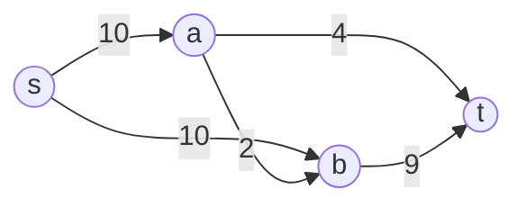

# Ford-Fulkerson

## Prerequisites

[Graph](../data-structures/graph.md) [Must read] - Ford-Fulkerson operates on a directed weighted (capacity) graph; adjacency representation shapes the residual-graph construction
[Depth-First Search (DFS)](./dfs.md) [Must read] - the classic Ford-Fulkerson finds augmenting paths via DFS on the residual graph
<!-- [Edmonds-Karp](./edmonds-karp.md) [Recommended] - the BFS-augmenting-path variant that fixes Ford-Fulkerson's pathological worst case -->

## Table of Contents

- [What it is](#what-it-is)
- [Intuition](#intuition)
- [How it works](#how-it-works)
- [Correctness / invariant](#correctness--invariant)
- [Complexity derivation](#complexity-derivation)
- [Constraints & approach](#constraints--approach)
- [When to use / when not](#when-to-use--when-not)
- [Comparison](#comparison)
- [Graph/tree assumptions](#graphtree-assumptions)
- [Edge cases](#edge-cases)
- [Implementation](#implementation)
- [What the interviewer probes for](#what-the-interviewer-probes-for)
- [Practice problems](#practice-problems)

## What it is

Ford-Fulkerson finds the maximum flow from a source `s` to a sink `t` in a capacity network by repeatedly finding a path with spare capacity (an **augmenting path**) and pushing as much flow as that path allows, until no augmenting path remains.

Time: **O(E · |max_flow|)** with integer capacities (can be worse - see Complexity derivation). Space: **O(V + E)** for the residual graph.

> **Soundbite:** Ford-Fulkerson keeps finding a leaky path from source to sink and plugs flow through it until every path is saturated - "max flow = no more room to push."

## Intuition

Model the graph as a network of pipes: each edge has a capacity (max water per second), the source pumps water in, the sink drains it out. Ford-Fulkerson's idea is simple - find any path from source to sink with unused capacity, push the maximum flow that path allows (limited by its tightest/bottleneck edge), and repeat.

The subtle part is the **residual graph**. After pushing flow along an edge `u→v`, you don't just reduce `u→v`'s remaining capacity - you also add a **reverse edge** `v→u` with capacity equal to the flow just pushed. This reverse edge lets a later augmenting path "undo" a bad earlier choice by routing flow back through it. Without reverse edges, an algorithm that greedily saturates the wrong path first could get stuck at a suboptimal flow with no way to correct course.

This is why Ford-Fulkerson works even though it makes no "smart" choice of which path to augment first - **any** sequence of augmenting paths converges to the max flow, because the residual graph always keeps a way to reroute. The **max-flow min-cut theorem** is the formal reason the algorithm is correct at all: flow value stops growing exactly when there is no augmenting path left, and at that point the graph has an s-t cut whose capacity equals the flow - so you cannot possibly push more.

## How it works

**Step-by-step trace** on a small capacity network:

```
Edges (u → v : capacity):
s → a : 10
s → b : 10
a → b : 2
a → t : 4
b → t : 9
```



**Iteration 1.** DFS finds path `s → a → t`. Bottleneck = min(10, 4) = 4. Push 4 units.
- Residual: `s→a` now 6, add reverse `a→s` cap 4; `a→t` now 0, add reverse `t→a` cap 4.
- Flow so far: 4.

**Iteration 2.** DFS finds path `s → b → t`. Bottleneck = min(10, 9) = 9. Push 9 units.
- Residual: `s→b` now 1, add reverse `b→s` cap 9; `b→t` now 0, add reverse `t→b` cap 9.
- Flow so far: 13.

**Iteration 3.** DFS finds path `s → a → b → t`. Bottleneck = min(6, 2, 0)... `b→t` is 0 now, so this path is **not viable directly** - DFS instead finds `s → a → b → (residual t→b reversed? no)`. In this small graph, after iteration 2, the only remaining path is `s → a → b → t`, but `b → t` is saturated (0 residual capacity) - no augmenting path exists there. DFS correctly reports no path.

**Terminates.** No augmenting path from `s` to `t` remains (checked via DFS reachability on the residual graph). **Max flow = 4 + 9 = 13.**

Notice: at every step, the invariant "flow pushed so far respects every edge's capacity and every node's conservation (inflow = outflow, except s and t)" holds - each augmentation preserves it by construction, since we only push the bottleneck amount.

## Correctness / invariant

**Invariant:** After each augmentation, the flow assignment is a valid flow - it satisfies capacity constraints (`0 ≤ f(u,v) ≤ c(u,v)` for every edge) and flow conservation (inflow = outflow at every node except `s` and `t`). Pushing the bottleneck amount along a path never violates capacity, and pushing the same amount into and out of every intermediate node on the path preserves conservation.

**Why termination requires integer capacities.** With integer capacities, each augmenting path increases total flow by at least 1 unit, so the algorithm terminates in at most `|max_flow|` iterations. With **irrational** capacities, a pathological choice of augmenting paths can make the flow converge to a value *strictly less* than the true max flow, taking infinitely many steps and never terminating - this is a classical counterexample (first shown by Ford and Fulkerson themselves). In practice, all interview/contest inputs use integer or rational capacities, so this never bites, but it is the theoretical reason Ford-Fulkerson is stated for integer (or rational, after scaling) capacities.

**Max-flow min-cut theorem as the correctness certificate.** The algorithm terminates when no augmenting path exists in the residual graph - equivalently, when the set of nodes reachable from `s` in the residual graph (call it `S`) does not include `t`. The cut `(S, V\S)` is then an s-t cut, and the theorem states **max flow = min cut capacity**. Every edge crossing from `S` to `V\S` in the original graph must be saturated (else it would still have residual capacity, and `t` would be reachable) - so the current flow equals the capacity of this cut. Since flow can never exceed any cut's capacity (weak duality), and we've found a cut whose capacity equals our flow, this flow **must** be maximum.

## Complexity derivation

**Time: O(E · |max_flow|)** for integer capacities.

Each augmentation requires one DFS/BFS over the residual graph to find a path: O(E) (or O(V+E), but E dominates in the graphs Ford-Fulkerson is used on). Each augmentation increases the flow by at least 1 (integer capacities), and the flow is bounded above by `|max_flow|`, so there are at most `|max_flow|` augmentations. Total: **O(E · |max_flow|)**.

This bound is loose and can be genuinely bad: consider a graph where `|max_flow|` is large (e.g., 2×10⁹ from huge capacities) but the graph itself is tiny (4 nodes). Then the algorithm can take billions of iterations even though `E` is constant - the bound is pseudo-polynomial (depends on the *value* of the input, not its size in bits). This is precisely the gap Edmonds-Karp closes by choosing augmenting paths via BFS (shortest path in edge count), which bounds the number of augmentations by O(VE) regardless of capacity magnitude.

**Space: O(V + E)** for the residual graph (original edges + their reverse counterparts) plus O(V) for the visited set used during each path search.

## Constraints & approach

| Input size / capacity magnitude          | Expected complexity        | Use Ford-Fulkerson?    | Notes                                                                                     |
| ----------------------------------------- | --------------------------- | ----------------------- | ------------------------------------------------------------------------------------------ |
| V, E ≤ 500, small integer capacities (≤100) | O(E · max_flow), fast in practice | Yes            | Textbook case; DFS-based augmentation is simple to implement under contest time pressure |
| Large capacities (≥ 10⁶), small graph     | O(E · max_flow) - can blow up | No, use Edmonds-Karp or Dinic | DFS may pick a low-bottleneck path repeatedly; pseudo-polynomial bound becomes the bottleneck |
| V, E ≤ 10⁴, need polynomial guarantee     | O(VE²) Edmonds-Karp or O(V²E) Dinic | No               | Ford-Fulkerson's bound depends on flow value, not just V/E - use a BFS-based variant instead |
| Bipartite matching, V ≤ 10³               | O(E·√V) Hopcroft-Karp or O(VE) via max-flow reduction | Situational | Ford-Fulkerson works but Dinic (unit-capacity special case) is faster - O(E√V) |
| Need min-cut, not just max-flow value     | Same as above               | Yes                      | Once Ford-Fulkerson terminates, the residual graph's reachable-from-s set directly gives the min cut |

**What rules Ford-Fulkerson out:** any input where capacities can be large relative to `E` - the pseudo-polynomial bound then dominates real runtime, and Edmonds-Karp or Dinic give a strict polynomial-in-`V,E` guarantee instead. **What it invites:** small, dense graphs with modest integer capacities where the simplicity of "DFS + augment" outweighs the asymptotic risk - a common contest shortcut when V, E ≤ few hundred.

## When to use / when not

**Reach for Ford-Fulkerson when:**

- The graph is small and capacities are modest - it's the simplest max-flow implementation to write from scratch under time pressure, and the pseudo-polynomial bound rarely bites at that scale.
- You need to understand or explain the **residual graph** and **augmenting path** concepts as a foundation before implementing Edmonds-Karp or Dinic - it's the pedagogical base case.
- You only need **any** correct max-flow algorithm and don't care about the specific augmenting-path strategy (e.g., verifying a hand-computed answer).

**Do not use Ford-Fulkerson when:**

- Capacities can be large (competitive programming problems often use capacities up to 10⁹) - use **Edmonds-Karp** (BFS augmentation, O(VE²), capacity-independent) or **Dinic** (O(V²E), faster in practice via blocking flows) instead.
- You need a **provable polynomial bound** independent of the numeric magnitude of the input - Ford-Fulkerson's O(E·|max_flow|) is not truly polynomial in the input size (number of bits), since `|max_flow|` can be exponential in the bit-length of the capacities.
- The problem is **unit-capacity bipartite matching** - Dinic's algorithm specializes to O(E√V) on unit-capacity graphs, dramatically faster than generic Ford-Fulkerson.

**Real-world usage:** max-flow algorithms underpin network bandwidth allocation (routing the most data through a network given link capacities), airline/scheduling problems modeled as flow networks, and image segmentation (min-cut/max-flow formulations in computer vision). At scale, the naive DFS-based Ford-Fulkerson is essentially never used in production - the pseudo-polynomial dependency on flow value makes it unpredictable on adversarial or naturally large-capacity inputs, so production systems always use Dinic or push-relabel variants with guaranteed polynomial bounds.

See also: [Edmonds-Karp](./edmonds-karp.md) for the BFS-based fix to the pathological worst case, and [Maximum Flow](./maximum-flow.md) for the full family survey and decision layer.

## Comparison

| Algorithm      | Time             | Space  | Key constraint / assumption                          | Pick it when…                                                                                   |
| -------------- | ----------------- | ------ | ------------------------------------------------------ | --------------------------------------------------------------------------------------------------- |
| Ford-Fulkerson | O(E · \|max_flow\|) | O(V+E) | Integer capacities (else may not terminate)           | Small graph, small integer capacities, and you want the simplest possible implementation           |
| Edmonds-Karp   | O(VE²)            | O(V+E) | Any non-negative integer capacities                   | You need a true polynomial bound independent of capacity magnitude, and E isn't too large (E² term dominates) |
| Dinic          | O(V²E)            | O(V+E) | Any non-negative capacities; O(E√V) on unit-capacity graphs | Larger graphs where Edmonds-Karp's O(VE²) is too slow, or the problem is unit-capacity bipartite matching |

**Crossover:** on a graph with V=E=1000 and capacities up to 10⁹, Ford-Fulkerson's bound (E·max_flow) can reach ~10¹² operations - infeasible - while Edmonds-Karp's O(VE²) = 10⁹ stays tractable. The crossover point is exactly when max_flow (a function of capacity magnitude) exceeds roughly V·E - beyond that, always prefer a BFS-based (capacity-independent) variant.

## Graph/tree assumptions

**Directed, weighted (capacity) graph.** Every edge `(u, v)` carries a capacity `c(u,v) ≥ 0`. Undirected edges are modeled as two directed edges (or one edge with equal-capacity flow in both directions, handled carefully to avoid double-counting in the residual graph).

**Residual graph construction.** For every edge `(u, v)` with capacity `c` and current flow `f`, the residual graph contains a forward edge `(u,v)` with residual capacity `c - f` (if positive) and a backward edge `(v,u)` with residual capacity `f` (if positive). The backward edge is what allows an algorithm to "cancel" flow chosen on a suboptimal earlier path - this is the single most-missed detail when implementing max-flow from scratch.

**DFS vs BFS path finding.** The classic Ford-Fulkerson uses **DFS** to find any augmenting path - simple to code, but gives no bound on path length, which is exactly why the pseudo-polynomial worst case exists (a long, low-bottleneck path can be chosen repeatedly). Edmonds-Karp swaps DFS for **BFS** (shortest augmenting path by edge count), which provably bounds the number of augmentations to O(VE) via the monotone-distance lemma - independent of capacity values.

## Edge cases

**1. No path from source to sink.** If `s` and `t` are in different components (or there's simply no directed path respecting capacities), the first DFS finds nothing and the algorithm terminates immediately with max flow = 0. Handle by checking the DFS/BFS return value before assuming a path exists.

**2. Disconnected graph / unreachable sink.** Same as above - always check reachability before attempting to compute a bottleneck; indexing into a non-existent path crashes rather than returning 0.

**3. Parallel edges between the same pair of nodes.** If there are two edges `u→v` with capacities 5 and 3, treat them as separate edges in the residual graph (don't merge into one edge of capacity 8, unless the problem explicitly says so) - merging silently changes the answer if the problem intends them as distinct edges with distinct reverse-edge bookkeeping.

**4. Self-loops.** An edge `u→u` never contributes to any s-t flow (it can't be part of a simple path) and should be skipped during path search - including it wastes work but doesn't cause incorrectness as long as your path-finding never revisits a node.

**5. CP-flavored trap: irrational or extremely large capacities causing non-termination or TLE.** With irrational capacities, Ford-Fulkerson may never terminate (see Correctness). In competitive programming, capacities are always integers, but if they're large (~10⁹) relative to the graph size, DFS-based Ford-Fulkerson can time out even though it's "correct" - this is the single most common way a naive max-flow submission gets TLE'd. Prefer Edmonds-Karp or Dinic whenever capacities aren't guaranteed small.

**6. Forgetting the reverse residual edge.** The most common implementation bug: pushing flow along `u→v` without adding/updating the reverse edge `v→u`. Without it, the algorithm can get stuck at a flow value below the true maximum, because it has no way to "undo" a greedy DFS's bad early path choice.

## Implementation

### Pseudocode (CLRS-style)

```
FORD-FULKERSON(G, s, t)
  for each edge (u, v) ∈ G.E
      f[u, v] ← 0
      f[v, u] ← 0
  while there exists a path p from s to t in the residual graph Gf
      cf(p) ← min { cf(u, v) : (u, v) is in p }   ▷ bottleneck capacity
      for each edge (u, v) in p
          f[u, v] ← f[u, v] + cf(p)
          f[v, u] ← f[v, u] - cf(p)                ▷ update reverse residual
  return f

FIND-AUGMENTING-PATH(Gf, s, t)
  ▷ DFS over residual graph; cf(u,v) = c(u,v) - f(u,v) if forward, f(v,u) if backward
  mark all vertices unvisited
  return DFS-PATH(Gf, s, t)
```

**Note:** CLRS presents Ford-Fulkerson generically ("there exists a path") without fixing DFS or BFS - the specific choice of DFS is what makes this "Ford-Fulkerson" as opposed to Edmonds-Karp (BFS) in the way most interview/CP contexts use the names.

### Python (idiomatic)

```python
from collections import defaultdict


class FlowNetwork:
    """Max-flow via Ford-Fulkerson with DFS-based augmenting paths."""

    def __init__(self) -> None:
        self.capacity: dict[tuple[int, int], int] = defaultdict(int)
        self.adj: dict[int, set[int]] = defaultdict(set)

    def add_edge(self, u: int, v: int, cap: int) -> None:
        self.capacity[(u, v)] += cap
        self.capacity[(v, u)] += 0   # ensure reverse residual edge exists
        self.adj[u].add(v)
        self.adj[v].add(u)

    def _find_path_dfs(self, source: int, sink: int) -> list[int] | None:
        visited: set[int] = {source}
        stack: list[tuple[int, list[int]]] = [(source, [source])]
        while stack:
            u, path = stack.pop()
            if u == sink:
                return path
            for v in self.adj[u]:
                if v not in visited and self.capacity[(u, v)] > 0:
                    visited.add(v)
                    stack.append((v, path + [v]))
        return None

    def max_flow(self, source: int, sink: int) -> int:
        total_flow = 0
        while True:
            path = self._find_path_dfs(source, sink)
            if path is None:
                break
            # bottleneck = min residual capacity along the path
            bottleneck = min(
                self.capacity[(path[i], path[i + 1])]
                for i in range(len(path) - 1)
            )
            for i in range(len(path) - 1):
                u, v = path[i], path[i + 1]
                self.capacity[(u, v)] -= bottleneck
                self.capacity[(v, u)] += bottleneck   # reverse residual edge
            total_flow += bottleneck
        return total_flow
```

**Contest note:** for adjacency, a `dict[tuple, int]` capacity map is simple to write but has hashing overhead; competitive programmers often use an edge-list-with-index representation (`to[]`, `cap[]`, `next[]` arrays) for speed at large V/E - the dict version here favors clarity.

## What the interviewer probes for

**"Why do you need the reverse residual edge?"**
Without it, once flow is pushed along `u→v`, there's no way to reduce that flow later. A DFS-based algorithm can greedily saturate a path that isn't part of the optimal solution; the reverse edge lets a later augmenting path effectively "cancel" and reroute that flow. Removing reverse edges can make the algorithm converge to a value below the true max flow.

**"What breaks with irrational capacities?"**
Termination relies on each augmentation increasing flow by at least some fixed positive amount. With irrational capacities, an adversarial (or unlucky) sequence of augmenting paths can make the flow converge to a value strictly less than the true maximum, taking infinitely many steps. This is a classical counterexample from Ford and Fulkerson's original paper - never an issue with integer capacities.

**"Why is the DFS choice a liability, and what fixes it?"**
DFS gives no guarantee on the length or bottleneck of the path it finds - it might repeatedly find a very long path with a tiny bottleneck (e.g., bottleneck = 1) even when a much better path exists, driving up the iteration count to O(max_flow). Edmonds-Karp fixes this by using BFS (shortest path by edge count), which provably bounds the number of augmentations to O(VE) via the monotone-distance lemma, independent of capacity values.

**"How do you extract the min cut once max flow is found?"**
Run a reachability search (BFS/DFS) from `s` in the final residual graph. The set of reachable nodes `S` and its complement `V\S` form the min cut; the edges crossing from `S` to `V\S` in the *original* graph are exactly the saturated edges whose total capacity equals the max flow.

## Practice problems

### 1. Max Flow / Min Cut (generic network, LC-style: "Maximum Flow" is not on LeetCode directly - canonical reference: CSES "Download Speed")

**Problem.** Given a directed graph with edge capacities, a source, and a sink, compute the maximum amount of flow that can be routed from source to sink without violating any edge's capacity. n ≤ 500 nodes, m ≤ 1000 edges, capacities up to 10⁹.

**Approach.** Direct application of Ford-Fulkerson (or Edmonds-Karp given the capacity magnitude - see Constraints table). Build the residual graph, repeatedly find an augmenting path, push the bottleneck flow, until no path remains.

```python
def download_speed(n: int, edges: list[tuple[int, int, int]]) -> int:
    net = FlowNetwork()
    for u, v, cap in edges:
        net.add_edge(u, v, cap)
    return net.max_flow(source=1, sink=n)
```

**Complexity.** O(E · max_flow) time, O(V + E) space.

**Duplicate problems:**
- Police Chase (CSES) - min-cut formulation; same max-flow computation, answer is the cut edges rather than the flow value.
- School Dance (CSES) - bipartite matching via max-flow reduction; same engine, different graph construction (source→left nodes→right nodes→sink, all unit capacity).

---

### 2. Maximum Bipartite Matching (LC 1349 - Maximum Students Taking Exam, reducible; canonical: CSES "School Dance")

**Problem.** Given a bipartite graph (two disjoint sets of nodes, edges only between the sets), find the maximum number of edges such that no two selected edges share an endpoint. n, m ≤ 500 nodes per side.

**Approach.** Reduce to max-flow: add a super-source connected to every left-side node (capacity 1), every original edge left→right (capacity 1), and every right-side node connected to a super-sink (capacity 1). The max flow in this network equals the maximum matching size, because a unit of flow through `source → l → r → sink` corresponds exactly to matching `l` with `r`, and capacity-1 edges prevent any node from being matched twice.

```python
def max_bipartite_matching(left_n: int, right_n: int, edges: list[tuple[int, int]]) -> int:
    SOURCE, SINK = 0, left_n + right_n + 1
    net = FlowNetwork()
    for l in range(1, left_n + 1):
        net.add_edge(SOURCE, l, 1)
    for r in range(1, right_n + 1):
        net.add_edge(left_n + r, SINK, 1)
    for l, r in edges:
        net.add_edge(l, left_n + r, 1)
    return net.max_flow(SOURCE, SINK)
```

**Complexity.** O(E · max_flow) = O(E · min(left_n, right_n)) since matching size is bounded by the smaller side. Space: O(V + E).

**Duplicate problems:**
- Assignment Problem (jobs to workers, unweighted feasibility variant) - identical bipartite-matching-via-max-flow reduction.
- Team Formation / Task Assignment style problems - same reduction whenever the question is "maximum number of pairs" under a bipartite compatibility constraint.

---

### 3. Min-Cost to Connect All Points... (not flow) → use instead: Circulation with Lower Bounds (conceptual/advanced, canonical: CSES "Distinct Routes")

**Problem.** Given a directed graph, find the maximum number of edge-disjoint paths from node 1 to node n (no two paths share an edge), and output the paths. n ≤ 500, m ≤ 1000.

**Approach.** Set every edge's capacity to 1 (edge-disjoint constraint) and run max-flow from node 1 to node n. The max flow value equals the maximum number of edge-disjoint paths. To recover the actual paths, repeatedly walk from source to sink following any edge with flow > 0 (decrementing as you go) - this is a distinct technique from problems 1-2 because it requires **path reconstruction from a flow assignment**, not just the flow value.

```python
def distinct_routes(n: int, edges: list[tuple[int, int]]) -> list[list[int]]:
    net = FlowNetwork()
    for u, v in edges:
        net.add_edge(u, v, 1)
    num_paths = net.max_flow(1, n)

    # reconstruct paths by following saturated forward edges
    paths = []
    for _ in range(num_paths):
        path, u = [1], 1
        while u != n:
            for v in net.adj[u]:
                if net.capacity[(v, u)] > 0 and net.capacity[(u, v)] == 0:
                    # a forward edge (u,v) with original cap 1 that's now fully
                    # "used" shows as capacity[(v,u)] > 0 (the reverse residual)
                    net.capacity[(v, u)] -= 1
                    path.append(v)
                    u = v
                    break
        paths.append(path)
    return paths
```

**Complexity.** O(E · max_flow) to compute flow, O(V · max_flow) to reconstruct all paths. Space: O(V + E).

**Duplicate problems:**
- Download Speed variant with path output - same reconstruction technique layered on top of problem 1's flow computation.
