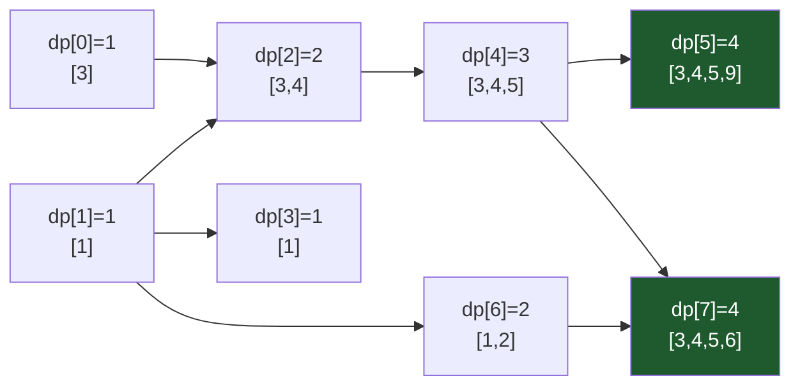

# Longest Increasing Subsequence

## Prerequisites

- [Dynamic Programming](./dynamic-programming.md) [Must read] - LIS's O(n²) formulation is a textbook 1D DP: state, recurrence, base case, and the memo-vs-tabulation tradeoff are all inherited from there, not re-taught here.
- [Binary Search](./binary-search.md) [Must read] - the O(n log n) formulation's entire speedup is a binary search for the leftmost insertion point in a maintained array; you need the boundary-search mechanics (`bisect_left`-style) before the patience-sorting trick makes sense.
- [Array](../data-structures/array.md) [Must read] - both formulations run over an indexable array; the tails array itself is the state in the fast version.

## Table of Contents

- [What it is](#what-it-is)
- [Intuition](#intuition)
- [How it works](#how-it-works)
- [Correctness / invariant](#correctness--invariant)
- [Complexity derivation](#complexity-derivation)
- [Constraints & approach](#constraints--approach)
- [When to use / when not](#when-to-use--when-not)
- [Comparison](#comparison)
- [State & recurrence](#state--recurrence)
- [Edge cases](#edge-cases)
- [Implementation](#implementation)
- [What the interviewer probes for](#what-the-interviewer-probes-for)
- [Practice problems](#practice-problems)

## What it is

**Longest Increasing Subsequence (LIS)** finds the length (or the sequence itself) of the longest subsequence of an array whose elements are strictly increasing, where a subsequence may skip elements but must preserve their original order.

**Mental model:** think of a row of cards - you may cross out any cards you like, but the ones you keep must read left-to-right in increasing order; LIS asks for the longest hand you can keep. There are two ways to answer it: a **O(n²) DP** that compares every pair `(i, j)` directly, and a **O(n log n) patience-sorting** trick that plays cards onto piles the way the real card game "patience" (solitaire) does - and it is this card game that gives the fast algorithm its name.

> **Takeaway (say it out loud):** "LIS is O(n²) DP by comparing every pair - or O(n log n) by patience sorting, where you binary-search a `tails` array for where each number would sit if you kept piles of increasing cards."

## Intuition

**Why the O(n²) DP works:** for every index `i`, ask "what's the longest increasing run that could end exactly here?" That run is either just `nums[i]` alone, or `nums[i]` appended onto the best run ending at some earlier, smaller element `nums[j]`. Trying every earlier `j` and taking the best is brute-force but airtight - the answer for the whole array is just the best of all per-index answers.

**Why the O(n log n) patience-sorting trick works, intuitively:** instead of asking "what's the best run *ending* at index `i`?", ask a different question: "if I'm building increasing runs of length `1, 2, 3, …` greedily, what is the *smallest possible last card* for each length, using only the numbers seen so far?" Keeping the last card of each length as small as possible is a greedy move that never hurts - a smaller tail only makes it *easier* to extend that run later with a future number. Each new number either **extends** the longest run so far (its tail is bigger than every current tail) or **replaces** the tail of the shortest run it can improve (making that run's tail smaller without shortening it). Because the tails end up sorted, "which run can this number improve" is answerable by binary search - that's where `log n` comes from, and why the technique carries the name of the solitaire game where you place each card on the leftmost pile it's allowed to sit on.

## How it works

Trace **both** approaches on the same input: `nums = [3, 1, 4, 1, 5, 9, 2, 6]` (index 0-7).

**O(n²) DP trace.** State `dp[i]` = length of the longest increasing subsequence ending exactly at index `i`. Recurrence: `dp[i] = 1 + max(dp[j] for j < i if nums[j] < nums[i])`, or `1` if no such `j` exists.

| i | nums[i] | j's with nums[j] < nums[i] | dp[i] | ending run (one choice) |
| - | ------- | --------------------------- | ----- | ------------------------ |
| 0 | 3 | none | 1 | `[3]` |
| 1 | 1 | none | 1 | `[1]` |
| 2 | 4 | j=0(3), j=1(1) → dp=1,1 | 2 | `[3,4]` |
| 3 | 1 | none (nums[1]=1 not `<` 1) | 1 | `[1]` |
| 4 | 5 | j=0,1,2,3 → best dp[2]=2 | 3 | `[3,4,5]` |
| 5 | 9 | all j=0..4 → best dp[4]=3 | 4 | `[3,4,5,9]` |
| 6 | 2 | j=1(1), j=3(1) → dp=1,1 | 2 | `[1,2]` |
| 7 | 6 | j=0,1,2,3,4,6 → best dp[4]=3 | 4 | `[3,4,5,6]` |

`max(dp) = 4`, achieved at index 5 and index 7 (two different LIS's of length 4). Answer: **4**.



**O(n log n) patience-sorting trace.** Maintain `tails`, where `tails[k]` = smallest possible tail value of an increasing subsequence of length `k+1` built so far. For each number: binary-search the leftmost position in `tails` that is `>=` the number; if none exists, append (extends the longest run); otherwise overwrite that slot (tightens a run of that length without shortening anything).

```
nums:      3    1    4    1    5    9    2    6
tails after each step (bracket = position just written):

step 0 (3): [ [3] ]                       -> 3 is bigger than everything (empty tails) -> append
step 1 (1): [ [1] ]                       -> 1 < 3 -> overwrite tails[0] (tighter length-1 tail)
step 2 (4): [ 1, [4] ]                    -> 4 > all tails -> append
step 3 (1): [ [1], 4 ]                    -> 1 <= tails[0]=1 -> overwrite tails[0] (no-op here)
step 4 (5): [ 1, 4, [5] ]                 -> 5 > all tails -> append
step 5 (9): [ 1, 4, 5, [9] ]              -> 9 > all tails -> append
step 6 (2): [ 1, [2], 5, 9 ]              -> 2 fits between 1 and 4 -> overwrite tails[1]
step 7 (6): [ 1, 2, 5, [6] ]              -> 6 fits between 5 and 9 -> overwrite tails[3]

final tails = [1, 2, 5, 6]  ->  len(tails) = 4
```

`len(tails) = 4` - **the same answer as the O(n²) DP**, even though `tails` is *not itself* a valid LIS (`[1, 2, 5, 6]` happens to be increasing here, but in general `tails` is just a record of best-possible-tails, not a reconstructed subsequence - see Edge cases and the interviewer-probes section for reconstructing the actual sequence). The two approaches agree because `len(tails)` at any step always equals `max(dp)` restricted to elements processed so far - proven next.

## Correctness / invariant

**O(n²) DP recurrence - proof.** Claim: `dp[i]` (as defined above) equals the true length of the longest increasing subsequence ending at index `i`.

- *Base case:* `dp[i] = 1` when no earlier `j` has `nums[j] < nums[i]` - trivially, the run `[nums[i]]` alone has length 1 and nothing shorter or "no run" beats it.
- *Inductive step:* assume `dp[j]` is correct (the true LIS-ending-at-`j` length) for all `j < i`. Any increasing subsequence ending at `i` either has length 1 (just `nums[i]`), or its second-to-last element is some `nums[j] < nums[i]` with `j < i`, in which case the prefix before `nums[i]` is itself an increasing subsequence ending at `j` - so its best possible length is exactly `dp[j]`. Taking `1 + max` over all valid `j` therefore finds the true optimum, by the inductive hypothesis.
- *Overall answer:* `max_i dp[i]`, since the LIS of the whole array must end somewhere, and `dp[i]` is the true best ending at that index.

**tails[] invariant - proof (the non-obvious part).** Claim: after processing a prefix of the array, `tails[k]` holds the smallest possible tail value among all increasing subsequences of length `k+1` that can be built from elements seen so far, and `tails` is always sorted strictly increasing.

- *`tails` stays sorted:* if `tails[k] >= tails[k+1]` were possible, then a run of length `k+2` ending at `tails[k+1]` would contain a prefix of length `k+1` ending at some value `< tails[k+1] <= tails[k]`, contradicting that `tails[k]` was already the smallest known length-`(k+1)` tail. So the invariant is self-reinforcing: sortedness is preserved by construction.
- *Extending:* when a new number `x` is greater than every `tails[k]`, appending it creates a run of length `len(tails)+1` with tail `x` - and no run of that new length existed before, so `x` is trivially the smallest possible tail for that length.
- *Tightening:* when `x <= tails[k]` for the leftmost such `k` (found by binary search - `k` = the count of `tails` entries strictly less than `x`), replacing `tails[k]` with `x` is valid because a run of length `k+1` ending at `x` genuinely exists (take the run ending at `tails[k-1] < x`, append `x`), and `x` is now the smallest possible tail for length `k+1` (nothing smaller could exist, since `x` was the smallest value processed that could extend a length-`k` run). Crucially, **`len(tails)` never shrinks on a tighten** - tightening only replaces a value, so the recorded LIS length so far is preserved, never corrupted.
- *Why `len(tails)` equals the answer:* by induction on the prefix processed, `len(tails)` after step `t` equals `max(dp[0..t])` from the O(n²) formulation - both are answering "what's the longest increasing run buildable so far," and the tightening step is exactly the greedy realization of "keep every length's option as flexible (small-tailed) as possible without ever losing a length already achieved."

## Complexity derivation

**O(n²) DP.** Two nested loops: the outer loop runs `n` times (one per index `i`), and for each `i` the inner loop scans all `j < i` - the *number of steps* is `sum_{i=0}^{n-1} i = n(n-1)/2 = O(n²)`. No recursion to unroll, no Master theorem needed - it's a direct double-loop count. Space: `O(n)` for the `dp` array.

**O(n log n) patience sorting.** The outer loop runs `n` times (one per array element); for each element, the binary search over the current `tails` array (which has at most `n` entries) costs `O(log n)`. Total: `n` iterations `× O(log n)` binary search each `= O(n log n)`. Space: `O(n)` for the `tails` array (worst case, a fully increasing input where `tails` grows to length `n`).

**Why the fast version doesn't need a smarter recurrence, just a smarter *representation*.** The O(n²) version re-derives, from scratch each time, "which earlier element can I extend?" by scanning linearly. The O(n log n) version instead maintains a **sorted proxy** (`tails`) of the state that lets that same question be answered by binary search instead of linear scan - the recurrence is unchanged (it's still "extend the best compatible smaller run"), only the lookup structure changed from O(n) scan to O(log n) search. This is the senior-level insight: `n` iterations that each *used to be* O(n) work become `n` iterations of O(log n) work by keeping an invariant-preserving sorted array around.

**Cache behavior.** Both variants scan a contiguous array sequentially in the outer loop - cache-friendly. The O(n²) inner loop is also a sequential scan over a contiguous `dp` array - cache-friendly. The O(n log n) binary search jumps around inside `tails`, but `tails` is small (`≤ n` ints) and typically fits entirely in L1/L2 cache, so the "non-sequential" access pattern of binary search costs far less in practice here than pointer-chasing a tree would - the asymptotic win is real and not eaten by cache effects.

## Constraints & approach

| Input size `n` | Expected complexity | Approach |
| --------------- | -------------------- | -------- |
| `n ≤ 1000` | O(n²) fine | **O(n²) DP** - simpler to code correctly under interview time pressure; a double loop with a direct recurrence has fewer places to introduce a bug than binary search boundary logic. |
| `n ≤ 10^5` or `10^6` | O(n²) too slow (10^10-10^12 ops) | **O(n log n) patience sorting** - mandatory; the binary-search-over-tails approach is the only one that survives this range. |
| Need the actual subsequence, not just its length | either complexity class | Track parent pointers alongside `dp[i]` (O(n²) version) or alongside each `tails` write (O(n log n) version) - reconstruction adds O(n) space either way but doesn't change the time complexity. |
| Values also bounded / need 2D ordering (e.g. envelopes) | O(n log n) still achievable | Sort by one dimension, then run 1D LIS-style patience sorting on the other - see Russian Doll Envelopes in Practice problems. |

**What the constraint rules out / invites:** `n ≤ 1000` *invites* the O(n²) DP precisely because it's simpler to get right live, and `1000² = 10^6` operations is comfortably fast. The moment `n` crosses roughly `10^4`-`10^5`, O(n²) is *ruled out* - `10^5² = 10^10` operations - and the constraint is screaming "you need the log-factor speedup," i.e., patience sorting. This is the single biggest tell interviewers plant: state the array size, watch whether the candidate reaches for O(n log n) unprompted.

## When to use / when not

Reach for LIS's O(n²) DP when `n` is small and you want a solution that's easy to verify correct on paper, or when you need to reconstruct the sequence and per-index parent pointers feel more natural to reason about. Reach for the O(n log n) patience-sorting version whenever `n` is large enough that O(n²) risks a timeout, or in any contest setting where the log-factor is simply expected.

**Prefer an alternative when:**

- The subsequence must be **contiguous** (a subarray, not a subsequence) - that's [Kadane's](./kadane.md)-style DP or a sliding window, not LIS; LIS explicitly allows skipping elements.
- You need **longest common subsequence between two arrays**, not the longest increasing run within one - that's [LCS](../patterns/dp-patterns.md), a genuinely different 2D DP (though see the Comparison table below for how LIS can be *reduced* to LCS in a pinch).
- You need the **number of** distinct LIS's, not just the length - a variant DP that additionally tracks a count alongside each `dp[i]`, still O(n²) or O(n log n) with a Fenwick tree for the count-tracking version.

**Real-world usage:** patience sorting is literally the mechanized form of the solitaire card game it's named after, and the *tails*-array trick is the core of the **`patience diff` algorithm** used by Git and Bazaar for computing minimal, more human-readable diffs - it finds the longest run of matching, order-preserving lines between two file versions, which is exactly LIS over the matched-line indices. The technique also appears in **box-stacking / Russian-doll-envelope**-style problems (nesting objects that must increase in every dimension) and in scheduling contexts where you want the longest run of tasks that can execute without violating a precedence/size ordering. **At scale**, when `n` reaches `10^7`-`10^8` (e.g. genomic sequence alignment variants), even O(n log n) can be too slow in wall-clock terms due to Python-level per-element overhead - production systems drop to a compiled/vectorized `tails`-array implementation, or bound the problem differently (e.g. block-decompose the array and merge per-block LIS's).

## Comparison

| Approach | Time | Space | Key assumption / when it wins |
| -------- | ---- | ----- | ------------------------------ |
| **O(n²) DP** | O(n²) | O(n) | Any `n`; simplest to code and reason about under pressure. Wins when `n ≤ ~1000` and correctness-under-time-pressure matters more than speed. |
| **O(n log n) patience sorting** | O(n log n) | O(n) | Any `n`; required once `n` exceeds a few thousand. The `tails` array is not itself a valid LIS - reconstruction needs extra bookkeeping (see Edge cases). |
| LIS-as-LCS reduction | O(n log n) (with the dedup + LIS trick) or O(n²) naively | O(n) | Build `B` = sorted, deduplicated copy of `A`; LIS(A) = LCS(A, B). Only useful pedagogically or when an LCS routine is already on hand - a direct LIS is simpler and never slower, so this is rarely the practical choice, but it shows LIS is a *special case* of LCS where one sequence is the sorted-unique version of the other. |
| Patience-sort-based diff (Git) | O(n log n) per common-line pass | O(n) | Real-world instance of this exact algorithm - finds the longest increasing run of matched line-number pairs between two file versions. |

The row that matters most in interviews: **O(n²) vs O(n log n)** - both give the correct length, differing only in how the "which run can I extend?" lookup is implemented (linear scan vs binary search over a maintained sorted proxy). Pick based on the stated constraint, not by default.

## State & recurrence

> Family: **Recursive/build** - LIS is a DP whose state, recurrence, and fill order fully determine both formulations; the fast version keeps the *same underlying recurrence* but changes which state it materializes.

**1. State.**
- **O(n²) formulation:** `dp[i]` = length of the longest increasing subsequence that *ends exactly at index `i`*. This is an "ends-at" state - it commits to using `nums[i]` as the last element, which is why the final answer needs a `max` over all `i`, not just `dp[n-1]`.
- **O(n log n) formulation:** `tails[k]` = smallest possible tail value among all increasing subsequences *of length `k+1`* built from the prefix seen so far. This is a fundamentally different state shape - indexed by **length**, not by **array position** - which is exactly what makes it compact enough (`≤ n` entries, but in practice often far fewer than `n`) and sorted, and therefore binary-searchable.

**2. Base case.**
- O(n²): `dp[i] = 1` for every `i` with no smaller predecessor - a single element is trivially an increasing subsequence of length 1.
- O(n log n): `tails` starts empty; the first element always gets appended (there is nothing to compare against, so it trivially becomes the smallest tail of a length-1 run).

**3. Memo vs tabulation.** The O(n²) formulation is naturally **tabulated bottom-up**: fill `dp[0..n-1]` left to right, since `dp[i]` only depends on `dp[j]` for `j < i` - a clean topological order with no benefit to memoized top-down recursion here (every state is visited exactly once regardless of direction, and there's no sparsity to exploit). The O(n log n) formulation isn't a classic memo table at all - it's a **single maintained array updated online**, one pass, no revisiting - which is precisely why it's faster: it never re-derives what a smaller sub-scan already established, because the sorted `tails` array *is* the compressed summary of every previous decision.

**4. State-space size.** O(n²): `n` states (one `dp[i]` per index), each costing O(n) to compute in the worst case → O(n²) total, matching the derivation above. O(n log n): the `tails` array has at most `n` slots, but only **one slot is touched per input element** (via binary search) - so state-space size doesn't directly bound the runtime the way it does in classic DP; instead, per-element work is bounded by `O(log(current tails size))`, which is where the `log n` factor comes from.

## Edge cases

- **Empty array (`nums = []`):** LIS length is `0` by definition - both formulations must return `0` without indexing into anything; guard with `if not nums: return 0` before either loop starts.
- **Single element (`nums = [5]`):** LIS length is `1`. Flushes out off-by-ones in both the `dp` base case and the `tails`-append logic (the very first element must always append, never compare against an empty structure incorrectly).
- **All elements equal (`nums = [2, 2, 2, 2]`) - the classic CP trap:** for **strictly increasing** LIS, the answer is `1` (no two equal elements can both be in the subsequence). Getting this right requires the binary search to use `bisect_left` semantics (find the first tail `>= x`, not `> x`) so that equal values overwrite rather than extend. If the problem instead asks for a **non-decreasing** (`<=`) subsequence, the same array's answer becomes `4`, and the fix is switching the binary search to `bisect_right` semantics (first tail `> x`). **This strict-vs-non-strict distinction is the single most common bug in LIS submissions** - always confirm which the problem means before coding.
- **All strictly descending (`nums = [9, 7, 5, 3, 1]`):** LIS length is `1` (no element extends any other). Every element overwrites `tails[0]` in turn - a good check that overwriting logic doesn't accidentally grow `tails`.
- **Duplicates mixed with genuine increases (`nums = [1, 3, 3, 5]`):** strict LIS = `3` (`[1,3,5]`, only one of the `3`s used) - a common place candidates double-count duplicates when they forget the strict-vs-non-strict rule above.
- **Integer overflow / large values (CP-flavored):** LIS itself doesn't accumulate sums, so overflow is rarely an issue for the length - but if the variant asks for the *maximum sum* of an increasing subsequence (a related but distinct problem), accumulating into a fixed-width integer type can overflow; use 64-bit accumulators in languages where it matters.

## Implementation

**Why `bisect_left` is used below, not hand-rolled, in the O(n log n) Python.** Per this wiki's Implementation-section rule, stdlib that hides *the mechanism being taught* is disallowed - but the mechanism this article teaches for the fast path is **patience sorting: the tails-array invariant and the extend-vs-tighten decision**, not binary search mechanics itself (those live in [Binary Search](./binary-search.md) and are assumed as a prerequisite). Using `bisect.bisect_left` here is the idiomatic, contest-velocity way to write this - exactly the kind of stdlib shortcut this wiki calls out as "what you'd actually type in a contest." The pseudocode below still spells out the binary search explicitly, so the mechanics aren't hidden anywhere in the article - only the Python reference leans on the stdlib, as intended.

**Pseudocode (CLRS-style) - O(n²) DP:**

```
LIS-QUADRATIC(nums)
n ← nums.length
let dp[0..n-1] be a new array
for i ← 0 to n-1
    dp[i] ← 1                              ▷ every element is a run of length 1 alone
for i ← 1 to n-1
    for j ← 0 to i-1
        if nums[j] < nums[i] and dp[j] + 1 > dp[i]
            dp[i] ← dp[j] + 1               ▷ extend the best run ending strictly smaller
best ← 0
for i ← 0 to n-1
    if dp[i] > best
        best ← dp[i]
return best
```

**Pseudocode (CLRS-style) - O(n log n) patience sorting:**

```
LIS-PATIENCE(nums)
let tails[0..n-1] be a new array         ▷ tails[k] = smallest tail of a run of length k+1
size ← 0
for i ← 0 to nums.length - 1
    lo ← 0
    hi ← size
    while lo < hi                          ▷ binary search: leftmost index with tails[mid] >= nums[i]
        mid ← lo + ⌊(hi - lo) / 2⌋
        if tails[mid] < nums[i]
            lo ← mid + 1
        else
            hi ← mid
    tails[lo] ← nums[i]                    ▷ append if lo = size, else tighten in place
    if lo = size
        size ← size + 1
return size
```

**Python - O(n²) DP:**

```python
from typing import List

def length_of_lis_quadratic(nums: List[int]) -> int:
    if not nums:
        return 0
    n = len(nums)
    dp = [1] * n                          # dp[i]: LIS length ending at i
    for i in range(1, n):
        for j in range(i):
            if nums[j] < nums[i]:
                dp[i] = max(dp[i], dp[j] + 1)
    return max(dp)
```

**Python - O(n log n) patience sorting (idiomatic, `bisect_left` - see rationale above):**

```python
import bisect
from typing import List

def length_of_lis(nums: List[int]) -> int:
    if not nums:
        return 0
    tails: List[int] = []
    for x in nums:
        i = bisect.bisect_left(tails, x)  # leftmost slot where x could sit
        if i == len(tails):
            tails.append(x)               # x extends the longest run so far
        else:
            tails[i] = x                  # x tightens an existing run's tail
    return len(tails)
```

**Python - reconstructing the actual subsequence (parent-pointer variant, O(n log n) space/time):**

```python
import bisect
from typing import List

def lis_sequence(nums: List[int]) -> List[int]:
    if not nums:
        return []
    tails_idx: List[int] = []             # indices into nums, kept sorted by nums[tails_idx[k]]
    parent = [-1] * len(nums)              # parent[i] = index of the element before i in its run
    for i, x in enumerate(nums):
        pos = bisect.bisect_left([nums[k] for k in tails_idx], x)
        if pos > 0:
            parent[i] = tails_idx[pos - 1]
        if pos == len(tails_idx):
            tails_idx.append(i)
        else:
            tails_idx[pos] = i
    seq = []
    k = tails_idx[-1]
    while k != -1:
        seq.append(nums[k])
        k = parent[k]
    return seq[::-1]
```

The pseudocode spells out the binary search inline with explicit `lo`/`hi`/`mid` (CLRS contract); the Python reaches for `bisect.bisect_left` and list comprehensions (contest-velocity reference) - they read differently on purpose.

## What the interviewer probes for

- **"How do you reconstruct the actual subsequence, not just its length?"** - For the O(n²) DP, store a `parent[i]` alongside `dp[i]` pointing at the `j` that gave the max, then walk parents back from the index with the largest `dp` value. For the O(n log n) version, `tails` itself is *not* a valid subsequence (its entries get overwritten and don't preserve true predecessor relationships) - you need a **separate parent array** tracking, for each element, which earlier element preceded it in *its own* run, as shown in the reconstruction code above. This is the most commonly missed follow-up because the natural `tails`-only implementation quietly discards the information needed to reconstruct.
- **"Strictly increasing vs non-decreasing - does your solution handle both?"** - Swap `bisect_left` (strict: first tail `>=` x, so equal values tighten) for `bisect_right` (non-decreasing: first tail `>` x, so equal values extend). In the O(n²) DP, swap the comparison from `nums[j] < nums[i]` to `nums[j] <= nums[i]`. State which variant the problem wants before coding - it's a one-token change with a completely different answer on inputs with duplicates.
- **"Can this extend to 2D (e.g. Russian Doll Envelopes)?"** - Yes: sort by the first dimension ascending, and **for ties, sort the second dimension descending** (so envelopes with the same width can't nest with each other during the pass), then run ordinary 1D LIS on the second dimension. The descending tie-break is the trick that makes a 2D "both dimensions must strictly increase" constraint reducible to a 1D patience-sort pass - missing it silently allows same-width envelopes to falsely nest.
- **"Why does the O(n log n) version work at all - isn't `tails` not a real subsequence?"** - Correct observation, and the answer is the invariant proof above: `tails[k]` only needs to record the *best possible tail value* for length `k+1`, not a coherent whole sequence; `len(tails)` tracks the true LIS length by induction even though `tails`'s own contents may never have coexisted as an actual subsequence.

## Practice problems

### 1. Longest Increasing Subsequence (LC 300)

**Problem.** Given an integer array `nums`, return the length of the longest strictly increasing subsequence. Constraints: `1 <= nums.length <= 2500`, values up to `10^4` in magnitude - `n <= 2500` technically allows O(n²) (`~6.25M` ops), but the intended/optimal solution is O(n log n).

**Approach.** This is the article's core algorithm: maintain `tails[k]` = smallest tail of an increasing run of length `k+1`; binary-search each new number's insertion point with `bisect_left`, append or overwrite accordingly. `len(tails)` at the end is the answer.

```python
import bisect
from typing import List

def length_of_lis(nums: List[int]) -> int:
    tails: List[int] = []
    for x in nums:
        i = bisect.bisect_left(tails, x)
        if i == len(tails):
            tails.append(x)
        else:
            tails[i] = x
    return len(tails)
```

**Complexity.** O(n log n) time, O(n) space.

**Duplicate problems:**
- Longest String Chain (LC 1048) - same "extend the best chain ending in a compatible predecessor" DP shape, but the predecessor relation is "remove one character" instead of "smaller value"; still an ends-at-`i` DP with an O(n²)-or-better transition search.
- Largest Divisible Subset (LC 368) - identical DP recurrence (`dp[i] = 1 + max(dp[j])` over compatible `j < i`), with "divisibility" replacing "less than" as the compatibility test; also needs parent-pointer reconstruction like the sequence-recovery variant here.

### 2. Russian Doll Envelopes (LC 354) - the 2D extension

**Problem.** Given pairs `(width, height)` representing envelopes, find the maximum number that can be nested inside each other, where an envelope `A` fits inside `B` only if both `A.width < B.width` and `A.height < B.height` (no rotation allowed). Constraints: `1 <= n <= 10^5` - an O(n²) DP over pairs is far too slow; the reduction to 1D LIS at O(n log n) is required.

**Approach.** Sort envelopes by width ascending; for envelopes tied on width, sort by height **descending** (so same-width envelopes can never both extend a run - one must come before the other in sorted order but neither can nest inside the other). Then run ordinary 1D LIS on the height sequence alone - the width ordering is already guaranteed by the sort, so LIS on height alone captures "both dimensions strictly increase."

```python
import bisect
from typing import List, Tuple

def max_envelopes(envelopes: List[Tuple[int, int]]) -> int:
    # width ascending; height DESCENDING on ties - prevents same-width nesting
    envelopes.sort(key=lambda e: (e[0], -e[1]))
    heights = [h for _, h in envelopes]
    tails: List[int] = []
    for h in heights:
        i = bisect.bisect_left(tails, h)
        if i == len(tails):
            tails.append(h)
        else:
            tails[i] = h
    return len(tails)
```

**Complexity.** O(n log n) time (dominated by the sort and the LIS pass), O(n) space.

**Duplicate problems:**
- Maximum Length of Pair Chain (LC 646) - superficially a 2D LIS-shaped problem, but because chains only require `b[i] < a[i+1]` (a strict-enough gap, not "both dimensions increase"), it's actually solvable by an interval-scheduling greedy in O(n log n) - a good contrast case for "when does the 2D-LIS reduction genuinely apply vs when greedy suffices."

### 3. Maximum Length of Pair Chain (LC 646)

**Problem.** Given pairs `(a, b)` with `a < b`, find the longest chain you can form where pair `p` can follow pair `q` only if `q.b < p.a` (no shared or overlapping ranges). Constraints: `n <= 1000` - small enough that either an O(n²) LIS-style DP or an O(n log n) greedy both pass, making this a good "which technique is actually needed" gut-check.

**Approach.** Although this *looks* like 2D LIS, it reduces further: because the chain condition is a strict ordering by end-then-start, sorting pairs by their second element and greedily taking every pair whose start exceeds the last chosen pair's end is provably optimal (interval-scheduling exchange argument) - no DP table needed at all. Contrast with Russian Doll Envelopes, where both dimensions must independently increase and greedy alone doesn't suffice, forcing the LIS reduction.

```python
from typing import List, Tuple

def find_longest_chain(pairs: List[Tuple[int, int]]) -> int:
    pairs.sort(key=lambda p: p[1])          # sort by end
    count, last_end = 0, float("-inf")
    for start, end in pairs:
        if start > last_end:                # non-overlapping: greedily extend
            count += 1
            last_end = end
    return count
```

**Complexity.** O(n log n) time (dominated by the sort), O(1) extra space.

**Duplicate problems:**
- Non-overlapping Intervals (LC 435) - identical greedy-by-end-time exchange argument; "maximize chain length" and "minimize removals to make non-overlapping" are complementary framings of the same interval-scheduling greedy.

