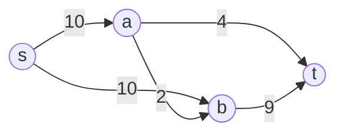

# Maximum Flow

## Prerequisites

- [Graph](../data-structures/graph.md) [Must read] - every max-flow algorithm operates on a directed, capacity-weighted graph; adjacency representation shapes the residual-graph construction.
- [Breadth-First Search (BFS)](./bfs.md) [Must read] - Edmonds-Karp and Dinic both use BFS to explore the residual graph; understand the traversal before the flow-specific rules layered on top.
- [Depth-First Search (DFS)](./dfs.md) [Should read] - the classic Ford-Fulkerson finds augmenting paths via DFS; Dinic uses DFS to find blocking flow within a level graph.

## Table of Contents

- [What it is](#what-it-is)
- [The problem max-flow solves](#the-problem-max-flow-solves)
- [Residual graphs and augmenting paths: the shared mechanic](#residual-graphs-and-augmenting-paths-the-shared-mechanic)
- [The members](#the-members)
- [Comparison](#comparison)
- [Which one when](#which-one-when)
- [Interview soundbite](#interview-soundbite)

> **Hub article.** This page is the survey + decision layer for maximum flow algorithms - it does not trace any single algorithm's implementation in full. Each member (Ford-Fulkerson, Edmonds-Karp, Dinic) has its own page with the full worked example, correctness proof, and implementation. Read this to understand _what a flow network is, why all these algorithms exist, and which one to reach for_; follow a member link for the procedure.

## What it is

**Maximum flow** is the largest amount of "stuff" (water, data, cargo) that can be pushed from a designated source node `s` to a designated sink node `t` through a directed graph where every edge has a capacity limiting how much can flow through it.

Mental model: **a network of pipes.** Each edge is a pipe with a maximum throughput; the source is a pump, the sink is a drain. Every algorithm on this page answers the same question - "how much water per second can I get from the pump to the drain, given the pipes I have?" - by the same core loop: **find a path with spare capacity, push flow through it, repeat until no such path remains.** The algorithms below differ only in _how they search for that path_, and that single choice is what separates a naive exponential-feeling implementation from a provably fast one.

> **Interview soundbite:** "Max-flow = repeatedly find a path with spare capacity from source to sink and push flow through it, until no path remains - and the max-flow min-cut theorem guarantees that's exactly the maximum."

## The problem max-flow solves

Many problems that don't look like "flow" at first are secretly asking for a maximum flow: bipartite matching (who can be paired with whom), edge/vertex-disjoint paths (how many independent routes exist), project selection under prerequisite constraints, image segmentation (foreground/background as a min-cut), and network bandwidth allocation. The reduction pattern is always the same - build a capacity network where "1 unit of flow" represents "1 unit of the thing you're actually counting," then max-flow gives you the answer directly.



In this network, the max flow from `s` to `t` is 13 (push 4 via `s→a→t`, push 9 via `s→b→t`) - every member algorithm on this page, given this exact input, returns 13. What differs between them is **how many steps it takes to get there** and **what guarantee you have on that step count**.

## Residual graphs and augmenting paths: the shared mechanic

Every algorithm below builds and updates the same core structure - the **residual graph** - and repeats the same core loop:

```
while an augmenting path p from s to t exists in the residual graph:
    bottleneck ← min residual capacity along p
    push `bottleneck` units of flow along p
    update the residual graph (reduce forward capacity, increase reverse capacity)
return total flow pushed
```

The subtlety every member shares: pushing flow along `u→v` doesn't just reduce `u→v`'s remaining capacity - it also creates or grows a **reverse edge** `v→u` with capacity equal to the flow just pushed. This reverse edge is what lets a later augmenting path "undo" an earlier greedy choice, and it's the reason the algorithm converges to the true optimum regardless of which augmenting path gets picked first. The **max-flow min-cut theorem** is the formal correctness certificate shared by every member: the algorithm has found the max flow exactly when no augmenting path remains, and at that point, the set of nodes still reachable from `s` in the residual graph defines an s-t cut whose capacity equals the flow found - so no larger flow is possible.

The members differ in **exactly one place**: which strategy they use to find the next augmenting path (or set of paths).

## The members

Each member uses a different path-finding strategy, trading implementation simplicity against a provable speed guarantee:

- **[Ford-Fulkerson](./ford-fulkerson.md)** - the **baseline**. Finds any augmenting path via DFS - simplest to implement, but its runtime is O(E·\|max_flow\|), which depends on the *numeric value* of the max flow, not just the graph size. On graphs with large capacities, this can be catastrophically slow even though the graph itself is tiny.
- **[Edmonds-Karp](./edmonds-karp.md)** - the **disciplined** one. Identical to Ford-Fulkerson except the augmenting path is found via BFS (always shortest path by edge count). That one rule bounds the runtime to O(VE²) - a true polynomial bound, independent of capacity magnitude.
- **[Dinic](./dinic.md)** - the **fast** one. Builds a level graph via BFS, then finds a blocking flow (multiple augmenting paths at once) via DFS within that level graph, repeating until no more levels exist. O(V²E) in general, O(E√V) on unit-capacity graphs (e.g. bipartite matching) - faster than Edmonds-Karp on large or dense graphs.
- **[Bipartite Matching](./bipartite-matching.md)** - not a distinct algorithm but the most common **application**: model a bipartite compatibility graph as a unit-capacity flow network (source → left nodes → right nodes → sink, all capacity 1), and the max flow equals the maximum matching size. Covers the reduction in depth plus the direct (non-flow) Kuhn's/Hopcroft-Karp alternatives.

## Comparison

| Algorithm      | Time                | Space  | Path-finding strategy         | Pick it when…                                                                                    |
| -------------- | -------------------- | ------ | -------------------------------- | ------------------------------------------------------------------------------------------------- |
| Ford-Fulkerson | O(E·\|max_flow\|)    | O(V+E) | DFS, any augmenting path        | Small graph, small guaranteed-small integer capacities - simplicity wins and the bound never bites |
| Edmonds-Karp   | O(VE²)               | O(V+E) | BFS, shortest augmenting path    | Capacities are large or unknown and the graph is small-to-medium - the safe, predictable default   |
| Dinic          | O(V²E), O(E√V) unit-cap | O(V+E) | BFS level graph + DFS blocking flow | Graph is large/dense, or the problem is unit-capacity bipartite matching - worth the extra complexity |

All three compute the **same max-flow value** on any given input - this table is entirely about the runtime guarantee and implementation cost, never about correctness or the answer itself.

## Which one when

- **Small graph, small integer capacities, need the simplest possible code** → **[Ford-Fulkerson](./ford-fulkerson.md)**. The pseudo-polynomial bound is a real risk only when capacities are large relative to the graph; at small scale it's rarely worth the extra BFS bookkeeping.
- **Capacities are large, unknown, or adversarial (the common competitive-programming case)** → **[Edmonds-Karp](./edmonds-karp.md)**. The capacity-independent O(VE²) bound is the textbook-safe default whenever you can't bound the flow value in advance.
- **Graph is large/dense, or the problem is unit-capacity bipartite matching** → **[Dinic](./dinic.md)**. Its blocking-flow-per-level-graph approach amortizes far better than one-BFS-per-augmentation, and its O(E√V) unit-capacity special case makes it the standard choice for matching problems at scale.
- **The problem isn't phrased as "flow" at all but involves "maximum pairs," "maximum disjoint paths," or "feasibility under prerequisite constraints"** → recognize it as a max-flow reduction first, then pick the member above based on graph size and capacity magnitude.

## Interview soundbite

> **(say this out loud):** "Max-flow repeatedly finds a path with spare capacity from source to sink and pushes flow through it until none remains - the max-flow min-cut theorem guarantees that's optimal. Ford-Fulkerson picks any path via DFS and can be slow on large capacities; Edmonds-Karp fixes that by always taking the shortest path via BFS, giving a capacity-independent O(VE²); Dinic goes further with level graphs and blocking flows for large or unit-capacity graphs like bipartite matching."
