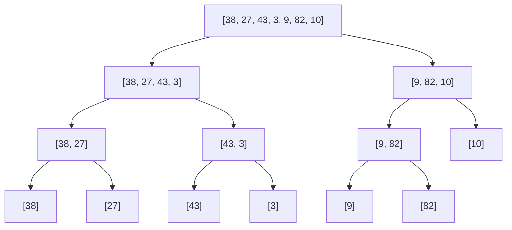
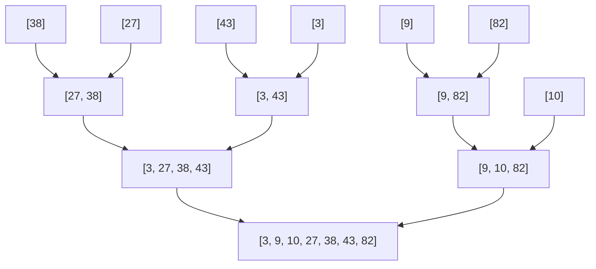

# Merge Sort

## Prerequisites

- **Big-O Notation** [Must read] - merge sort's whole selling point is a _guaranteed_ O(n log n); you can't weigh that against quicksort's average-case bound without complexity. <!-- U9: not-yet-written target — wire to `algorithms/big-o-notation.md` (bracket-link form) once that page exists. -->
- [Array](../data-structures/array.md) [Must read] - merging copies runs into and out of contiguous buffers; the O(n) auxiliary space and the two-pointer walk assume indexable arrays.
- [Sorting](./sorting.md) [Should read] - the hub: where merge sort sits among the six sorts, and the O(n log n) comparison lower bound it achieves.

## Table of Contents

- [Prerequisites](#prerequisites)
- [Table of Contents](#table-of-contents)
- [What it is](#what-it-is)
- [Intuition](#intuition)
- [How it works](#how-it-works)
- [Correctness / invariant](#correctness--invariant)
- [Complexity derivation](#complexity-derivation)
- [Constraints & approach](#constraints--approach)
- [When to use / when not](#when-to-use--when-not)
- [Comparison](#comparison)
- [Loop/recurrence invariant](#looprecurrence-invariant)
- [Edge cases](#edge-cases)
- [Implementation](#implementation)
- [What the interviewer probes for](#what-the-interviewer-probes-for)
- [Practice problems](#practice-problems)
  - [Sort an Array](#1-sort-an-array--merge-sort-from-scratch)
  - [Count of Smaller Numbers After Self](#2-count-of-smaller-numbers-after-self--merge-sort-with-a-counter)
  - [Count Inversions](#3-count-inversions--cross-pair-counting-during-merge)
  - [Merge k Sorted Lists](#4-merge-k-sorted-lists--k-way-merge)

## What it is

**Merge sort** sorts by _divide and conquer_: split the array in half, recursively sort each half, then **merge** the two sorted halves into one sorted whole. The work is all in the merge — combining two already-sorted runs is cheap because you only ever compare their two front elements.

Mental model: **riffling two sorted piles of cards.** You have two face-up stacks, each already in order. Repeatedly take the smaller of the two top cards onto the output. Because both stacks are sorted, the smaller top card is the smallest card overall — so the output comes out sorted, in one linear pass over both piles.

What makes merge sort the one to reach for when guarantees matter: its O(n log n) is the **worst case, not the average** — there is no input that makes it slow — and it is **stable** (equal elements keep their input order). The price is O(n) auxiliary space for the merge buffer, which is also why it's the algorithm of choice for **external sorting**: when the data doesn't fit in RAM, merging sorted chunks streamed from disk is the natural fit.

> **Takeaway (say this out loud):** "Merge sort splits in half, sorts each half, and merges — O(n log n) guaranteed in _all_ cases and stable, paying O(n) extra space; it's the safe choice when quicksort's O(n²) tail is unacceptable."

**Complexity:** O(n log n) time (best = average = worst), O(n) auxiliary space.

## Intuition

Why is merging cheap, and why does halving give `log n` levels? Two separate ideas:

**Merging is linear because sortedness makes the next output obvious.** To merge two sorted runs you never search — the smallest unplaced element is always one of the two run-heads, so a single comparison picks it. Each comparison emits one element, so merging `m` total elements costs O(m). The hard part (deciding global order) was already paid for by the recursion sorting each half.

**Halving gives `log n` levels because you can only halve `n` about `log₂ n` times before hitting size 1.** Level 0 is one array of size `n`; level 1 is two of size `n/2`; level `k` is `2^k` arrays of size `n/2^k`. At every level the merges touch all `n` elements once → O(n) per level. Multiply: `log n` levels × O(n) per level = O(n log n). The genius is that the per-level cost is _constant in `n`_ no matter how deep you are — the arrays get smaller exactly as fast as they get more numerous.

## How it works

A merge sort trace on `a = [38, 27, 43, 3, 9, 82, 10]` runs in two phases: **divide** the array down to singletons, then **conquer** by merging sorted runs back up.

**Phase 1 — Divide:** split each subarray in half until every piece is length 1 (trivially sorted).



**Phase 2 — Conquer (merge):** walk back up, merging each pair of sorted runs into one — this is where the actual ordering happens.



A single merge step, zoomed in — merging `[3, 27, 38, 43]` with `[9, 10, 82]` using two pointers `i`, `j`:

```
L: [3, 27, 38, 43]   R: [9, 10, 82]      out: []
    i                    j
 compare 3 vs 9  → 3   → out: [3]                      i→
 compare 27 vs 9 → 9   → out: [3, 9]                       j→
 compare 27 vs 10 → 10 → out: [3, 9, 10]                   j→
 compare 27 vs 82 → 27 → out: [3, 9, 10, 27]          i→
 compare 38 vs 82 → 38 → out: [3, 9, 10, 27, 38]      i→
 compare 43 vs 82 → 43 → out: [3, 9, 10, 27, 38, 43]  i→ (L empty)
 drain R               → out: [3, 9, 10, 27, 38, 43, 82]
```

Each comparison emits exactly one element and advances one pointer; the **invariant** holds throughout — `out` is sorted, and everything still in `L`/`R` is ≥ everything in `out`.

## Correctness / invariant

Two nested arguments — one for the recursion, one for the merge loop.

**Recurrence invariant (the recursion):** `merge_sort(a)` returns a sorted permutation of `a`.

- _Base case:_ a length-≤1 array is already sorted.
- _Inductive step:_ assume both recursive calls return sorted halves (induction hypothesis). `merge` of two sorted runs is sorted (proven next), and it's a permutation because it places every element of both halves exactly once. By induction on array length, the whole array sorts.

**Loop invariant (the merge):** at the top of each merge iteration, the output `out` is sorted **and** every element remaining in `L[i..]` and `R[j..]` is ≥ every element already in `out`.

- _Initialization:_ `out` is empty — vacuously sorted, nothing violates the ≥ condition.
- _Maintenance:_ we append `min(L[i], R[j])`. Since both runs are sorted, that min is ≤ all remaining elements in both, so appending it keeps `out` sorted and preserves the ≥ condition for the rest.
- _Termination:_ one run empties; draining the other (already sorted, all ≥ `out`) yields a fully sorted `out`.

The `≤` (not `<`) comparison in "take from `L` when `L[i] ≤ R[j]`" is what makes merge sort **stable**: on a tie, the left run's element — which came earlier in the input — is emitted first.

## Complexity derivation

Split into two halves, recurse on each, then an O(n) merge:

```
T(n) = 2·T(n/2) + Θ(n)
```

**Master theorem:** `a = 2, b = 2, f(n) = Θ(n)`. Then `n^(log_b a) = n^(log₂ 2) = n¹ = n`, which matches `f(n)` → **case 2** → `T(n) = Θ(n log n)`.

**By hand (recursion tree):** level `k` has `2^k` subproblems of size `n/2^k`; merge work per subproblem is `Θ(n/2^k)`, so per-level work is `2^k · n/2^k = Θ(n)`. There are `log₂ n + 1` levels. Total `= Θ(n) · log n = Θ(n log n)`.

Best = average = worst, all `Θ(n log n)` — the recurrence has no dependence on input order, so **no input is bad**. That input-independence is exactly what quicksort lacks. **Space:** O(n) for the merge buffer (the standard top-down implementation allocates new lists; even an in-place merge needs O(n) scratch to stay O(n log n) time), plus O(log n) recursion stack.

## Constraints & approach

| Input size `n`   | Expected complexity | What it tells you                                                                                      |
| ---------------- | ------------------- | ------------------------------------------------------------------------------------------------------ |
| `n ≤ 10⁵–10⁶`    | O(n log n)          | Comfortable; merge sort fits with room to spare — pick it when you need the _guarantee_ or stability.  |
| `n ≤ 10⁷–10⁸`    | O(n log n) tight    | The O(n) buffer matters — memory, not time, becomes the constraint vs in-place quicksort/heapsort.     |
| Data exceeds RAM | external O(n log n) | The constraint _invites_ merge sort: sort chunks that fit, then k-way merge the sorted runs from disk. |
| `n ≤ 10`         | anything            | Size rules out caring; library sort or even insertion sort is simpler.                                 |

The senior reading: when the constraint is **"worst case must stay O(n log n)"** or **"stable"** or **"doesn't fit in memory"**, merge sort is the answer; when it's **"minimize extra memory"**, that O(n) buffer pushes you to quicksort or heapsort instead.

## When to use / when not

Reach for merge sort when you need a **guaranteed** O(n log n) (no input can degrade it — unlike [quicksort](./quicksort.md), whose naive pivot is O(n²)), when you need **stability** (equal keys keep input order, essential for multi-key sorts), or when sorting **data too large for RAM** (external merge sort streams sorted runs from disk). It's also the natural sort for **linked lists** — merging needs only sequential access, no random indexing, so a list sorts in O(n log n) with O(1) extra space (no buffer needed; you relink nodes).

Don't use it when **memory is tight** — the O(n) auxiliary buffer is its one real cost; in-place [quicksort](./quicksort.md) (O(log n) space) or heapsort (O(1) space) win there. And for general in-memory arrays where the average case is all that matters, quicksort's smaller constant factor and cache-friendly sequential partitioning usually beat merge sort in wall-clock time despite the identical asymptotic.

Merge sort is the backbone of **external sorting** in databases and big-data frameworks, and the merge half of Python's **Timsort** (which merges insertion-sorted runs).

## Comparison

| Algorithm      | Best    | Average | Worst   | Space    | Stable | Key trait                                      |
| -------------- | ------- | ------- | ------- | -------- | ------ | ---------------------------------------------- |
| **Merge sort** | n log n | n log n | n log n | O(n)     | ✅     | Guaranteed bound; stable; external/linked-list |
| Quicksort      | n log n | n log n | **n²**  | O(log n) | ❌     | In-place, faster constant; O(n²) tail          |
| Heapsort       | n log n | n log n | n log n | O(1)     | ❌     | Worst-case bound + O(1) space; cache-poor      |
| Timsort        | **n**   | n log n | n log n | O(n)     | ✅     | Adaptive (detects runs); Python/Java default   |

The head-to-head that matters: **merge sort vs quicksort**. Identical O(n log n) average, but they trade on three axes — merge sort guarantees the worst case (quicksort's is O(n²) without randomization), is stable (quicksort isn't), and needs O(n) space (quicksort is in-place at O(log n)). So quicksort wins wall-clock for general in-memory arrays (smaller constant, cache-friendly), while merge sort wins whenever the _guarantee_, _stability_, or _external/linked-list_ access pattern is the binding constraint.

Timsort is merge sort's practical descendant: it finds existing sorted runs, extends short ones with insertion sort, then merges — getting merge sort's stability and worst-case bound _plus_ near-O(n) on partially-sorted input.

## Loop/recurrence invariant

The **Search/divide** family signature: split the problem into subproblems of a fixed _fraction_ of the size and recombine. Merge sort and [binary search](./binary-search.md) share the machinery; the difference is the recurrence's `a` (number of recursive calls):

- **Recurrence:** `T(n) = 2·T(n/2) + Θ(n)` → `Θ(n log n)` (Master case 2). Binary search's is `T(n) = 1·T(n/2) + O(1)` → `Θ(log n)` — _one_ recursive call, constant recombine. Merge sort makes _two_ calls and does linear recombine. The two dials (`a` = calls, `f(n)` = recombine cost) fully determine the result.
- **Invariant:** the merge loop's "`out` sorted, remainder ≥ `out`" (proven above) is the local correctness obligation; the recursion's "each call returns sorted" is the global one. Both must hold.
- **Why merge and not partition?** Merge sort does its work on the way _up_ (merge), so each level's split is trivial (`mid`) but recombine is O(n). Quicksort does its work on the way _down_ (partition), so split is O(n) but recombine is trivial (concatenation). Same `2T(n/2)+O(n)` shape, opposite ends — which is why merge sort's cost is input-independent and quicksort's hinges on pivot balance.

## Edge cases

- **Empty / single element** — `len(a) <= 1` returns immediately; this is the recursion base case and must be checked _before_ computing `mid`.
- **Two elements** — splits into two singletons, one merge comparison; smallest cost path, exercises the merge with both runs length 1.
- **One run empties before the other (merge tail)** — when all of `L` is consumed while `R` still has elements (or vice versa), the merge loop exits and the remaining run is appended wholesale (`out.extend(right[j:])`). Forgetting this drain — only emitting while _both_ runs are non-empty — is the classic merge bug: it silently drops the tail. Both an already-sorted half and a reverse-sorted half hit this path (one run drains immediately).
- **Already sorted** — still does the full `Θ(n log n)` work (no early exit) — a real downside vs adaptive Timsort, which detects the sorted run and finishes in O(n). Worth naming: plain merge sort is _not_ adaptive.
- **All-equal elements** — fine and stable; the `≤` tie-break keeps order. Contrast quicksort, which degenerates to O(n²) on all-equal input without 3-way partitioning.
- **Duplicates with stability requirement** — handled correctly by the `≤` comparison; flipping it to `<` silently breaks stability (a subtle bug that passes "is it sorted?" tests but fails multi-key sorts).
- **Overflow (CP-flavored trap)** — `mid = (lo + hi) // 2` overflows in fixed-width languages; use `mid = lo + (hi - lo) // 2`. Harmless in Python's bigints, but interviewers ask and it bites in C++/Java contest code.

## Implementation

**Pseudocode** (CLRS — top-down):

```
MERGE-SORT(A, lo, hi)
 1  if lo < hi
 2      mid ← lo + ⌊(hi − lo) / 2⌋
 3      MERGE-SORT(A, lo, mid)              ▷ sort left half
 4      MERGE-SORT(A, mid + 1, hi)          ▷ sort right half
 5      MERGE(A, lo, mid, hi)               ▷ combine two sorted runs

MERGE(A, lo, mid, hi)
 1  L ← A[lo .. mid]                        ▷ copy out both runs
 2  R ← A[mid + 1 .. hi]
 3  i ← 1; j ← 1; k ← lo
 4  while i ≤ L.length and j ≤ R.length
 5      if L[i] ≤ R[j]                      ▷ ≤ keeps it STABLE (left wins ties)
 6          A[k] ← L[i]; i ← i + 1
 7      else
 8          A[k] ← R[j]; j ← j + 1
 9      k ← k + 1
10  copy any remaining L[i..] / R[j..] into A[k..]
```

**Python** — idiomatic top-down + the contest-velocity reality:

```python
def merge_sort(a: list[int]) -> list[int]:
    """Stable O(n log n), O(n) space. Returns a new sorted list."""
    if len(a) <= 1:                         # base case: 0 or 1 element
        return a
    mid = len(a) // 2
    left, right = merge_sort(a[:mid]), merge_sort(a[mid:])
    return _merge(left, right)


def _merge(left: list[int], right: list[int]) -> list[int]:
    out, i, j = [], 0, 0
    while i < len(left) and j < len(right):
        if left[i] <= right[j]:             # <= → stable (left run wins ties)
            out.append(left[i]); i += 1
        else:
            out.append(right[j]); j += 1
    out.extend(left[i:])                    # exactly one tail is non-empty
    out.extend(right[j:])
    return out


# Contest / real-world velocity: never hand-roll. Timsort is stable, adaptive, O(n log n).
from heapq import merge
merged = list(merge(left, right))            # stdlib merge of two sorted iterables
nums = [38, 27, 43, 3, 9, 82, 10]
nums.sort()                                  # in-place Timsort (a merge-sort descendant)
```

## What the interviewer probes for

- **"Merge sort vs quicksort — when each?"** — Merge sort for a _guaranteed_ O(n log n), stability, or external/linked-list data; quicksort for in-memory arrays where average speed and O(1)-ish space matter. Quicksort's smaller constant usually wins wall-clock; merge sort wins when the O(n²) tail or instability is unacceptable.
- **"What makes it stable, and how would you break it?"** — The `≤` tie-break: on equal keys the left (earlier) run emits first. Change it to `<` and ties flip to right-first — instability. Stability matters when sorting by a secondary key after a primary.
- **"Can you avoid the O(n) space?"** — In-place merge exists but is either O(n log² n) time (block merge) or galloping/complex; the honest interview answer is "not without a real time or complexity cost — if memory is the constraint, switch to heapsort (O(1) space) or quicksort (O(log n))." For a _linked list_, though, merge sort is naturally O(1) extra — you relink nodes, no buffer.
- **"Why is it good for data that doesn't fit in memory?"** — Merging needs only _sequential_ access to each run, so you can stream sorted chunks from disk and merge them with small buffers. That's external merge sort — the standard approach for sorting terabytes.

## Practice problems

### 1. Sort an Array — merge sort from scratch

Sort an integer array in O(n log n) without using the library sort. Constraints: `n ≤ 5·10⁴`, values fit in 32-bit — a direct "implement a sort" prompt that rejects `.sort()`.

**Approach:** Textbook top-down merge sort: recurse to singletons, merge back up with the two-pointer `_merge`. The whole point is demonstrating you can write a correct, stable O(n log n) sort and explain its invariant. Quicksort also passes but risks the O(n²) tail on adversarial test cases; merge sort's guarantee is safer here.

```python
def sort_array(nums: list[int]) -> list[int]:
    if len(nums) <= 1:
        return nums
    mid = len(nums) // 2
    return _merge(sort_array(nums[:mid]), sort_array(nums[mid:]))

def _merge(left: list[int], right: list[int]) -> list[int]:
    out, i, j = [], 0, 0
    while i < len(left) and j < len(right):
        if left[i] <= right[j]:
            out.append(left[i]); i += 1
        else:
            out.append(right[j]); j += 1
    out.extend(left[i:]); out.extend(right[j:])
    return out
```

Time O(n log n), space O(n). Pattern: divide-and-conquer merge sort.

### 2. Count of Smaller Numbers After Self — merge sort with a counter

For each element, count how many elements to its **right** are smaller than it. Return the counts array. Constraints: `n ≤ 10⁵`, so the O(n²) brute force is too slow — the tell for an O(n log n) approach.

**Approach:** Piggyback on merge sort. When merging, an element from the **left** run that is placed _after_ some right-run elements means those right elements were smaller and to its right — count them at merge time. Track original indices so counts land in the right slots. The merge structure gives you the cross-pair information for free.

```python
def count_smaller(nums: list[int]) -> list[int]:
    counts = [0] * len(nums)
    enum = list(enumerate(nums))                 # (orig_index, value)

    def sort(arr):
        if len(arr) <= 1:
            return arr
        mid = len(arr) // 2
        left, right = sort(arr[:mid]), sort(arr[mid:])
        merged, j = [], 0
        for idx, val in left:
            while j < len(right) and right[j][1] < val:
                j += 1                            # right elements smaller than this left value
            counts[idx] += j                      # ...are all to its right
            merged.append((idx, val))
        # standard stable merge to keep the recursion's contract
        return sorted(left + right, key=lambda t: t[1])

    sort(enum)
    return counts
```

Time O(n log n), space O(n). Pattern: merge sort augmented to count cross-pairs.

### 3. Count Inversions — cross-pair counting during merge

Count pairs `(i, j)` with `i < j` but `a[i] > a[j]` (the number of swaps bubble sort would do). Constraints: `n ≤ 10⁵`, O(n²) brute force times out.

**Approach:** Same merge-sort augmentation, counting globally instead of per-element. While merging two sorted halves, when you take an element from the **right** run before exhausting the left, _every_ remaining left-run element forms an inversion with it — add `len(left) - i` in one shot. Inversions split cleanly into within-left + within-right + cross, matching the recursion.

```python
def count_inversions(a: list[int]) -> int:
    def sort_count(arr):
        if len(arr) <= 1:
            return arr, 0
        mid = len(arr) // 2
        left, cl = sort_count(arr[:mid])
        right, cr = sort_count(arr[mid:])
        merged, i, j, cross = [], 0, 0, 0
        while i < len(left) and j < len(right):
            if left[i] <= right[j]:
                merged.append(left[i]); i += 1
            else:
                merged.append(right[j]); j += 1
                cross += len(left) - i            # all remaining left > right[j]
        merged.extend(left[i:]); merged.extend(right[j:])
        return merged, cl + cr + cross
    return sort_count(a)[1]
```

Time O(n log n), space O(n). Pattern: divide-and-conquer inversion counting.

### 4. Merge k Sorted Lists — k-way merge

Merge `k` sorted linked lists into one sorted list. Constraints: `k ≤ 10⁴`, total nodes `≤ 10⁴` per list — naive concatenate-then-sort is O(N log N); the structure invites better.

**Approach:** Generalize the two-way merge to `k` ways. Two options: (a) pairwise-merge lists in a tournament — `log k` rounds, each merging all `N` nodes → O(N log k); or (b) a **min-heap** of the `k` current heads, popping the smallest and pushing its successor → also O(N log k). Both beat re-sorting; the heap version is the cleanest to code and the canonical answer.

```python
import heapq

def merge_k_lists(lists: list[list[int]]) -> list[int]:
    heap = [(lst[0], i, 0) for i, lst in enumerate(lists) if lst]
    heapq.heapify(heap)                           # k heads
    out = []
    while heap:
        val, li, ei = heapq.heappop(heap)
        out.append(val)
        if ei + 1 < len(lists[li]):
            heapq.heappush(heap, (lists[li][ei + 1], li, ei + 1))  # next from same list
    return out
```

Time O(N log k), space O(k) for the heap. Pattern: k-way merge via a min-heap.
