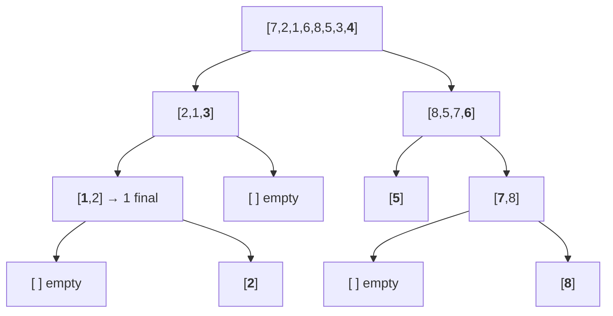

# Quicksort

## Prerequisites

- **Big-O Notation** [Must read] - quicksort's story is "O(n log n) _average_, O(n²) worst"; the gap between average and worst is the whole point, and you can't read it without complexity. <!-- U9: not-yet-written target — wire to `algorithms/big-o-notation.md` (bracket-link form) once that page exists. -->
- [Array](../data-structures/array.md) [Must read] - partitioning swaps elements in place by index; the O(1) extra space and the swap-based loop assume a random-access array.
- [Sorting](./sorting.md) [Should read] - the hub: where quicksort sits among the six sorts and why it's the in-memory default despite the O(n²) tail.
- [Merge Sort](./merge-sort.md) [Should read] - the divide-and-conquer sibling; quicksort does its work in the _split_ (partition), merge sort in the _combine_ (merge) — same recurrence, opposite ends.

## Table of Contents

- [Prerequisites](#prerequisites)
- [Table of Contents](#table-of-contents)
- [What it is](#what-it-is)
- [Intuition](#intuition)
- [How it works](#how-it-works)
- [Correctness / invariant](#correctness--invariant)
- [Complexity derivation](#complexity-derivation)
- [Constraints & approach](#constraints--approach)
- [When to use / when not](#when-to-use--when-not)
- [Comparison](#comparison)
- [Loop/recurrence invariant](#looprecurrence-invariant)
- [Edge cases](#edge-cases)
- [Implementation](#implementation)
- [What the interviewer probes for](#what-the-interviewer-probes-for)
- [Practice problems](#practice-problems)
  - [Sort an Array](#1-sort-an-array--quicksort-with-a-randomized-pivot)
  - [Kth Largest Element](#2-kth-largest-element--quickselect)
  - [Sort Colors](#3-sort-colors--three-way-partition)
  - [Wiggle Sort II](#4-wiggle-sort-ii--quickselect--three-way-partition)

## What it is

**Quicksort** sorts by _divide and conquer_, but it does the work in the **split**: pick a **pivot**, **partition** the array so everything smaller sits left of the pivot and everything larger sits right, then recurse on each side. The pivot lands in its final sorted position after one partition; combining the recursed halves needs no work at all — they're already in place.

Mental model: **sorting papers by repeatedly splitting a pile.** Grab one sheet (the pivot), then toss every other sheet left or right of it by comparison. Now that one sheet is in its final spot, and you have two smaller piles to repeat on. No re-merging — once split, the order is locked.

The trade that defines quicksort: **O(n log n) on average with a tiny constant factor and O(1) extra space**, making it the fastest general-purpose in-memory sort in practice — but a bad pivot gives unbalanced splits and an **O(n²) worst case**. The fix is to pick the pivot well (randomize it, or median-of-three), which makes the worst case astronomically unlikely without changing the average. It is **not stable** — partitioning swaps distant elements, scrambling the order of equal keys.

> **Takeaway (say this out loud):** "Quicksort partitions around a pivot in place — O(n log n) average with a small constant, O(1) space — but a bad pivot is O(n²), so randomize it; it's the in-memory default, not stable."

**Complexity:** O(n log n) average, **O(n²) worst** (mitigated by randomization), O(log n) space (recursion stack).

## Intuition

Why does partitioning give a sort? Because **one partition permanently places one element.** After partitioning around pivot `p`, `p` is at the index where it belongs in the final sorted array — everything left is smaller, everything right is larger, by construction. Nothing later can dislodge it. Recurse on the two sides and every element eventually becomes a pivot in its final spot.

Why is the pivot choice everything? The recurrence is `T(n) = T(left) + T(right) + O(n)`. If the pivot splits evenly, `left ≈ right ≈ n/2` → `2T(n/2) + O(n)` → O(n log n), `log n` levels. If the pivot is always the min or max (e.g. first element of an already-sorted array), one side is empty and the other is `n-1` → `T(n-1) + O(n)` → O(n²), `n` levels. **Same algorithm, the input decides which** — unless you remove the input's power by choosing the pivot _randomly_, so no adversarial ordering can force the bad case.

## How it works

Partition `a = [7, 2, 1, 6, 8, 5, 3, 4]` around pivot `4` (last element), using the **Lomuto** scheme. Pointer `i` marks the boundary of the "≤ pivot" region; `j` scans:

```
pivot = 4 (a[7]).  i starts at 0 (next slot for a small element).

 j=0: a[0]=7 > 4  → skip                  [7 2 1 6 8 5 3 | 4]   i=0
 j=1: a[1]=2 ≤ 4  → swap a[i],a[j], i++    [2 7 1 6 8 5 3 | 4]   i=1
 j=2: a[2]=1 ≤ 4  → swap a[i],a[j], i++    [2 1 7 6 8 5 3 | 4]   i=2
 j=3: a[3]=6 > 4  → skip                   [2 1 7 6 8 5 3 | 4]   i=2
 j=4: a[4]=8 > 4  → skip                   [2 1 7 6 8 5 3 | 4]   i=2
 j=5: a[5]=5 > 4  → skip                   [2 1 7 6 8 5 3 | 4]   i=2
 j=6: a[6]=3 ≤ 4  → swap a[i],a[j], i++    [2 1 3 6 8 5 7 | 4]   i=3
 done: swap pivot into a[i]                [2 1 3 4 8 5 7 6]     pivot at index 3
                                            └──≤4──┘ ↑ └──>4──┘
```

Pivot `4` is now at index `3` — its **final** position. Recurse on `[2, 1, 3]` (left) and `[8, 5, 7, 6]` (right). Each recursive partition places its own pivot, and the array sorts in place with no merge step.

The full recursion (each node = a partition, **bold** = the pivot landing in its final slot; last-element pivot throughout):



Unlike [merge sort](./merge-sort.md)'s always-balanced split, the _shape_ of this tree depends on the data and pivot: a good pivot keeps it bushy and shallow (`log n` deep → O(n log n)); a bad pivot (always the min/max) makes it a degenerate chain (`n` deep → O(n²)). The tree's height **is** the running time.

## Correctness / invariant

**Partition invariant (the loop):** during the scan with boundary `i` and cursor `j`, the array is kept in three zones — `a[lo .. i-1]` all **≤ pivot**, `a[i .. j-1]` all **> pivot**, and `a[j .. hi-1]` unexamined.

- _Initialization:_ `i = j = lo` — both the ≤ and > zones are empty, invariant holds.
- _Maintenance:_ if `a[j] > pivot`, it joins the > zone (just advance `j`). If `a[j] ≤ pivot`, swap it with `a[i]` (the first > element) and advance both — the ≤ zone grows by one, the > zone shifts right by one, both still correct.
- _Termination:_ `j` reaches `hi`; swapping the pivot into `a[i]` places it exactly between the two zones. Everything left is ≤, everything right is >, so the pivot is in its final sorted index.

**Recurrence invariant (the recursion):** after partition, the pivot is final and the two sides are independent subarrays containing exactly the elements that belong there. Sorting each (induction hypothesis) sorts the whole, since the pivot already separates them. By induction on subarray size, quicksort sorts.

## Complexity derivation

Partition is `Θ(n)` (one pass). The recurrence depends entirely on how balanced the split is:

```
T(n) = T(k) + T(n − 1 − k) + Θ(n)     where k = size of the left side
```

- **Best / balanced** (`k ≈ n/2`): `T(n) = 2·T(n/2) + Θ(n)` → **Master case 2** → `Θ(n log n)`. `log n` levels, O(n) per level.
- **Worst** (`k = 0` or `k = n-1`, pivot always extreme — e.g. sorted input, first/last pivot): `T(n) = T(n−1) + Θ(n) = Θ(n²)`. `n` levels, each doing O(n) — the recursion tree degenerates to a chain.

**Average case** (random pivot): with a randomly chosen pivot every split is expected to be "good enough" — the expected number of comparisons solves to `≈ 1.39 n log₂ n`, i.e. `Θ(n log n)`. The intuition: a random pivot lands in the middle half of the range with probability ½, and a constant fraction of "decent" splits is enough to keep depth `O(log n)` in expectation. Randomization makes the O(n²) case depend on _coin flips, not input_ — no adversary can force it.

**Space:** O(log n) for the recursion stack on balanced splits; O(n) stack in the worst case unless you recurse into the **smaller** side first and loop on the larger (tail-call elimination → guaranteed O(log n) stack).

## Constraints & approach

| Input size `n`               | Expected complexity | What it tells you                                                                                      |
| ---------------------------- | ------------------- | ------------------------------------------------------------------------------------------------------ |
| `n ≤ 10⁵–10⁶`                | O(n log n) average  | Quicksort's home turf — fastest constant factor, O(1) extra space; randomize the pivot and ship.       |
| `n ≤ 10⁷–10⁸`                | O(n log n) tight    | The in-place O(1) space matters vs merge sort's O(n) buffer — quicksort fits where merge sort can't.   |
| Adversarial / sorted input   | needs randomization | A naive pivot is O(n²); the constraint _demands_ a random or median-of-three pivot to stay O(n log n). |
| "Find the k-th element only" | O(n) average        | Don't sort — **quickselect** (partition toward one index) is the partial-sort specialization.          |

The senior reading: quicksort is the default _unless_ the constraint says "worst case must be O(n log n)" (→ merge/heap) or "stable" (→ merge). If it says "k-th / top-k / median," that's the quickselect signal, not full sorting.

## When to use / when not

Reach for quicksort as the **default in-memory array sort** when average-case speed matters and the worst case is tolerable or defended with randomization — its small constant factor and cache-friendly sequential partitioning make it the fastest comparison sort in practice. It's what C++'s `std::sort` uses (as introsort, which switches to heapsort if recursion goes too deep, capping the worst case). Reach for **quickselect** — the one-sided form — when you need the **k-th smallest/largest or the median** without a full sort: O(n) average instead of O(n log n).

Don't use plain quicksort when you need a **guaranteed** O(n log n) (its O(n²) tail rules it out for hard real-time or adversarial inputs — use [merge sort](./merge-sort.md) or heapsort) or when you need **stability** (equal keys get reordered by the swaps — use merge sort). And avoid the naive first/last-element pivot on data that may arrive sorted: it triggers the worst case exactly when you'd least expect it.

Quicksort (as introsort) is the backbone of **`std::sort`** in C++ and the partition step is reused in **quickselect** for median-finding and **3-way partitioning** for Dutch-flag problems.

## Comparison

| Algorithm     | Best    | Average | Worst   | Space    | Stable | Key trait                                       |
| ------------- | ------- | ------- | ------- | -------- | ------ | ----------------------------------------------- |
| **Quicksort** | n log n | n log n | **n²**  | O(log n) | ❌     | In-place, smallest constant; O(n²) tail         |
| Merge sort    | n log n | n log n | n log n | O(n)     | ✅     | Guaranteed bound; stable; needs O(n) buffer     |
| Heapsort      | n log n | n log n | n log n | O(1)     | ❌     | Worst-case bound + O(1) space; cache-unfriendly |
| Introsort     | n log n | n log n | n log n | O(log n) | ❌     | Quicksort + heapsort fallback — best of both    |

Introsort is the practical answer to quicksort's flaw: run quicksort, but if recursion depth exceeds `~2 log n` (a sign the pivot is going bad), switch that branch to heapsort. You keep quicksort's average speed _and_ get a worst-case O(n log n) guarantee — which is why it's the C++ standard-library sort.

## Loop/recurrence invariant

The **Search/divide** family, doing its work on the way _down_ (partition) rather than up (merge):

- **Recurrence:** `T(n) = T(k) + T(n−1−k) + Θ(n)`. Balanced (`k ≈ n/2`) → `2T(n/2)+Θ(n)` → `Θ(n log n)`; degenerate (`k = 0`) → `T(n−1)+Θ(n)` → `Θ(n²)`. Unlike [merge sort](./merge-sort.md), whose split is always perfectly balanced (`mid`), quicksort's balance is **data-dependent** — that's the entire source of the O(n²) tail.
- **Invariant:** the three-zone partition invariant (≤ / > / unexamined) is the local correctness obligation; "pivot ends final, sides independent" is the global one.
- **Why partition and not merge?** Merge sort pays O(n) to _combine_ and gets a free split; quicksort pays O(n) to _split_ and gets a free combine. The asymmetry is why merge sort's cost is input-independent (`mid` is always balanced) and quicksort's hinges on the pivot — and why quickselect can prune to _one_ side (`T(n)=T(n/2)+O(n)`→O(n)), which merge sort can't, since merge sort's information is created in the combine, not the split.

## Edge cases

- **Empty / single element** — `lo >= hi` returns immediately; the recursion base case, checked before partitioning.
- **Already sorted / reverse sorted** — the classic O(n²) trap with a first/last-element pivot (every split is maximally unbalanced). **Randomized or median-of-three pivot fixes it** — the single most important quicksort hardening, and the senior-depth point here.
- **All-equal elements** — a _catastrophe_ for two-way partitioning: every element equals the pivot, splits go 0/(n-1), → O(n²). The fix is **3-way partitioning** (Dutch National Flag): segment into `< p`, `== p`, `> p` and recurse only on the unequal parts → O(n) on all-equal input. (See practice problem 3.)
- **Duplicates generally** — even non-degenerate, heavy duplicates favor 3-way partitioning; it's the standard production choice (`std::sort` and Sedgewick's quicksort both use a duplicate-aware partition).
- **Stack overflow on worst case** — naive recursion is O(n) stack depth in the worst case. Recurse into the **smaller** partition and loop on the larger (tail elimination) to cap stack at O(log n) — a real bug in contest code on `n = 10⁶` sorted input.
- **Overflow (CP-flavored trap)** — `mid = (lo + hi) // 2` when computing a median-of-three pivot index overflows in fixed-width languages; use `lo + (hi - lo) // 2`. Harmless in Python's bigints.

## Implementation

**Pseudocode** (CLRS — Lomuto partition, last element pivot):

```
QUICKSORT(A, lo, hi)
 1  if lo < hi
 2      p ← PARTITION(A, lo, hi)            ▷ p = pivot's final index
 3      QUICKSORT(A, lo, p − 1)             ▷ sort ≤ side
 4      QUICKSORT(A, p + 1, hi)             ▷ sort > side

PARTITION(A, lo, hi)
 1  pivot ← A[hi]                           ▷ choose last as pivot
 2  i ← lo − 1                              ▷ boundary of the ≤ zone
 3  for j ← lo to hi − 1
 4      if A[j] ≤ pivot
 5          i ← i + 1
 6          swap A[i] A[j]                  ▷ grow the ≤ zone
 7  swap A[i + 1] A[hi]                     ▷ drop pivot between the zones
 8  return i + 1
```

**Python** — idiomatic, with a randomized pivot (the essential hardening) and the contest-velocity reality:

```python
import random


def quicksort(a: list[int]) -> None:
    """In-place, average O(n log n). Randomized pivot avoids the O(n²) tail."""
    def sort(lo: int, hi: int) -> None:
        while lo < hi:                          # loop on larger side → O(log n) stack
            p = partition(lo, hi)
            if p - lo < hi - p:                 # recurse into the SMALLER side
                sort(lo, p - 1)
                lo = p + 1
            else:
                sort(p + 1, hi)
                hi = p - 1

    def partition(lo: int, hi: int) -> int:
        r = random.randint(lo, hi)              # randomize → no adversarial O(n²)
        a[r], a[hi] = a[hi], a[r]
        pivot, i = a[hi], lo - 1
        for j in range(lo, hi):
            if a[j] <= pivot:
                i += 1
                a[i], a[j] = a[j], a[i]
        a[i + 1], a[hi] = a[hi], a[i + 1]
        return i + 1

    sort(0, len(a) - 1)


# Contest / real-world velocity: you call the library sort (introsort/Timsort), not this.
nums = [7, 2, 1, 6, 8, 5, 3, 4]
nums.sort()                                     # CPython: Timsort; C++ std::sort: introsort
```

## What the interviewer probes for

- **"What's quicksort's worst case and how do you avoid it?"** — O(n²) when the pivot is always extreme (sorted input + first/last pivot). Avoid it by **randomizing the pivot** or median-of-three, which makes the bad case depend on randomness, not input. Production code uses introsort: fall back to heapsort if recursion gets too deep.
- **"Quicksort vs merge sort?"** — Quicksort: in-place (O(log n) space), smaller constant, faster in practice — but O(n²) tail and not stable. Merge sort: guaranteed O(n log n), stable, but O(n) space. Pick merge for guarantees/stability/external data, quick for raw in-memory speed.
- **"Why is it not stable, and can you make it?"** — Partitioning swaps distant equal elements, breaking input order. Making it stable requires extra space (then you've basically reinvented merge sort), so in practice "stable + fast" means merge sort / Timsort.
- **"How would you find the median without sorting?"** — **Quickselect**: partition, but recurse into only the side containing the median index → O(n) average. The same partition primitive, pruned to one side.
- **"All elements are equal — what happens?"** — Two-way partition degenerates to O(n²). Use **3-way partitioning** (`< = >`), which handles duplicates in O(n) and is the standard production partition.

## Practice problems

### 1. Sort an Array — quicksort with a randomized pivot

Sort an integer array in O(n log n) average without the library sort. Constraints: `n ≤ 5·10⁴`, and test suites often include **already-sorted** and **all-equal** inputs specifically to punish naive pivots.

**Approach:** Quicksort with a **randomized pivot** and recursion into the smaller side. The randomization is not optional here — a fixed first/last pivot times out on the adversarial sorted-input cases. For robustness against heavy duplicates, a 3-way partition (problem 3) is even safer, but randomized 2-way passes.

```python
import random

def sort_array(nums: list[int]) -> list[int]:
    def sort(lo, hi):
        if lo >= hi:
            return
        r = random.randint(lo, hi)
        nums[r], nums[hi] = nums[hi], nums[r]
        pivot, i = nums[hi], lo - 1
        for j in range(lo, hi):
            if nums[j] <= pivot:
                i += 1
                nums[i], nums[j] = nums[j], nums[i]
        nums[i + 1], nums[hi] = nums[hi], nums[i + 1]
        sort(lo, i); sort(i + 2, hi)
    sort(0, len(nums) - 1)
    return nums
```

Time O(n log n) average / O(n²) worst (randomization-mitigated), space O(log n). Pattern: randomized quicksort.

### 2. Kth Largest Element — quickselect

Find the k-th largest element in an unsorted array. Constraints: `n ≤ 10⁵`, expected O(n) — so a full sort (O(n log n)) is the "works but not optimal" answer.

**Approach:** **Quickselect** — quicksort that recurses into only the side containing the target index. Partition around a random pivot; the pivot lands at its final index `p`. If `p` is the target, return it; else recurse into the single side that contains the target. Pruning to one side gives `T(n)=T(n/2)+O(n)` → O(n) average.

```python
import random

def find_kth_largest(nums: list[int], k: int) -> int:
    target = len(nums) - k                      # k-th largest = (n-k)-th smallest index
    lo, hi = 0, len(nums) - 1
    while lo <= hi:
        r = random.randint(lo, hi)
        nums[r], nums[hi] = nums[hi], nums[r]
        pivot, i = nums[hi], lo
        for j in range(lo, hi):
            if nums[j] < pivot:
                nums[i], nums[j] = nums[j], nums[i]; i += 1
        nums[i], nums[hi] = nums[hi], nums[i]
        if i == target:
            return nums[i]
        elif i < target:
            lo = i + 1                          # recurse right only
        else:
            hi = i - 1                          # recurse left only
```

Time O(n) average / O(n²) worst, space O(1). Pattern: quickselect (one-sided quicksort).

### 3. Sort Colors — three-way partition

Sort an array of `0`s, `1`s, `2`s in-place, one pass, O(1) space. Constraints: `n ≤ 300`, exactly 3 distinct keys — the tell for a single 3-way partition, not a general sort.

**Approach:** This _is_ quicksort's partition with a fixed pivot value (1) and three regions — the **Dutch National Flag**. Three pointers: `low` (boundary of 0s), `mid` (cursor), `high` (boundary of 2s). Swap each element into its region as `mid` sweeps. It's also the cure for quicksort's all-equal O(n²) degeneracy, demonstrated standalone.

```python
def sort_colors(nums: list[int]) -> None:
    low, mid, high = 0, 0, len(nums) - 1
    while mid <= high:
        if nums[mid] == 0:
            nums[low], nums[mid] = nums[mid], nums[low]
            low += 1; mid += 1
        elif nums[mid] == 1:
            mid += 1
        else:                                   # == 2
            nums[mid], nums[high] = nums[high], nums[mid]
            high -= 1                            # don't advance mid: swapped-in value unchecked
```

Time O(n), space O(1). Pattern: 3-way partition (Dutch National Flag).

### 4. Wiggle Sort II — quickselect + three-way partition

Reorder an array so `a[0] < a[1] > a[2] < a[3] …` (strictly alternating). Constraints: `n ≤ 5·10⁴`; duplicates near the median make the naive interleave fail, so this composes two quicksort primitives.

**Approach:** Find the **median** with quickselect (O(n)), 3-way-partition around it so equal-to-median values cluster, then place the larger half and smaller half into alternating index positions (odd indices first, descending, to keep equal medians apart). It's the hardest because the duplicate handling — separating equal medians to opposite ends — is exactly why a plain sort-and-interleave breaks.

```python
def wiggle_sort(nums: list[int]) -> None:
    n = len(nums)
    median = find_kth_largest(nums, (n + 1) // 2)        # quickselect, problem 2
    # virtual index map: odd positions first (desc), then even (desc)
    def idx(i: int) -> int:
        return (2 * i + 1) % (n | 1)
    left, i, right = 0, 0, n - 1                          # 3-way partition on virtual indices
    while i <= right:
        if nums[idx(i)] > median:
            nums[idx(left)], nums[idx(i)] = nums[idx(i)], nums[idx(left)]
            left += 1; i += 1
        elif nums[idx(i)] < median:
            nums[idx(i)], nums[idx(right)] = nums[idx(right)], nums[idx(i)]
            right -= 1
        else:
            i += 1
```

Time O(n) average, space O(1). Pattern: quickselect for the median + 3-way partition on a virtual index map.
