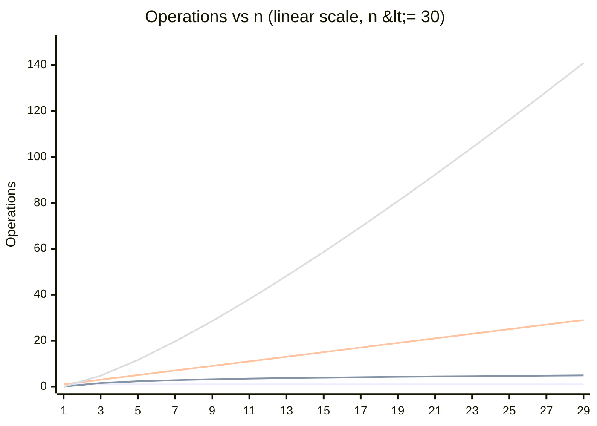
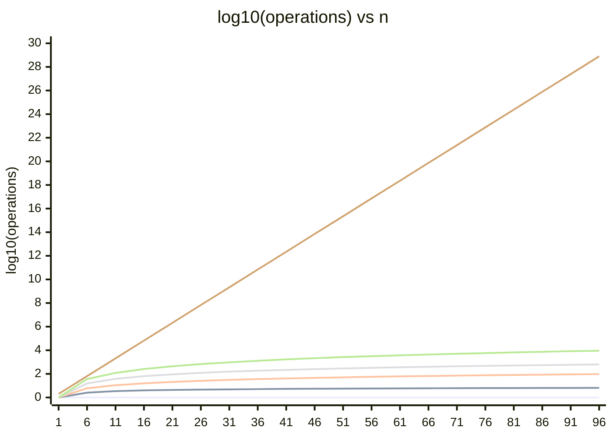

# Complexity Growth Reference Cheatsheet

How bad is O(n²) actually, at real n - growth classes side by side.

> 📖 Full articles:
> [Sorting](../algorithms/sorting.md) · [Dynamic Programming](../algorithms/dynamic-programming.md)

## Growth curve - true shape (small n, linear y-axis)

Actual operation counts, n = 1 to 30, O(n²) and O(2ⁿ) excluded (both dwarf the others at this scale and are already off-scale by n = 30 - see the log chart below, and the table further down for exact values). O(n) is honestly straight here; a log axis would bend it.

**Legend** (top-to-bottom = plot order = default line-color order): O(1) → O(log n) → O(n) → O(n log n). At n = 30: O(1) is flat at 1, O(log n) ≈ 5 (lowest rising line), O(n) = 30 (straight diagonal), O(n log n) ≈ 147 (steepest, highest line).

## Growth curve - full range (log y-axis)

Mermaid's xychart-beta has no true log-axis, so the y-axis plots **log₁₀(operation count)** directly - read 1 as 10 ops, 2 as 100 ops, 3 as 1,000 ops, and so on. This is what makes O(2ⁿ) fit next to the rest at all, but it bends every straight/near-straight line (O(n), O(n log n)) into a curve - only the relative gap between lines matters here, not their shape. n = 1 to 100:

**Legend** (top-to-bottom = plot order = default line-color order): O(1) → O(log n) → O(n) → O(n log n) → O(n²) → O(2ⁿ). At n = 100: O(1) is flat at 0, O(log n) ≈ 0.8, O(n) = 2, O(n log n) ≈ 2.8, O(n²) = 4, O(2ⁿ) ≈ 30 (the line that shoots off the top).

O(2ⁿ) already needs 30+ on this log scale by n = 100 (that's 10³⁰ operations) - it separates from every other curve within the first ~20-30 steps and keeps climbing while the rest flatten out.

## Operation count at real n

| n | O(log n) | O(n) | O(n log n) | O(n²) | O(2ⁿ) |
| --- | --- | --- | --- | --- | --- |
| 10 | 3 | 10 | 33 | 100 | 1,024 |
| 100 | 7 | 100 | 664 | 10,000 | astronomical |
| 1,000 | 10 | 1,000 | 9,966 | 1,000,000 | astronomical |
| 10⁵ | 17 | 100,000 | 1,660,964 | 10¹⁰ | astronomical |
| 10⁶ | 20 | 1,000,000 | 19,931,569 | 10¹² | astronomical |

## Gut check

| Complexity | ~1 second budget (10⁸-10⁹ ops) fits n up to |
| --- | --- |
| O(2ⁿ) | ~20-25 |
| O(n²) | ~10⁴ |
| O(n log n) | ~10⁶-10⁷ |
| O(n) | ~10⁸ |
| O(log n) | any n |

## Gotchas

- ⚠️ O(n²) at n = 10⁵ is already 10¹⁰ operations - looks "just quadratic" on paper but is unusably slow (~10s+) well before n reaches 10⁶.
- ⚠️ O(2ⁿ) is fine at n ≤ 20-22 but doubles with every added element - n = 30 is already ~10⁹, n = 40 is ~10¹².
