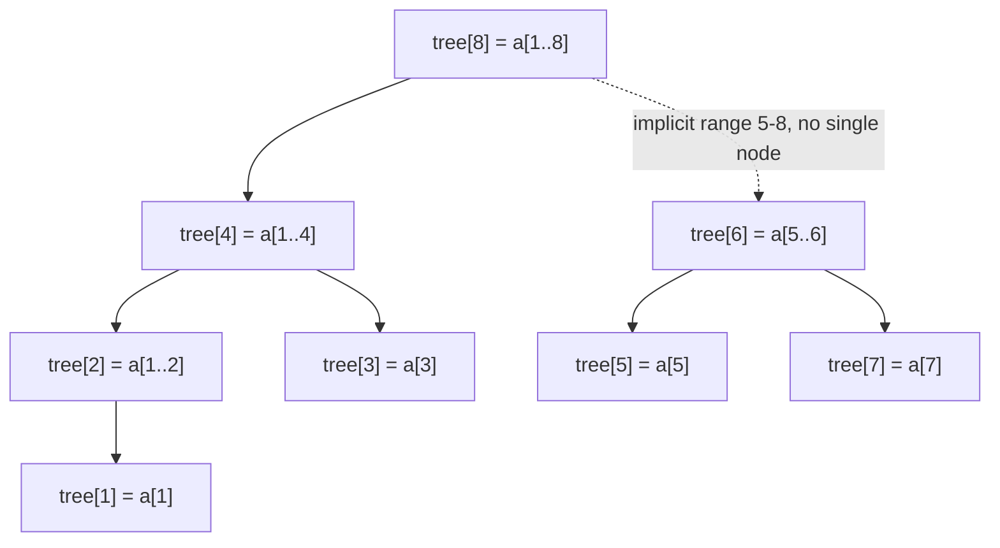

# Fenwick Tree

## Prerequisites

- **Big-O Notation** [Must read] - the whole point of a Fenwick tree is trading O(n) prefix-sum recomputation for O(log n) update + query; you need the cost model to see why that matters. <!-- U9: not-yet-written target - wire to `algorithms/big-o-notation.md` once that page exists. -->
- [Array](./array.md) [Must read] - a Fenwick tree **is** an array; every "tree" operation is index arithmetic over a flat array, no pointers.
- [Prefix Sum](../patterns/prefix-sum.md) [Must read] - a Fenwick tree solves exactly the problem prefix sums solve, but with fast point updates; you need to feel the O(n) rebuild cost prefix sums pay to see what this fixes.
- [Segment Tree](./segment-tree.md) [Should read] - the more general range-query structure Fenwick specializes; seeing both clarifies what Fenwick trades away for its smaller constant.
- [Bit Manipulation](../algorithms/bit-manipulation.md) [Should read] - every Fenwick operation is a bitwise trick (`i & -i`) that isolates the lowest set bit; the structure is unreadable without it.

## Table of Contents

- [Prerequisites](#prerequisites)
- [Table of Contents](#table-of-contents)
- [What it is](#what-it-is)
- [How it works](#how-it-works)
- [Operations](#operations)
- [Complexity summary](#complexity-summary)
- [When to use / when not](#when-to-use--when-not)
- [Comparison](#comparison)
- [Variants](#variants)
- [Traversal & invariant](#traversal--invariant)
  - [The `i & -i` isolation trick](#the-i---i-isolation-trick)
  - [Why prefix sum decomposes into O(log n) pieces](#why-prefix-sum-decomposes-into-olog-n-pieces)
  - [Update walks the same tree upward](#update-walks-the-same-tree-upward)
- [Implementation](#implementation)
- [CP-primitives](#cp-primitives)
  - [Range update, point query (difference array + BIT)](#range-update-point-query-difference-array--bit)
  - [Range update, range query (two BITs)](#range-update-range-query-two-bits)
  - [BIT as an order-statistics structure (count inversions / k-th element)](#bit-as-an-order-statistics-structure-count-inversions--k-th-element)
- [Gotchas / edge cases](#gotchas--edge-cases)
- [What the interviewer probes for](#what-the-interviewer-probes-for)
- [Practice problems](#practice-problems)
  - [Range Sum Query - Mutable](#1-range-sum-query---mutable--point-update-range-query)
  - [Count of Smaller Numbers After Self](#2-count-of-smaller-numbers-after-self--bit-as-order-statistics)
  - [Range Sum Query - Range Update and Range Sum](#3-range-sum-query---range-update-and-range-sum--two-bits)

## What it is

A **Fenwick tree** (a.k.a. **Binary Indexed Tree / BIT**) is a flat array that supports **point update** and **prefix-sum query** in **O(log n)** each, by having each index implicitly "own" a range of elements whose size is determined by the index's lowest set bit.

Mental model: **a tree hiding inside an array, wired by binary arithmetic instead of pointers.** Index `i` doesn't store one element - it stores the sum of a range ending at `i`, and the range's length is exactly `i`'s lowest set bit (`i & -i`). Querying a prefix sum means jumping through O(log n) of these ranges by stripping the lowest set bit each step; updating one element means propagating the change upward through the O(log n) ranges that contain it, by adding the lowest set bit each step. Same bit trick, opposite direction.

> **Takeaway (say this out loud):** "A Fenwick tree turns O(n) prefix-sum-after-update into O(log n) update and O(log n) query, using nothing but `i & -i` to walk implicit ranges in an array - a segment tree's little sibling, half the code, half the memory, sums-only."

## How it works

Underneath, a Fenwick tree is one array `tree[1..n]` (**1-indexed - this is load-bearing, not a style choice**). `tree[i]` holds the sum of a range of the original array ending at index `i`, whose **length is `i`'s lowest set bit**. That single fact generates the entire structure:

```
Original array (1-indexed): a[1] a[2] a[3] a[4] a[5] a[6] a[7] a[8]

i=1 (0b0001, lowbit=1): tree[1] = a[1]                    range length 1
i=2 (0b0010, lowbit=2): tree[2] = a[1]+a[2]                range length 2
i=3 (0b0011, lowbit=1): tree[3] = a[3]                     range length 1
i=4 (0b0100, lowbit=4): tree[4] = a[1]+a[2]+a[3]+a[4]      range length 4
i=5 (0b0101, lowbit=1): tree[5] = a[5]                     range length 1
i=6 (0b0110, lowbit=2): tree[6] = a[5]+a[6]                range length 2
i=7 (0b0111, lowbit=1): tree[7] = a[7]                     range length 1
i=8 (0b1000, lowbit=8): tree[8] = a[1]+...+a[8]            range length 8
```

As a tree, node `i`'s "children" are the nodes covering the sub-ranges that make up `i`'s range - e.g. `tree[8]`'s span `[1,8]` decomposes into `tree[4]`'s `[1,4]` and would-be `[5,8]`, itself decomposing further:



This tree is never built as pointers - it's implicit in the index arithmetic. **Query** `prefix_sum(i)` sums `tree[i]`, then jumps to `i - lowbit(i)` and repeats until `i` hits 0 - each jump strips the lowest set bit, so it terminates in at most `log₂ n` steps (the number of set bits in `i`'s binary form, bounded by its bit-length). **Update** `add(i, delta)` adds `delta` to `tree[i]`, then jumps to `i + lowbit(i)` and repeats until `i` exceeds `n` - each jump climbs to the next range that also covers index `i`, terminating in at most `log₂ n` steps.

## Operations

| Operation                  | Time     | Space |
| --------------------------- | -------- | ----- |
| Build from array (naive)    | O(n log n) | O(n)  |
| Build from array (linear)   | O(n)     | O(n)  |
| Point update (`add`)        | O(log n) | O(1)  |
| Prefix sum query (`query`)  | O(log n) | O(1)  |
| Range sum query (`l..r`)    | O(log n) | O(1)  |
| Point query (read one value)| O(log n) | O(1)  |

## Complexity summary

| Operation      | Best     | Average  | Worst    |
| -------------- | -------- | -------- | -------- |
| Update          | O(log n) | O(log n) | O(log n) |
| Prefix query    | O(log n) | O(log n) | O(log n) |
| Range query     | O(log n) | O(log n) | O(log n) |
| Space           | O(n)     | O(n)     | O(n)     |

No amortization here - every operation is a **hard O(log n)** in all cases, because the number of set bits an index walks through is bounded by its bit-length regardless of data. This determinism (no worst-case cliff, unlike a resizing dynamic array) is part of why it's a CP favorite: no surprise spikes mid-contest.

## When to use / when not

**Reach for a Fenwick tree when:**

- You need **prefix-sum queries interleaved with point updates** on an array - the exact "mutable range sum" shape. A plain [prefix sum](../patterns/prefix-sum.md) array is O(1) query but O(n) to fix after any update; Fenwick trades a little query speed for O(log n) updates.
- The query is a **sum (or any invertible/associative op)** - not min/max. Sum, XOR, and product (with care for zeros) all work because the decomposition can be "undone" going the other direction; min/max cannot be undone, so a plain Fenwick can't support point-update-range-min without extra machinery (a [segment tree](./segment-tree.md) can).
- You want the **smallest, fastest implementation** for range-sum - a Fenwick tree is ~10 lines, one array, no recursion, roughly **2-3x less memory and a smaller constant factor** than an equivalent segment tree, because it has no explicit tree nodes or recursive call overhead.

**Reach for something else when:**

- You need **range min/max/gcd queries** or arbitrary non-invertible aggregates → a [segment tree](./segment-tree.md); it supports any associative operation, invertible or not.
- You need **range assignment / lazy range updates with range queries** beyond the two-BIT trick (e.g. "set every element in `[l,r]` to `x`, then query range sum") → a segment tree with **lazy propagation**; Fenwick's range-update tricks only extend cleanly to additive updates.
- The array is **static** (no updates after the initial build) → a plain [prefix sum](../patterns/prefix-sum.md) array; O(1) query beats O(log n) when there's nothing to keep in sync.
- You need to query **arbitrary subtree/2D regions with complex shapes** → a segment tree (2D Fenwick exists but a 2D segment tree or offline sweep is often more natural).

Real-world: order-statistics / "count of elements less than X seen so far" powers **leaderboard rank queries** in real-time ranking systems, and BIT-backed prefix sums show up in **inventory/analytics dashboards** doing rolling-window aggregates over frequently-updated counters. At scale, the failure mode is **coordinate range**: a Fenwick tree is sized to the key range, not the data count - sparse keys over a huge range (e.g. summing over timestamps spanning years at millisecond resolution) force **coordinate compression** first, or the array itself becomes the bottleneck.

## Comparison

| Structure                          | Point update | Prefix/range sum | Range min/max | Space          | Constant factor | Pick it when…                                                      |
| ----------------------------------- | ------------- | ----------------- | -------------- | -------------- | ---------------- | -------------------------------------------------------------------- |
| **Fenwick tree (BIT)**              | O(log n)      | O(log n)          | no (sum-only\*) | O(n)            | small, no recursion | sum/XOR range queries with point updates - simplest and fastest to code |
| [Segment tree](./segment-tree.md)   | O(log n)      | O(log n)          | **yes**         | O(4n) typical   | larger (recursion, node overhead) | need min/max/gcd, or lazy range updates + range queries               |
| [Prefix sum array](../patterns/prefix-sum.md) | O(n) rebuild | **O(1)**          | no              | O(n)            | trivial           | array is **static** - no updates after build, query-only workload    |
| Plain array (rescan each query)     | **O(1)**      | O(n)               | O(n)            | O(n)            | trivial           | updates are frequent, queries are rare (opposite of Fenwick's sweet spot) |

\*A Fenwick tree over min/max is possible only with restrictions (e.g. updates strictly decrease the value) - it loses the general point-update guarantee, unlike a segment tree. The crossover: with **q queries and u updates**, Fenwick/segment tree win once `u ≥ 1` and `q ≥ log n` - below that (pure static, all queries), a prefix-sum array's O(1) query is unbeatable and the log-n structures are pure overhead.

## Variants

- **[Segment tree](./segment-tree.md)** - the general-purpose superset: any associative op, lazy propagation for range updates. Fenwick is what you reach for when you only need sums and want less code.
- **BIT for range update + point query** - store the **difference array** in the BIT instead of the raw array; a range update becomes two point updates, a point query becomes a prefix-sum query. One-line inversion of what BIT normally does - full treatment in [CP-primitives](#range-update-point-query-difference-array--bit).
- **BIT for range update + range query** - two BITs combined algebraically to support both in O(log n) - see [CP-primitives](#range-update-range-query-two-bits).
- **2D Fenwick tree (BIT of BITs)** - each "node" of the outer BIT is itself a BIT over the second dimension; supports 2D prefix-sum with point updates in O(log n · log m). Used for grid range-sum-with-updates (e.g. live heatmap queries).
- **BIT as order statistics (Fenwick over frequency)** - index the BIT by **value** rather than array position, storing counts; prefix-sum then answers "how many elements ≤ x" and, with binary lifting over the tree, "find the k-th smallest" in O(log n) - see [CP-primitives](#bit-as-an-order-statistics-structure-count-inversions--k-th-element).

## Traversal & invariant

The entire structure rests on one bitwise operation and one invariant it maintains: **`tree[i]` always equals the sum of exactly `lowbit(i)` original elements ending at `i`.**

### The `i & -i` isolation trick

`i & -i` isolates the **lowest set bit** of `i`. In two's-complement, `-i` is `~i + 1` - flip every bit of `i` and add 1. Flipping turns every trailing `0` into `1` and the lowest `1` into `0`; adding 1 turns those trailing `1`s back into `0`s and carries into the bit that was originally the lowest `1`. ANDing `i` with `-i` cancels every bit except that one:

```
i  = 0b01100   (12)
-i = 0b10100   (two's complement negation)
i & -i = 0b00100  = 4   ← lowbit(12) = 4
```

This single expression is what makes both operations O(log n): every step strips (query) or adds (update) exactly one bit, so at most `log₂ n` steps run before `i` hits 0 or exceeds `n`.

### Why prefix sum decomposes into O(log n) pieces

Any integer `i` in binary is a sum of at most `log₂ i` powers of two (its set bits). `query(i)` walks `i → i - lowbit(i) → ...` - each jump removes the current lowest set bit, so the walk visits exactly as many nodes as `i` has set bits, **at most `⌊log₂ n⌋ + 1`**. Each visited `tree[j]` covers a range that exactly tiles a slice of `[1, i]` with no overlap and no gap - the binary representation of `i` **is** the partition of `[1,i]` into power-of-two blocks.

```
query(13) where 13 = 0b1101 = 8 + 4 + 1:
  tree[13] covers a[13]           (lowbit(13)=1)
  jump to 13-1=12; tree[12] covers a[9..12]   (lowbit(12)=4)
  jump to 12-4=8;  tree[8]  covers a[1..8]    (lowbit(8)=8)
  jump to 8-8=0 → stop
  sum = a[13] + a[9..12] + a[1..8] = a[1..13]  ✓  (3 hops, 3 set bits in 13)
```

### Update walks the same tree upward

`add(i, delta)` must fix every `tree[j]` whose range **includes** index `i` - those are exactly the ancestors in the implicit tree, reached by **adding** the lowest set bit each step: `i → i + lowbit(i) → ...` until `i > n`. This terminates in O(log n) steps by the same set-bit argument, now counting upward instead of downward.

```
add(3, +5) in an 8-element BIT:
  tree[3] += 5     (lowbit(3)=1, next: 3+1=4)
  tree[4] += 5     (lowbit(4)=4, next: 4+4=8)
  tree[8] += 5     (lowbit(8)=8, next: 8+8=16 > 8 → stop)
  every range containing index 3 (i.e. [3,3], [1,4], [1,8]) is now consistent
```

**Amortized proof:** n/a - Fenwick tree has **no amortized behavior**; every `add`/`query` call is a hard O(log n) in the worst case, deterministically, because the loop bound is fixed by `i`'s bit-length, not by any accumulated slack or resize schedule. There is nothing to amortize.

## Implementation

**Pseudocode (CLRS-style contract):**

```
FENWICK-BUILD(a, n)
1   let tree[1..n] be a new array initialized to 0
2   for i = 1 to n
3       FENWICK-ADD(tree, n, i, a[i])
4   return tree

FENWICK-ADD(tree, n, i, delta)
1   while i ≤ n
2       tree[i] = tree[i] + delta
3       i = i + (i & -i)             ▷ climb to the next ancestor range

FENWICK-QUERY(tree, i)                ▷ returns prefix sum a[1..i]
1   sum = 0
2   while i > 0
3       sum = sum + tree[i]
4       i = i - (i & -i)             ▷ strip lowest set bit, descend
5   return sum

FENWICK-RANGE(tree, l, r)             ▷ returns sum a[l..r]
1   return FENWICK-QUERY(tree, r) - FENWICK-QUERY(tree, l - 1)
```

**Python (reference - idiomatic):**

```python
from __future__ import annotations


class FenwickTree:
    """1-indexed Binary Indexed Tree over a fixed-size array of sums."""

    def __init__(self, n: int) -> None:
        self.n = n
        self.tree = [0] * (n + 1)          # 1-indexed; tree[0] unused

    @classmethod
    def from_array(cls, a: list[int]) -> "FenwickTree":
        """O(n) linear build: assign a[i] to tree[i], then push each node's
        value onto its immediate parent - avoids the O(n log n) naive build."""
        n = len(a)
        bit = cls(n)
        bit.tree[1:] = a[:]
        for i in range(1, n + 1):
            parent = i + (i & -i)
            if parent <= n:
                bit.tree[parent] += bit.tree[i]
        return bit

    def add(self, i: int, delta: int) -> None:
        """Point update: a[i] += delta (1-indexed)."""
        while i <= self.n:
            self.tree[i] += delta
            i += i & -i

    def prefix_sum(self, i: int) -> int:
        """Sum of a[1..i] (1-indexed, inclusive)."""
        total = 0
        while i > 0:
            total += self.tree[i]
            i -= i & -i
        return total

    def range_sum(self, l: int, r: int) -> int:
        """Sum of a[l..r] (1-indexed, inclusive)."""
        return self.prefix_sum(r) - self.prefix_sum(l - 1)
```

**Contest velocity.** For a one-off static prefix sum with no updates, `itertools.accumulate` is faster to type and O(1) per query - only reach for `FenwickTree` once a point update appears in the problem. The `from_array` linear build (pushing each node onto its parent) beats calling `add` n times (O(n log n)) - worth it once `n` exceeds a few thousand.

## CP-primitives

### Range update, point query (difference array + BIT)

Store the [difference array](../patterns/difference-array.md) in the BIT instead of the raw array. A range update `add [l,r] += delta` becomes two point updates (`add(l, delta)`, `add(r+1, -delta)`); a point query for `a[i]` becomes `prefix_sum(i)` on the difference BIT (prefix sum of deltas reconstructs the value, exactly like the difference-array pattern).

```python
def range_update(bit: FenwickTree, l: int, r: int, delta: int) -> None:
    bit.add(l, delta)
    bit.add(r + 1, -delta)          # cancel the delta past r

def point_query(bit: FenwickTree, i: int) -> int:
    return bit.prefix_sum(i)         # sum of deltas up to i = current value
```

**Why for CP:** collapses O(range length) batch increments to O(log n) per update - the same trick as a plain difference array, but now interleaved with point queries at any time (a static difference array only reconstructs the full array in one O(n) pass at the end).

### Range update, range query (two BITs)

Extending the trick above to answer **range sum queries** (not just point queries) after range updates needs a second BIT tracking `delta * index`. The algebra: if `B1` holds the difference array and `B2` holds `delta * (l-1)` corrections, then `prefix_sum(i) = i * B1.prefix_sum(i) - B2.prefix_sum(i)`.

```python
class RangeBIT:
    def __init__(self, n: int) -> None:
        self.b1 = FenwickTree(n)     # tracks raw deltas
        self.b2 = FenwickTree(n)     # tracks delta * (index just before range)

    def _add(self, i: int, delta: int) -> None:
        self.b1.add(i, delta)
        self.b2.add(i, delta * (i - 1))

    def range_update(self, l: int, r: int, delta: int) -> None:
        self._add(l, delta)
        self._add(r + 1, -delta)

    def prefix_sum(self, i: int) -> int:
        return i * self.b1.prefix_sum(i) - self.b2.prefix_sum(i)

    def range_sum(self, l: int, r: int) -> int:
        return self.prefix_sum(r) - self.prefix_sum(l - 1)
```

**Why for CP:** this is the BIT answer to "range update, range query" that would otherwise force a segment tree with lazy propagation - two BITs (still ~20 lines total) match a lazy segment tree's asymptotics for the additive case with a smaller constant.

### BIT as an order-statistics structure (count inversions / k-th element)

Index the BIT by **value** (after [coordinate compression](../patterns/prefix-sum.md) if values are large/sparse) instead of array position, storing a count of `1`s. `prefix_sum(v)` then answers "how many elements seen so far are `≤ v`" - process the array right-to-left, and for each element, `prefix_sum(v-1)` counts existing elements smaller than it (an inversion count point). Binary-lifting over the same tree ("BIT walk") answers **k-th smallest** in O(log n) without a query loop.

```python
def count_inversions(a: list[int]) -> int:
    """Count pairs (i, j) with i < j and a[i] > a[j], via a value-indexed BIT."""
    ranks = {v: r + 1 for r, v in enumerate(sorted(set(a)))}   # coordinate compression
    bit = FenwickTree(len(ranks))
    inversions = 0
    for x in reversed(a):
        r = ranks[x]
        inversions += bit.prefix_sum(r - 1)   # count already-seen elements smaller than x
        bit.add(r, 1)
    return inversions
```

**Why for CP:** turns "count smaller elements to the right" / "k-th order statistic under updates" from an O(n²) or O(n log² n) merge-sort-tree problem into a single O(n log n) linear scan with O(log n) per step - one of the most-reused CP tricks once the "BIT over values, not positions" reframe clicks.

## Gotchas / edge cases

- **1-indexing is not optional.** `i & -i` for `i = 0` is `0`, which breaks both loops (query never terminates moving toward 0 from 0; more subtly, index 0 can't "own" any range since every index's range is defined by its lowest set bit, and 0 has none). Real-world data is usually 0-indexed - shift every external index by `+1` at the API boundary, and document it loudly, or an off-by-one silently corrupts every query.
- **Overflow on accumulation.** Prefix sums over `int32`-range values summed across 10⁵-10⁶ elements can exceed `2³¹-1` fast (worst case ~2×10¹⁴ for `10⁶` elements at `2×10⁸` each) - use 64-bit accumulators (`long` in C++/Java; Python ints are arbitrary-precision so this is invisible until porting to another language, which is exactly when it bites).
- **Coordinate compression is a separate step, not automatic.** If the "index" is a value (timestamps, coordinates, arbitrary large keys) rather than a dense `1..n` position, you must **compress to ranks first** - the BIT array is sized to the key range, not the element count, so an uncompressed BIT over `10⁹` timestamps allocates `10⁹` ints and OOMs.
- **Sum-only, not min/max.** A beginner's first instinct is "I'll just take max instead of sum in `add`" - this silently breaks correctness, because `query` **subtracts** ranges (`i - lowbit(i)`) which requires the operation to be invertible. Max has no inverse; a BIT over max only works as a monotone "running max so far" (no decreases ever), not general point updates.
- **At-scale: cache locality degrades for very large n.** The BIT array itself is contiguous (cache-friendly, like any array), but the **access pattern per query is not sequential** - each `i & -i` jump can leap far across the array (e.g. from index 1000 to 1024), so at `n > 10⁷` the working set stops fitting in L2 and each hop risks a cache miss, unlike a true sequential scan. Still far better than a pointer-chasing segment tree, but not "free" cache behavior.

## What the interviewer probes for

- **"Why not just use a prefix-sum array?"** - A prefix-sum array gives O(1) query but O(n) to fix after any single update (every downstream prefix shifts). If updates are rare and queries dominate, prefix sum wins; the moment updates and queries interleave, Fenwick's O(log n) both ways wins overall. State the crossover explicitly: worth it once there's at least one update mixed with `Ω(log n)` queries.
- **"Why not always use a segment tree instead - it does everything Fenwick does and more?"** - True in power, false in practice: Fenwick is ~5x less code, roughly half to a third the memory (one array vs. an explicit tree, often over-allocated to `4n`), and has a smaller constant factor (no recursion, no node-object overhead). Use Fenwick when the query is a sum/XOR and you don't need lazy range updates or min/max; reach for the heavier segment tree only when the extra generality is actually needed.
- **"What if the update is a range, not a point?"** - Not natively - a bare Fenwick only does point-update/range-query. Two workarounds exist without leaving BIT-land: store a difference array in the BIT for range-update/point-query, or run two BITs together for range-update/range-query (both shown in [CP-primitives](#cp-primitives)). Beyond additive updates (e.g. "set range to x"), a segment tree with lazy propagation is the right tool.
- **"Can this work for 2D grids?"** - Yes: a BIT of BITs, where each outer-BIT node is itself a BIT over the second dimension. O(log n · log m) per point update / prefix query. Costs O(n·m) space like the grid itself, same asymptotic story as 1D just squared in both dimensions.

## Practice problems

### 1. Range Sum Query - Mutable - _point update, range query_

**Problem.** Given an integer array, support two operations: `update(index, val)` (set `a[index] = val`) and `sumRange(left, right)` (return the sum of `a[left..right]`, inclusive), with both called repeatedly in any order.

**Approach.** The textbook Fenwick shape. Build a BIT over the array; `update` computes the delta (`val - current_value`, tracked in a parallel array) and calls `add`; `sumRange` calls `range_sum`. This is the problem the structure exists to solve - recognizing "repeated point updates + range sum queries" as the trigger is the entire skill.

```python
class NumArray:
    def __init__(self, nums: list[int]) -> None:
        self.nums = nums[:]
        self.bit = FenwickTree.from_array(nums)

    def update(self, index: int, val: int) -> None:
        delta = val - self.nums[index]
        self.nums[index] = val
        self.bit.add(index + 1, delta)         # shift to 1-indexed

    def sumRange(self, left: int, right: int) -> int:
        return self.bit.range_sum(left + 1, right + 1)   # shift to 1-indexed
```

**Complexity.** O(log n) per `update` and `sumRange`, O(n) build. O(n) space.

**Duplicate problems:**
- Range Sum Query 2D - Mutable (LC 308) - identical shape extended to 2D via a BIT-of-BITs; same point-update/range-query recognition, one more dimension of index arithmetic.
- My Calendar III (LC 732) - range-add + max-overlap query is the difference-array-on-BIT variant, tracking booking counts instead of raw sums.

### 2. Count of Smaller Numbers After Self - _BIT as order statistics_

**Problem.** Given an integer array `nums`, return an array `counts` where `counts[i]` is the number of elements to the right of `nums[i]` that are smaller than it. E.g. `[5,2,6,1]` → `[2,1,1,0]`.

**Approach.** Coordinate-compress the values to ranks `1..k`, then scan **right to left**, maintaining a value-indexed BIT of counts. For each element, `prefix_sum(rank - 1)` gives the count of smaller elements already inserted (i.e., to its right in original order); then insert it (`add(rank, 1)`). This is the order-statistics reframe from [CP-primitives](#bit-as-an-order-statistics-structure-count-inversions--k-th-element) applied per-element instead of as a single inversion count.

```python
def count_smaller(nums: list[int]) -> list[int]:
    ranks = {v: r + 1 for r, v in enumerate(sorted(set(nums)))}
    bit = FenwickTree(len(ranks))
    result = [0] * len(nums)
    for i in range(len(nums) - 1, -1, -1):
        r = ranks[nums[i]]
        result[i] = bit.prefix_sum(r - 1)
        bit.add(r, 1)
    return result
```

**Complexity.** O(n log n) time (n inserts/queries at O(log n) each, plus O(n log n) sort for compression), O(n) space.

**Duplicate problems:**
- Reverse Pairs (LC 493) - same right-to-left BIT-over-ranks scan, counting pairs `i < j, nums[i] > 2*nums[j]` instead of raw inversions.
- Count of Range Sum (LC 327) - prefix sums compressed into ranks, then the identical "count smaller already-inserted" BIT scan.

### 3. Range Sum Query - Range Update and Range Sum - _two BITs_

**Problem.** Support `update(left, right, val)` (add `val` to every element in `[left, right]`) and `sumRange(left, right)` (return the sum of `a[left..right]`), both called repeatedly.

**Approach.** Point-update Fenwick can't do range updates in O(log n) directly. Use the **two-BIT range-update/range-query** trick from [CP-primitives](#range-update-range-query-two-bits): one BIT tracks the raw delta array, a second tracks `delta * (index - 1)` correction terms, and `prefix_sum(i) = i * B1.prefix_sum(i) - B2.prefix_sum(i)` reconstructs the true prefix sum in O(log n).

```python
class RangeUpdateRangeQuery:
    def __init__(self, n: int) -> None:
        self.range_bit = RangeBIT(n)

    def update(self, left: int, right: int, val: int) -> None:
        self.range_bit.range_update(left + 1, right + 1, val)   # 1-indexed

    def sumRange(self, left: int, right: int) -> int:
        return self.range_bit.range_sum(left + 1, right + 1)
```

**Complexity.** O(log n) per `update` and `sumRange`. O(n) space (two BITs).

**Duplicate problems:**
- Range Addition (LC 370) - the same range-update mechanism, but only needs the final array (a single difference-array pass suffices; the two-BIT machinery is overkill if queries never interleave with updates).
