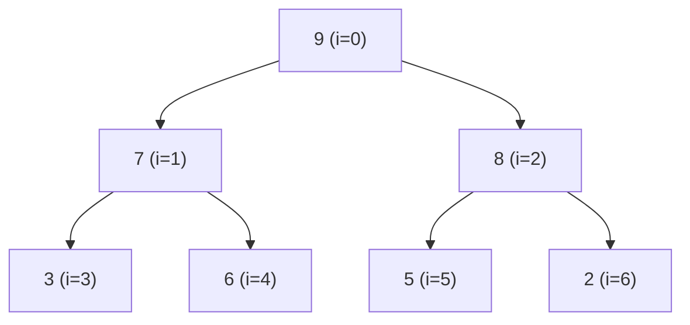

# Heap

## Prerequisites

- **Big-O Notation** [Must read] - a heap's value is that push/pop are O(log n) and peek is O(1); those bounds are the reason to use it, and you can't read them without complexity. <!-- U9: not-yet-written target — wire to `algorithms/big-o-notation.md` (bracket-link form) once that page exists. -->
- [Array](./array.md) [Must read] - a binary heap is stored _in an array_, with parent/child found by index arithmetic; the whole compact representation rests on contiguous indexing.
- [Dynamic Array](./dynamic-array.md) [Should read] - push/pop grow and shrink the heap, so the backing store is a dynamic array; amortized O(1) append underlies amortized push.

## Table of Contents

- [Prerequisites](#prerequisites)
- [Table of Contents](#table-of-contents)
- [What it is](#what-it-is)
- [How it works](#how-it-works)
- [Operations](#operations)
- [Complexity summary](#complexity-summary)
- [When to use / when not](#when-to-use--when-not)
- [Comparison](#comparison)
- [Variants](#variants)
- [Traversal & invariant](#traversal--invariant)
- [Implementation](#implementation)
- [CP-primitives](#cp-primitives)
- [Gotchas / edge cases](#gotchas--edge-cases)
- [Practice problems](#practice-problems)
  - [Kth Largest Element in a Stream](#1-kth-largest-element-in-a-stream--bounded-min-heap)
  - [Top K Frequent Elements](#2-top-k-frequent-elements--heap-of-size-k)
  - [Merge K Sorted Lists](#3-merge-k-sorted-lists--k-way-merge-with-a-heap)
  - [Find Median from Data Stream](#4-find-median-from-data-stream--two-heaps)

## What it is

A **heap** is a binary tree that satisfies the **heap property**: every parent compares favorably to its children — in a **max-heap**, each parent is ≥ both children (so the maximum sits at the root); in a **min-heap**, each parent is ≤ both children (the minimum at the root). It is **not** fully sorted — only the root is guaranteed to be the extreme — which is exactly why it's cheap to maintain.

Mental model: **a corporate hierarchy where every manager out-ranks their direct reports.** The CEO (root) is the most senior, but two people at the same level have no defined order, and someone deep in one branch may out-rank a manager in another. You can find the top person instantly (it's the root) and promote/remove people with only local reshuffling along one path — you never re-sort the whole org.

The heap's reason to exist: it gives **O(1) access to the min or max** and **O(log n) insert and extract**, making it the data structure for any **"top-K", "k-th largest", "next to process by priority", or "repeatedly grab the smallest"** problem. It's stored compactly **in a flat array** (no node pointers), and it's the engine behind the **priority queue**, [heapsort](../algorithms/heapsort.md), and Dijkstra's algorithm.

> **Takeaway (say this out loud):** "A heap is a binary tree where every parent beats its children — O(1) peek at the extreme, O(log n) push/pop — perfect for anything 'top-K' or priority-ordered, and it lives in a plain array."

**Complexity:** peek O(1); push/pop O(log n); build-heap O(n); space O(n).

## How it works

A binary heap is a **complete binary tree** (every level full except possibly the last, which fills left-to-right) stored in an array. Completeness is what lets the array layout work with **no gaps**: the node at index `i` has

- **parent** at `(i - 1) // 2`
- **left child** at `2i + 1`
- **right child** at `2i + 2`

A max-heap `[9, 7, 8, 3, 6, 5, 2]` as tree and array — note the array is the level-order traversal:



```
array:  [ 9,  7,  8,  3,  6,  5,  2 ]
index:    0   1   2   3   4   5   6
          ▲   └─┬─┘   └──┬──┘ └─┬─┘
        root  children  children…   (parent of i = (i-1)//2)
```

Every parent ≥ its children (9≥7,8; 7≥3,6; 8≥5,2) — the heap property holds, but the array is _not_ sorted. Two repair operations keep the property after a change:

- **sift-up (bubble-up):** after inserting at the end, swap the new node with its parent while it beats the parent — restores the property along one root-ward path.
- **sift-down (bubble-down / heapify):** after replacing the root (on pop), swap the node with its _larger_ child (max-heap) while a child beats it — pushes it down one leaf-ward path.

Both touch only one root-to-leaf path → O(height) = O(log n).

## Operations

| Operation                   | Time     | How                                                                                |
| --------------------------- | -------- | ---------------------------------------------------------------------------------- |
| peek (find-min/max)         | O(1)     | The extreme is always at index 0 — just read it.                                   |
| push (insert)               | O(log n) | Append at the end, then **sift-up** along the path to the root.                    |
| pop (extract-min/max)       | O(log n) | Swap root with last element, remove last, then **sift-down** the new root.         |
| build-heap (heapify array)  | **O(n)** | Sift-down every non-leaf node, bottom-up — tighter than n pushes (see derivation). |
| decrease-key / increase-key | O(log n) | Change a key, then sift in the direction that may now violate the property.        |
| delete arbitrary            | O(log n) | Replace with last element, then sift-up or sift-down as needed (needs the index).  |

## Complexity summary

| Metric             | Best     | Average  | Worst    | Note                                                                                                                                                                                                     |
| ------------------ | -------- | -------- | -------- | -------------------------------------------------------------------------------------------------------------------------------------------------------------------------------------------------------- |
| peek               | O(1)     | O(1)     | O(1)     | Root is the extreme.                                                                                                                                                                                     |
| push               | O(1)\*   | O(1)†    | O(log n) | \*Best: key ≤ parent, zero sift-ups. †Average is **O(1) amortized** — a random key's expected sift-up distance is constant (most nodes are near the leaves). Worst O(log n) when it bubbles to the root. |
| pop                | O(log n) | O(log n) | O(log n) | Always sifts the swapped-up leaf down.                                                                                                                                                                   |
| build-heap         | O(n)     | O(n)     | O(n)     | Bottom-up heapify — _not_ O(n log n).                                                                                                                                                                    |
| search (arbitrary) | O(1)     | O(n)     | O(n)     | No ordering across branches — a heap can't search.                                                                                                                                                       |
| space              |          | O(n)     |          | Flat array; no per-node pointer overhead.                                                                                                                                                                |

The number that surprises people: **build-heap is O(n), not O(n log n)** — derived in [Traversal & invariant](#traversal--invariant). The other key point: **search is O(n)** — a heap is hopeless for "does X exist?" because siblings are unordered; it only answers "what's the extreme?"

## When to use / when not

Reach for a heap whenever you need **repeated access to the smallest or largest** of a changing set: a **priority queue** (process the highest-priority task next), **top-K / k-th largest** (keep a size-K heap), **k-way merge** (a heap of the `k` list heads), **streaming medians** (two heaps), and graph algorithms like **Dijkstra** and **Prim** (extract the closest frontier node). The rule of thumb: if a problem says "repeatedly take the min/max" or "top K", reach for a heap.

Don't use a heap when you need to **search for arbitrary elements** or **iterate in sorted order** — it can't do either efficiently (search is O(n); there's no cheap in-order traversal). For those, a **balanced BST** (or a sorted array) is the right tool: it gives O(log n) search _and_ ordered iteration, at the cost of O(log n) (not O(1)) min/max and more memory. And if you only ever need the extreme _once_ (not repeatedly), a single O(n) linear scan beats building a heap.

A heap is the workhorse behind OS/event-loop **schedulers**, **Dijkstra's shortest paths** (the priority queue of frontier nodes), and Python's `heapq` / Java's `PriorityQueue`.

## Comparison

| Structure       | peek min/max | insert     | delete extreme | search   | sorted iteration | Use when                                  |
| --------------- | ------------ | ---------- | -------------- | -------- | ---------------- | ----------------------------------------- |
| **Binary heap** | **O(1)**     | O(log n)   | O(log n)       | O(n)     | ❌ (O(n log n))  | repeated min/max, priority queue          |
| d-ary heap      | **O(1)**     | O(log_d n) | O(d·log_d n)   | O(n)     | ❌               | decrease-key-heavy (dense-graph Dijkstra) |
| Balanced BST    | O(log n)     | O(log n)   | O(log n)       | O(log n) | ✅ O(n)          | need search + order + min/max             |
| Sorted array    | O(1)         | O(n)       | O(1) (at end)  | O(log n) | ✅ O(n)          | static data, search-heavy, rare insert    |
| Unsorted array  | O(n)         | O(1)       | O(n)           | O(n)     | ❌               | insert-heavy, extreme needed rarely       |

The heap's niche is the **insert + extract-extreme** combo: a sorted array peeks in O(1) too, but insertion is O(n); a BST does everything in O(log n) but loses the O(1) peek and costs pointer memory. When the _only_ queries are "insert" and "remove the extreme," the heap wins on both constants and simplicity.

## Variants

- **Min-heap vs max-heap** — the comparison direction; everything else is identical. Python's `heapq` is a min-heap; for a max-heap, negate keys or store `(-key, value)`.
- **d-ary heap** — each node has `d` children instead of 2. Shallower tree (`log_d n` height) → faster `decrease-key` (fewer levels to sift up), slower `pop` (compare `d` children per level). Used to tune Dijkstra on dense graphs.
- **Binary heap on an array** — the standard, covered here. The flat-array layout (no pointers) is itself the "variant" that makes heaps cache-friendly and memory-light versus a pointer-based tree.
- **Fibonacci heap** — O(1) amortized `decrease-key` and `insert`, O(log n) `extract-min`; improves Dijkstra/Prim to O(E + V log V) in theory. Complex constants make it mostly theoretical — named because interviewers ask "can you do better than binary-heap Dijkstra?"
- **Indexed / addressable heap** — keeps a map from element → its array index so you can `decrease-key` or delete an _arbitrary_ element in O(log n). Required for a correct, efficient Dijkstra; the plain heap can't locate an element to update it.

## Traversal & invariant

The Tree/heap family's defining trait: a **partial-order invariant** maintained along root-to-leaf paths, with **no ordering between siblings or across branches** — which is precisely why a heap is cheaper than a fully-sorted structure but useless for search.

- **The heap invariant.** Max-heap: `A[parent] ≥ A[child]` for every node; min-heap flips it. This is _weaker_ than the BST invariant (which orders left < node < right). The weakness is the feature: maintaining it costs only one path of swaps, not a full reorder.
- **No useful traversal order.** Unlike a BST (in-order traversal = sorted), a heap has no traversal yielding sorted output short of repeated `pop` (which is heapsort, O(n log n)). The array layout is level-order, not sorted. "Iterate a heap in order" is an anti-pattern — it means you wanted a BST.
- **Why build-heap is O(n), not O(n log n).** Inserting `n` elements one by one is O(n log n). But **bottom-up heapify** — sift-down every non-leaf, starting from the deepest — is O(n). The reason: most nodes are _near the bottom_ and sift down only a little. A node at height `h` does O(h) work, and there are ≤ `n / 2^(h+1)` nodes at height `h`. Summing: `Σ_{h=0}^{log n} (n / 2^(h+1)) · O(h) = O(n · Σ h/2^h) = O(n · 2) = O(n)`, since `Σ h/2^h` converges to 2. The leaves (half the nodes) do zero work; only the rare high nodes do log-n work. This O(n) build is the basis of [heapsort](../algorithms/heapsort.md)'s heapify phase.
- **Height is ⌊log₂ n⌋.** Completeness guarantees the tree is as shallow as possible, so every sift path is O(log n).

## Implementation

**Pseudocode** (CLRS — max-heap sift-down, the core repair; build-heap drives it):

```
MAX-HEAPIFY(A, i, n)                      ▷ sift A[i] down; subtrees already heaps
 1  l ← 2i + 1; r ← 2i + 2; largest ← i
 2  if l < n and A[l] > A[largest]
 3      largest ← l
 4  if r < n and A[r] > A[largest]
 5      largest ← r
 6  if largest ≠ i
 7      swap A[i] A[largest]
 8      MAX-HEAPIFY(A, largest, n)         ▷ recurse down the affected child

BUILD-MAX-HEAP(A, n)
 1  for i ← ⌊n/2⌋ − 1 downto 0             ▷ every non-leaf, bottom-up
 2      MAX-HEAPIFY(A, i, n)               ▷ total work O(n), not O(n log n)
```

**Python** — idiomatic, using the stdlib `heapq` (a min-heap) the way you actually would, plus the max-heap and from-scratch notes:

```python
import heapq

# --- stdlib heapq: a MIN-heap on a plain list (contest/real-world default) ---
h: list[int] = []
heapq.heappush(h, 5)              # O(log n)
heapq.heappush(h, 2)
smallest = h[0]                   # peek min — O(1), just index 0
heapq.heappop(h)                  # remove & return min — O(log n)
heapq.heapify([3, 1, 2])          # build-heap in place — O(n)
top3 = heapq.nlargest(3, data)    # top-K in one call — O(n log k)

# --- max-heap: negate keys (heapq has no max-heap) ---
maxh: list[int] = []
heapq.heappush(maxh, -value)      # store negatives
largest = -maxh[0]                # peek max
# for (priority, item) pairs, push (-priority, item)

# --- from-scratch min-heap sift operations (the mechanics heapq hides) ---
def sift_up(a: list[int], i: int) -> None:
    while i > 0:
        parent = (i - 1) // 2
        if a[i] >= a[parent]:                 # min-heap: stop when ≥ parent
            break
        a[i], a[parent] = a[parent], a[i]
        i = parent

def sift_down(a: list[int], i: int, n: int) -> None:
    while True:
        smallest, l, r = i, 2 * i + 1, 2 * i + 2
        if l < n and a[l] < a[smallest]: smallest = l
        if r < n and a[r] < a[smallest]: smallest = r
        if smallest == i:
            break
        a[i], a[smallest] = a[smallest], a[i]
        i = smallest
```

## CP-primitives

Contest tools the heap unlocks (advisory for the Tree/heap family, but heaps are CP-heavy):

- **Top-K with a bounded heap.** To find the K largest of a stream, keep a **min-heap of size K**: push each element, pop the min when size exceeds K. The heap holds the K largest seen, its root is the K-th largest, in O(n log K) time and O(K) space — far better than sorting everything (O(n log n)) when K ≪ n. (Mirror with a max-heap for K smallest.)
- **Two-heap median / streaming order statistics.** Maintain a **max-heap of the lower half** and a **min-heap of the upper half**, balanced in size. The median is the root(s); insertion is O(log n). The standard tool for "median of a data stream" and sliding-window medians.
- **Heap-based k-way merge.** Merge `k` sorted sequences by heaping their current heads: pop the smallest, push that list's successor. O(N log k) total — the engine of external merge sort and "merge k lists".
- **Lazy deletion.** When you can't address an element to delete it (plain `heapq`), push updates and **skip stale entries on pop** (check against a validity map). The standard trick for Dijkstra with `heapq`, which has no `decrease-key`.

## Gotchas / edge cases

- **Empty heap** — `peek`/`pop` on an empty heap must be guarded (`heapq.heappop([])` raises `IndexError`). Check `if not h` first.
- **It is NOT sorted** — the most common misconception. The array is _not_ in sorted order; only `h[0]` is the extreme. Iterating `h` does not yield sorted output. Wanting sorted iteration means you wanted a BST or a full sort.
- **No max-heap in `heapq` (CP-flavored trap)** — Python's `heapq` is min-only. Negate keys for a max-heap (`push(-x)`, `peek = -h[0]`), and remember to negate _back_ on pop. For tuples, push `(-priority, item)`. Forgetting the negation is the classic Python heap bug.
- **No `decrease-key` in `heapq`** — you can't efficiently update an element's priority. Use **lazy deletion** (push the new value, skip outdated pops) or an indexed heap. This bites in Dijkstra implementations — the naive "update in place" doesn't exist.
- **Tuple comparison ties** — pushing `(priority, item)` fails if two priorities tie and `item` isn't comparable (`TypeError: '<' not supported`). Add a tiebreaker: push `(priority, count, item)` with a monotonic `count`.
- **Build-heap direction** — heapify must go **bottom-up** (`n//2 - 1` downto 0). Top-down sift-down doesn't establish the invariant and silently produces a non-heap — and loses the O(n) build, since you'd be back to O(n log n).

## Practice problems

### 1. Kth Largest Element in a Stream — bounded min-heap

Design a class that, given `k`, returns the k-th largest element seen so far after each `add(val)`. Constraints: a stream — elements arrive over time, so you can't sort once; queries are continuous.

**Approach:** Keep a **min-heap of size `k`** holding the k largest values seen. On `add`, push the value; if the heap exceeds size `k`, pop the smallest. The root is always the k-th largest. O(log k) per add, O(k) space — vastly better than re-sorting the stream.

```python
import heapq

class KthLargest:
    def __init__(self, k: int, nums: list[int]):
        self.k = k
        self.heap = nums
        heapq.heapify(self.heap)                  # O(n) build
        while len(self.heap) > k:
            heapq.heappop(self.heap)

    def add(self, val: int) -> int:
        heapq.heappush(self.heap, val)
        if len(self.heap) > self.k:
            heapq.heappop(self.heap)              # keep only the k largest
        return self.heap[0]                       # root = k-th largest
```

Time O(log k) per add, space O(k). Pattern: bounded-size min-heap for top-K.

### 2. Top K Frequent Elements — heap of size K

Return the `k` most frequent elements of an array. Constraints: `n ≤ 10⁵`; expected better than O(n log n) full sort when `k ≪ n`.

**Approach:** Count frequencies (a hash map), then keep a **min-heap of size `k`** keyed on frequency: push each `(freq, value)`, pop the smallest when size exceeds `k`. The heap ends holding the k most frequent. O(n log k) — better than sorting all distinct elements when `k` is small. (`heapq.nlargest(k, ...)` does exactly this in one call.)

```python
import heapq
from collections import Counter

def top_k_frequent(nums: list[int], k: int) -> list[int]:
    freq = Counter(nums)
    heap = []                                     # min-heap of (freq, val), size ≤ k
    for val, f in freq.items():
        heapq.heappush(heap, (f, val))
        if len(heap) > k:
            heapq.heappop(heap)                   # drop least frequent
    return [val for _, val in heap]
```

Time O(n log k), space O(n). Pattern: size-K min-heap on frequency.

### 3. Merge K Sorted Lists — k-way merge with a heap

Merge `k` sorted lists into one sorted list. Constraints: total `N` elements across `k` lists; naive concatenate-then-sort is O(N log N) — the heap does O(N log k).

**Approach:** Heap of the `k` current heads. Pop the smallest, append it to output, push that list's next element. The heap never exceeds size `k`, so each of the `N` pops/pushes is O(log k) → O(N log k). This is the canonical heap-based k-way merge, the engine of external sorting.

```python
import heapq

def merge_k_lists(lists: list[list[int]]) -> list[int]:
    heap = [(lst[0], i, 0) for i, lst in enumerate(lists) if lst]
    heapq.heapify(heap)                           # k heads
    out = []
    while heap:
        val, li, ei = heapq.heappop(heap)
        out.append(val)
        if ei + 1 < len(lists[li]):
            heapq.heappush(heap, (lists[li][ei + 1], li, ei + 1))
    return out
```

Time O(N log k), space O(k). Pattern: k-way merge via a min-heap.

### 4. Find Median from Data Stream — two heaps

Support `addNum(x)` and `findMedian()` on a growing stream. Constraints: continuous queries, so you must keep order statistics incrementally — no re-sorting.

**Approach:** **Two heaps.** A **max-heap** holds the smaller half, a **min-heap** the larger half, kept balanced in size (differ by ≤ 1). The median is the max-heap root (odd total) or the average of both roots (even). Each `addNum` pushes to one heap and rebalances in O(log n); `findMedian` is O(1). The textbook two-heap streaming pattern.

```python
import heapq

class MedianFinder:
    def __init__(self):
        self.lo = []   # max-heap (negated) — smaller half
        self.hi = []   # min-heap — larger half

    def addNum(self, num: int) -> None:
        heapq.heappush(self.lo, -num)             # push to lower half
        heapq.heappush(self.hi, -heapq.heappop(self.lo))   # move its max to upper
        if len(self.hi) > len(self.lo):           # rebalance: lo holds the extra
            heapq.heappush(self.lo, -heapq.heappop(self.hi))

    def findMedian(self) -> float:
        if len(self.lo) > len(self.hi):
            return -self.lo[0]
        return (-self.lo[0] + self.hi[0]) / 2
```

Time O(log n) add / O(1) median, space O(n). Pattern: two balanced heaps for streaming median.
