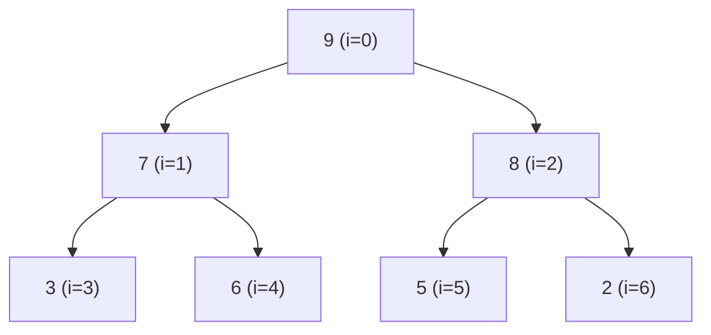

# Heap

## Prerequisites

- [Big-O Notation](../algorithms/big-o-notation.md) [Must read]
- [Array](./array.md) [Must read]
- [Dynamic Array](./dynamic-array.md) [Should read]

## Table of Contents

- [Prerequisites](#prerequisites)
- [Table of Contents](#table-of-contents)
- [What it is](#what-it-is)
- [How it works](#how-it-works)
- [Operations](#operations)
- [Complexity summary](#complexity-summary)
- [When to use / when not](#when-to-use--when-not)
- [Comparison](#comparison)
- [Variants](#variants)
- [Traversal & <abbr>invariant</abbr>](#traversal--invariant)
- [Implementation](#implementation)
- [CP-primitives](#cp-primitives)
- [Gotchas / edge cases](#gotchas--edge-cases)
- [What the interviewer probes for](#what-the-interviewer-probes-for)
- [Practice problems](#practice-problems)
  - [Kth Largest Element in a Stream](#1-kth-largest-element-in-a-stream--bounded-min-<abbr>heap</abbr>)
  - [Top K Frequent Elements](#2-top-k-frequent-elements--heap-of-size-k)
  - [Merge K Sorted Lists](#3-merge-k-sorted-lists-lc-23---k-way-merge-with-a-heap)
  - [Find Median from Data Stream](#4-find-median-from-data-stream--two-heaps)
  - [Swim in Rising Water](#5-swim-in-rising-water-lc-778---dijkstra-style-heap-shortest-path)

## What it is

A **heap** is a binary tree that satisfies the **heap property**: every parent compares favorably to its children - in a **max-heap**, each parent is ≥ both children (so the maximum sits at the root); in a **min-heap**, each parent is ≤ both children (the minimum at the root). It is **not** fully sorted - only the root is guaranteed to be the extreme - which is exactly why it's cheap to maintain.

Mental model: **a corporate hierarchy where every manager out-ranks their direct reports.** The CEO (root) is the most senior, but two people at the same level have no defined order, and someone deep in one branch may out-rank a manager in another. You can find the top person instantly (it's the root) and promote/remove people with only local reshuffling along one path - you never re-sort the whole org.

The heap's reason to exist: it gives **O(1) access to the min or max** and **O(log n) insert and extract**, making it the data structure for any **"top-K", "k-th largest", "next to process by priority", or "repeatedly grab the smallest"** problem. It's stored compactly **in a flat array** (no node pointers), and it's the engine behind the **priority queue**, [heapsort](../algorithms/heapsort.md), and Dijkstra's algorithm.

> **Takeaway (say this out loud):** "A heap is a binary tree where every parent beats its children - O(1) peek at the extreme, O(log n) push/pop - perfect for anything 'top-K' or priority-ordered, and it lives in a plain array."

**Complexity:** peek O(1); push/pop O(log n); build-heap O(n); space O(n).

## How it works

A binary heap is a **complete binary tree** (every level full except possibly the last, which fills left-to-right) stored in an array. Completeness is what lets the array layout work with **no gaps**: the node at index `i` has

- **parent** at `(i - 1) // 2`
- **left child** at `2i + 1`
- **right child** at `2i + 2`

A max-heap `[9, 7, 8, 3, 6, 5, 2]` as tree and array - note the array is the level-order traversal:


```mermaid
graph TD
    A["9 (i=0)"] --> B["7 (i=1)"]
    A --> C["8 (i=2)"]
    B --> D["3 (i=3)"]
    B --> E["6 (i=4)"]
    C --> F["5 (i=5)"]
    C --> G["2 (i=6)"]
```

```
array:  [ 9,  7,  8,  3,  6,  5,  2 ]
index:    0   1   2   3   4   5   6
          ▲   └─┬─┘   └──┬──┘ └─┬─┘
        root  children  children…   (parent of i = (i-1)//2)
```

Every parent ≥ its children (9≥7,8; 7≥3,6; 8≥5,2) - the heap property holds, but the array is _not_ sorted. Two repair operations keep the property after a change:

- **sift-up (bubble-up):** after inserting at the end, swap the new node with its parent while it beats the parent - restores the property along one root-ward path.
- **sift-down (bubble-down / heapify):** after replacing the root (on pop), swap the node with its _larger_ child (max-heap) while a child beats it - pushes it down one leaf-ward path.

Both touch only one root-to-leaf path → O(height) = O(log n).

## Operations

| Operation                   | Time     | How                                                                                |
| --------------------------- | -------- | ---------------------------------------------------------------------------------- |
| peek (find-min/max)         | O(1)     | The extreme is always at index 0 - just read it.                                   |
| push (insert)               | O(log n) | Append at the end, then **sift-up** along the path to the root.                    |
| pop (extract-min/max)       | O(log n) | Swap root with last element, remove last, then **sift-down** the new root.         |
| build-heap (heapify array)  | **O(n)** | Sift-down every non-leaf node, bottom-up - tighter than n pushes (see derivation). |
| decrease-key / increase-key | O(log n) | Change a key, then sift in the direction that may now violate the property.        |
| delete arbitrary            | O(log n) | Replace with last element, then sift-up or sift-down as needed (needs the index).  |

## Complexity summary

| Metric             | Best     | Average  | Worst    | Note                                                                                                                                                                                                     |
| ------------------ | -------- | -------- | -------- | -------------------------------------------------------------------------------------------------------------------------------------------------------------------------------------------------------- |
| peek               | O(1)     | O(1)     | O(1)     | Root is the extreme.                                                                                                                                                                                     |
| push               | O(1)\*   | O(1)†    | O(log n) | \*Best: key ≤ parent, zero sift-ups. †Average is **O(1) amortized** - a random key's expected sift-up distance is constant (most nodes are near the leaves). Worst O(log n) when it bubbles to the root. |
| pop                | O(log n) | O(log n) | O(log n) | Always sifts the swapped-up leaf down.                                                                                                                                                                   |
| build-heap         | O(n)     | O(n)     | O(n)     | Bottom-up heapify - _not_ O(n log n).                                                                                                                                                                    |
| search (arbitrary) | O(1)     | O(n)     | O(n)     | No ordering across branches - a heap can't search.                                                                                                                                                       |
| space              |          | O(n)     |          | Flat array; no per-node pointer overhead.                                                                                                                                                                |

The number that surprises people: **build-heap is O(n), not O(n log n)** - derived in [Traversal & invariant](#traversal--invariant). The other key point: **search is O(n)** - a heap is hopeless for "does X exist?" because siblings are unordered; it only answers "what's the extreme?"

## When to use / when not

Reach for a heap whenever you need **repeated access to the smallest or largest** of a changing set: a **priority queue** (process the highest-priority task next), **top-K / k-th largest** (keep a size-K heap), **k-way merge** (a heap of the `k` list heads), **streaming medians** (two heaps), and graph algorithms like **Dijkstra** and **Prim** (extract the closest frontier node). The rule of thumb: if a problem says "repeatedly take the min/max" or "top K", reach for a heap.

Don't use a heap when you need to **search for arbitrary elements** or **iterate in sorted order** - it can't do either efficiently (search is O(n); there's no cheap in-order traversal). For those, a **balanced BST** (or a sorted array) is the right tool: it gives O(log n) search _and_ ordered iteration, at the cost of O(log n) (not O(1)) min/max and more memory. And if you only ever need the extreme _once_ (not repeatedly), a single O(n) linear scan beats building a heap.

A heap is the workhorse behind OS/event-loop **schedulers**, **Dijkstra's shortest paths** (the priority queue of frontier nodes), and Python's `heapq` / Java's `PriorityQueue`.

## Comparison

| Structure       | peek min/max | insert     | delete extreme | search   | sorted iteration | Use when                                  |
| --------------- | ------------ | ---------- | -------------- | -------- | ---------------- | ----------------------------------------- |
| **Binary heap** | **O(1)**     | O(log n)   | O(log n)       | O(n)     | ❌ (O(n log n))  | repeated min/max, priority queue          |
| d-ary heap      | **O(1)**     | O(log_d n) | O(d·log_d n)   | O(n)     | ❌               | decrease-key-heavy (dense-graph Dijkstra) |
| Balanced BST    | O(log n)     | O(log n)   | O(log n)       | O(log n) | ✅ O(n)          | need search + order + min/max             |
| Sorted array    | O(1)         | O(n)       | O(1) (at end)  | O(log n) | ✅ O(n)          | static data, search-heavy, rare insert    |
| Unsorted array  | O(n)         | O(1)       | O(n)           | O(n)     | ❌               | insert-heavy, extreme needed rarely       |

The heap's niche is the **insert + extract-extreme** combo: a sorted array peeks in O(1) too, but insertion is O(n); a BST does everything in O(log n) but loses the O(1) peek and costs pointer memory. When the _only_ queries are "insert" and "remove the extreme," the heap wins on both constants and simplicity.

## Variants

- **Min-heap vs max-heap** - the comparison direction; everything else is identical. Python's `heapq` is a min-heap; for a max-heap, negate keys or store `(-key, value)`.
- **d-ary heap** - each node has `d` children instead of 2. Shallower tree (`log_d n` height) → faster `decrease-key` (fewer levels to sift up), slower `pop` (compare `d` children per level). Used to tune Dijkstra on dense graphs.
- **Binary heap on an array** - the standard, covered here. The flat-array layout (no pointers) is itself the "variant" that makes heaps cache-friendly and memory-light versus a pointer-based tree.
- **Fibonacci heap** - O(1) <abbr>amortized</abbr> `decrease-key` and `insert`, O(log n) `extract-min`; improves Dijkstra/Prim to O(E + V log V) in theory. Complex constants make it mostly theoretical - named because interviewers ask "can you do better than binary-heap Dijkstra?"
- **Indexed / addressable heap** - keeps a map from element → its array index so you can `decrease-key` or delete an _arbitrary_ element in O(log n). Required for a correct, efficient Dijkstra; the plain heap can't locate an element to update it.

## Traversal & invariant

The Tree/heap family's defining trait: a **partial-order invariant** maintained along root-to-leaf paths, with **no ordering between siblings or across branches** - which is precisely why a heap is cheaper than a fully-sorted structure but useless for search.

- **The heap invariant.** Max-heap: `A[parent] ≥ A[child]` for every node; min-heap flips it. This is _weaker_ than the BST invariant (which orders left < node < right). The weakness is the feature: maintaining it costs only one path of swaps, not a full reorder.
- **No useful traversal order.** Unlike a BST (in-order traversal = sorted), a heap has no traversal yielding sorted output short of repeated `pop` (which is heapsort, O(n log n)). The array layout is level-order, not sorted. "Iterate a heap in order" is an anti-pattern - it means you wanted a BST.
- **Why build-heap is O(n), not O(n log n).** Inserting `n` elements one by one is O(n log n). But **bottom-up heapify** - sift-down every non-leaf, starting from the deepest - is O(n). The reason: most nodes are _near the bottom_ and sift down only a little. A node at height `h` does O(h) work, and there are ≤ `n / 2^(h+1)` nodes at height `h`. Summing: `Σ_{h=0}^{log n} (n / 2^(h+1)) · O(h) = O(n · Σ h/2^h) = O(n · 2) = O(n)`, since `Σ h/2^h` converges to 2. The leaves (half the nodes) do zero work; only the rare high nodes do log-n work. This O(n) build is the basis of [heapsort](../algorithms/heapsort.md)'s heapify phase.
- **Height is ⌊log₂ n⌋.** Completeness guarantees the tree is as shallow as possible, so every sift path is O(log n).

## Implementation

**Pseudocode** (CLRS - max-heap sift-down, the core repair; build-heap drives it):

```
MAX-HEAPIFY(A, i, n)                      ▷ sift A[i] down; subtrees already heaps
 1  l ← 2i + 1; r ← 2i + 2; largest ← i
 2  if l < n and A[l] > A[largest]
 3      largest ← l
 4  if r < n and A[r] > A[largest]
 5      largest ← r
 6  if largest ≠ i
 7      swap A[i] A[largest]
 8      MAX-HEAPIFY(A, largest, n)         ▷ recurse down the affected child

BUILD-MAX-HEAP(A, n)
 1  for i ← ⌊n/2⌋ − 1 downto 0             ▷ every non-leaf, bottom-up
 2      MAX-HEAPIFY(A, i, n)               ▷ total work O(n), not O(n log n)
```

**Python** - idiomatic, using the stdlib `heapq` (a min-heap) the way you actually would, plus the max-heap and from-scratch notes:

```python
import heapq

# --- stdlib heapq: a MIN-heap on a plain list (contest/real-world default) ---
h: list[int] = []
heapq.heappush(h, 5)              # O(log n)
heapq.heappush(h, 2)
smallest = h[0]                   # peek min - O(1), just index 0
heapq.heappop(h)                  # remove & return min - O(log n)
heapq.heapify([3, 1, 2])          # build-heap in place - O(n)
top3 = heapq.nlargest(3, data)    # top-K in one call - O(n log k)

# --- max-heap: negate keys (heapq has no max-heap) ---
maxh: list[int] = []
heapq.heappush(maxh, -value)      # store negatives
largest = -maxh[0]                # peek max
# for (priority, item) pairs, push (-priority, item)

# --- from-scratch min-heap sift operations (the mechanics heapq hides) ---
def sift_up(a: list[int], i: int) -> None:
    while i > 0:
        parent = (i - 1) // 2
        if a[i] >= a[parent]:                 # min-heap: stop when ≥ parent
            break
        a[i], a[parent] = a[parent], a[i]
        i = parent

def sift_down(a: list[int], i: int, n: int) -> None:
    while True:
        smallest, l, r = i, 2 * i + 1, 2 * i + 2
        if l < n and a[l] < a[smallest]: smallest = l
        if r < n and a[r] < a[smallest]: smallest = r
        if smallest == i:
            break
        a[i], a[smallest] = a[smallest], a[i]
        i = smallest
```

## CP-primitives

Contest tools the heap unlocks (advisory for the Tree/heap family, but heaps are CP-heavy):

- **Top-K with a bounded heap.** To find the K largest of a stream, keep a **min-heap of size K**: push each element, pop the min when size exceeds K. The heap holds the K largest seen, its root is the K-th largest, in O(n log K) time and O(K) space - far better than sorting everything (O(n log n)) when K ≪ n. (Mirror with a max-heap for K smallest.)
- **Two-heap median / streaming order statistics.** Maintain a **max-heap of the lower half** and a **min-heap of the upper half**, balanced in size. The median is the root(s); insertion is O(log n). The standard tool for "median of a data stream" and sliding-window medians.
- **Heap-based k-way merge.** Merge `k` sorted sequences by heaping their current heads: pop the smallest, push that list's successor. O(N log k) total - the engine of external merge sort and "merge k lists".
- **Lazy deletion.** When you can't address an element to delete it (plain `heapq`), push updates and **skip stale entries on pop** (check against a validity map). The standard trick for Dijkstra with `heapq`, which has no `decrease-key`.

## Gotchas / edge cases

- **Empty heap** - `peek`/`pop` on an empty heap must be guarded (`heapq.heappop([])` raises `IndexError`). Check `if not h` first.
- **It is NOT sorted** - the most common misconception. The array is _not_ in sorted order; only `h[0]` is the extreme. Iterating `h` does not yield sorted output. Wanting sorted iteration means you wanted a BST or a full sort.
- **No max-heap in `heapq` (CP-flavored trap)** - Python's `heapq` is min-only. Negate keys for a max-heap (`push(-x)`, `peek = -h[0]`), and remember to negate _back_ on pop. For tuples, push `(-priority, item)`. Forgetting the negation is the classic Python heap bug.
- **No `decrease-key` in `heapq`** - you can't efficiently update an element's priority. Use **lazy deletion** (push the new value, skip outdated pops) or an indexed heap. This bites in Dijkstra implementations - the naive "update in place" doesn't exist.
- **Tuple comparison ties** - pushing `(priority, item)` fails if two priorities tie and `item` isn't comparable (`TypeError: '<' not supported`). Add a tiebreaker: push `(priority, count, item)` with a monotonic `count`.
- **Build-heap direction** - heapify must go **bottom-up** (`n//2 - 1` downto 0). Top-down sift-down doesn't establish the invariant and silently produces a non-heap - and loses the O(n) build, since you'd be back to O(n log n).
- **At n > 10⁷, cache misses dominate over the log n bound (at-scale trap).** A heap's array is flat and contiguous, but sift-up/sift-down jump by index arithmetic (`2i+1`, `2i+2`, `(i-1)//2`) that scatters across the array as `i` grows - parent and children drift further apart in memory the deeper the tree gets, so each sift step increasingly misses cache even though the array itself is contiguous. At large n, wall-clock time on push/pop grows faster than the O(log n) op count alone predicts, because each of those O(log n) comparisons pays a cache-miss penalty that a small heap doesn't. This is why production priority queues at extreme scale (external-memory heaps, cache-oblivious variants) restructure the layout rather than trust the asymptotic bound.

## What the interviewer probes for

**What breaks first if this heap holds 10⁹ elements, not 10⁴?** - The height (`log₂ 10⁹ ≈ 30`) barely moves, so the *comparison count* stays cheap; what actually degrades is cache behavior. As noted in Gotchas, `2i+1`/`2i+2` index jumps scatter further apart in memory as the tree deepens, so each sift step increasingly misses cache - wall-clock time grows faster than the O(log n) bound alone predicts. At that scale, production systems reach for external-memory or cache-oblivious heap variants rather than trust the asymptotics, or shard the priority queue across machines so no single heap holds the full 10⁹.

**Why not just keep the array sorted instead of using a heap?** - A sorted array gives O(1) peek too, and sorted iteration for free, which a heap can't. But insertion into a sorted array is O(n) (shift elements), while a heap's push is O(log n). The heap trades away full ordering - it only guarantees the root is extreme, nothing about sibling order - to buy fast insert. If you never need to see anything but the current min/max, and inserts are frequent, that trade wins; if the data is mostly static or you need range queries, a sorted structure or BST wins instead.

**Does concurrent access change the design?** - Yes: a heap's sift-up/sift-down mutate multiple array slots across a root-to-leaf path, so naive concurrent push/pop needs a lock around the whole operation (fine-grained locking is hard because swaps can touch any level). High-throughput systems either shard into multiple heaps with a dispatcher, or use a lock-free skip-list-based priority queue instead, since skip lists tolerate concurrent modification far more gracefully than an array-backed heap.

## Practice problems

### 1. Kth Largest Element in a Stream - bounded min-heap

Design a class that, given `k`, returns the k-th largest element seen so far after each `add(val)`. Constraints: a stream - elements arrive over time, so you can't sort once; queries are continuous.

**Worked examples:**
- **Example 1**
  - **Input:** k = 3, nums = [4,5,8,2], add(3) | **Output:** 4
  - **Explanation:** after adding 3, the stream is [4,5,8,2,3]; the 3rd largest is 4.
- **Example 2**
  - **Input:** k = 3 (continued from Example 1), add(5) | **Output:** 5
  - **Explanation:** the stream is now [4,5,8,2,3,5]; the 3rd largest is 5.

**Constraints:** `1 ≤ k ≤ 10⁴`, `0 ≤ nums.length ≤ 10⁴`, at most `10⁴` calls to `add`.

**Approach:** Keep a **min-heap of size `k`** holding the k largest values seen. On `add`, push the value; if the heap exceeds size `k`, pop the smallest. The root is always the k-th largest. O(log k) per add, O(k) space - vastly better than re-sorting the stream.

```python
import heapq

class KthLargest:
    def __init__(self, k: int, nums: list[int]):
        self.k = k
        self.heap = nums
        heapq.heapify(self.heap)
        while len(self.heap) > k:
            heapq.heappop(self.heap)

    def add(self, val: int) -> int:
        heapq.heappush(self.heap, val)
        if len(self.heap) > self.k:
            heapq.heappop(self.heap)
        return self.heap[0]
```

**Complexity:** O(log k) per add, O(k) space. Pattern: bounded-size min-heap for top-K.

**Duplicate problems:**
- Kth Largest Element in an Array (LC 215) - identical bounded size-K min-heap whose root is the answer; the only difference is a one-shot batch query instead of a streaming `add`.

---

### 2. Top K Frequent Elements - heap of size K

Return the `k` most frequent elements of an array. Constraints: `n ≤ 10⁵`; expected better than O(n log n) full sort when `k ≪ n`.

**Worked examples:**
- **Example 1**
  - **Input:** nums = [1,1,1,2,2,3], k = 2 | **Output:** [1,2]
  - **Explanation:** 1 appears 3 times, 2 appears twice, 3 appears once; the two most frequent are 1 and 2.
- **Example 2**
  - **Input:** nums = [1], k = 1 | **Output:** [1]
  - **Explanation:** only one distinct value exists, so it's trivially the most frequent.

**Constraints:** `1 ≤ nums.length ≤ 10⁵`, `k` is in the range `[1, number of distinct elements]`.

**Approach:** Count frequencies (a hash map), then keep a **min-heap of size `k`** keyed on frequency: push each `(freq, value)`, pop the smallest when size exceeds `k`. The heap ends holding the k most frequent. O(n log k) - better than sorting all distinct elements when `k` is small. (`heapq.nlargest(k, ...)` does exactly this in one call.)

```python
import heapq

def top_k_frequent(nums: list[int], k: int) -> list[int]:
    freq = {}
    for x in nums: freq[x] = freq.get(x, 0) + 1
    heap = []                                     # min-heap of (freq, val), size ≤ k
    for val, f in freq.items():
        heapq.heappush(heap, (f, val))
        if len(heap) > k:
            heapq.heappop(heap)
    return [val for _, val in heap]
```

**Complexity:** O(n log k) time, O(n) space. Pattern: size-K min-heap on frequency.

**Duplicate problems:**
- Top K Frequent Words (LC 692) - same count-then-size-K-heap mechanic; only the tiebreak comparator (lexicographic) changes.
- K Closest Points to Origin (LC 973) - same size-K heap, keyed on distance instead of frequency.

---

### 3. Merge K Sorted Lists (LC 23) - k-way merge with a heap

Merge `k` sorted lists into one sorted list. Constraints: total `N` elements across `k` lists; naive concatenate-then-sort is O(N log N) - the heap does O(N log k).

**Worked examples:**
- **Example 1**
  - **Input:** lists = [[1,4,5],[1,3,4],[2,6]] | **Output:** [1,1,2,3,4,4,5,6]
  - **Explanation:** merging three sorted lists yields one fully sorted sequence of all 8 elements.
- **Example 2**
  - **Input:** lists = [] | **Output:** []
  - **Explanation:** no lists to merge produces an empty result.

**Constraints:** `0 ≤ k ≤ 10⁴`, total nodes across all lists `≤ 10⁴`, each list individually sorted ascending.

**Approach:** Heap of the `k` current heads. Pop the smallest, append it to output, push that list's next element. The heap never exceeds size `k`, so each of the `N` pops/pushes is O(log k) → O(N log k). This is the canonical heap-based k-way merge, the engine of external sorting.

```python
import heapq

def merge_k_lists(lists: list[list[int]]) -> list[int]:
    heap = [(lst[0], i, 0) for i, lst in enumerate(lists) if lst]
    heapq.heapify(heap)
    out = []
    while heap:
        val, li, ei = heapq.heappop(heap)
        out.append(val)
        if ei + 1 < len(lists[li]):
            heapq.heappush(heap, (lists[li][ei + 1], li, ei + 1))
    return out
```

**Complexity:** O(N log k) time, O(k) space. Pattern: k-way merge via a min-heap.

**Duplicate problems:**
- Kth Smallest Element in a Sorted Matrix (LC 378) - same k-way merge over sorted rows via a heap of current heads; also this article's own dedicated entry in [k-way-merge.md](../patterns/k-way-merge.md).

---

### 4. Find Median from Data Stream - two heaps

Support `addNum(x)` and `findMedian()` on a growing stream. Constraints: continuous queries, so you must keep order statistics incrementally - no re-sorting.

**Worked examples:**
- **Example 1**
  - **Input:** addNum(1), addNum(2), findMedian() | **Output:** 1.5
  - **Explanation:** the stream [1,2] has an even count, so the median is the average of the two middle values.
- **Example 2**
  - **Input:** addNum(3) (continued from Example 1), findMedian() | **Output:** 2.0
  - **Explanation:** the stream [1,2,3] has an odd count, so the median is the single middle value.

**Constraints:** up to `5 × 10⁴` calls to `addNum` and `findMedian` combined, `-10⁵ ≤ num ≤ 10⁵`.

**Approach:** **Two heaps.** A **max-heap** holds the smaller half, a **min-heap** the larger half, kept balanced in size (differ by ≤ 1). The median is the max-heap root (odd total) or the average of both roots (even). Each `addNum` pushes to one heap and rebalances in O(log n); `findMedian` is O(1). The textbook two-heap streaming pattern.

```python
import heapq

class MedianFinder:
    def __init__(self):
        self.lo = []   # max-heap (negated) - smaller half
        self.hi = []   # min-heap - larger half

    def addNum(self, num: int) -> None:
        heapq.heappush(self.lo, -num)
        heapq.heappush(self.hi, -heapq.heappop(self.lo))   # move its max to upper
        if len(self.hi) > len(self.lo):           # rebalance: lo holds the extra
            heapq.heappush(self.lo, -heapq.heappop(self.hi))

    def findMedian(self) -> float:
        if len(self.lo) > len(self.hi):
            return -self.lo[0]
        return (-self.lo[0] + self.hi[0]) / 2
```

**Complexity:** O(log n) per `addNum`, O(1) per `findMedian`, O(n) space. Pattern: two balanced heaps for streaming median.

**Duplicate problems:**
- Sliding Window Median (LC 480) - same balanced-two-heap invariant, with the added mechanic of lazily deleting values that slide out of the window.

---

### 5. Swim in Rising Water (LC 778) - Dijkstra-style heap shortest path

An `n × n` grid where `grid[r][c]` is the elevation of that cell. Starting at `(0,0)`, at time `t` you can move to any adjacent cell whose elevation is `≤ t` (water has risen to level `t` everywhere). Find the minimum time to reach `(n-1, n-1)`. Elevations are a permutation of `0..n²-1`; `n ≤ 50`.

**Worked examples:**
- **Example 1**
  - **Input:** grid = [[0,2],[1,3]] | **Output:** 3
  - **Explanation:** at t=3, all cells are submerged (0,1,2 all ≤ 3), so a path from (0,0) to (1,1) exists; t=2 leaves elevation-3 unreachable, blocking the only route.
- **Example 2**
  - **Input:** grid = [[0,1,2,3,4],[24,23,22,21,5],[12,13,14,15,16],[11,17,18,19,20],[10,9,8,7,6]] | **Output:** 16
  - **Explanation:** the spiral layout forces the path through the highest elevation on the only viable route, which is 16.

**Constraints:** `1 ≤ n ≤ 50`, `grid[r][c]` is a permutation of `[0, n² - 1]`.

**Approach:** This is the coverage gap the article's own prose names explicitly - the heap as "the priority queue of frontier nodes" behind Dijkstra - but no entry above exercises it; all four are top-K/merge/median uses, not shortest-path. Reframe the grid as an implicit weighted graph where the "cost" to enter a cell is its elevation, and the "distance" to minimize along a path is the **maximum** elevation seen so far (not a sum - the water has to reach every cell on the path, so the bottleneck cell decides the answer). Run Dijkstra with a min-heap keyed on that running max: always expand the frontier cell reachable at the lowest current bottleneck, relax neighbors by `max(current_bottleneck, neighbor_elevation)`. This is the same <abbr>greedy</abbr> frontier-expansion discipline as sum-based Dijkstra, just with `max` swapped in for `+` in the relax step.

```python
import heapq

def swimInWater(grid: list[list[int]]) -> int:
    n = len(grid)
    visited = [[False] * n for _ in range(n)]
    pq: list[tuple[int, int, int]] = [(grid[0][0], 0, 0)]   # (bottleneck so far, r, c)
    visited[0][0] = True

    while pq:
        t, r, c = heapq.heappop(pq)
        if r == n - 1 and c == n - 1:
            return t
        for dr, dc in ((0, 1), (0, -1), (1, 0), (-1, 0)):
            nr, nc = r + dr, c + dc
            if 0 <= nr < n and 0 <= nc < n and not visited[nr][nc]:
                visited[nr][nc] = True
                heapq.heappush(pq, (max(t, grid[nr][nc]), nr, nc))

    return -1  # unreachable - not possible given the problem's constraints
```

**Complexity:** O(n² log n) time (each of n² cells pushed/popped once from a heap of size up to n²), O(n²) space.

**Duplicate problems:**
- Path with Minimum Effort (LC 1631) - identical "minimize the max edge weight along a path" Dijkstra variant, framed as absolute elevation difference between adjacent cells instead of raw elevation.
- Path with Maximum Probability (LC 1514) - same heap-frontier-expansion shape, but combines edge weights by multiplication (probabilities) instead of max, and maximizes instead of minimizes - the heap becomes a max-heap via negation.
