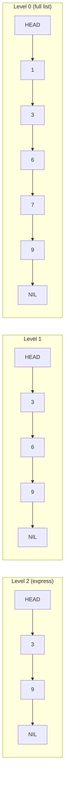

# Skip List

## Prerequisites

- [Linked List](./linked-list.md) [Must read] - a skip list is a linked list with extra "express lane" layers on top; you need the pointer-chasing mental model first.
- [Balanced BST](./balanced-bst.md) [Should read] - skip lists solve the same problem (ordered O(log n) search/insert/delete) with a randomized structure instead of rotations; the comparison is the point.
- **Big-O Notation** [Should read] - the whole pitch is expected O(log n) via probability, not a worst-case guarantee. <!-- U9: not-yet-written target - wire to `algorithms/big-o-notation.md` once that page exists. -->

## Table of Contents

- [What it is](#what-it-is)
- [How it works](#how-it-works)
- [Operations](#operations)
- [Complexity summary](#complexity-summary)
- [When to use / when not](#when-to-use--when-not)
- [Comparison](#comparison)
- [Variants](#variants)
- [Traversal & invariant](#traversal--invariant)
- [Implementation](#implementation)
- [CP-primitives](#cp-primitives)
- [Gotchas / edge cases](#gotchas--edge-cases)
- [What the interviewer probes for](#what-the-interviewer-probes-for)
- [Practice problems](#practice-problems)

## What it is

A **skip list** is a sorted linked list with extra layers of "express lane" pointers stacked on top, where each layer skips over more nodes than the one below it - giving expected O(log n) search, insert, and delete without any rotations or rebalancing logic.

Mental model: **an express-train map over a local-stop subway line.** The bottom layer is the local train, stopping at every station (every node, fully sorted). Each layer above is an express that skips more stations, chosen **randomly** when each node is inserted (flip a coin per level: heads, promote to the next layer up). Searching starts at the top-left, rides the highest express lane as far as possible, drops a level whenever the next stop would overshoot, and repeats down to the local line - discarding a large fraction of nodes at every level, the same halving intuition as binary search, but built from independent coin flips instead of a fixed tree shape.

> **Interview soundbite:** "A skip list is a sorted linked list with randomized express lanes on top - each insert flips coins to decide how tall to build that node's tower, and search rides the tallest lane it can before dropping down, giving expected O(log n) with no rotations at all."

## How it works

Each node has a **tower** of forward pointers, one per level it participates in - a node at level `k` has pointers at levels `0..k`, and appears in every layer from 0 up to `k`. The number of levels a new node gets is randomized: start at level 0, and with probability `p` (typically `p = 1/2`) promote to the next level, repeating (geometric distribution) up to a capped `MAX_LEVEL`. This produces, in expectation, half as many nodes at each level as the one below - level 0 has all `n` nodes, level 1 has ~`n/2`, level 2 has ~`n/4`, and so on, exactly mirroring a balanced tree's layer structure but built by independent randomness instead of enforced invariants.



**Search for 7:** start at HEAD's top level (level 2). Move to `3` (≤ 7, advance). Next on level 2 is `9` (> 7, too far) - **drop to level 1** at node `3`. Move to `6` (≤ 7, advance). Next on level 1 is `9` (> 7) - **drop to level 0** at node `6`. Move to `7` (= 7) - **found**, in 4 pointer-hops instead of scanning all 6 nodes linearly. This "advance while possible, else drop a level" rule is the entire search algorithm - the same shape at insert and delete, just with extra bookkeeping to splice or unsplice a tower.

## Operations

| Operation | Average | Worst case | Notes |
| --- | --- | --- | --- |
| Search | O(log n) | O(n) | Worst case only if randomization degenerates (see Gotchas) |
| Insert | O(log n) | O(n) | Search to find position, then splice in a randomly-sized tower |
| Delete | O(log n) | O(n) | Search to find node, then unsplice its tower at every level it appears |
| Successor / predecessor | O(1) | O(1) | Bottom layer is a sorted doubly linked list - trivial once positioned |
| Range query (k results) | O(log n + k) | O(n) | Locate the start in O(log n), then walk level-0 pointers for k steps |

## Complexity summary

**Time: O(log n) expected** for search/insert/delete, **O(n) worst case** (astronomically unlikely with proper randomization, but not structurally impossible - there's no invariant forbidding it, only probability making it vanishingly rare). **Space: O(n) expected** - each node has an expected `1/(1-p)` pointers (with `p = 1/2`, expected 2 pointers per node), so total pointers across all nodes is O(n), not O(n log n); this is a common point of confusion worth stating explicitly.

## When to use / when not

Reach for a skip list when you want **O(log n) ordered operations without implementing rotation logic** - it is dramatically simpler to code correctly than a [red-black tree](./red-black-tree.md) or [AVL tree](./avl-tree.md), because insert/delete never need case-analysis on rebalancing; you just flip coins and splice a linked list. It's also naturally **lock-friendlier under concurrency**: because there's no global rebalancing step that touches distant parts of the structure (a rotation in a balanced BST can ripple up to the root), fine-grained locking or lock-free skip lists are much easier to build than a lock-free balanced tree - this is a big part of why production systems that need concurrent ordered maps (Redis sorted sets, LevelDB/RocksDB's in-memory memtable) chose skip lists over balanced trees.

Do not use a skip list when you need a **hard worst-case guarantee** - a balanced BST's rotations give a provable O(log n) bound every single operation, while a skip list's bound is only probabilistic (see Gotchas for the degenerate case). Also skip it when you need **order-statistics operations baked in for free** (rank/select, "find the k-th smallest") - a balanced BST augmented with subtree-size counters gives this in O(log n) directly, while a skip list needs an extra "span" field per pointer (tracked in real implementations like Redis's, but not free) to support it.

**Real-world usage:** Redis's sorted set (`ZSET`) is implemented as a skip list paired with a hash table (hash table for O(1) score lookup by member, skip list for ordered range queries) - this is the single most-cited production skip list. LevelDB and RocksDB use skip lists for their in-memory memtable specifically because of the lock-friendly concurrent-insert property. **At scale**, the O(n) expected space (2× pointers per node on average with p=1/2) becomes a real memory cost at billions of entries - production skip lists often tune `p` down (e.g. `p = 1/4`) to trade slightly worse expected search time for meaningfully less pointer overhead per node.

## Comparison

| Structure | Search | Insert | Delete | Balance mechanism | Pick it when… |
| --- | --- | --- | --- | --- | --- |
| Skip List | O(log n) expected | O(log n) expected | O(log n) expected | Randomization (coin flips per insert) | Concurrent access matters, or rotation logic is too much implementation risk for the deadline |
| [AVL Tree](./avl-tree.md) | O(log n) worst | O(log n) worst | O(log n) worst | Strict height rotations | You need a hard worst-case guarantee and reads dominate writes |
| [Red-Black Tree](./red-black-tree.md) | O(log n) worst | O(log n) worst | O(log n) worst | Color-based rotations (fewer than AVL) | Hard guarantee needed, general-purpose read/write mix - the library default |
| Sorted array / [Dynamic Array](./dynamic-array.md) | O(log n) search | O(n) insert | O(n) delete | None (shift elements) | Read-mostly, rare mutation - beats all tree structures on cache locality for search alone |

**Crossover:** a skip list beats a sorted array the moment inserts/deletes become frequent (array's O(n) shift cost dominates); it beats a balanced BST specifically under **concurrent** access, where lock-free or fine-grained-locked skip list implementations exist and are simpler to get right than a lock-free balanced tree - outside of concurrency, a red-black tree's worst-case guarantee makes it the safer single-threaded default.

## Variants

- **Indexable skip list (with span/width counters).** Each forward pointer additionally stores how many level-0 nodes it skips over ("span"), enabling O(log n) **rank** (index of a value) and **select** (value at index k) - the augmentation Redis's `ZSET` uses to answer `ZRANK`/`ZRANGE` queries in O(log n) instead of O(n).
- **Deterministic skip list.** Replaces coin-flip promotion with a deterministic rule (e.g., promote every node whose position satisfies a specific counting invariant) - trades the "no worst case guarantee" weakness for more complex insert/delete bookkeeping, rarely used in practice since it gives up the main simplicity advantage.
- **Concurrent / lock-free skip list.** Uses compare-and-swap on individual node pointers instead of a single global lock, exploiting the fact that inserts only touch a local run of nodes at each level - the concurrency-friendliness that makes skip lists attractive over balanced trees in multi-threaded key-value stores.

## Traversal & invariant

**The search invariant**, maintained at every step of search/insert/delete: at the current position `(level, node)`, every node **before** `node` at every level `≤ level` has already been confirmed `< target`. This is what licenses "advance while the next node's key is `≤` target, else drop a level" - the search never needs to backtrack, because the invariant guarantees nothing skipped-over could have been the answer.

**Why expected O(log n): the layer-count argument.** With promotion probability `p`, the expected number of nodes at level `k` is `n·p^k` (each promotion is an independent coin flip, so surviving to level `k` requires `k` consecutive "heads"). The expected number of levels with at least one node is therefore `O(log_{1/p} n)` - solve `n·p^k = 1` for `k` to get `k = log_{1/p} n`. Each level of the search does O(1) expected work before dropping down (a geometric-distribution argument: the expected number of forward-hops per level before dropping is `O(1)`, since the chance of overshooting is constant per hop), giving `O(log_{1/p} n)` total expected work to traverse from top to a target - **O(log n)** with `p` treated as a constant. This is a genuine probabilistic argument, not an amortized one: no accounting/potential-function proof applies here because there's no worst-case-amortized-to-average trick - it's an expectation over the randomness of the coin flips themselves, and a specific unlucky sequence of flips (e.g., every node promoted to `MAX_LEVEL`) can still produce O(n) search, just with vanishing probability as `n` grows.

**Cache behavior:** a skip list is **pointer-chasing, cache-hostile** - each node is a separate heap allocation, and each level-drop or forward-hop is a fresh pointer dereference likely to miss cache, exactly like a linked list or pointer-based BST. This is the concrete cost a skip list pays relative to a sorted array or a cache-conscious B-tree: even though the Big-O is O(log n) for both a skip list and a balanced BST, a skip list's *node towers* (each level's pointer stored separately) add even more scattered memory access than a plain binary tree node, which only has two child pointers.

## Implementation

### Pseudocode (CLRS-style)

```
SKIP-LIST-SEARCH(list, target)
  x ← list.head
  for i ← list.top_level downto 0
      while x.forward[i] ≠ NIL and x.forward[i].key < target
          x ← x.forward[i]
  x ← x.forward[0]
  if x ≠ NIL and x.key = target
      return x
  return NIL

SKIP-LIST-INSERT(list, key, value)
  update[0..MAX_LEVEL] ← undefined            ▷ update[i] = last node touched at level i
  x ← list.head
  for i ← list.top_level downto 0
      while x.forward[i] ≠ NIL and x.forward[i].key < key
          x ← x.forward[i]
      update[i] ← x
  new_level ← RANDOM-LEVEL()                   ▷ geometric: keep flipping while heads, capped at MAX_LEVEL
  if new_level > list.top_level
      for i ← list.top_level + 1 to new_level
          update[i] ← list.head
      list.top_level ← new_level
  node ← MAKE-NODE(key, value, new_level)
  for i ← 0 to new_level
      node.forward[i] ← update[i].forward[i]
      update[i].forward[i] ← node
```

### Python (idiomatic)

```python
import random
from dataclasses import dataclass, field


MAX_LEVEL = 16
P = 0.5


@dataclass
class SkipNode:
    key: float
    value: object
    forward: list["SkipNode | None"] = field(default_factory=list)


class SkipList:
    """Randomized ordered map: expected O(log n) search/insert/delete, no rotations."""

    def __init__(self) -> None:
        self.head = SkipNode(key=float("-inf"), value=None, forward=[None] * (MAX_LEVEL + 1))
        self.top_level = 0

    def _random_level(self) -> int:
        level = 0
        while random.random() < P and level < MAX_LEVEL:
            level += 1
        return level

    def search(self, key: float) -> object | None:
        x = self.head
        for i in range(self.top_level, -1, -1):
            while x.forward[i] is not None and x.forward[i].key < key:
                x = x.forward[i]
        x = x.forward[0]
        return x.value if x is not None and x.key == key else None

    def insert(self, key: float, value: object) -> None:
        update: list[SkipNode] = [self.head] * (MAX_LEVEL + 1)
        x = self.head
        for i in range(self.top_level, -1, -1):
            while x.forward[i] is not None and x.forward[i].key < key:
                x = x.forward[i]
            update[i] = x

        new_level = self._random_level()
        if new_level > self.top_level:
            for i in range(self.top_level + 1, new_level + 1):
                update[i] = self.head
            self.top_level = new_level

        node = SkipNode(key=key, value=value, forward=[None] * (new_level + 1))
        for i in range(new_level + 1):
            node.forward[i] = update[i].forward[i]
            update[i].forward[i] = node

    def delete(self, key: float) -> bool:
        update: list[SkipNode] = [self.head] * (MAX_LEVEL + 1)
        x = self.head
        for i in range(self.top_level, -1, -1):
            while x.forward[i] is not None and x.forward[i].key < key:
                x = x.forward[i]
            update[i] = x

        target = x.forward[0]
        if target is None or target.key != key:
            return False

        for i in range(self.top_level + 1):
            if update[i].forward[i] is not target:
                break
            update[i].forward[i] = target.forward[i]

        while self.top_level > 0 and self.head.forward[self.top_level] is None:
            self.top_level -= 1
        return True
```

## CP-primitives

- **Order-statistics via span-augmented towers** - store, per forward pointer, how many level-0 nodes it spans (Redis `ZSET`'s technique); this turns "find the k-th smallest key" and "find the rank of key x" into O(log n) walks instead of O(n) scans - useful whenever a contest problem needs an ordered structure with rank queries and you don't want to hand-code a Fenwick tree over coordinate-compressed values.
- **Mergeable/splittable ordered sets** - because a skip list's structure doesn't depend on strict shape invariants, splitting it at a key or merging two skip lists is easier to reason about than splitting a balanced tree (which requires careful subtree surgery); this matters for offline problems processed in an order where sets need to be split and merged repeatedly (e.g., some divide-and-conquer-on-queries techniques).

*(Advisory for the Tree/heap family - Python's standard library provides no skip list; contest use typically reaches for `sortedcontainers.SortedList`, which is not a skip list internally but gives the same asymptotic behavior for these use cases.)*

## Gotchas / edge cases

- **The worst case is real, just improbable.** Unlike a balanced BST where the invariant makes O(n) height *structurally impossible*, a skip list has no such invariant - a sequence of insertions could (with probability `~(1/2)^n`) produce a list where every node reaches `MAX_LEVEL`, degenerating search toward O(n). This is why production skip lists cap `MAX_LEVEL` at `log_{1/p}(expected_max_n)` rather than leaving it unbounded - an uncapped level can theoretically grow without bound.
- **`MAX_LEVEL` sizing is a real tuning decision, not an arbitrary constant.** Set too low, tall towers can't form and the structure degrades toward a plain linked list (O(n)); set too high, memory is wasted on towers that will almost never be needed for the actual `n`. The standard rule of thumb is `MAX_LEVEL = log_{1/p}(expected_n)`.
- **CP-flavored trap: comparing floating-point keys for equality after coordinate compression.** If keys are floats representing compressed coordinates, exact equality checks (`x.key == key`) can silently fail due to floating-point representation error - always coordinate-compress to integers first when keys originate from floating-point input.
- **At-scale trap: pointer overhead compounds.** With `p = 1/2`, each node has an *expected* 2 forward pointers, but that's an average - across billions of nodes at large scale, the actual memory overhead (8 bytes per pointer × 2 average × billions of nodes, plus per-node allocation overhead from the pointer-chasing structure) becomes a meaningful fraction of total memory; this is exactly why Redis and other production systems tune `p` down to `1/4` at scale, accepting slightly worse expected search time (`log_4 n` levels instead of `log_2 n`, so more hops per level but fewer levels) for materially less memory.

**Common misconceptions:**
- "A skip list guarantees O(log n) like a balanced BST." It does not - the O(log n) is an *expectation* over random coin flips, not a worst-case bound; a balanced BST's O(log n) is enforced by an invariant that makes the bad case structurally impossible, while a skip list's bad case is merely astronomically unlikely.
- "Skip list space is O(n log n) because of the extra levels." It is not - the total pointer count across all nodes and all levels is O(n) in expectation (geometric series `n + n/2 + n/4 + ... = 2n`), not O(n log n); the log n term is the *height* (number of levels), not the total node-or-pointer count.

## What the interviewer probes for

**"Why would you ever choose this over a red-black tree, which has a guaranteed bound?"**
Concurrency and implementation simplicity. A skip list's insert/delete only touches a local run of adjacent nodes per level, with no global rebalancing step - this makes fine-grained locking or lock-free CAS-based concurrent implementations tractable, whereas a lock-free balanced BST (needing rotations that can ripple to the root) is a substantially harder concurrent-data-structure problem. Redis's `ZSET` is the standard real-world citation.

**"What happens in the worst case - can you actually get O(n)?"**
Yes, in principle - if every coin flip during insertion happens to come up "promote" for many nodes, the structure degenerates toward every node being present at every level, and search becomes a linear scan of the top level. This is why `MAX_LEVEL` is capped and sized to the expected `n` - it bounds how bad the pathological case can get, though it doesn't eliminate the probabilistic risk entirely.

**"How would you support 'find the k-th smallest element' efficiently?"**
Augment each forward pointer with a **span** - the number of level-0 nodes it skips over - and accumulate span while descending during search; this gives O(log n) rank/select, the same augmentation Redis's `ZSET` uses for `ZRANK`. Without it, rank queries degrade to O(n) since a plain skip list has no notion of position, only key order.

## Practice problems

### 1. Design Skip List (LeetCode 1206)

**Problem.** Implement a skip list supporting `search(target)`, `add(num)`, and `erase(num)` - the canonical "build the structure from scratch" interview question. Values fit in a reasonable integer range; up to 2×10⁴ calls.

**Approach.** Direct implementation of the search/insert/delete algorithms above: maintain an `update` array while descending to record where each level's forward pointer needs splicing, randomize the new node's tower height, splice at every level up to that height.

```python
class Solution:
    def __init__(self) -> None:
        self.skip_list = SkipList()

    def search(self, target: int) -> bool:
        return self.skip_list.search(target) is not None

    def add(self, num: int) -> None:
        self.skip_list.insert(num, num)

    def erase(self, num: int) -> bool:
        return self.skip_list.delete(num)
```

**Complexity.** O(log n) expected per operation, O(n) expected space.

**Duplicate problems:**
- Design a Sorted Set / Ordered Map from scratch - identical operation set, same underlying structure.

---

### 2. Range Sum Query with Frequent Insert/Delete (design variant)

**Problem.** Maintain a dynamic multiset of numbers supporting insert, delete, and "count of elements in range `[lo, hi]`" queries, with the set changing frequently between queries (ruling out a static sorted array + binary search, since each insert/delete would cost O(n) to shift). n, q ≤ 10⁵.

**Approach.** A span-augmented skip list (see CP-primitives) answers "how many elements are ≤ x" in O(log n) by accumulating span while descending to the position just past x; range count is `rank(hi) - rank(lo - 1)`. This is a genuinely different technique from problem 1 - it requires the order-statistics augmentation, not plain search/insert/delete.

```python
# Sketch: extend SkipNode.forward entries with a parallel `span` list,
# accumulate span while descending in search() to get rank(key) in O(log n).
def range_count(skip_list_with_span, lo: float, hi: float) -> int:
    return skip_list_with_span.rank(hi) - skip_list_with_span.rank(lo)
```

**Complexity.** O(log n) per insert/delete/range-count, O(n) space.

**Duplicate problems:**
- Count of Smaller Numbers After Self (LeetCode 315) - same rank-query technique, though a Fenwick tree over coordinate-compressed values is the more common accepted solution in practice.

---

### 3. LRU-style Ordered Eviction by Score (Redis ZSET-style design)

**Problem.** Design a structure that maps members to scores, supports O(log n) insert/update/remove, and can answer "give me the top-k members by score" and "what is member x's rank" - effectively, design Redis's sorted set. n ≤ 10⁵ members, up to 10⁵ operations.

**Approach.** Pair a hash table (member → score, O(1) lookup) with a span-augmented skip list keyed by score (O(log n) ordered operations and rank queries) - exactly Redis's real implementation. This demonstrates the pattern of combining a hash table for O(1) point lookup with a skip list for ordered/ranked access, a composition that shows up whenever a problem needs *both* fast point lookup *and* ordered range/rank queries.

```python
class ScoreBoard:
    """Hash table (member -> score) + skip list (ordered by score) - the Redis ZSET pattern."""

    def __init__(self) -> None:
        self.scores: dict[str, float] = {}
        self.by_score = SkipList()

    def set_score(self, member: str, score: float) -> None:
        if member in self.scores:
            self.by_score.delete(self.scores[member])
        self.scores[member] = score
        self.by_score.insert(score, member)
```

**Complexity.** O(log n) per update, O(1) point lookup by member, O(n) space.

**Duplicate problems:**
- Leaderboard design problems (LeetCode 1244 "Design A Leaderboard") - same hash-table + ordered-structure composition, though small `n` there often permits a simpler sorted-list-with-bisect approach.
