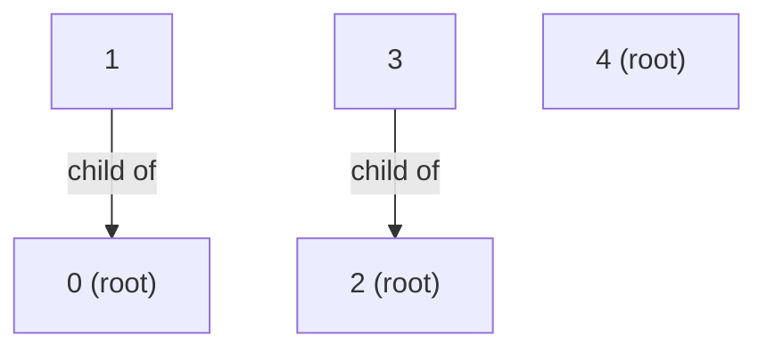
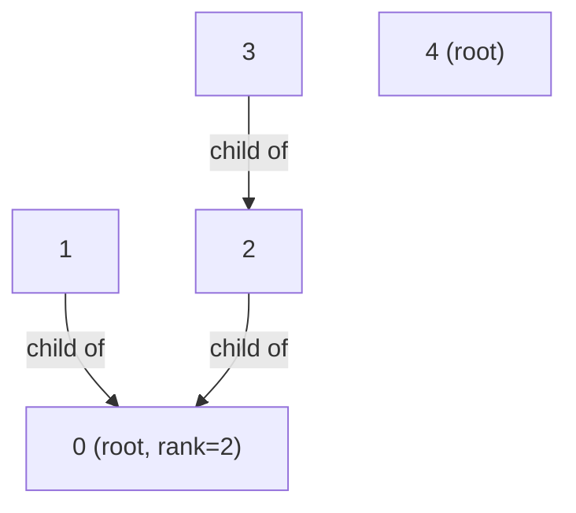

# Union-Find

## Prerequisites

- [Graph](./graph.md) [Must read] - Union-Find partitions the vertices of an implicit graph into disjoint connected components; without a mental model of nodes and edges, the "merge two sets" operation has no concrete meaning.
- [Binary Tree](./binary-tree.md) [Should read] - each component is represented as a rooted tree in the forest; understanding parent pointers, roots, and tree height is the foundation for understanding why union by rank and path compression work.
- <!-- [Minimum Spanning Tree (Kruskal)](../../algorithms/minimum-spanning-tree.md) [Should read] - Kruskal's algorithm is Union-Find's canonical consumer: sort edges by weight, use DSU to detect cycles and skip edges that would merge already-connected components. -->

## Table of Contents

- [Prerequisites](#prerequisites)
- [Table of Contents](#table-of-contents)
- [What it is](#what-it-is)
- [How it works](#how-it-works)
- [Operations](#operations)
- [Complexity summary](#complexity-summary)
- [When to use / when not](#when-to-use--when-not)
- [Comparison](#comparison)
- [Variants](#variants)
- [Traversal & invariant](#traversal--invariant)
- [Implementation](#implementation)
- [CP-primitives](#cp-primitives)
- [Gotchas / edge cases](#gotchas--edge-cases)
- [What the interviewer probes for](#what-the-interviewer-probes-for)
- [Practice problems](#practice-problems)
  - [Number of Connected Components](#1-number-of-connected-components-in-an-undirected-graph)
  - [Kruskal's MST (edge-sort + DSU)](#2-kruskals-mst-edge-sort--dsu-cycle-detection)
  - [Accounts Merge](#3-accounts-merge)
  - [Redundant Connection](#4-redundant-connection--cycle-detection)
  - [Satisfiability of Equality Equations](#5-satisfiability-of-equality-equations)

## What it is

A **Union-Find** (also called **Disjoint-Set Union, DSU**) is a forest of rooted trees where each tree represents one set - the root serves as the canonical representative, and any node can ask "who is my root?" in near-constant amortized time, merging two trees into one just as fast.

Mental model: **a bag of labeled chips where you can clip any two bags together.** Each clip job is destructive - the two bags become one. You can always ask "which mega-bag does chip X belong to?" and get a definitive answer in near-constant time. The internal wiring (which chip physically holds the clip) is an implementation detail you never see; only the root representative matters.

The structure exists to answer two questions over a changing partition of n elements:

1. **`find(x)` → representative** - which set does x belong to?
2. **`union(x, y)` → merge** - merge the sets containing x and y.
3. **`connected(x, y)` → bool** - do x and y share a representative?

With **path compression** and **union by rank**, both operations run in O(α(n)) amortized time - where α is the inverse Ackermann function, so small that α(n) ≤ 5 for any n achievable in the physical universe.

> **Takeaway:** "Union-Find: path compression + union by rank → near-O(1) connectivity queries - the go-to for grouping and merging."

**Complexity:** find O(α(n)) amortized; union O(α(n)) amortized; space O(n).

## How it works

Each of n elements starts in its own singleton set. The internal state is just one integer array `parent[0..n-1]` (and optionally `rank[0..n-1]` or `size[0..n-1]`). A node is a root when `parent[x] == x`.

**Initial state - five singletons (each node is its own root):**

```
Node:    0   1   2   3   4
parent:  0   1   2   3   4
rank:    0   0   0   0   0
```

**After `union(0, 1)` and `union(2, 3)` - two components form:**



```
parent:  0   0   2   2   4    ▷ node 1 points to 0; node 3 points to 2
rank:    1   0   1   0   0    ▷ root rank increases when merging equal-rank trees
```

**After `union(0, 2)` - ranks are equal (both 1), so one root becomes child of the other:**



**Path compression in action - `find(3)` on the tree above:** node 3 → node 2 → node 0 (root). After compression, node 3's parent is set directly to 0:

```
Before find(3):  3 → 2 → 0
After  find(3):  3 → 0  (2 → 0 unchanged)
```

This flattening makes every subsequent `find` on node 3 O(1). Path compression does **not** change the root, only the intermediate pointers - correctness is unaffected.

> **Note:** This trace shows iterative path compression (two-pass). Recursive path compression on the same call would also compress node 2 directly to 0 - the recursive call on node 2's parent propagates the root all the way back up the call stack, setting every node's parent to the root on the return path.

## Operations

| Operation         | Time           | How                                                                                               |
| ----------------- | -------------- | ------------------------------------------------------------------------------------------------- |
| `find(x)`         | O(α(n)) amort. | Walk parent pointers to root; on return, point every visited node directly to root (compression). |
| `union(x, y)`     | O(α(n)) amort. | Call `find(x)` and `find(y)`; attach the shorter-rank root under the taller one.                 |
| `connected(x, y)` | O(α(n)) amort. | `find(x) == find(y)`.                                                                            |
| `make_set(x)`     | O(1)           | `parent[x] = x; rank[x] = 0`.                                                                    |
| Space             | O(n)           | Two arrays of length n: `parent` and `rank` (or `size`).                                         |

## Complexity summary

| Metric                          | Value          | Note                                                                                                                        |
| ------------------------------- | -------------- | --------------------------------------------------------------------------------------------------------------------------- |
| find (with both optimizations)  | O(α(n)) amort. | α(n) ≤ 5 for all practical n - covered in Traversal & invariant.                                                           |
| union (with both optimizations) | O(α(n)) amort. | Calls find twice; attaches by rank/size.                                                                                    |
| find (path compression only)    | O(log n) amort.| Without union-by-rank, trees can grow tall; compression alone is insufficient.                                              |
| find (union-by-rank only)       | O(log n) worst | Without compression, rank bounds height, but each find still walks the full path.                                           |
| find (neither optimization)     | O(n) worst     | A chain union(0,1), union(1,2), … degenerates into a linked list.                                                          |
| make_set                        | O(1)           | Single array write.                                                                                                         |
| Space                           | O(n)           | Two arrays; no nodes, no pointers.                                                                                          |

The crucial point: **you need both optimizations.** Each alone only gets you to O(log n). The inverse-Ackermann guarantee requires both working together.

## When to use / when not

Reach for Union-Find whenever a problem involves **dynamic connectivity** - a set of nodes where pairs get merged incrementally and you need to answer "are these two in the same group?" after each merge. It is the natural tool for **Kruskal's MST** (process edges cheapest-first; skip any edge whose endpoints are already connected), **cycle detection in undirected graphs** (an edge (u,v) creates a cycle iff `find(u) == find(v)` before union), **online component queries** (union operations arrive in a stream and you must answer connectivity queries after each), and **grouping problems** (accounts merge, friend circles, common ancestors).

Don't use Union-Find when you need to **undo a merge** (the structure does not support splits - once merged, always merged), when you need **path information** (it tells you which component, not the path between nodes), when the graph is **dynamic with deletions** (deletions require offline tricks or a different structure entirely), or when you need to **enumerate members of a component** efficiently (the structure doesn't keep an explicit member list - you'd need an adjunct `collections.defaultdict(list)`). For those, BFS/DFS over an adjacency list, or a balanced BST per component, is the right tool.

Real-world usage: DSU appears in **network partitioning** (are these two machines in the same subnet?), **image segmentation** (merge adjacent pixels of the same color), **compiler alias analysis** (the compiler tracks which pointer variables may alias the same memory; DSU merges aliasing sets as assignments are processed), and **least common ancestor** algorithms.

## Comparison

| Structure                    | `connected(u,v)`     | `union(u,v)`         | Path info? | Supports delete? | Pick it when…                                                                |
| ---------------------------- | -------------------- | -------------------- | ---------- | ---------------- | ---------------------------------------------------------------------------- |
| **Union-Find (DSU)**         | **O(α(n)) amort.**   | **O(α(n)) amort.**   | No         | No (offline only)| Repeated merges + connectivity queries, no path needed, no deletions.        |
| BFS/DFS (adjacency list)     | O(V + E)             | O(1) (add edge)      | Yes        | Yes              | Need the actual path, or deletions; graph is small / static.                 |
| Adjacency matrix             | O(1) (bit lookup)    | O(1) (set bit)       | No         | Yes              | Dense graph (E ≈ V²); V small enough for an n×n array.                       |
| Spanning tree (BFS/DFS once) | O(1) after O(V+E)    | n/a (static)         | Yes        | No               | Only when the graph is static after construction and query volume justifies the O(V+E) build cost; DSU beats it the moment even one edge is added dynamically. |
| Link-Cut Tree                | O(log n) find/union/split/link | O(n)       | Supports splits + path queries | When edges are deleted or you need path aggregates (DSU cannot delete or query paths). |

**Crossover:** BFS/DFS wins when the graph is static and you need the actual path, or when V and E are small and you only run a handful of connectivity checks (the O(V+E) per query is fine at n ≤ 1 000). The adjacency matrix wins on ultra-dense graphs where E ≈ V² and V ≤ a few thousand, because the O(1) lookup beats DSU's cache-unfriendly pointer chasing on large n. DSU takes over as soon as n is in the tens of thousands and the merge/query stream is long - the amortized O(α(n)) per operation dwarfs any per-query BFS cost.

## Variants

- **Union by size** - attach the smaller component's root under the larger one. Guarantees tree depth ≤ ⌊log₂ n⌋ (same asymptotic as rank). Simpler to reason about than rank because "size" is exact and never stale; see Traversal & invariant for why rank can diverge from actual height after path compression.
- **Weighted Union-Find** - augment each edge with a value (e.g., relative weight or parity) to answer "what is the relationship between x and y?" in addition to connectivity. Used in bipartite checking and weighted connectivity problems.
- **Rollback DSU (offline / persistent)** - keep a stack of `(node, old_parent, old_rank)` to undo unions. Used in divide-and-conquer on time (offline deletion), competitive programming with "undo" queries, and persistent connectivity. Note: path compression cannot be used with rollback (it loses the old path); union by rank only. See CP-primitives.
- **Parallel DSU** - lock-free or fine-grained-locking variants for multi-threaded component counting in large graph pipelines.

## Traversal & invariant

The Tree/heap family's defining trait is a **maintained invariant** along root-to-node paths, with explicit repair operations that restore it after each mutation. In a binary search tree the invariant is an ordering; in a heap it's a priority relationship; in Union-Find the invariant is **root reachability and representative consistency**.

**The forest invariant.** Every node has exactly one parent pointer, and every chain of parent pointers terminates at a root (`parent[root] == root`). The invariant is: for every node x, `find(x)` returns the same value as `find(parent[x])` - a node and its parent always belong to the same component. Path compression never changes the root; it only shortens the path. So compression is invariant-preserving by construction: it replaces `x → ... → root` with `x → root` while leaving the root unchanged.

**Rank is an upper bound on height, not exact height.** Rank starts at 0 for every singleton. When two trees of equal rank r are merged, one root becomes a child of the other and the surviving root's rank is incremented to r+1. When two trees of unequal rank merge, rank never changes. This means rank tracks the **pre-compression height**. After path compression flattens paths, a root's rank may be strictly larger than its actual tree height. This is intentional: rank is used only for the union decision (attach smaller-rank root under larger-rank root), not as a truthful height measurement. Rank is **monotonically non-decreasing** and **never decremented** even as the tree gets flatter. A node with rank 3 still attracts child attachments over a node with rank 2, even if the actual tree height dropped to 1 after compression.

**Why O(α(n)) amortized - the iterated-log intuition.** Define the "iterated-log" function log*(n) = 0 if n ≤ 1, else 1 + log*(log n). This counts how many times you must apply log₂ before the value drops to ≤ 1:

```
log*(2)        = 1      (log2(2)  = 1  ≤ 1, done)
log*(4)        = 2      (log2(4)  = 2 → log2(2) = 1 ≤ 1, done)
log*(16)       = 3
log*(65536)    = 4
log*(2^65536)  = 5      ← more atoms than exist in the observable universe
```

The O(α(n)) bound from the full Ackermann analysis is even tighter than O(log* n) - α grows more slowly still - but log* already makes the "practically constant" claim clear. α grows strictly slower than log*, which itself grows slower than log n - the α(n) bound is tighter than the O(log* n) bound that path compression alone gives. Here is the one-paragraph sketch of why: partition the n nodes into O(log* n) rank groups, where group k contains nodes whose rank falls in the interval (log*(k−1), log*(k)]. Within each group, the potential function tracks how many "good" nodes remain (nodes whose parent is in a higher rank group). Each `find()` traversal pays for "bad" node visits (same rank group) using the decrease in potential; since each rank group is small and potential only decreases, the total amortized cost across all find operations is O(m · log* n) for m operations. The full Ackermann argument replaces log* with α by using a more refined group-level potential, but the structure is the same - O(log* n) groups, O(1) amortized cost per group per operation. The bottom line: for any graph you can describe, the cost per union or find is ≤ 5 in practice, and the proof establishes it as a rigorous amortized bound, not just an empirical observation.

**Why path compression preserves correctness but not rank accuracy.** After `find(x)` compresses x's path, x's new parent is the root. But the root's rank was set when it absorbed the old subtree containing x's old parent. Detaching x from that old parent and reattaching it to the root does not change the root's rank - and it shouldn't. If we decremented the root's rank during compression, we'd break the union-by-rank contract (a future union might attach a larger subtree under this now-lower-rank root, violating the bounded-height guarantee). Rank is a structural commitment made at union time, not a live height measurement.

## Implementation

**Pseudocode** (CLRS style - union by rank with path compression):

```
MAKE-SET(x)
  parent[x] ← x
  rank[x]   ← 0

FIND(x)                                      ▷ path-compressing find; returns root
  if parent[x] ≠ x
      parent[x] ← FIND(parent[x])            ▷ compress: point directly to root
  return parent[x]

UNION(x, y)
  rx ← FIND(x)                               ▷ always find() first - never union raw nodes
  ry ← FIND(y)
  if rx = ry                                 ▷ already in the same set; nothing to do
      return
  if rank[rx] < rank[ry]                     ▷ attach shorter-rank root under taller
      swap rx ↔ ry
  parent[ry] ← rx                            ▷ ry becomes child of rx
  if rank[rx] = rank[ry]                     ▷ only increment when equal ranks merge
      rank[rx] ← rank[rx] + 1

CONNECTED(x, y)
  return FIND(x) = FIND(y)
```

**Python** (idiomatic - union by size variant, which is easier to reason about than rank):

```python
class DSU:
    def __init__(self, n: int) -> None:
        self.parent = list(range(n))           # parent[i] = i initially (each is own root)
        self.size   = [1] * n                  # size of component rooted at i
        self.components = n                    # number of distinct sets

    def find(self, x: int) -> int:
        # Note: Python's default recursion limit (~1000) can be hit on pathological
        # inputs before compression kicks in. Prefer find_iterative for production use.
        if self.parent[x] != x:
            self.parent[x] = self.find(self.parent[x])   # path compression
        return self.parent[x]

    def find_iterative(self, x: int) -> int:
        root = x
        while self.parent[root] != root:
            root = self.parent[root]
        while self.parent[x] != root:  # path compression pass
            self.parent[x], x = root, self.parent[x]
        return root

    def union(self, x: int, y: int) -> bool:
        """Merge sets containing x and y. Returns True if a new merge occurred."""
        rx, ry = self.find(x), self.find(y)
        if rx == ry:
            return False                       # already connected - no merge
        if self.size[rx] < self.size[ry]:
            rx, ry = ry, rx                    # always attach smaller under larger
        self.parent[ry] = rx
        self.size[rx] += self.size[ry]
        self.components -= 1
        return True

    def connected(self, x: int, y: int) -> bool:
        return self.find(x) == self.find(y)

    def component_size(self, x: int) -> int:
        return self.size[self.find(x)]


# --- usage ---
dsu = DSU(5)
dsu.union(0, 1)
dsu.union(2, 3)
print(dsu.connected(0, 1))   # True
print(dsu.connected(0, 2))   # False
dsu.union(0, 2)
print(dsu.connected(1, 3))   # True  (0-1 and 2-3 are now one component)
print(dsu.components)        # 2  (one big component + singleton 4)
```

**Iterative path compression** (avoids recursion-depth issues on very long initial chains before any compression has occurred):

```python
def find(self, x: int) -> int:
    root = x
    while self.parent[root] != root:           # walk to root
        root = self.parent[root]
    while self.parent[x] != root:             # compress: point each node to root
        nxt = self.parent[x]
        self.parent[x] = root
        x = nxt
    return root
```

## CP-primitives

Contest tools that Union-Find unlocks (advisory for the Tree/heap family, but DSU is one of the most CP-relevant data structures):

- **Kruskal's MST - sort edges, skip cycles with DSU.** Sort all edges by weight. Iterate; for each edge (u, v, w), if `find(u) != find(v)`, add it to the MST and call `union(u, v)`; otherwise skip (it would form a cycle). O(E log E) sort + O(E·α(V)) union-find = effectively O(E log E). The DSU replaces an O(V + E) BFS cycle check for every candidate edge, giving a clean amortized cost per edge. Why for CP: any problem asking "minimum cost to connect all nodes" or "build a spanning forest with minimum total weight" maps directly here - sort edges, greedily add, DSU guards the cycle.

- **Online undirected cycle detection.** Edges arrive one by one. Before calling `union(u, v)`, check `find(u) == find(v)`. If so, this edge creates a cycle (LC 684 / 685 / 261 - "is this graph a valid tree?"). A valid tree on n nodes has exactly n-1 edges and no cycle; DSU checks both conditions in one pass at O(α(n)) per edge. Why for CP: replaces O(n) BFS per added edge with O(α(n)), enabling online "add edge, is graph still acyclic?" queries on graphs up to 10⁵ nodes.

- **Component counting and size queries.** Maintain a `components` counter (decrement on each successful union) and a `size[]` array (update the absorbing root). After processing all edges, `components` gives the number of connected components; `size[find(x)]` gives x's component size in O(α(n)). Why for CP: problems like "number of islands after flipping cells", "accounts merge", "friend circles", and "largest component after unions" all reduce to this - count components, find the max-size component, or track which merges changed the count. This turns an otherwise O(n²) simulation into O(n·α(n)).

- **Offline connectivity with rollback (divide-and-conquer on time).** A stream of "add edge" + "connectivity query" events can be processed offline by dividing the time axis in half: recurse on each half, adding persistent edges to a DSU with rollback (union-by-rank only, no path compression - compression cannot be undone in O(1)). Each union records `(ry, old_parent[ry], old_rank[rx])` on a stack; undo pops the stack in O(1). Each query is answered in O(log n) per level × O(log n) levels = O(log²n) total. Note: path compression is disabled in rollback DSU - each `find()` costs O(log n) (union by rank only). O(log n) per query × O(log n) levels of D&C = O(log²n) per query total. Why for CP: enables handling edge **deletions** (reframe as "this edge is absent from a time interval") - a standard technique when online DSU cannot be used because operations must be undoable.

## Gotchas / edge cases

- **Always call `find()` inside `union()`.** The union procedure must compare roots, not raw nodes. Writing `parent[x] = y` directly instead of calling `find(x)` and `find(y)` and then comparing by rank/size ignores the optimization and can create O(n)-depth chains instantly. This is the single most common DSU bug in contest code.
- **Self-loop / already-connected edges.** `union(x, x)` must be a no-op. Check `rx == ry` before doing any work. Skipping this guard merges a tree with itself and corrupts the size counter (it would double-count the component and decrement the component counter incorrectly).
- **0-indexed vs 1-indexed nodes.** Contest problems often give 1-indexed nodes. Either shift (`DSU(n+1)` and ignore index 0) or translate on input. Mixing indices silently produces wrong roots with no error.
- **Rank vs size semantics - don't mix them.** Rank counts tree height (an upper bound post-compression); size counts nodes. They are not interchangeable. If you copy-paste a rank-based implementation and then check `self.rank[x]` expecting a node count, you'll get a wrong answer. Choose one and keep it consistent.
- **Path compression makes rank an upper bound, not exact height.** After compression, a root's rank may be strictly larger than the actual tree height. Do not use rank as a truthful height measurement - it will give wrong results anywhere you need the real depth.
- **At-scale cache miss trap.** With n > 10⁷–10⁸ nodes, the `parent` array itself becomes the bottleneck. Each `find()` traversal follows a chain of reads into random positions in a large array - a cache line miss on every step. At n > 10⁸, each `find()` hop on an uncompressed chain incurs ~1 L2/L3 cache miss (~50–200 ns); at this scale, memory latency dominates the O(α(n)) operation count. Consider blocked/partitioned DSU representations, NUMA-aware layouts, or chunked offline processing to regain cache locality.
- **Rollback DSU: disable path compression.** If you need to undo unions, you must use union-by-rank **without** path compression. Compression restructures the tree in a way that cannot be reversed in O(1) - you'd have to remember the entire old path for every compressed node. Without compression, each union records only `(ry, old_parent[ry], old_rank[rx])` - three integers - and undo pops the stack in O(1).

## What the interviewer probes for

- **"What's the difference between union by rank and union by size?"** Both give O(log n) depth guarantees and the same O(α(n)) amortized bound when combined with path compression. Rank tracks an upper bound on tree height and never decreases after compression (even though the actual height may drop). Size tracks the node count exactly. Size is simpler to reason about; rank is slightly more efficient in practice for trees where large-size trees are actually short. Neither is definitively better - the interviewer is checking whether you know rank can become stale (over-estimate actual height) after compression.
- **"Why do you need both optimizations?"** Rank alone gives O(log n) worst case per find - the path from a leaf in a balanced tree is O(log n) and you walk it fully with no shortcutting. Compression alone gives O(log n) amortized - trees grow slowly, but without rank they can be tall initially. Together they give O(α(n)) - a fundamentally different complexity regime.
- **"Can you support deletions?"** Not directly with the standard structure - once two components merge, the merge is permanent. Offline deletions are handled by the "rollback DSU + divide-and-conquer on time" technique (see CP-primitives). Online deletions require a different approach (link-cut trees or virtual nodes per deleted element). This question tests whether you understand the structure's fundamental limitation.
- **"How do you find all members of a component?"** DSU doesn't maintain member lists - it only tracks the representative. To enumerate members, maintain a `collections.defaultdict(list)` keyed on `find(x)` and rebuild after all unions, or maintain it incrementally (on each successful `union(x, y)`, extend `members[find(x)]` with `members[find(y)]`). The interviewer is checking whether you understand what the structure does and does not provide out of the box.
- **"What breaks if you use path compression in a rollback DSU?"** Path compression re-wires the parent array to bypass intermediate nodes - undoing this during rollback would require storing the full path before each `find()`, not just the two union edges. The rollback stack entry would need to record O(path length) writes instead of O(1), eliminating the space advantage. This is why rollback DSU uses union by rank only (O(log n) find) and skips path compression entirely.

## Practice problems

### 1. Number of Connected Components in an Undirected Graph

Given n nodes (labeled 0 to n-1) and a list of undirected edges, return the number of connected components in the graph. Constraints: `1 ≤ n ≤ 2000`, `0 ≤ edges.length ≤ 5000`.

**Approach:** Initialize DSU with n singletons (components = n). For each edge (u, v), call `union(u, v)` - if it returns True (a new merge), the component count decrements automatically. Return `components` at the end. This is the template DSU problem: the decremental counter is the most common DSU output pattern.

```python
def count_components(n: int, edges: list[list[int]]) -> int:
    parent = list(range(n))
    size   = [1] * n
    count  = n

    def find(x: int) -> int:
        if parent[x] != x:
            parent[x] = find(parent[x])
        return parent[x]

    def union(x: int, y: int) -> None:
        nonlocal count
        rx, ry = find(x), find(y)
        if rx == ry:
            return
        if size[rx] < size[ry]:
            rx, ry = ry, rx
        parent[ry] = rx
        size[rx] += size[ry]
        count -= 1

    for u, v in edges:
        union(u, v)
    return count
```

Time O(E·α(n)), space O(n). Distinct technique: component counting via decremental counter.

**Duplicate problems:** LeetCode 547 (Friend Circles / Number of Provinces) - identical structure with an adjacency matrix input instead of an edge list; LeetCode 200 (Number of Islands) - same component-count pattern, but the "edges" are derived from 4-directional grid adjacency rather than an explicit list.

### 2. Kruskal's MST (edge-sort + DSU cycle detection)

Given a weighted undirected graph with V vertices and E edges, find the minimum spanning tree weight. Constraints: `1 ≤ V ≤ 10⁵`, `1 ≤ E ≤ 2×10⁵`. Return -1 if the graph is disconnected.

**Approach:** Sort edges by weight ascending. Greedily add an edge if its endpoints are in different components (`find(u) != find(v)`). The DSU cycle check replaces an O(V + E) BFS/DFS per candidate edge - each edge costs O(α(V)) instead. Collect edges until V-1 are added (complete MST) or the list is exhausted. Without DSU, Kruskal's inner loop degenerates from O(E·α(V)) to O(E(V+E)), making the entire algorithm O(E² + EV) instead of O(E log E).

```python
def kruskal_mst(n: int, edges: list[tuple[int, int, int]]) -> int:
    """edges: list of (weight, u, v). Returns MST weight, or -1 if disconnected."""
    parent = list(range(n))
    rank   = [0] * n

    def find(x: int) -> int:
        if parent[x] != x:
            parent[x] = find(parent[x])
        return parent[x]

    def union(x: int, y: int) -> bool:
        rx, ry = find(x), find(y)
        if rx == ry:
            return False
        if rank[rx] < rank[ry]:
            rx, ry = ry, rx
        parent[ry] = rx
        if rank[rx] == rank[ry]:
            rank[rx] += 1
        return True

    mst_weight = 0
    edge_count = 0
    for w, u, v in sorted(edges):             # sort by weight (first tuple element)
        if union(u, v):
            mst_weight += w
            edge_count += 1
            if edge_count == n - 1:
                return mst_weight
    return -1 if edge_count < n - 1 else mst_weight
```

Time O(E log E) sort + O(E·α(V)) DSU = O(E log E). Space O(V). Distinct technique: edge-greedy selection with DSU cycle guard.

**Duplicate problems:** LeetCode 1584 (Min Cost to Connect All Points) - same Kruskal template, edges are Euclidean distances between 2D points; LeetCode 1135 (Connecting Cities With Minimum Cost) - direct Kruskal on explicit edge list.

### 3. Accounts Merge

Given a list of accounts where each account is `[name, email1, email2, ...]`, merge accounts that share any email address and return the merged accounts with emails sorted. Constraints: `1 ≤ accounts.length ≤ 1000`, each account has at most 10 emails.

**Approach:** DSU over email strings (use a dict as the parent map). For each account, union all of its emails together (chain: `union(emails[0], emails[1])`, `union(emails[0], emails[2])`, …). After all unions, group emails by their root representative. This is the "grouping by shared property" pattern - the connection is implicit (shared email) rather than an explicit edge, but it maps to DSU identically.

```python
from collections import defaultdict

def accounts_merge(accounts: list[list[str]]) -> list[list[str]]:
    parent: dict[str, str] = {}

    def find(x: str) -> str:
        if parent.setdefault(x, x) != x:
            parent[x] = find(parent[x])
        return parent[x]

    def union(x: str, y: str) -> None:
        # Simplified DSU: no union-by-rank. Acceptable here (n ≤ 1000); use ranked DSU for large n.
        parent[find(x)] = find(y)

    email_to_name: dict[str, str] = {}
    for account in accounts:
        name = account[0]
        for email in account[1:]:
            email_to_name[email] = name
            union(account[1], email)           # chain all emails in this account to the first

    groups: dict[str, list[str]] = defaultdict(list)
    for email in email_to_name:
        groups[find(email)].append(email)

    return [[email_to_name[root]] + sorted(emails)
            for root, emails in groups.items()]
```

Time O(N·α(N)) where N = total emails, space O(N). Distinct technique: string-keyed DSU for implicit grouping by shared attribute.

**Duplicate problems:** LeetCode 737 (Sentence Similarity II) - same shared-attribute grouping with word pairs; LeetCode 952 (Largest Component Size by Common Factor) - similar implicit grouping, but the shared property is a common factor rather than a shared string.

### 4. Redundant Connection - cycle detection

A connected undirected graph of n nodes (1-indexed) is given with exactly n edges - making it a tree plus one extra edge. Return the redundant edge that creates the cycle. If multiple answers exist, return the last one in the input order. Constraints: `3 ≤ n ≤ 1000`.

**Approach:** Process edges in input order. For each edge (u, v), check `find(u) == find(v)` before calling `union`. If already connected, this edge is redundant - return it immediately. Because we process in input order and return on the first cycle-forming edge, the problem's "return the last one" tiebreak is naturally satisfied. This is the pure cycle-detection DSU pattern - no weight sorting, just a per-edge connectivity gate.

```python
def find_redundant_connection(edges: list[list[int]]) -> list[int]:
    n = len(edges)
    parent = list(range(n + 1))    # 1-indexed
    rank   = [0] * (n + 1)

    def find(x: int) -> int:
        if parent[x] != x:
            parent[x] = find(parent[x])
        return parent[x]

    for u, v in edges:
        ru, rv = find(u), find(v)
        if ru == rv:
            return [u, v]          # first cycle-forming edge in input order
        if rank[ru] < rank[rv]:
            ru, rv = rv, ru
        parent[rv] = ru
        if rank[ru] == rank[rv]:
            rank[ru] += 1

    return []                      # unreachable for valid input
```

Time O(n·α(n)), space O(n). Distinct technique: per-edge cycle check as a gate before union; return the first cycle-forming edge.

**Duplicate problems:** LeetCode 685 (Redundant Connection II) - directed graph variant where a node may have two parents; requires checking both "is there a node with in-degree 2?" and "does removing one candidate edge break all cycles?" - harder, requiring two-pass DSU; LeetCode 261 (Graph Valid Tree) - same cycle check but the output is a boolean rather than the offending edge.

### 5. Satisfiability of Equality Equations

Given a list of equations in the form `"a==b"` or `"a!=b"` where variables are single lowercase letters, return true if all equations can be satisfied simultaneously, false otherwise. Constraints: `1 ≤ equations.length ≤ 500`, variables are single lowercase letters.

**Approach:** Two-pass. First pass: union all `==` pairs. Second pass: for each `!=` equation, check `find(a) != find(b)` - if they share a root, the constraint is violated. This is the canonical bipartite-labeling / equality-propagation DSU problem.

```python
from typing import List

def equationsPossible(equations: List[str]) -> bool:
    parent = list(range(26))

    def find(x: int) -> int:
        while parent[x] != x:
            parent[x] = parent[parent[x]]
            x = parent[x]
        return x

    def union(x: int, y: int) -> None:
        parent[find(x)] = find(y)

    for eq in equations:
        if eq[1] == '=':
            union(ord(eq[0]) - ord('a'), ord(eq[3]) - ord('a'))

    for eq in equations:
        if eq[1] == '!':
            if find(ord(eq[0]) - ord('a')) == find(ord(eq[3]) - ord('a')):
                return False
    return True
```

Time O(N · α(26)) = O(N); Space O(26) = O(1). Distinct technique: two-pass equality propagation - union all equality constraints first, then validate inequality constraints against the resulting components.

**Duplicate problems:** LC 547 Number of Provinces - same two-pass union pattern on an adjacency matrix. LC 721 Accounts Merge - same equality-propagation but on strings instead of chars.
