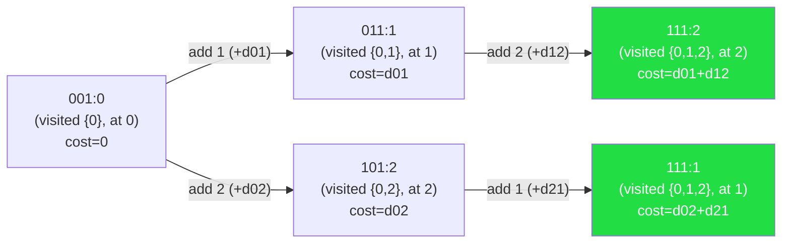

# Bitmask DP

## Prerequisites

[Bit Manipulation](../algorithms/bit-manipulation.md) [Must read] - bitmask DP uses bitwise ops to encode/test/update subset state; you need AND, OR, shift, and popcount fluently.
[Dynamic Programming](../algorithms/dynamic-programming.md) [Must read] - bitmask DP is standard DP where the state dimension is a subset; memoisation and tabulation apply directly.

## Table of Contents

- [What it is](#what-it-is)
- [Recognition signals](#recognition-signals)
- [How it works](#how-it-works)
- [Skeleton](#skeleton)
- [Complexity](#complexity)
- [Constraints & approach](#constraints--approach)
- [Variations](#variations)
- [CP-primitives](#cp-primitives)
- [Worked problems](#worked-problems)
- [Pitfalls](#pitfalls)
- [First 30 seconds](#first-30-seconds)
- [Related](#related)
- [Practice problems](#practice-problems)

## What it is

Bitmask DP encodes a **subset of n items as an n-bit integer** and uses it as a DP state dimension, turning exponential-time exhaustive search into a memoised table of size 2ⁿ.

**Mental model:** each bit `i` in the mask answers "have we included item i?" - so mask `0b1011` means items 0, 1, and 3 are in the set. Transitions expand one subset to slightly larger ones, building up from the empty mask to the full mask.

> **Interview soundbite:** "Bitmask DP - encode which items you've used as a single integer, DP over all 2ⁿ subsets. The n ≤ 20 constraint is the trigger."

## Recognition signals

**(a) Trigger phrases** - literal problem-statement snippets that point here:

- "visit every city exactly once" / "minimum cost tour"
- "assign each task to exactly one worker"
- "find the minimum number of steps to cover all nodes"
- "partition the set into subsets such that …"
- "how many ways to seat n people such that …"
- "given n ≤ 20 items, find the optimal …"

**(b) Structural cues** - input shape + output property:

- **n ≤ 20** (hard ceiling - this constraint almost always signals bitmask DP or bitmask backtracking)
- Problem asks for optimal cost, count, or feasibility **over all possible subsets or orderings** of a small set
- Each element can be "used" or "not used" and the choice affects future decisions (state dependency between elements)
- A pair-cost or compatibility matrix is given for all (i, j) pairs - TSP, assignment, scheduling

**(c) Not to be confused with:**

- **Plain backtracking** - backtracking also exhausts subsets but without memoisation; if the same (subset, last-item) pair can be reached via multiple orderings, backtracking re-solves it every time, bitmask DP does not. When subproblems overlap, use bitmask DP.
- **Bitmask enumeration / bit manipulation** - iterating over subsets with bitwise tricks (no DP recurrence, no overlapping subproblems); the pattern is just subset iteration, not DP.
- **Knapsack DP** - items have weights/values, you pick a subset bounded by capacity; state is `(index, remaining_capacity)`, not the full subset. Use knapsack when n is large (up to 10⁵) and you don't need to know *which* items were chosen per transition.

## How it works

The classic vehicle is the **Travelling Salesman Problem (TSP)**: given n cities and pairwise distances, find the minimum-cost tour visiting all cities exactly once.

**State:** `dp[mask][i]` = minimum cost to have visited exactly the cities in `mask`, ending at city `i`.

**Transition:** to extend to city `j` not yet in `mask`:

```
dp[mask | (1 << j)][j] = min(dp[mask | (1 << j)][j],
                              dp[mask][i] + dist[i][j])
```

**Base case:** `dp[1 << start][start] = 0` (at the start city, only it visited, zero cost).

**Answer:** `min over all i of dp[(1<<n)-1][i] + dist[i][start]` (full mask, return home).

**State-space diagram for n = 3 cities (0, 1, 2)** - nodes are `mask:endpoint`, edges show which city is added:



Answer = `min(dp[111][1] + d[1][0], dp[111][2] + d[2][0])` - return to city 0 from the green nodes.

**Iteration order:** enumerate masks in increasing order (smaller subsets before larger ones). For each mask, iterate over every bit `i` set in it (current endpoint), then every bit `j` not set (next city). This ensures `dp[mask][i]` is fully computed before it's used to extend.

**Why O(2ⁿ · n²)?** 2ⁿ masks × n possible last cities × n possible next cities = 2ⁿ · n² transitions.

Cache behaviour: `dp` is a 2ⁿ × n table accessed sequentially per mask - **cache-friendly row-by-row fill**, much better than the recursion tree it replaces.

## Skeleton

**Pseudocode (CLRS style):**

```
BITMASK-DP(n, cost)
  ▷ cost[i][j] = cost of going from i to j
  dp[0..2ⁿ-1][0..n-1] ← ∞
  dp[1][0] ← 0                          ▷ start at node 0, mask = {0}
  for mask = 1 to 2ⁿ - 1
    for i = 0 to n - 1
      if bit i not set in mask then continue
      if dp[mask][i] = ∞ then continue
      for j = 0 to n - 1
        if bit j set in mask then continue
        new_mask ← mask | (1 << j)
        dp[new_mask][j] ← min(dp[new_mask][j], dp[mask][i] + cost[i][j])
  return min over all i of dp[2ⁿ - 1][i] + cost[i][0]
```

**Python template:**

```python
from typing import List
import math

def bitmask_dp(n: int, cost: List[List[int]]) -> int:
    FULL = (1 << n) - 1
    INF = math.inf

    # dp[mask][i] = min cost to have visited exactly the nodes in mask, ending at i
    dp: List[List[float]] = [[INF] * n for _ in range(1 << n)]
    dp[1][0] = 0

    for mask in range(1, 1 << n):
        for i in range(n):
            if not (mask >> i & 1):
                continue
            if dp[mask][i] == INF:
                continue
            for j in range(n):
                if mask >> j & 1:
                    continue
                # your logic here: compute transition cost and update
                new_mask = mask | (1 << j)
                dp[new_mask][j] = min(dp[new_mask][j], dp[mask][i] + cost[i][j])

    best = min(dp[FULL][i] + cost[i][0] for i in range(n))
    return -1 if best == INF else int(best)  # -1 if no Hamiltonian cycle exists
```

## Complexity

| Dimension     | Cost          | Notes                                              |
| ------------- | ------------- | -------------------------------------------------- |
| Time          | O(2ⁿ · n²)   | TSP/tour: 2ⁿ masks × n endpoints × n transitions  |
| Time (simpler)| O(2ⁿ · n)    | Assignment / coverage: one choice per mask         |
| Space         | O(2ⁿ · n)    | The DP table; sometimes reducible to O(2ⁿ)         |

The dominant constant is the inner `n` or `n²` loop. At n = 20, `2²⁰ · 20 ≈ 20M` - fits in ~1s. At n = 20 with n², `2²⁰ · 400 ≈ 400M` - tight; optimise inner loop.

## Constraints & approach

| n (set size)    | Expected complexity            | Approach                                                                          |
| --------------- | ------------------------------ | --------------------------------------------------------------------------------- |
| n ≤ 12          | O(2ⁿ · n²) comfortably         | Full bitmask DP; TSP, assignment - no constant-factor worry                       |
| 12 < n ≤ 20     | O(2ⁿ · n) or O(2ⁿ · n²) tight  | Bitmask DP; profile carefully - n=20 with n² inner loop may need pruning          |
| 20 < n ≤ 40     | O(2^(n/2) · n)                 | Meet-in-the-middle: split into two halves, enumerate each, join (see CP-primitives) |
| n > 40          | Exponential - too slow          | Seek problem structure: greedy, flow, matching, branch-and-bound, or approximation |

**The constraint tells you the algorithm:** seeing n ≤ 20 in a problem with pairwise costs or "visit all" semantics is the single strongest signal for bitmask DP. Seeing 20 < n ≤ 40 with the same shape points to meet-in-the-middle.

**What it rules out:** n ≤ 20 rules out O(n!) brute force (20! ≈ 2.4 × 10¹⁸). It invites O(2ⁿ · poly(n)) - that's bitmask DP's sweet spot.

**Real-world usage:** compiler register allocation uses bitmask DP over n ≤ 20 physical registers to assign variables to registers optimally; OS job schedulers use it for small task sets (n ≤ 16) where exact optimal assignment matters. At scale the bottleneck is memory - a 2²⁰ × 20 table of 64-bit ints is ~160 MB, which fits in L3 cache only at smaller n; beyond n ≈ 23 the table stops fitting in RAM on typical contest judges.

## Variations

- **TSP / minimum-cost tour** - the canonical form; dp[mask][i] = min cost ending at i having visited mask.
- **Minimum cost to cover all nodes** - dp[mask] = min cost to cover exactly the nodes in mask; no endpoint dimension needed when coverage order doesn't matter.
- **Optimal assignment (n workers, n tasks)** - mask encodes which tasks are done; popcount(mask) gives which worker is next; dp[mask] = min cost assigning popcount(mask) tasks.
- **Counting Hamiltonian paths** - same DP table, addition instead of min.
- **Broken-profile DP** - for grid tiling problems (e.g. domino tiling); mask encodes the "profile" of the boundary between filled and unfilled cells, transitioning column by column.
- **Subset-sum over subsets (SOS DP)** - compute, for every mask, the sum (or max/min) over all its subsets; O(2ⁿ · n) via the "contribution" technique (see CP-primitives).

## CP-primitives

### 1. SOS DP - Sum over Subsets in O(2ⁿ · n)

**Why for CP:** computing `f[mask] = Σ g[sub]` for every submask `sub ⊆ mask` naively is O(3ⁿ) total (each mask has 2^popcount submasks; summed over all masks = 3ⁿ by binomial theorem). SOS DP brings it to O(2ⁿ · n) by iterating over each bit dimension independently.

```python
# g[mask] given; compute f[mask] = sum of g[sub] for all sub ⊆ mask
f = g[:]
for i in range(n):
    for mask in range(1 << n):
        if mask >> i & 1:
            f[mask] += f[mask ^ (1 << i)]  # add contribution from sub without bit i
```

**Concrete example (n=3):** suppose `g = [0, 1, 1, 0, 1, 0, 0, 0]` (g[mask]=1 means mask is a "good" subset - items {0}, {1}, {2} are good). After SOS:

```
f[0b111] = g[111] + g[110] + g[101] + g[100] + g[011] + g[010] + g[001] + g[000]
         = 0 + 0 + 0 + 0 + 0 + 1 + 1 + 1 = 3   (three good subsets of {0,1,2})
f[0b011] = g[011] + g[010] + g[001] + g[000]
         = 0 + 1 + 1 + 0 = 2               (two good subsets of {0,1})
```

**Typical use:** AND-convolution, counting pairs with AND=0, frequency aggregation over subsets in OR-convolution problems.

### 2. Iterating over all submasks of a mask in O(3ⁿ) total

**Why for CP:** some problems need to split a mask into two complementary subsets (e.g. partition into two teams with min cost-diff). Naively O(4ⁿ); the "submask iteration" trick is O(3ⁿ) because each mask has at most 2^popcount(mask) submasks, and Σ C(n,k)·2^k = 3ⁿ.

```python
mask = some_mask
sub = mask
while sub > 0:
    sub = (sub - 1) & mask  # next submask
# Note: sub=0 (empty set) is also a valid submask; handle separately if needed
```

**Typical use:** subset-convolution, AND/OR/XOR convolutions, partitioning problems where both halves matter.

### 3. Meet-in-the-Middle for n ≤ 40

**Why for CP:** when n ≤ 40, full bitmask DP is O(2⁴⁰) ≈ 10¹² - impossible. Split items into two halves of size 20 each, enumerate all 2²⁰ subsets of each half independently, then join (sort + binary search or hash map). Total O(2^(n/2) · n) ≈ 20M - feasible.

**When to reach for it:** "n ≤ 40, find subset with sum closest to target" / "count pairs of subsets with XOR = k".

## Worked problems

### TSP (Travelling Salesman Problem)

Given n cities (n ≤ 15) and an n×n distance matrix, find the minimum-cost Hamiltonian cycle (visit all cities exactly once, return to start). Constraints: n ≤ 15, distances are non-negative integers.

**Approach:** `dp[mask][i]` = min cost to have visited exactly the cities in `mask`, currently at city `i`. Transition: extend to any unvisited city `j`. This memoises the O(n!) brute force into O(2ⁿ · n²) by recognising that two paths reaching the same (mask, endpoint) are interchangeable.

**Duplicate problems:**
- Shortest Hamiltonian Path (no return) - same DP, skip the `+ dist[i][0]` return leg.
- Minimum cost to visit all nodes (directed, any start) - same table, initialise all `dp[1<<i][i] = 0` and take `min dp[FULL][i]` without return.

### Minimum Number of Work Sessions (LC 1986)

Given n tasks (n ≤ 14) each with a duration, and a session length, find the minimum number of sessions needed to finish all tasks. Each session can hold any subset of tasks as long as their total duration ≤ sessionTime.

**Approach:** `dp[mask]` = min sessions to complete exactly the tasks in `mask`. For each mask, try adding any contiguous subsequence of unfinished tasks that fits in one session. Equivalently: find the minimum number of subsets that partition the full mask, each with sum ≤ sessionTime. O(3ⁿ) via submask enumeration - precompute `fits[sub]` (does subset `sub` fit in one session), then `dp[mask] = min(dp[mask ^ sub] + 1)` over all fitting submasks `sub ⊆ mask`.

**Duplicate problems:**
- Partition to K Equal Sum Subsets (LC 698) - partition n ≤ 16 numbers into k equal-sum groups; same submask enumeration.
- Fair Distribution of Cookies (LC 2305) - distribute cookies to k children minimising the max; same bitmask DP shape.

### Shortest Path Visiting All Nodes (LC 847)

Given an undirected graph of n ≤ 12 nodes, find the length of the shortest path that visits every node (revisits allowed, no fixed start). Constraints: n ≤ 12.

**Approach:** BFS over states `(node, visited_mask)`. Initial queue contains all `(i, 1<<i)` for every node (any start). BFS guarantees shortest path. State space: n × 2ⁿ ≈ 12 × 4096 = 49K - tiny. This blends BFS with bitmask DP: the "DP" part is the visited mask encoding which nodes are done; BFS handles the shortest-path layer.

**Duplicate problems:**
- Minimum Cost to Connect All Points as a tour - switch BFS to DP with cost matrix.

### Optimal Assignment (LC 1947 / Assignment Problem)

Given n workers and n jobs, with a compatibility matrix `compatible[i][j]` (worker i can do job j or not), find the maximum number of assignments, or the minimum cost assignment. n ≤ 20.

**Approach:** `dp[mask]` = max assignments when `mask` encodes which jobs are done. The worker index is implicit: `popcount(mask)` = number of jobs assigned = index of the next worker. Transition: for the next worker `w = popcount(mask)`, try assigning any unassigned job `j` - `dp[mask | (1<<j)] = max(dp[mask | (1<<j)], dp[mask] + compatible[w][j])`. O(2ⁿ · n), space O(2ⁿ).

**Duplicate problems:**
- Minimum Cost to Assign Tasks (classic) - same DP, min instead of max.
- Maximum Students Taking Exam (LC 1349) - seats on rows, broken-profile DP variant; same bitmask shape but per-row state.

### Counting Hamiltonian Paths (Count of All Permutations with Constraints)

Given a directed graph of n ≤ 15 nodes and a set of allowed edges, count the number of Hamiltonian paths (visiting every node exactly once). Constraints: n ≤ 15.

**Approach:** `dp[mask][i]` = number of paths visiting exactly the nodes in `mask`, ending at `i`. Transition: `dp[mask | (1<<j)][j] += dp[mask][i]` for every allowed edge `(i, j)` where `j ∉ mask`. Sum `dp[FULL][i]` over all `i` for the answer. Same table as TSP, addition instead of min.

**Duplicate problems:**
- Count Hamiltonian Cycles - same + return edge check.
- Number of Ways to Assign n Distinct Jobs to n Distinct Workers with Restrictions - identical structure.

## Pitfalls

1. **Wrong base case mask.** `dp[0][0] = 0` vs `dp[1<<start][start] = 0` - these are different problems. If the start node is fixed, initialise only `dp[1<<start][start]`. If any node can be the start (e.g. LC 847), push all `(i, 1<<i)` into the initial queue. A wrong base case silently gives a wrong answer with no runtime error.

2. **`1 << n` integer overflow when n ≥ 31 (Python is immune; C++ is not).** In C++, shifting into or past the sign bit of a 32-bit `int` is undefined behaviour - `1 << 31` is already UB. Use `1LL << n` whenever n ≥ 31 to promote to a 64-bit operand. Python integers are arbitrary precision so this doesn't bite in Python - but problem setters set n ≤ 20 partly for C++ safety too.

3. **Iterating masks in wrong order.** Smaller subsets must be computed before larger ones. Always `for mask in range(1, 1 << n)` - since mask increases monotonically and adding a bit strictly increases the mask value, correctness is guaranteed. Iterating in reverse or randomly breaks the dependency.

4. **Treating bitmask DP as the answer for n > 20.** At n = 25, `2²⁵ · 25 ≈ 800M` - TLE. If you see n ≤ 40, pivot to meet-in-the-middle. If n > 40, look for structure (greedy, flow, matching) - bitmask DP is the wrong tool.

5. **Forgetting that popcount(mask) gives the "which step" index.** In assignment problems, the next worker's index is `popcount(mask)` - you don't need an explicit loop over workers. Forgetting this adds a spurious O(n) factor and introduces double-assignment bugs.

6. **Off-by-one on the full mask.** Full mask = `(1 << n) - 1`, not `(1 << n)`. Querying `dp[(1<<n)][i]` is an out-of-bounds access (or always INF in Python if the table is allocated correctly). Double-check: for n=3, FULL = 0b111 = 7 = (1<<3)-1.

## First 30 seconds

"n is at most 20 and the problem asks for the minimum cost (or count, or feasibility) of some assignment or traversal over all elements - that's bitmask DP. The mask encodes *which* elements are done; DP over all 2ⁿ masks memoises what would otherwise be an exhaustive search. State is `dp[mask][last_item]` if order matters, `dp[mask]` if it doesn't. Transition: extend from mask by setting one more bit."

## Related

- [Bit Manipulation](../algorithms/bit-manipulation.md) - the low-level ops (AND/OR/shift/popcount) that bitmask DP rides on.
- [Dynamic Programming](../algorithms/dynamic-programming.md) - the general framework; bitmask DP is DP where one state dimension is a subset integer.
- [Backtracking](./backtracking.md) - the non-memoised cousin; use backtracking when n is small and subproblems don't overlap; switch to bitmask DP when they do.
- [DP Patterns](./dp-patterns.md) - other DP shapes (knapsack, LIS, interval DP); bitmask DP is the "exponential state" entry in that family.
- [Subsets & Permutations](./subsets-permutations.md) - backtracking enumeration of subsets without DP; useful when n ≤ 10 and overlap is absent.

## Practice problems

### Travelling Salesman Problem (classic / LC 847 variant)

n cities (n ≤ 15), n×n cost matrix. Find the minimum cost to visit every city exactly once and return to the start. Constraints shape the approach: n ≤ 12 is comfortable O(2ⁿ · n²); n = 20 is the ceiling - prune the inner loop by skipping `dist[i][j] == INF`.

**Approach/insight:** `dp[mask][i]` = min cost reaching city `i` having visited exactly `mask`. The key insight is that the *set* of visited cities plus the *last* city is sufficient state - the order within the visited set doesn't matter for future cost. This collapses O(n!) paths into O(2ⁿ · n) states.

```python
from typing import List
import math

def tsp(n: int, dist: List[List[int]]) -> int:
    INF = math.inf
    dp = [[INF] * n for _ in range(1 << n)]
    dp[1][0] = 0

    for mask in range(1, 1 << n):
        for i in range(n):
            if not (mask >> i & 1) or dp[mask][i] == INF:
                continue
            for j in range(n):
                if mask >> j & 1:
                    continue
                new_mask = mask | (1 << j)
                dp[new_mask][j] = min(dp[new_mask][j], dp[mask][i] + dist[i][j])

    full = (1 << n) - 1
    return int(min(dp[full][i] + dist[i][0] for i in range(1, n)))
```

**Time:** O(2ⁿ · n²) - **Space:** O(2ⁿ · n)

**Duplicate problems:**
- Find the Shortest Superstring (LC 943) - string TSP; `dist[i][j]` = overlap reduction between strings i and j; same DP, track parent for path reconstruction.
- Minimum Cost to Visit All Nodes (directed, any start) - same table, all nodes as valid start, no return leg.

---

### Partition to K Equal Sum Subsets (LC 698)

Given an array of n ≤ 16 integers and k, determine if the array can be partitioned into k non-empty subsets with equal sum. Constraints: n ≤ 16 (the signal for bitmask DP over subsets).

**Approach/insight:** precompute `target = total / k`. `dp[mask]` = True if the elements in `mask` can be perfectly partitioned into some number of groups each summing to `target`. Transition: for each mask, find the largest fitting subset `sub ⊆ mask` with `sum(sub) == target`; if `dp[mask ^ sub]` is True, so is `dp[mask]`. The key: precompute which subsets sum to `target`, then do subset-DP. O(3ⁿ) via submask enumeration (but n ≤ 16, so 3¹⁶ ≈ 43M - fine).

```python
from typing import List
from functools import lru_cache

def can_partition_k_subsets(nums: List[int], k: int) -> bool:
    total = sum(nums)
    if total % k:
        return False
    target = total // k
    n = len(nums)
    full = (1 << n) - 1

    @lru_cache(maxsize=None)
    def dp(mask: int, current: int) -> bool:
        # mask = elements already placed; current = running sum in the active bucket
        if mask == full:
            return True
        for i in range(n):
            if mask >> i & 1:
                continue
            new_sum = current + nums[i]
            if new_sum > target:
                continue
            # new_sum % target resets bucket to 0 when it just hit target exactly
            if dp(mask | (1 << i), new_sum % target):
                return True
        return False

    return dp(0, 0)
```

**Time:** O(2ⁿ · n) - **Space:** O(2ⁿ)

**Duplicate problems:**
- Fair Distribution of Cookies (LC 2305) - distribute n ≤ 8 cookie bags to k children minimising max; same state, min instead of feasibility.
- Number of Ways to Wear Different Hats to Each Other (LC 1434) - assignment DP; same bitmask structure.

---

### Maximum Students Taking Exam (LC 1349)

An m×n exam room grid has broken seats (`#`) and working seats (`.`). Students cannot sit adjacent (same row: left/right) or diagonally adjacent across rows. Find the maximum number of students that can be seated. Constraints: m ≤ 5, n ≤ 8.

**Approach/insight:** broken-profile DP - `dp[row][mask]` = max students seated in rows 0..row where `mask` encodes which seats in `row` are occupied. Transition: for each row, enumerate valid seat masks (no two adjacent bits set, no broken seats used), then check diagonal conflicts with the previous row's mask. This is bitmask DP over rows, with n ≤ 8 bits per row = 256 masks. The constraint `n ≤ 8` is the n ≤ 20 signal applied to a 2D grid.

```python
from typing import List

def max_students(seats: List[List[str]]) -> int:
    m, n = len(seats), len(seats[0])

    row_masks = [
        sum(1 << j for j in range(n) if seats[i][j] == '.') for i in range(m)
    ]

    INF = -1
    dp = [INF] * (1 << n)
    dp[0] = 0

    for i in range(m):
        new_dp = [INF] * (1 << n)
        valid = row_masks[i]
        for prev_mask in range(1 << n):
            if dp[prev_mask] == INF:
                continue
            for mask in range(1 << n):
                if mask & valid != mask:
                    continue
                # no two adjacent in same row
                if mask & (mask >> 1):
                    continue
                # no diagonal conflicts with previous row
                if prev_mask & (mask << 1) or prev_mask & (mask >> 1):
                    continue
                count = bin(mask).count('1')
                if new_dp[mask] < dp[prev_mask] + count:
                    new_dp[mask] = dp[prev_mask] + count
        dp = new_dp

    return max(dp)
```

**Time:** O(m · 4ⁿ) - **Space:** O(2ⁿ)

**Duplicate problems:**
- Domino Tiling (classic CP) - broken-profile DP over columns; same per-column mask transitions.
- Maximum AND Sum of Array (LC 2172) - assign n ≤ 9 nums to 3·k slots; `dp[mask]` = max AND sum; same assignment DP.
