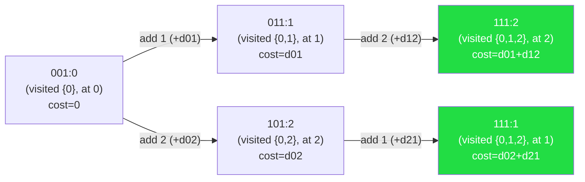

# Bitmask DP

## Prerequisites

[Bit Manipulation](../algorithms/bit-manipulation.md) [Must read]
[Dynamic Programming](../algorithms/dynamic-programming.md) [Must read]

## Table of Contents

- [What it is](#what-it-is)
- [Recognition signals](#recognition-signals)
- [How it works](#how-it-works)
- [Complexity](#complexity)
- [Constraints & approach](#constraints--approach)
- [Variations](#variations)
- [Pitfalls](#pitfalls)
- [First 30 seconds](#first-30-seconds)
- [Related](#related)
- [Practice problems](#practice-problems)
  - [Travelling Salesman Problem (classic)](#1-travelling-salesman-problem-classic)
  - [Partition to K Equal Sum Subsets (LC 698)](#2-partition-to-k-equal-sum-subsets-lc-698)
  - [Maximum Students Taking Exam (LC 1349)](#3-maximum-students-taking-exam-lc-1349)
  - [Shortest Path Visiting All Nodes (LC 847)](#4-shortest-path-visiting-all-nodes-lc-847)
  - [Optimal Assignment (LC 1947-style)](#5-optimal-assignment-lc-1947-style)
  - [Sum Over All Subsets (SOS DP)](#6-sum-over-all-subsets-sos-dp)
  - [Smallest Sufficient Team (LC 1125)](#7-smallest-sufficient-team-lc-1125)
  - [Closest Subsequence Sum (LC 1755)](#8-closest-subsequence-sum-lc-1755)

## What it is

Bitmask DP encodes a **subset of n items as an n-bit integer** and uses it as a DP state dimension, turning exponential-time exhaustive search into a memoised table of size 2ⁿ.

**Mental model:** each bit `i` in the mask answers "have we included item i?" - so mask `0b1011` means items 0, 1, and 3 are in the set. Transitions expand one subset to slightly larger ones, building up from the empty mask to the full mask.

> **Interview soundbite:** "Bitmask DP - encode which items you've used as a single integer, DP over all 2ⁿ subsets. The n ≤ 20 constraint is the trigger."

## Recognition signals

**(a) Trigger phrases** - literal problem-statement snippets that point here:

- "visit every city exactly once" / "minimum cost tour"
- "assign each task to exactly one worker"
- "find the minimum number of steps to cover all nodes"
- "partition the set into subsets such that …"
- "how many ways to seat n people such that …"
- "given n ≤ 20 items, find the optimal …"

**(b) Structural cues** - input shape + output property:

- **n ≤ 20** (hard ceiling - this constraint almost always signals bitmask DP or bitmask backtracking)
- Problem asks for optimal cost, count, or feasibility **over all possible subsets or orderings** of a small set
- Each element can be "used" or "not used" and the choice affects future decisions (state dependency between elements)
- A pair-cost or compatibility matrix is given for all (i, j) pairs - TSP, assignment, scheduling

**(c) Not to be confused with:**

- **Plain backtracking** - backtracking also exhausts subsets but without memoisation; if the same (subset, last-item) pair can be reached via multiple orderings, backtracking re-solves it every time, bitmask DP does not. When subproblems overlap, use bitmask DP.
- **Bitmask enumeration / bit manipulation** - iterating over subsets with bitwise tricks (no DP recurrence, no overlapping subproblems); the pattern is just subset iteration, not DP.
- **Knapsack DP** - items have weights/values, you pick a subset bounded by capacity; state is `(index, remaining_capacity)`, not the full subset. Use knapsack when n is large (up to 10⁵) and you don't need to know *which* items were chosen per transition.

## How it works

Consider the shape of "visit every node exactly once at minimum cost, then return to the start": given n nodes and pairwise distances, find the minimum-cost tour visiting all of them exactly once.

**State:** `dp[mask][i]` = minimum cost to have visited exactly the cities in `mask`, ending at city `i`.

**Transition:** to extend to city `j` not yet in `mask`:

```
dp[mask | (1 << j)][j] = min(dp[mask | (1 << j)][j],
                              dp[mask][i] + dist[i][j])
```

**Base case:** `dp[1 << start][start] = 0` (at the start city, only it visited, zero cost).

**Answer:** `min over all i of dp[(1<<n)-1][i] + dist[i][start]` (full mask, return home).

**State-space diagram for n = 3 cities (0, 1, 2)** - nodes are `mask:endpoint`, edges show which city is added:


```mermaid
graph LR
    A["001:0<br/>(visited {0}, at 0)<br/>cost=0"]
    B["011:1<br/>(visited {0,1}, at 1)<br/>cost=d01"]
    C["101:2<br/>(visited {0,2}, at 2)<br/>cost=d02"]
    D["111:2<br/>(visited {0,1,2}, at 2)<br/>cost=d01+d12"]
    E["111:1<br/>(visited {0,1,2}, at 1)<br/>cost=d02+d21"]

    A -->|"add 1 (+d01)"| B
    A -->|"add 2 (+d02)"| C
    B -->|"add 2 (+d12)"| D
    C -->|"add 1 (+d21)"| E

    style D fill:#2d4,color:#fff
    style E fill:#2d4,color:#fff
```

Answer = `min(dp[111][1] + d[1][0], dp[111][2] + d[2][0])` - return to city 0 from the green nodes.

**Iteration order:** enumerate masks in increasing order (smaller subsets before larger ones). For each mask, iterate over every bit `i` set in it (current endpoint), then every bit `j` not set (next city). This ensures `dp[mask][i]` is fully computed before it's used to extend.

**Why O(2ⁿ · n²)?** 2ⁿ masks × n possible last cities × n possible next cities = 2ⁿ · n² transitions.

Cache behaviour: `dp` is a 2ⁿ × n table accessed sequentially per mask - **<abbr>cache-friendly</abbr> row-by-row fill**, much better than the recursion tree it replaces.

## Complexity

| Dimension     | Cost          | Notes                                              |
| ------------- | ------------- | -------------------------------------------------- |
| Time          | O(2ⁿ · n²)   | TSP/tour: 2ⁿ masks × n endpoints × n transitions  |
| Time (simpler)| O(2ⁿ · n)    | Assignment / coverage: one choice per mask         |
| Space         | O(2ⁿ · n)    | The DP table; sometimes reducible to O(2ⁿ)         |

The dominant constant is the inner `n` or `n²` loop. At n = 20, `2²⁰ · 20 ≈ 20M` - fits in ~1s. At n = 20 with n², `2²⁰ · 400 ≈ 400M` - tight; optimise inner loop.

## Constraints & approach

| n (set size)    | Expected complexity            | Approach                                                                          |
| --------------- | ------------------------------ | --------------------------------------------------------------------------------- |
| n ≤ 12          | O(2ⁿ · n²) comfortably         | Full bitmask DP; TSP, assignment - no constant-factor worry                       |
| 12 < n ≤ 20     | O(2ⁿ · n) or O(2ⁿ · n²) tight  | Bitmask DP; profile carefully - n=20 with n² inner loop may need pruning          |
| 20 < n ≤ 40     | O(2^(n/2) · n)                 | Meet-in-the-middle: split into two halves, enumerate each, join (see Practice problems) |
| n > 40          | Exponential - too slow          | Seek problem structure: greedy, flow, matching, branch-and-bound, or approximation |

**The constraint tells you the algorithm:** seeing n ≤ 20 in a problem with pairwise costs or "visit all" semantics is the single strongest signal for bitmask DP. Seeing 20 < n ≤ 40 with the same shape points to meet-in-the-middle.

**What it rules out:** n ≤ 20 rules out O(n!) brute force (20! ≈ 2.4 × 10¹⁸). It invites O(2ⁿ · poly(n)) - that's bitmask DP's sweet spot.

**Real-world usage:** compiler register allocation uses bitmask DP over n ≤ 20 physical registers to assign variables to registers optimally; OS job schedulers use it for small task sets (n ≤ 16) where exact optimal assignment matters. At scale the bottleneck is memory - a 2²⁰ × 20 table of 64-bit ints is ~160 MB, which fits in L3 cache only at smaller n; beyond n ≈ 23 the table stops fitting in RAM on typical contest judges.

## Variations

- **TSP / minimum-cost tour** - the canonical form; dp[mask][i] = min cost ending at i having visited mask.
- **Minimum cost to cover all nodes** - dp[mask] = min cost to cover exactly the nodes in mask; no endpoint dimension needed when coverage order doesn't matter.
- **Optimal assignment (n workers, n tasks)** - mask encodes which tasks are done; popcount(mask) gives which worker is next; dp[mask] = min cost assigning popcount(mask) tasks.
- **Counting Hamiltonian paths** - same DP table, addition instead of min.
- **Broken-profile DP** - for grid tiling problems (e.g. domino tiling); mask encodes the "profile" of the boundary between filled and unfilled cells, transitioning column by column.
- **Subset-sum over subsets (SOS DP)** - compute, for every mask, the sum (or max/min) over all its subsets; O(2ⁿ · n) via the "contribution" technique (see Practice problems).

## Pitfalls

1. **Wrong base case mask.** `dp[0][0] = 0` vs `dp[1<<start][start] = 0` - these are different problems. If the start node is fixed, initialise only `dp[1<<start][start]`. If any node can be the start (e.g. LC 847), push all `(i, 1<<i)` into the initial queue. A wrong base case silently gives a wrong answer with no runtime error.

2. **`1 << n` integer overflow when n ≥ 31 (Python is immune; C++ is not).** In C++, shifting into or past the sign bit of a 32-bit `int` is undefined behaviour - `1 << 31` is already UB. Use `1LL << n` whenever n ≥ 31 to promote to a 64-bit operand. Python integers are arbitrary precision so this doesn't bite in Python - but problem setters set n ≤ 20 partly for C++ safety too.

3. **Iterating masks in wrong order.** Smaller subsets must be computed before larger ones. Always `for mask in range(1, 1 << n)` - since mask increases monotonically and adding a bit strictly increases the mask value, correctness is guaranteed. Iterating in reverse or randomly breaks the dependency.

4. **Treating bitmask DP as the answer for n > 20.** At n = 25, `2²⁵ · 25 ≈ 800M` - TLE. If you see n ≤ 40, pivot to meet-in-the-middle. If n > 40, look for structure (greedy, flow, matching) - bitmask DP is the wrong tool.

5. **Forgetting that popcount(mask) gives the "which step" index.** In assignment problems, the next worker's index is `popcount(mask)` - you don't need an explicit loop over workers. Forgetting this adds a spurious O(n) factor and introduces double-assignment bugs.

6. **Off-by-one on the full mask.** Full mask = `(1 << n) - 1`, not `(1 << n)`. Querying `dp[(1<<n)][i]` is an out-of-bounds access (or always INF in Python if the table is allocated correctly). Double-check: for n=3, FULL = 0b111 = 7 = (1<<3)-1.

## First 30 seconds

"n is at most 20 and the problem asks for the minimum cost (or count, or feasibility) of some assignment or traversal over all elements - that's bitmask DP. The mask encodes *which* elements are done; DP over all 2ⁿ masks memoises what would otherwise be an exhaustive search. State is `dp[mask][last_item]` if order matters, `dp[mask]` if it doesn't. Transition: extend from mask by setting one more bit."

## Related

- [Bit Manipulation](../algorithms/bit-manipulation.md) - the low-level ops (AND/OR/shift/popcount) that bitmask DP rides on.
- [Dynamic Programming](../algorithms/dynamic-programming.md) - the general framework; bitmask DP is <abbr>dynamic programming</abbr> where one state dimension is a subset integer.
- [Backtracking](./backtracking.md) - the non-memoised cousin; use backtracking when n is small and subproblems don't overlap; switch to bitmask DP when they do.
- [DP Patterns](./dp-patterns.md) - other DP shapes (knapsack, LIS, interval DP); bitmask DP is the "exponential state" entry in that family.
- [Subsets & Permutations](./subsets-permutations.md) - backtracking enumeration of subsets without DP; useful when n ≤ 10 and overlap is absent.

## Practice problems

### 1. Travelling Salesman Problem (classic)

n cities (n ≤ 15), n×n cost matrix. Find the minimum cost to visit every city exactly once and return to the start. Constraints shape the approach: n ≤ 12 is comfortable O(2ⁿ · n²); n = 20 is the ceiling - prune the inner loop by skipping `dist[i][j] == INF`.

**Worked examples:**
- **Example 1**
  - **Input:** n = 4, dist = [[0,10,15,20],[10,0,35,25],[15,35,0,30],[20,25,30,0]] | **Output:** 80
  - **Explanation:** tour 0→1→3→2→0 costs 10+25+30+15=80, the minimum over all tours.
- **Example 2**
  - **Input:** n = 2, dist = [[0,5],[5,0]] | **Output:** 10

**Constraints:** `1 ≤ n ≤ 15`, `dist[i][j] ≥ 0`, `dist[i][i] = 0`.

**Approach/insight:** `dp[mask][i]` = min cost reaching city `i` having visited exactly `mask`. The key insight is that the *set* of visited cities plus the *last* city is sufficient state - the order within the visited set doesn't matter for future cost. This collapses O(n!) paths into O(2ⁿ · n) states.

```python
from typing import List
import math

def tsp(n: int, dist: List[List[int]]) -> int:
    INF = math.inf
    dp = [[INF] * n for _ in range(1 << n)]
    dp[1][0] = 0

    for mask in range(1, 1 << n):
        for i in range(n):
            if not (mask >> i & 1) or dp[mask][i] == INF:
                continue
            for j in range(n):
                if mask >> j & 1:
                    continue
                new_mask = mask | (1 << j)
                dp[new_mask][j] = min(dp[new_mask][j], dp[mask][i] + dist[i][j])

    full = (1 << n) - 1
    return int(min(dp[full][i] + dist[i][0] for i in range(1, n)))
```

**Time:** O(2ⁿ · n²) - **Space:** O(2ⁿ · n)

**Duplicate problems:**
- Shortest Hamiltonian Path (no return) - same DP, skip the `+ dist[i][0]` return leg.
- Find the Shortest Superstring (LC 943) - string TSP; `dist[i][j]` = overlap reduction between strings i and j; same DP, track parent for path reconstruction.
- Minimum Cost to Visit All Nodes (directed, any start) - same table, all nodes as valid start, no return leg.
- Counting Hamiltonian Paths (classic) - same `dp[mask][i]` table, addition instead of min: `dp[mask | (1<<j)][j] += dp[mask][i]` for every allowed edge, sum `dp[FULL][i]` for the count.

---

### 2. Partition to K Equal Sum Subsets (LC 698)

Given an array of n ≤ 16 integers and k, determine if the array can be partitioned into k non-empty subsets with equal sum. Constraints: n ≤ 16 (the signal for bitmask DP over subsets).

**Worked examples:**
- **Example 1**
  - **Input:** nums = [4,3,2,3,5,2,1], k = 4 | **Output:** true
  - **Explanation:** four subsets each summing to 5: (5), (1,4), (2,3), (2,3).
- **Example 2**
  - **Input:** nums = [1,2,3,4], k = 3 | **Output:** false

**Constraints:** `1 ≤ k ≤ nums.length ≤ 16`, `1 ≤ nums[i] ≤ 10⁴`.

**Approach/insight:** precompute `target = total / k`. `dp[mask]` = True if the elements in `mask` can be perfectly partitioned into some number of groups each summing to `target`. Transition: for each mask, find the largest fitting subset `sub ⊆ mask` with `sum(sub) == target`; if `dp[mask ^ sub]` is True, so is `dp[mask]`. The key: precompute which subsets sum to `target`, then do subset-DP. O(3ⁿ) via submask enumeration (but n ≤ 16, so 3¹⁶ ≈ 43M - fine).

```python
from typing import List
from functools import lru_cache

def can_partition_k_subsets(nums: List[int], k: int) -> bool:
    total = sum(nums)
    if total % k:
        return False
    target = total // k
    n = len(nums)
    full = (1 << n) - 1

    @lru_cache(maxsize=None)
    def dp(mask: int, current: int) -> bool:
        # mask = elements already placed; current = running sum in the active bucket
        if mask == full:
            return True
        for i in range(n):
            if mask >> i & 1:
                continue
            new_sum = current + nums[i]
            if new_sum > target:
                continue
            # new_sum % target resets bucket to 0 when it just hit target exactly
            if dp(mask | (1 << i), new_sum % target):
                return True
        return False

    return dp(0, 0)
```

**Time:** O(2ⁿ · n) - **Space:** O(2ⁿ)

**Duplicate problems:**
- Fair Distribution of Cookies (LC 2305) - distribute n ≤ 8 cookie bags to k children minimising max; same state, min instead of feasibility.
- Minimum Number of Work Sessions (LC 1986) - same submask-enumeration shape; find the minimum number of subsets partitioning the full mask, each fitting a session-time budget instead of an equal-sum target.

---

### 3. Maximum Students Taking Exam (LC 1349)

An m×n exam room grid has broken seats (`#`) and working seats (`.`). Students cannot sit adjacent (same row: left/right) or diagonally adjacent across rows. Find the maximum number of students that can be seated. Constraints: m ≤ 5, n ≤ 8.

**Worked examples:**
- **Example 1**
  - **Input:** seats = [[".","#",".",".",".","#"],[".","#",".",".",".","."],[".",".",".",".","#","."]] | **Output:** 4
- **Example 2**
  - **Input:** seats = [[".",".","."],[".","#","."],[".",".","."]] | **Output:** 4

**Constraints:** `1 ≤ m ≤ 8`, `1 ≤ n ≤ 8`, `seats[i][j]` is `.` or `#`.

**Approach/insight:** broken-profile DP - `dp[row][mask]` = max students seated in rows 0..row where `mask` encodes which seats in `row` are occupied. Transition: for each row, enumerate valid seat masks (no two adjacent bits set, no broken seats used), then check diagonal conflicts with the previous row's mask. This is bitmask DP over rows, with n ≤ 8 bits per row = 256 masks. The constraint `n ≤ 8` is the n ≤ 20 signal applied to a 2D grid.

```python
from typing import List

def max_students(seats: List[List[str]]) -> int:
    m, n = len(seats), len(seats[0])

    row_masks = [
        sum(1 << j for j in range(n) if seats[i][j] == '.') for i in range(m)
    ]

    INF = -1
    dp = [INF] * (1 << n)
    dp[0] = 0

    for i in range(m):
        new_dp = [INF] * (1 << n)
        valid = row_masks[i]
        for prev_mask in range(1 << n):
            if dp[prev_mask] == INF:
                continue
            for mask in range(1 << n):
                if mask & valid != mask:
                    continue
                # no two adjacent in same row
                if mask & (mask >> 1):
                    continue
                # no diagonal conflicts with previous row
                if prev_mask & (mask << 1) or prev_mask & (mask >> 1):
                    continue
                count = bin(mask).count('1')
                if new_dp[mask] < dp[prev_mask] + count:
                    new_dp[mask] = dp[prev_mask] + count
        dp = new_dp

    return max(dp)
```

**Time:** O(m · 4ⁿ) - **Space:** O(2ⁿ)

**Duplicate problems:**
- Domino Tiling (classic CP) - broken-profile DP over columns; same per-column mask transitions.

---

### 4. Shortest Path Visiting All Nodes (LC 847)

Given an undirected graph of n ≤ 12 nodes, find the length of the shortest path that visits every node (revisits allowed, no fixed start). Constraints: n ≤ 12.

**Worked examples:**
- **Example 1**
  - **Input:** graph = [[1,2,3],[0],[0],[0]] | **Output:** 4
  - **Explanation:** path 1→0→2→0→3 visits all 4 nodes in 4 edges.
- **Example 2**
  - **Input:** graph = [[1],[0,2,4],[1,3,4],[2],[1,2]] | **Output:** 4

**Constraints:** `1 ≤ n ≤ 12`, graph given as adjacency list, connected.

**Approach.** BFS over states `(node, visited_mask)` rather than a table filled by mask order - distinct from every dp[mask]-style entry above because the state-space search itself is BFS, not a DP recurrence filled bottom-up. Initial queue contains all `(i, 1<<i)` for every node (any node can start, since there's no fixed source). BFS guarantees the shortest path since all edges have equal weight. State space: n × 2ⁿ ≈ 12 × 4096 = 49K - tiny. The mask still encodes "which nodes are done" (the bitmask-DP part), but shortest-path-ness comes from BFS level order, not from a min/max transition.

```python
from collections import deque

def shortest_path_length(graph: list[list[int]]) -> int:
    n = len(graph)
    if n == 1:
        return 0
    full = (1 << n) - 1
    visited = set()
    queue = deque()
    for i in range(n):
        state = (i, 1 << i)
        visited.add(state)
        queue.append((i, 1 << i, 0))

    while queue:
        node, mask, steps = queue.popleft()
        if mask == full:
            return steps
        for nb in graph[node]:
            new_mask = mask | (1 << nb)
            if (nb, new_mask) not in visited:
                visited.add((nb, new_mask))
                queue.append((nb, new_mask, steps + 1))
    return -1
```

**Complexity.** O(n² · 2ⁿ) time (each of n·2ⁿ states expands to ≤ n neighbors), O(n · 2ⁿ) space.

**Duplicate problems:**
- Minimum Cost to Connect All Points as a tour - switch BFS to DP with a cost matrix once edges are weighted (becomes a TSP-shaped problem, not BFS).

---

### 5. Optimal Assignment (LC 1947-style)

Given n workers and n jobs, with a compatibility matrix `compatible[i][j]` (worker i can do job j or not), find the maximum number of assignments. Constraints: n ≤ 20.

**Worked examples:**
- **Example 1**
  - **Input:** n = 3, compatible = [[1,1,0],[0,1,1],[1,0,1]] | **Output:** 3
  - **Explanation:** worker 0→job 0, worker 1→job 1, worker 2→job 2 - all compatible.
- **Example 2**
  - **Input:** n = 2, compatible = [[1,1],[1,1]] | **Output:** 2

**Constraints:** `1 ≤ n ≤ 20`, `compatible[i][j]` is 0 or 1.

**Approach.** Distinct from TSP's `dp[mask][i]`: here `dp[mask]` alone suffices, no explicit endpoint dimension, because the worker index is *derived* from the mask itself via `popcount(mask)` (number of jobs assigned so far = index of the next worker to assign). Transition: for the next worker `w = popcount(mask)`, try assigning any unassigned job `j` - `dp[mask | (1<<j)] = max(dp[mask | (1<<j)], dp[mask] + compatible[w][j])`. This popcount-as-implicit-index trick is the reusable insight: whenever items are processed in a fixed, mask-independent order (worker 0, then 1, then 2, ...), the mask's popcount alone tells you which item is next, saving a whole state dimension compared to TSP where the "next" choice is free-form.

```python
def max_assignment(n: int, compatible: list[list[int]]) -> int:
    full = (1 << n) - 1
    dp = [0] * (1 << n)
    for mask in range(full):
        w = bin(mask).count("1")
        if w >= n:
            continue
        for j in range(n):
            if not (mask >> j & 1) and compatible[w][j]:
                dp[mask | (1 << j)] = max(dp[mask | (1 << j)], dp[mask] + 1)
    return dp[full]
```

**Complexity.** O(2ⁿ · n) time, O(2ⁿ) space.

**Duplicate problems:**
- Minimum Cost to Assign Tasks (classic) - same DP, min-cost instead of max-count.
- Number of Ways to Wear Different Hats to Each Other (LC 1434) - same popcount-as-index assignment shape, counts valid assignments instead of maximizing/minimizing one.
- Maximum AND Sum of Array (LC 2172) - assign n ≤ 9 nums to 3·k slots; `dp[mask]` = max AND sum; same assignment-DP shape with a different per-slot scoring function.

---

### 6. Sum Over All Subsets (SOS DP)

Given an array `g` of size `2ⁿ` indexed by bitmask, compute `f[mask] = Σ g[sub]` for every submask `sub ⊆ mask`, for every mask from `0` to `2ⁿ - 1`. Constraints: n ≤ 21 (2²¹ ≈ 2M array entries).

**Worked examples:**
- **Example 1**
  - **Input:** n = 2, g = [0, 1, 1, 0] (indices are masks 00, 01, 10, 11) | **Output:** f = [0, 1, 1, 2]
  - **Explanation:** f[11] sums g over submasks {00,01,10,11} = 0+1+1+0 = 2; f[01] sums over submasks {00,01} = 0+1 = 1.
- **Example 2**
  - **Input:** n = 3, g = [0, 1, 1, 0, 1, 0, 0, 0] | **Output:** f[111] = 3, f[011] = 2
  - **Explanation:** f[111] sums all 8 submasks of the full mask (three of the eight g-values are 1); f[011] sums the 4 submasks of {0,1} (two are 1).

**Constraints:** `1 ≤ n ≤ 21`, `g[mask]` given for all `0 ≤ mask < 2ⁿ`.

**Approach.** Distinct from every dp[mask][i]-shaped entry above - there's no "last item" or transition-by-adding-one-bit here. Instead, iterating each of the n bit positions independently and, for every mask that has that bit set, adding in the contribution from the same mask with that bit cleared, accumulates all `2^popcount(mask)` submask sums in n passes instead of enumerating submasks directly (which costs O(3ⁿ) total - see submask-enumeration note below). Each of the n outer passes is a full O(2ⁿ) sweep, giving O(2ⁿ · n) total - the standard CP trick for AND/OR-convolution and any "aggregate over all subsets of every mask" problem.

```python
def sum_over_subsets(g: list[int], n: int) -> list[int]:
    f = g[:]
    for i in range(n):
        for mask in range(1 << n):
            if mask >> i & 1:
                f[mask] += f[mask ^ (1 << i)]
    return f
```

**Complexity.** O(2ⁿ · n) time, O(2ⁿ) space.

**Duplicate problems:**
- Counting pairs with AND = 0 (classic CP) - same SOS DP used to build a "how many array elements are submasks of X" table, then queried per element.

---

### 7. Smallest Sufficient Team (LC 1125)

Given a list of `n ≤ 60` required skills and `m ≤ 60` people each with a subset of those skills, find the smallest team of people whose combined skills cover every required skill. Constraints: `1 ≤ n ≤ 16` skills (the bitmask dimension), `1 ≤ m ≤ 60` people.

**Worked examples:**
- **Example 1**
  - **Input:** req_skills = ["java","nodejs","reactjs"], people = [["java"],["nodejs"],["nodejs","reactjs"]] | **Output:** [0,2]
  - **Explanation:** person 0 covers "java", person 2 covers "nodejs" and "reactjs" - together they cover all 3 skills with only 2 people.
- **Example 2**
  - **Input:** req_skills = ["algorithms","math","java"], people = [["algorithms"],["math"],["java"]] | **Output:** [0,1,2]

**Constraints:** `1 ≤ req_skills.length ≤ 16`, `1 ≤ people.length ≤ 60`, each person has ≤ 16 skills.

**Approach.** Encode each required skill as a bit and each person as the bitmask of skills they cover. `dp[mask]` = the smallest team (as a list of person-indices) whose combined skill mask is at least `mask`. This is genuinely distinct from the submask-DP shape used elsewhere in this article: rather than enumerating submasks of a fixed mask, it iterates every person against every currently-reachable mask and takes the union `mask | person_skills`, keeping whichever team is smaller whenever a mask is reached two different ways. Track the actual team (not just its size) so the answer can be reconstructed.

```python
def smallest_sufficient_team(req_skills: list[str], people: list[list[str]]) -> list[int]:
    skill_index = {s: i for i, s in enumerate(req_skills)}
    n = len(req_skills)
    person_masks = []
    for skills in people:
        mask = 0
        for s in skills:
            mask |= 1 << skill_index[s]
        person_masks.append(mask)

    full = (1 << n) - 1
    dp: dict[int, list[int]] = {0: []}
    for i, pmask in enumerate(person_masks):
        for mask, team in list(dp.items()):
            new_mask = mask | pmask
            if new_mask == mask:
                continue
            if new_mask not in dp or len(dp[new_mask]) > len(team) + 1:
                dp[new_mask] = team + [i]

    return dp[full]
```

**Complexity.** O(m · 2ⁿ) time and space in the worst case (m people, up to 2ⁿ reachable masks).

**Duplicate problems:**
- Partition to K Equal Sum Subsets (LC 698) - shares the "union/cover masks with a DP table keyed by mask" shape, but tracks a numeric target instead of a set-cover, so treated as a separate worked entry above rather than folded here.

---

### 8. Closest Subsequence Sum (LC 1755)

Given an array of up to 40 integers and a target `goal`, find the minimum absolute difference between `goal` and the sum of any subsequence (including the empty subsequence). Constraints: `1 ≤ n ≤ 40`.

**Worked examples:**
- **Example 1**
  - **Input:** nums = [5,-7,3,5], goal = 6 | **Output:** 0
  - **Explanation:** the subsequence [5,-7,3,5] minus one 5 (i.e. {-7,3,5} summing to 1) isn't it - actually {5,-7,3,5} full sum is 6, matching goal exactly.
- **Example 2**
  - **Input:** nums = [7,-9,15,-2], goal = -5 | **Output:** 1
  - **Explanation:** subsequence {-9,-2}+... closest achievable sum is -6, one away from -5.

**Constraints:** `1 ≤ nums.length ≤ 40`, `-10⁷ ≤ nums[i] ≤ 10⁷`, `-10⁹ ≤ goal ≤ 10⁹`.

**Approach.** n ≤ 40 rules out full bitmask DP (2⁴⁰ is far too large) but is exactly the meet-in-the-middle ceiling: split the array into two halves of ≤ 20 elements each, enumerate all 2²⁰ subset sums of each half independently (cheap - well within a bitmask-DP-sized budget per half), sort one half's sums, then for every sum in the other half binary-search for the complement closest to `goal`. This is the pattern's exponential-state idea (enumerate every subset) applied at double the size bitmask DP alone could reach, by trading the single 2ⁿ table for two 2^(n/2) tables joined at the end.

```python
from bisect import bisect_left

def min_abs_difference(nums: list[int], goal: int) -> int:
    n = len(nums)
    left, right = nums[: n // 2], nums[n // 2 :]

    def all_subset_sums(arr: list[int]) -> list[int]:
        sums = [0]
        for x in arr:
            sums += [s + x for s in sums]
        return sums

    left_sums = sorted(all_subset_sums(left))
    right_sums = sorted(all_subset_sums(right))

    best = float("inf")
    for ls in left_sums:
        target = goal - ls
        i = bisect_left(right_sums, target)
        for j in (i - 1, i):
            if 0 <= j < len(right_sums):
                best = min(best, abs(ls + right_sums[j] - goal))
    return best
```

**Complexity.** O(2^(n/2) · n) time, O(2^(n/2)) space.

**Duplicate problems:**
- Partition array into two subsets minimizing sum difference, n ≤ 40 (classic CP) - identical meet-in-the-middle split/enumerate/join shape, target is 0 instead of an arbitrary goal.
