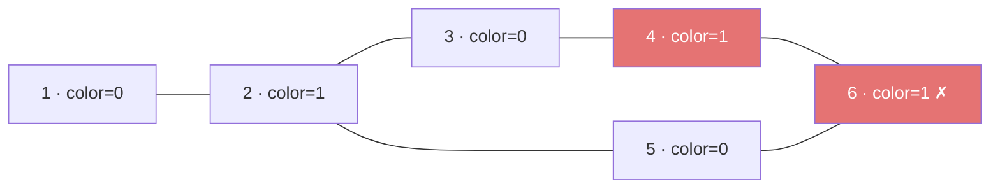
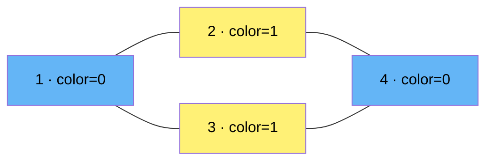

# Graph Coloring

## Prerequisites

- [Graph](../data-structures/graph.md) [Must read] - graph coloring operates on adjacency-list/matrix representations; you need to understand nodes, edges, and adjacency before anything here makes sense
- [BFS](../algorithms/bfs.md) [Must read] - bipartite check (2-coloring) is BFS in disguise; level assignment = color assignment
- [DFS](../algorithms/dfs.md) [Must read] - the backtracking k-coloring approach is DFS + color assignment; cycle detection via DFS underpins odd-cycle proof

## Table of Contents

- [What it is](#what-it-is)
- [Recognition signals](#recognition-signals)
- [How it works](#how-it-works)
- [Skeleton](#skeleton)
- [Complexity](#complexity)
- [Constraints & approach](#constraints--approach)
- [Variations](#variations)
- [CP-primitives](#cp-primitives)
- [Worked problems](#worked-problems)
- [Pitfalls](#pitfalls)
- [First 30 seconds](#first-30-seconds)
- [Related](#related)
- [Practice problems](#practice-problems)

---

## What it is

**Graph coloring** assigns labels ("colors") to graph nodes so that no two adjacent nodes share the same color, using as few colors as possible.

**Mental model:** a map where every country must be a different color from its neighbors. 2 colors = can you split the graph into two independent camps? k colors = can you schedule k resources so no two conflicting tasks share one? The landmark result: every planar graph needs ≤ 4 colors (Four Color Theorem, 1976) — which is why real maps always work with four; general graphs have no such bound.

> **Interview soundbite:** "Graph coloring — assign colors to nodes so no two neighbors match; 2-coloring (bipartite check) runs in O(V + E) with BFS/DFS; k-coloring for k ≥ 3 is NP-complete but backtracking with pruning handles small inputs."

---

## Recognition signals

### (a) Trigger phrases

- *"determine if the graph is bipartite"* / *"can you divide nodes into two groups such that…"*
- *"check if a graph contains an odd-length cycle"*
- *"schedule tasks/courses/exams such that no two conflicting items share the same slot"*
- *"assign frequencies to radio towers so no two nearby towers share a frequency"*
- *"color a map so no two adjacent regions share the same color"*
- *"is it possible to split the employees into two teams such that no two people who dislike each other are on the same team"*

### (b) Structural cues

- Input is a graph (adjacency list / matrix, explicit edges, or an implicit "conflicts with" relation).
- The goal involves **partitioning nodes** such that no two neighbors share the same partition/label/slot/color.
- k = 2: the question is a **yes/no split** or an **odd-cycle check** — always solvable in polynomial time.
- k ≥ 3: the question asks for the **minimum number of colors** or whether k colors suffice — NP-complete for general graphs; exact-color prompts usually appear with **n ≤ 20** (bitmask DP) or a **planar/chordal** graph promise.
- The constraint graph is **not explicitly labeled** as a coloring problem — the signal is conflict/adjacency + partition.

### (c) Not to be confused with

| Pattern | Distinction |
|---|---|
| **BFS / level-order traversal** | 2-coloring IS BFS with colors as level parity — but the output is "bipartite yes/no" and you must detect odd cycles, not just build a level tree. The coloring interpretation changes what you check. |
| **Tree & Graph Traversal** | DFS/BFS for reachability or path-finding don't maintain a color state per node. Graph coloring assigns and validates a persistent label; traversal moves and explores. |
| **Backtracking** | k-coloring for k ≥ 3 uses backtracking, but the pattern here is specifically recognizing the coloring structure from the problem statement — backtracking is the *engine*, graph coloring is the *frame*. |

---

## How it works

### 2-coloring (bipartite check) — O(V + E)

A graph is 2-colorable if and only if it contains **no odd-length cycle**. The BFS proof: assign color 0 to the source, then alternate 0/1 across each edge. If you ever try to color a node that's already colored with the same color as its neighbor, you've found an odd cycle → not bipartite.

**Example — not bipartite (odd cycle):**



BFS from 1 assigns colors 0/1 alternately. Edge (4, 6): both land on color 1 → **conflict → not bipartite**.

**Example — bipartite (even cycles only):**



Blue = color 0, yellow = color 1. Every edge crosses color groups → **bipartite**.

### k-coloring via backtracking — O(k^V)

For k ≥ 3, try assigning colors 1..k to each node in DFS order. Before assigning color c to node v, check that no neighbor of v already has color c. If no color works at v, backtrack. This brute-force is exponential but constraint propagation (forward checking) prunes heavily in practice.

```
Graph triangle: 1—2—3—1, k=3

Assign color[1]=1
  Assign color[2]=2  (neighbor of 1, can't use 1)
    Assign color[3]=3  (neighbor of 1 and 2, can't use 1 or 2) ✓
→ valid 3-coloring: [1,2,3]
```

**Chromatic number:** the minimum k for which a valid coloring exists. Finding it exactly is NP-hard; greedy upper-bounds it at Δ+1 (Δ = max degree).

---

## Skeleton

### 2-coloring (bipartite check)

**Pseudocode:**

```
IS-BIPARTITE(G = (V, E))
  color[v] ← -1 for all v ∈ V
  for each unvisited source s ∈ V:
    color[s] ← 0
    Q ← queue containing s
    while Q not empty:
      u ← DEQUEUE(Q)
      for each neighbor v of u:
        if color[v] = -1:
          color[v] ← 1 − color[u]
          ENQUEUE(Q, v)
        else if color[v] = color[u]:
          return FALSE          ▷ odd cycle found
  return TRUE
```

**Python template:**

```python
from collections import deque
from typing import List

def is_bipartite(graph: List[List[int]]) -> bool:
    n = len(graph)
    color = [-1] * n

    for start in range(n):
        if color[start] != -1:
            continue
        color[start] = 0
        queue = deque([start])
        while queue:
            node = queue.popleft()
            for neighbor in graph[node]:
                if color[neighbor] == -1:
                    color[neighbor] = 1 - color[node]
                    queue.append(neighbor)
                elif color[neighbor] == color[node]:
                    return False  # odd cycle
    return True
```

### k-coloring via backtracking

**Pseudocode:**

```
K-COLOR(G, k, node, color[])
  if node = |V|:
    return TRUE                 ▷ all nodes colored
  for c = 1 to k:
    if IS-SAFE(G, node, c, color):
      color[node] ← c
      if K-COLOR(G, k, node + 1, color):
        return TRUE
      color[node] ← 0           ▷ un-choose
  return FALSE

IS-SAFE(G, node, c, color[])
  for each neighbor v of node:
    if color[v] = c:
      return FALSE
  return TRUE
```

**Python template:**

```python
from typing import List, Optional

def k_color(graph: List[List[int]], k: int) -> Optional[List[int]]:
    n = len(graph)
    color = [0] * n

    def is_safe(node: int, c: int) -> bool:
        return all(color[nb] != c for nb in graph[node])

    def backtrack(node: int) -> bool:
        if node == n:
            return True
        for c in range(1, k + 1):
            if is_safe(node, c):
                color[node] = c
                if backtrack(node + 1):
                    return True
                color[node] = 0  # undo and try next color
        return False

    return color if backtrack(0) else None
```

---

## Complexity

| Variant | Time | Space |
|---|---|---|
| 2-coloring (bipartite check, BFS/DFS) | O(V + E) | O(V) for color array + queue |
| k-coloring, backtracking (worst case) | O(k^V) | O(V) recursion depth + color array |
| k-coloring, bitmask DP (n ≤ 20) | O(2^n · n) | O(2^n) |
| Greedy coloring (Δ+1 bound) | O(V + E) | O(V) |

---

## Constraints & approach

| Input size | Signal | Approach |
|---|---|---|
| n ≤ 10⁵, k = 2 | "bipartite", "split into two teams", "odd cycle" | BFS/DFS 2-coloring, O(V + E) |
| n ≤ 20, arbitrary k | "minimum colors", "chromatic number", exact partition | Bitmask DP over independent sets, O(2^n · n) |
| n ≤ 20, fixed k | "can you color with k colors", small n | Backtracking with IS-SAFE pruning, O(k^n) |
| n ≤ 10⁵, k = 3 or k = 4 | special graph (planar, chordal, bipartite complement) | Exploit structural property; exact coloring without it is NP-hard |
| Very large n, approximate | "minimize conflicts" | Greedy (Δ+1 upper bound); not exact chromatic number |

**When to push off this pattern:** if k ≥ 3 and n > 25 with no structural promise (planar / chordal / interval graph), do not attempt exact coloring — it is NP-complete. The interviewer either means a 2-coloring problem reworded, or is testing that you recognize the complexity boundary.

**At scale:** even 2-coloring breaks down in two ways when n > 10⁸ — the color array itself exceeds memory (one byte per node × 10⁸ = 100 MB), and BFS's queue thrashes the cache as neighbor lists scatter across DRAM. Production graph systems handle this with partitioned BFS (process the graph in shards) or distributed coloring algorithms that trade exact answers for probabilistic guarantees.

---

## Variations

- **Directed graph 2-coloring:** check if the underlying undirected graph is bipartite; direction usually doesn't change the coloring semantics. Use when edges are directed but the conflict is symmetric (e.g., mutual dislike).
- **Edge coloring:** color edges (not nodes) so no two edges sharing a vertex share a color — Vizing's theorem guarantees Δ or Δ+1 colors always suffice. O(E·√V) with the Hopcroft-Karp-based approach. Appears in scheduling problems where *jobs* (edges) share a *machine* (vertex), not the other way around.
- **List coloring:** each node has a prescribed list of allowed colors; determine if a valid assignment exists from the per-node lists. NP-complete in general; polynomial for bipartite graphs (Hall's theorem). Appears as "each worker has a set of available shifts" problems.
- **Greedy coloring:** process nodes in any order; assign the smallest color not used by a neighbor. Gives ≤ Δ+1 colors, O(V + E). Result depends on order — Welsh-Powell (sort by degree descending) consistently produces fewer colors in practice, though still not guaranteed optimal.
- **Interval graph coloring:** clique number = chromatic number for interval graphs (chordal); a greedy left-to-right sweep by start time is optimal in O(n log n). Appears as "minimum conference rooms for overlapping meetings."

---

## CP-primitives

### 1. Bipartite matching via 2-coloring

Once you prove a graph is bipartite (2-colorable), the two color classes become the two sides of a bipartite graph. You can then run **maximum bipartite matching** on it. The pattern: "assign tasks to workers with conflicts" → 2-color to identify the two sides → augmenting-path BFS to find maximum matching.

```python
from typing import List

def max_bipartite_matching(graph: List[List[int]], n: int, color: List[int]) -> int:
    # graph: adjacency list; color[v] in {0,1} assigned by IS-BIPARTITE
    # left side = color 0, right side = color 1
    match_r = [-1] * n  # match_r[v] = left-side node matched to right node v, or -1

    def dfs_augment(u: int, visited: list[bool]) -> bool:
        for v in graph[u]:              # v is a right-side neighbor
            if not visited[v]:
                visited[v] = True
                if match_r[v] == -1 or dfs_augment(match_r[v], visited):
                    match_r[v] = u      # flip the augmenting path
                    return True
        return False

    result = 0
    for u in range(n):
        if color[u] == 0:              # only iterate left-side nodes
            visited = [False] * n
            if dfs_augment(u, visited):
                result += 1
    return result
```

Why for CP: bipartite structure is the gateway to max-flow / matching reductions (job scheduling, minimum vertex cover via König's theorem) that are opaque on an unstructured graph. This DFS augmenting-path matcher runs in O(V · E); Hopcroft-Karp (BFS to find all shortest augmenting paths simultaneously) improves it to O(E√V) for large inputs.

### 2. Bitmask DP for chromatic number (n ≤ 20)

For small graphs, compute the chromatic number exactly:
1. Precompute all **independent sets** (no two adjacent nodes) via subset enumeration: for each mask, check `mask & adj[v] == 0` for all v in mask.
2. DP: `can[mask]` = True if the nodes in `mask` form an independent set.
3. `dp[mask]` = minimum colors to color all nodes in `mask` = min over all independent-set submasks `s ⊆ mask` of `1 + dp[mask ^ s]`.

```python
def chromatic_number(adj: list[int], n: int) -> int:
    # adj[v] = bitmask of v's neighbors
    full = (1 << n) - 1
    indep = [False] * (full + 1)
    for mask in range(full + 1):
        ok = True
        for v in range(n):
            if mask >> v & 1:
                if mask & adj[v] & ((1 << v) - 1):  # earlier neighbor in mask
                    ok = False
                    break
        indep[mask] = ok

    dp = [float('inf')] * (full + 1)
    dp[0] = 0
    for mask in range(1, full + 1):
        sub = mask
        while sub:
            if indep[sub]:
                dp[mask] = min(dp[mask], 1 + dp[mask ^ sub])
            sub = (sub - 1) & mask
    return dp[full]
```

Why for CP: exact chromatic number in O(2^n · n) beats backtracking's O(k^n) for dense graphs with n ≤ 20.

### 3. Odd-cycle detection via 2-coloring

BFS 2-coloring is strictly faster than DFS for odd-cycle detection because it terminates as soon as a cross-edge hits the same color layer, without needing to track back-edge ancestry. Why for CP: in problems that ask "is this constraint graph satisfiable with two categories", a failed 2-coloring pinpoints the exact conflicting edge — useful for printing "which edge causes conflict."

---

## Worked problems

### 1. Is Graph Bipartite? (LC 785)

Given an undirected graph as an adjacency list, determine if it is bipartite. The graph may be disconnected. Constraints: n ≤ 100, edges ≤ 400.

**Approach:** This is IS-BIPARTITE verbatim. BFS from each unvisited node; alternate colors 0/1 across every edge. If any edge connects two same-color nodes an odd cycle exists → not bipartite. Disconnection handled by the outer loop over all unvisited sources — without it, isolated components are silently ignored.

**Solution:**

```python
from collections import deque
from typing import List

def is_bipartite(graph: List[List[int]]) -> bool:
    color = [-1] * len(graph)
    for start in range(len(graph)):
        if color[start] != -1:
            continue
        color[start] = 0
        queue = deque([start])
        while queue:
            node = queue.popleft()
            for nb in graph[node]:
                if color[nb] == -1:
                    color[nb] = 1 - color[node]
                    queue.append(nb)
                elif color[nb] == color[node]:
                    return False
    return True
```

**Complexity:** O(V + E) time, O(V) space.

**Duplicate problems:**
- Possible Bipartition (LC 886) — same BFS 2-coloring; "dislikes" edges form the conflict graph, partition = bipartite sides.
- Divide Nodes into the Maximum Number of Groups (LC 2493) — extends bipartite check per connected component then combines; coloring is still the prerequisite step.

---

### 2. Course Schedule with Conflict Groups (scheduling variant)

You have n exams and a list of pairs `[a, b]` meaning exam a and b cannot be scheduled in the same slot. Determine the minimum number of slots needed if you know the conflict graph is bipartite. Constraints: n ≤ 10⁵.

**Approach:** IS-BIPARTITE with a reframing: "slot" = color, "conflict" = edge. The skeleton runs unchanged — BFS alternating slot 0/1 across conflict edges. A bipartite graph guarantees 2 slots suffice; a failed coloring (odd cycle) means ≥ 3 slots are needed, which lies outside this pattern. The scheduling framing is the only novelty; the algorithm is identical to the 2-color skeleton.

**Solution:**

```python
from collections import deque
from typing import List, Optional

def two_slot_schedule(n: int, conflicts: List[List[int]]) -> Optional[List[int]]:
    graph = [[] for _ in range(n)]
    for a, b in conflicts:
        graph[a].append(b)
        graph[b].append(a)

    slot = [-1] * n
    for start in range(n):
        if slot[start] != -1:
            continue
        slot[start] = 0
        queue = deque([start])
        while queue:
            node = queue.popleft()
            for nb in graph[node]:
                if slot[nb] == -1:
                    slot[nb] = 1 - slot[node]
                    queue.append(nb)
                elif slot[nb] == slot[node]:
                    return None  # not bipartite
    return slot
```

**Complexity:** O(V + E) time, O(V) space.

**Duplicate problems:**
- Flower Planting With No Adjacent (LC 1042) — 3-coloring of a degree-≤-3 graph; greedy assign-first-available color works because degree ≤ 3 guarantees 3 colors always suffice.

---

### 3. Find if Path Exists with Color Constraint (bipartite + query)

Given a graph and a list of "forbidden same-color pairs", determine for each query whether two nodes are in different color groups (LC-style: "is there a valid 2-coloring AND are nodes u and v in different groups?"). Constraints: n ≤ 10⁴.

**Approach:** IS-BIPARTITE first, then use the `color[]` array as the answer store. The skeleton runs unchanged to populate colors; queries are O(1) lookups into that array. Key nuance that goes beyond the skeleton: adjacent nodes are *forced* to different groups by the coloring invariant, but non-adjacent nodes can share a group — so `color[u] != color[v]` answers "are they in different groups under this BFS assignment", not "must they always differ". If the graph is not bipartite, no valid 2-coloring exists → all queries return false.

**Solution:**

```python
from collections import deque
from typing import List, Tuple

def color_queries(
    n: int,
    edges: List[List[int]],
    queries: List[Tuple[int, int]]
) -> List[bool]:
    graph = [[] for _ in range(n)]
    for a, b in edges:
        graph[a].append(b)
        graph[b].append(a)

    color = [-1] * n
    bipartite = True

    for start in range(n):
        if color[start] != -1:
            continue
        color[start] = 0
        queue = deque([start])
        while queue and bipartite:
            node = queue.popleft()
            for nb in graph[node]:
                if color[nb] == -1:
                    color[nb] = 1 - color[node]
                    queue.append(nb)
                elif color[nb] == color[node]:
                    bipartite = False

    if not bipartite:
        return [False] * len(queries)
    return [color[u] != color[v] for u, v in queries]
```

**Complexity:** O(V + E + Q) time, O(V) space.

**Duplicate problems:**
- Check if a Graph is Bipartite (LC 785) — degenerate case of this with zero queries.

---

## Pitfalls

1. **Forgetting disconnected components.** A common mistake is starting BFS from node 0 only. If the graph has multiple connected components, each must be independently 2-colored — missing any component may silently return the wrong answer. Always loop over all unvisited nodes as potential sources.

2. **Conflating "bipartite" with "no cycles."** A bipartite graph can have cycles — it just can't have *odd-length* cycles. The classic trap: "the graph has a cycle, so it can't be bipartite" is wrong. An even-length cycle (4-cycle, 6-cycle) is perfectly fine. The coloring check handles this correctly; don't short-circuit based on cycle presence alone.

3. **Treating k ≥ 3 as tractable for large n.** 3-coloring a general graph with n = 50 is already slow with naive backtracking. If n > 25 and k ≥ 3 appear in a contest/interview, either the graph has a special structure (planar, chordal) or the answer involves 2-coloring reinterpreted. Don't reach for O(k^n) backtracking on large inputs.

4. **Greedy coloring is not optimal, and ordering matters more than most realize.** Greedy assigns at most Δ+1 colors, but the color count is highly sensitive to vertex order — an adversarial ordering can force greedy to use Δ+1 colors on a graph whose chromatic number is 2. Welsh-Powell (process vertices by decreasing degree) consistently reduces the count in practice and is the standard greedy heuristic worth knowing by name. Even so, no polynomial ordering is guaranteed to match the chromatic number on general graphs. For the exact minimum, you need bitmask DP (n ≤ 20) or structural exploitation. Never report greedy output as the chromatic number without qualifying it as an upper bound.

---

## First 30 seconds

"This is a graph coloring problem. If the question asks about splitting into two groups, checking bipartiteness, or detecting odd cycles — that's 2-coloring, solvable in O(V + E) with BFS: alternate colors 0 and 1 across every edge, return false if a same-color collision occurs. If k ≥ 3 and n is small (≤ 20), reach for bitmask DP on independent sets; if n is large, question whether k = 2 is really what's being asked."

---

## Related

- [Graph](../data-structures/graph.md) — the substrate; adjacency list is the standard representation here
- [BFS](../algorithms/bfs.md) — the engine for 2-coloring; level assignment = color assignment
- [DFS](../algorithms/dfs.md) — alternative engine; back-edge detection is the odd-cycle signal
- [Backtracking](./backtracking.md) — the engine for k-coloring (k ≥ 3) via color assignment + undo
- [Bitmask DP](./bitmask-dp.md) — exact chromatic number for n ≤ 20 via independent-set enumeration
- [Tree & Graph Traversal](./tree-graph-traversal.md) — sibling pattern; traversal for reachability vs coloring for partition

---

## Practice problems

### Possible Bipartition (LC 886)

Given n people and a list of "dislike" pairs, determine if you can split everyone into two groups such that no two people who dislike each other are in the same group. Constraints: n ≤ 2000, dislikes ≤ 10⁴.

**Approach:** Build an undirected conflict graph from dislikes. Run BFS 2-coloring: try to assign each person to group 0 or 1. A dislike edge crossing two same-group people signals an odd cycle — return false. Disconnect handled by looping over all unvisited nodes as BFS sources.

**Solution:**

```python
from collections import deque
from typing import List

def possible_bipartition(n: int, dislikes: List[List[int]]) -> bool:
    graph = [[] for _ in range(n + 1)]
    for a, b in dislikes:
        graph[a].append(b)
        graph[b].append(a)

    color = [-1] * (n + 1)
    for start in range(1, n + 1):
        if color[start] != -1:
            continue
        color[start] = 0
        queue = deque([start])
        while queue:
            node = queue.popleft()
            for nb in graph[node]:
                if color[nb] == -1:
                    color[nb] = 1 - color[node]
                    queue.append(nb)
                elif color[nb] == color[node]:
                    return False
    return True
```

**Complexity:** O(V + E) time, O(V + E) space.

**Duplicate problems:**
- Is Graph Bipartite? (LC 785) — identical algorithm; "dislike" edges vs explicit adjacency list, same 2-coloring logic.
- Divide Nodes into the Maximum Number of Groups (LC 2493) — requires bipartite check per component then BFS-layer assignment; coloring is the prerequisite.

---

### Flower Planting With No Adjacent (LC 1042)

You have n gardens (1-indexed) and a list of paths between them. Each garden must be planted with one of 4 flower types such that no two adjacent gardens have the same type. Each garden has at most 3 paths. Return any valid assignment. Constraints: n ≤ 10⁴, paths ≤ 2 × 10⁴.

**Approach:** With max degree 3, there are always ≤ 3 forbidden colors per node, leaving ≥ 1 of the 4 colors available. Greedy: for each garden, collect the colors of its planted neighbors and assign the smallest color not in that set. Order doesn't matter since 4 > max-degree guarantees a color always exists.

**Solution:**

```python
from typing import List

def garden_no_adj(n: int, paths: List[List[int]]) -> List[int]:
    graph = [[] for _ in range(n + 1)]
    for a, b in paths:
        graph[a].append(b)
        graph[b].append(a)

    color = [0] * (n + 1)
    for node in range(1, n + 1):
        used = {color[nb] for nb in graph[node]}
        for c in range(1, 5):
            if c not in used:
                color[node] = c
                break
    return color[1:]
```

**Complexity:** O(V + E) time, O(V + E) space.

**Duplicate problems:**
- Graph Coloring — general greedy formulation; same assign-first-available approach for any bounded-degree graph.

---

### Check Whether the Graph is Bipartite (custom — DFS variant)

Given an undirected graph as an edge list, check bipartiteness using DFS instead of BFS. This variant appears when the problem additionally asks for the exact odd cycle that violates bipartiteness. Constraints: n ≤ 10⁵.

**Approach:** DFS-based 2-coloring tracks color along the DFS tree. When a back edge connects two same-color nodes, the cycle from v up to u through the DFS path is an odd cycle. DFS variant is useful when you need to reconstruct the cycle, not just detect it.

**Solution:**

```python
from typing import List

def is_bipartite_dfs(n: int, edges: List[List[int]]) -> bool:
    graph = [[] for _ in range(n)]
    for a, b in edges:
        graph[a].append(b)
        graph[b].append(a)

    color = [-1] * n

    def dfs(node: int, c: int) -> bool:
        color[node] = c
        for nb in graph[node]:
            if color[nb] == -1:
                if not dfs(nb, 1 - c):
                    return False
            elif color[nb] == c:
                return False
        return True

    return all(color[v] != -1 or dfs(v, 0) for v in range(n))
```

**Complexity:** O(V + E) time, O(V) space (recursion stack depth V in worst case; use iterative DFS for n > 10⁴ to avoid stack overflow in Python).

**Duplicate problems:**
- Is Graph Bipartite? (LC 785) — BFS vs DFS; same problem, same result, different traversal order.
