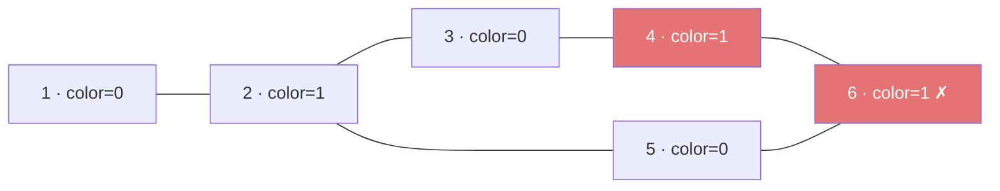
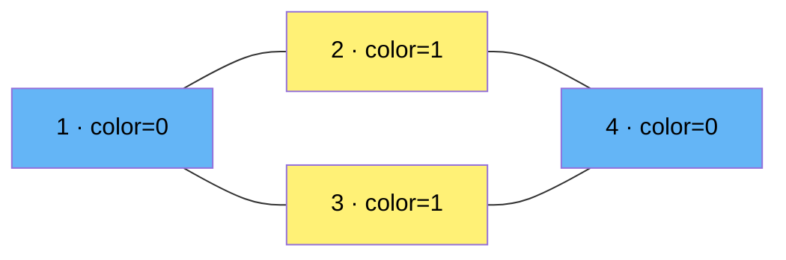

# Graph Coloring

## Prerequisites

- [Graph](../data-structures/graph.md) [Must read]
- [BFS](../algorithms/bfs.md) [Must read]
- [DFS](../algorithms/dfs.md) [Must read]

## Table of Contents

- [What it is](#what-it-is)
- [Recognition signals](#recognition-signals)
- [How it works](#how-it-works)
- [Complexity](#complexity)
- [Constraints & approach](#constraints--approach)
- [Variations](#variations)
- [Pitfalls](#pitfalls)
- [First 30 seconds](#first-30-seconds)
- [Related](#related)
- [Practice problems](#practice-problems)
  - [Possible Bipartition (LC 886)](#1-possible-bipartition-lc-886)
  - [Flower Planting With No Adjacent (LC 1042)](#2-flower-planting-with-no-adjacent-lc-1042)
  - [Chromatic Number (bitmask DP)](#3-chromatic-number-bitmask-dp)
  - [Maximum Number of Accepted Invitations (LC 1820)](#4-maximum-number-of-accepted-invitations-lc-1820)

---

## What it is

**Graph coloring** assigns labels ("colors") to graph nodes so that no two adjacent nodes share the same color, using as few colors as possible.

**Mental model:** a map where every country must be a different color from its neighbors. 2 colors = can you split the graph into two independent camps? k colors = can you schedule k resources so no two conflicting tasks share one? The landmark result: every planar graph needs ≤ 4 colors (Four Color Theorem, 1976) - which is why real maps always work with four; general graphs have no such bound.

> **Interview soundbite:** "Graph coloring - assign colors to nodes so no two neighbors match; 2-coloring (bipartite check) runs in O(V + E) with BFS/DFS; k-coloring for k ≥ 3 is NP-complete but backtracking with pruning handles small inputs."

---

## Recognition signals

### (a) Trigger phrases

- *"determine if the graph is bipartite"* / *"can you divide nodes into two groups such that…"*
- *"check if a graph contains an odd-length cycle"*
- *"schedule tasks/courses/exams such that no two conflicting items share the same slot"*
- *"assign frequencies to radio towers so no two nearby towers share a frequency"*
- *"color a map so no two adjacent regions share the same color"*
- *"is it possible to split the employees into two teams such that no two people who dislike each other are on the same team"*

### (b) Structural cues

- Input is a graph (adjacency list / matrix, explicit edges, or an implicit "conflicts with" relation).
- The goal involves **partitioning nodes** such that no two neighbors share the same partition/label/slot/color.
- k = 2: the question is a **yes/no split** or an **odd-cycle check** - always solvable in polynomial time.
- k ≥ 3: the question asks for the **minimum number of colors** or whether k colors suffice - NP-complete for general graphs; exact-color prompts usually appear with **n ≤ 20** (bitmask DP) or a **planar/chordal** graph promise.
- The constraint graph is **not explicitly labeled** as a coloring problem - the signal is conflict/adjacency + partition.

### (c) Not to be confused with

| Pattern | Distinction |
|---|---|
| **BFS / level-order traversal** | 2-coloring IS BFS with colors as level parity - but the output is "bipartite yes/no" and you must detect odd cycles, not just build a level tree. The coloring interpretation changes what you check. |
| **Tree & Graph Traversal** | DFS/BFS for reachability or path-finding don't maintain a color state per node. Graph coloring assigns and validates a persistent label; traversal moves and explores. |
| **Backtracking** | k-coloring for k ≥ 3 uses backtracking, but the pattern here is specifically recognizing the coloring structure from the problem statement - backtracking is the *engine*, graph coloring is the *frame*. |

---

## How it works

### 2-coloring (bipartite check) - O(V + E)

A graph is 2-colorable if and only if it contains **no odd-length cycle**. The BFS proof: assign color 0 to the source, then alternate 0/1 across each edge. If you ever try to color a node that's already colored with the same color as its neighbor, you've found an odd cycle → not bipartite.

**Example - not bipartite (odd cycle):**


```mermaid
graph LR
  1["1 · color=0"] --- 2["2 · color=1"]
  2 --- 3["3 · color=0"]
  2 --- 5["5 · color=0"]
  3 --- 4["4 · color=1"]
  4 --- 6["6 · color=1 ✗"]
  5 --- 6
  style 4 fill:#e57373,color:#fff
  style 6 fill:#e57373,color:#fff
```

BFS from 1 assigns colors 0/1 alternately. Edge (4, 6): both land on color 1 → **conflict → not bipartite**.

**Example - bipartite (even cycles only):**


```mermaid
graph LR
  1["1 · color=0"] --- 2["2 · color=1"]
  1 --- 3["3 · color=1"]
  2 --- 4["4 · color=0"]
  3 --- 4
  style 1 fill:#64b5f6,color:#000
  style 4 fill:#64b5f6,color:#000
  style 2 fill:#fff176,color:#000
  style 3 fill:#fff176,color:#000
```

Blue = color 0, yellow = color 1. Every edge crosses color groups → **bipartite**.

### k-coloring via backtracking - O(k^V)

For k ≥ 3, try assigning colors 1..k to each node in DFS order. Before assigning color c to node v, check that no neighbor of v already has color c. If no color works at v, backtrack. This brute-force is exponential but constraint propagation (forward checking) prunes heavily in practice.

```
Graph triangle: 1-2-3-1, k=3

Assign color[1]=1
  Assign color[2]=2  (neighbor of 1, can't use 1)
    Assign color[3]=3  (neighbor of 1 and 2, can't use 1 or 2) ✓
→ valid 3-coloring: [1,2,3]
```

**Chromatic number:** the minimum k for which a valid coloring exists. Finding it exactly is NP-hard; greedy upper-bounds it at Δ+1 (Δ = max degree).

---

## Complexity

| Variant | Time | Space |
|---|---|---|
| 2-coloring (bipartite check, BFS/DFS) | O(V + E) | O(V) for color array + queue |
| k-coloring, backtracking (worst case) | O(k^V) | O(V) recursion depth + color array |
| k-coloring, bitmask DP (n ≤ 20) | O(2^n · n) | O(2^n) |
| Greedy coloring (Δ+1 bound) | O(V + E) | O(V) |

---

## Constraints & approach

| Input size | Signal | Approach |
|---|---|---|
| n ≤ 10⁵, k = 2 | "bipartite", "split into two teams", "odd cycle" | BFS/DFS 2-coloring, O(V + E) |
| n ≤ 20, arbitrary k | "minimum colors", "chromatic number", exact partition | Bitmask DP over independent sets, O(2^n · n) |
| n ≤ 20, fixed k | "can you color with k colors", small n | Backtracking with IS-SAFE pruning, O(k^n) |
| n ≤ 10⁵, k = 3 or k = 4 | special graph (planar, chordal, bipartite complement) | Exploit structural property; exact coloring without it is NP-hard |
| Very large n, approximate | "minimize conflicts" | Greedy (Δ+1 upper bound); not exact chromatic number |

**When to push off this pattern:** if k ≥ 3 and n > 25 with no structural promise (planar / chordal / interval graph), do not attempt exact coloring - it is NP-complete. The interviewer either means a 2-coloring problem reworded, or is testing that you recognize the complexity boundary.

**At scale:** even 2-coloring breaks down in two ways when n > 10⁸ - the color array itself exceeds memory (one byte per node × 10⁸ = 100 MB), and BFS's queue thrashes the cache as neighbor lists scatter across DRAM. Production graph systems handle this with partitioned BFS (process the graph in shards) or distributed coloring algorithms that trade exact answers for probabilistic guarantees.

---

## Variations

- **Directed graph 2-coloring:** check if the underlying undirected graph is bipartite; direction usually doesn't change the coloring semantics. Use when edges are directed but the conflict is symmetric (e.g., mutual dislike).
- **Edge coloring:** color edges (not nodes) so no two edges sharing a vertex share a color - Vizing's theorem guarantees Δ or Δ+1 colors always suffice. O(E·√V) with the Hopcroft-Karp-based approach. Appears in scheduling problems where *jobs* (edges) share a *machine* (vertex), not the other way around.
- **List coloring:** each node has a prescribed list of allowed colors; determine if a valid assignment exists from the per-node lists. NP-complete in general; polynomial for bipartite graphs (Hall's theorem). Appears as "each worker has a set of available shifts" problems.
- **Greedy coloring:** process nodes in any order; assign the smallest color not used by a neighbor. Gives ≤ Δ+1 colors, O(V + E). Result depends on order - Welsh-Powell (sort by degree descending) consistently produces fewer colors in practice, though still not guaranteed optimal.
- **Interval graph coloring:** clique number = chromatic number for interval graphs (chordal); a greedy left-to-right sweep by start time is optimal in O(n log n). Appears as "minimum conference rooms for overlapping meetings."

---

## Pitfalls

1. **Forgetting disconnected components.** A common mistake is starting BFS from node 0 only. If the graph has multiple connected components, each must be independently 2-colored - missing any component may silently return the wrong answer. Always loop over all unvisited nodes as potential sources.

2. **Conflating "bipartite" with "no cycles."** A bipartite graph can have cycles - it just can't have *odd-length* cycles. The classic trap: "the graph has a cycle, so it can't be bipartite" is wrong. An even-length cycle (4-cycle, 6-cycle) is perfectly fine. The coloring check handles this correctly; don't short-circuit based on cycle presence alone.

3. **Treating k ≥ 3 as tractable for large n.** 3-coloring a general graph with n = 50 is already slow with naive backtracking. If n > 25 and k ≥ 3 appear in a contest/interview, either the graph has a special structure (planar, chordal) or the answer involves 2-coloring reinterpreted. Don't reach for O(k^n) backtracking on large inputs.

4. **Greedy coloring is not optimal, and ordering matters more than most realize.** Greedy assigns at most Δ+1 colors, but the color count is highly sensitive to vertex order - an adversarial ordering can force greedy to use Δ+1 colors on a graph whose chromatic number is 2. Welsh-Powell (process vertices by decreasing degree) consistently reduces the count in practice and is the standard greedy heuristic worth knowing by name. Even so, no polynomial ordering is guaranteed to match the chromatic number on general graphs. For the exact minimum, you need bitmask DP (n ≤ 20) or structural exploitation. Never report greedy output as the chromatic number without qualifying it as an upper bound.

---

## First 30 seconds

"This is a graph coloring problem. If the question asks about splitting into two groups, checking bipartiteness, or detecting odd cycles - that's 2-coloring, solvable in O(V + E) with BFS: alternate colors 0 and 1 across every edge, return false if a same-color collision occurs. If k ≥ 3 and n is small (≤ 20), reach for bitmask DP on independent sets; if n is large, question whether k = 2 is really what's being asked."

---

## Related

- [Graph](../data-structures/graph.md) - the substrate; adjacency list is the standard representation here
- [BFS](../algorithms/bfs.md) - the engine for 2-coloring; level assignment = color assignment
- [DFS](../algorithms/dfs.md) - alternative engine; back-edge detection is the odd-cycle signal
- [Backtracking](./backtracking.md) - the engine for k-coloring (k ≥ 3) via color assignment + undo
- [Bitmask DP](./bitmask-dp.md) - exact chromatic number for n ≤ 20 via independent-set enumeration
- [Tree & Graph Traversal](./tree-graph-traversal.md) - sibling pattern; traversal for reachability vs coloring for partition

---

## Practice problems

### 1. Possible Bipartition (LC 886)

Given n people and a list of "dislike" pairs, determine if you can split everyone into two groups such that no two people who dislike each other are in the same group. Constraints: n ≤ 2000, dislikes ≤ 10⁴.

**Worked examples:**
- **Example 1**
  - **Input:** n = 4, dislikes = [[1,2],[1,3],[2,4]] | **Output:** true
  - **Explanation:** group1 = [1,4], group2 = [2,3].
- **Example 2**
  - **Input:** n = 3, dislikes = [[1,2],[1,3],[2,3]] | **Output:** false
  - **Explanation:** the 3 people form a triangle (odd cycle) - no valid 2-way split.

**Constraints:** `1 ≤ n ≤ 2000`, `0 ≤ dislikes.length ≤ 10⁴`, each pair distinct.

**Approach:** Build an undirected conflict graph from dislikes. Run BFS 2-coloring: try to assign each person to group 0 or 1. A dislike edge crossing two same-group people signals an odd cycle - return false. Disconnect handled by looping over all unvisited nodes as BFS sources.

**Solution:**

```python
from collections import deque
from typing import List

def possible_bipartition(n: int, dislikes: List[List[int]]) -> bool:
    graph = [[] for _ in range(n + 1)]
    for a, b in dislikes:
        graph[a].append(b)
        graph[b].append(a)

    color = [-1] * (n + 1)
    for start in range(1, n + 1):
        if color[start] != -1:
            continue
        color[start] = 0
        queue = deque([start])
        while queue:
            node = queue.popleft()
            for nb in graph[node]:
                if color[nb] == -1:
                    color[nb] = 1 - color[node]
                    queue.append(nb)
                elif color[nb] == color[node]:
                    return False
    return True
```

**Complexity:** O(V + E) time, O(V + E) space.

**Duplicate problems:**
- Is Graph Bipartite? (LC 785) - identical algorithm; explicit adjacency list vs "dislike" edges, same 2-coloring logic.
- Divide Nodes into the Maximum Number of Groups (LC 2493) - requires bipartite check per component then BFS-layer assignment; coloring is the prerequisite.
- Odd-cycle detection (CP-primitive framing) - the same BFS 2-coloring mechanic described generically as "does a same-color collision occur"; this problem is its concrete worked instance over an explicit conflict graph.

---

### 2. Flower Planting With No Adjacent (LC 1042)

You have n gardens (1-indexed) and a list of paths between them. Each garden must be planted with one of 4 flower types such that no two adjacent gardens have the same type. Each garden has at most 3 paths. Return any valid assignment. Constraints: n ≤ 10⁴, paths ≤ 2 × 10⁴.

**Worked examples:**
- **Example 1**
  - **Input:** n = 3, paths = [[1,2],[2,3],[3,1]] | **Output:** [1,2,3]
- **Example 2**
  - **Input:** n = 4, paths = [[1,2],[3,4]] | **Output:** [1,2,1,2]

**Constraints:** `1 ≤ n ≤ 10⁴`, `0 ≤ paths.length ≤ 2×10⁴`, each garden has at most 3 paths.

**Approach:** With max degree 3, there are always ≤ 3 forbidden colors per node, leaving ≥ 1 of the 4 colors available. Greedy: for each garden, collect the colors of its planted neighbors and assign the smallest color not in that set. Order doesn't matter since 4 > max-degree guarantees a color always exists.

**Solution:**

```python
from typing import List

def garden_no_adj(n: int, paths: List[List[int]]) -> List[int]:
    graph = [[] for _ in range(n + 1)]
    for a, b in paths:
        graph[a].append(b)
        graph[b].append(a)

    color = [0] * (n + 1)
    for node in range(1, n + 1):
        used = {color[nb] for nb in graph[node]}
        for c in range(1, 5):
            if c not in used:
                color[node] = c
                break
    return color[1:]
```

**Complexity:** O(V + E) time, O(V + E) space.

**Duplicate problems:**
- Graph Coloring - general greedy formulation; same assign-first-available approach for any bounded-degree graph.

---

### 3. Chromatic Number (bitmask DP)

Given a small undirected graph (`n ≤ 20`) as an adjacency list, find its chromatic number - the minimum number of colors needed so no two adjacent nodes share a color. Unlike Possible Bipartition (fixed k=2) or Flower Planting (fixed k=4, degree-bounded), this finds the exact minimum k for an arbitrary graph, which is NP-hard in general - bitmask DP makes it tractable at n ≤ 20.

**Worked examples:**
- **Example 1**
  - **Input:** n = 3, edges = [[0,1],[1,2],[0,2]] (triangle) | **Output:** 3
  - **Explanation:** every pair is adjacent, so all 3 nodes need distinct colors.
- **Example 2**
  - **Input:** n = 4, edges = [[0,1],[1,2],[2,3],[3,0]] (4-cycle) | **Output:** 2
  - **Explanation:** an even cycle is bipartite - 2 colors suffice.

**Constraints:** `1 ≤ n ≤ 20`, edges given as an adjacency list or edge list.

**Approach.** Precompute which subsets of nodes ("masks") form an independent set (no two adjacent nodes both in the mask) - `indep[mask]` is `True` iff `mask` has no internal edge. Then DP over all masks: `dp[mask]` = minimum colors needed to color exactly the nodes in `mask`, computed as `min(1 + dp[mask ^ sub])` over every independent-set submask `sub` of `mask` (color `sub` with one color, recurse on the rest). This is mechanically distinct from both 2-coloring (BFS/DFS parity) and greedy k-coloring (single pass, first-available) - it's an exact exponential search over the subset lattice, trading n≤20 tractability for a provably optimal answer no greedy or polynomial check can guarantee.

```python
def chromatic_number(adj: list[int], n: int) -> int:
    # adj[v] = bitmask of v's neighbors
    full = (1 << n) - 1
    indep = [False] * (full + 1)
    for mask in range(full + 1):
        ok = True
        for v in range(n):
            if mask >> v & 1:
                if mask & adj[v] & ((1 << v) - 1):  # earlier neighbor in mask
                    ok = False
                    break
        indep[mask] = ok

    dp = [float('inf')] * (full + 1)
    dp[0] = 0
    for mask in range(1, full + 1):
        sub = mask
        while sub:
            if indep[sub]:
                dp[mask] = min(dp[mask], 1 + dp[mask ^ sub])
            sub = (sub - 1) & mask
    return dp[full]
```

**Complexity.** O(2ⁿ · n) time (building `indep`) + O(3ⁿ) time (submask enumeration in the DP), O(2ⁿ) space.

**Duplicate problems:**
- Minimum number of teams / groups such that no two conflicting members share a team (classic/CP framing) - same bitmask-DP-over-independent-sets shape, different cover story.

---

### 4. Maximum Number of Accepted Invitations (LC 1820)

`m` boys and `n` girls; `grid[i][j] = 1` if boy `i` is willing to invite girl `j`. Each boy can invite at most one girl and each girl can accept at most one invitation. Find the maximum number of accepted invitations. `1 ≤ m, n ≤ 200`.

**Worked examples:**
- **Example 1**
  - **Input:** grid = [[1,1,1],[1,0,1],[0,0,1]] | **Output:** 3
  - **Explanation:** boy 0 → girl 1, boy 1 → girl 0, boy 2 → girl 2 - every boy is matched.
- **Example 2**
  - **Input:** grid = [[1,0,1,0],[1,0,0,0],[0,0,1,0],[1,1,1,0]] | **Output:** 3

**Constraints:** `m == grid.length`, `n == grid[i].length`, `1 ≤ m, n ≤ 200`, `grid[i][j]` is 0 or 1.

**Approach.** Boys and girls are already the two sides of a bipartite graph (the willingness matrix *is* the 2-coloring - boys and girls are two disjoint classes with edges only crossing between them, no coloring computation needed). This is a genuinely distinct technique from every prior entry: instead of assigning colors or checking feasibility, it searches for a **maximum matching** - repeatedly try to match each boy to some willing girl via an augmenting path (DFS from the boy, and if a candidate girl is already taken, recursively try to re-route her current match to a different girl). A boy contributes to the answer only if an augmenting path is found for him.

```python
def maximum_invitations(grid: list[list[int]]) -> int:
    m, n = len(grid), len(grid[0])
    match_girl = [-1] * n  # match_girl[j] = boy matched to girl j, or -1

    def try_match(boy: int, visited: list[bool]) -> bool:
        for girl in range(n):
            if grid[boy][girl] and not visited[girl]:
                visited[girl] = True
                if match_girl[girl] == -1 or try_match(match_girl[girl], visited):
                    match_girl[girl] = boy
                    return True
        return False

    count = 0
    for boy in range(m):
        visited = [False] * n
        if try_match(boy, visited):
            count += 1
    return count
```

**Complexity.** O(V · E) time (V = m boys, E = up to m·n edges), O(n) space for the matching arrays.

**Duplicate problems:**
- Bipartite matching via 2-coloring (CP-primitive, general graph) - identical augmenting-path mechanic, but starts from an arbitrary graph and must first run 2-coloring to identify which side is "left" and which is "right" before matching, instead of the sides being given directly as boys/girls.
