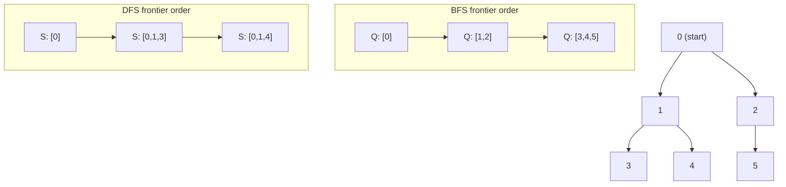

# Tree & Graph Traversal

## Prerequisites

- [BFS](../algorithms/bfs.md) [Must read]
- [DFS](../algorithms/dfs.md) [Must read]
- [Graph](../data-structures/graph.md) [Must read]
- [Queue](../data-structures/queue.md) [Must read]
- [Stack](../data-structures/stack.md) [Must read]

## Table of Contents

- [What it is](#what-it-is)
- [Recognition signals](#recognition-signals)
- [How it works](#how-it-works)
- [Complexity](#complexity)
- [Constraints & approach](#constraints--approach)
- [Variations](#variations)
- [Pitfalls](#pitfalls)
- [First 30 seconds](#first-30-seconds)
- [Related](#related)
- [Practice problems](#practice-problems)

---

## What it is

**Tree & Graph Traversal** is the transfer layer over BFS and DFS: instead of re-deriving the walk from scratch for every new problem, you recognize "this is a reachability/level/component problem," reach for one of two fixed skeletons (queue-based or stack/<abbr>recursion</abbr>-based), and drop your problem-specific logic into the one slot marked for it.

**Mental model:** BFS and DFS are the *engine*; this pattern is the *chassis* you bolt any problem onto. The algorithm articles prove the engine works and derive its complexity - this article is the parts catalog: which chassis for which job, and where the custom logic plugs in.

> **Interview soundbite:** "This is a traversal problem - I need to visit every reachable node exactly once. If it asks for shortest/minimum-steps or level grouping, BFS skeleton; if it asks for structure, paths, or exhaustive exploration, DFS skeleton."

---

## Recognition signals

### (a) Trigger phrases

- *"connected components"* / *"number of provinces/islands"*
- *"shortest path in an unweighted grid"* / *"minimum number of steps"*
- *"level order traversal"* / *"nodes at depth k"*
- *"flood fill"* / *"paint the region"*
- *"clone the graph"* / *"deep copy of a tree/graph"*
- *"does a path exist from A to B"*

### (b) Structural cues

- Input is an explicit tree/graph (adjacency list, `TreeNode` with `left`/`right`, or a grid treated as an implicit graph).
- The task requires visiting **every reachable node** (or every node at a given depth), not searching a sorted key space.
- There is no ordering by value to exploit (that would point to binary search); the only navigable relationship is "which nodes are adjacent."
- Output is one of: a count (components, islands), a grouping (per-level lists), a boolean (path exists / can finish), or a transformed copy (cloned graph, filled grid).

### (c) Not to be confused with

| Pattern / tool | Distinction |
|---|---|
| **Matrix Traversal** ([`../patterns/matrix-traversal.md`](../patterns/matrix-traversal.md)) | Matrix Traversal is this exact pattern specialized to a 2D grid as the implicit graph - same BFS/DFS skeletons, but neighbors are computed via `(±1,0)/(0,±1)` offsets instead of an adjacency list, and bounds-checking replaces the visited-lookup-on-an-explicit-structure step. If the input is literally a grid, reach for Matrix Traversal's grid-specific skeleton; if it's a tree or an adjacency-list graph, use this one. |
| **Union-Find (Disjoint Set Union)** | Union-Find answers "are these two nodes connected?" or "how many components exist?" in near-O(1) per query without ever materializing a path - it's the right tool when you only need connectivity, especially under **online** union/find operations (edges added over time). Traversal is required the moment you need the *actual path*, per-level structure, or any node ordering (discovery/finish time) - Union-Find has no notion of a path or an order. |
| **Backtracking** ([`./backtracking.md`](./backtracking.md)) | Backtracking is also DFS on an implicit tree, but it explores a *search space of decisions* (subsets, permutations, placements) and prunes/undoes state at each step. Tree/graph traversal explores a *given* structure and visits each node once; backtracking explores a *constructed* structure and may visit exponentially many states. |

---

## How it works

The mechanic is the same regardless of which skeleton you pick: maintain a frontier (queue or stack/call-stack), pop one node, do problem-specific work on it, then push its unvisited neighbors. The **only** thing that changes between BFS and DFS is the frontier's discipline - FIFO vs LIFO - and that single difference is what produces level-by-level exploration versus deep-then-backtrack exploration.



Same graph, two disciplines: BFS's queue empties level 0 (`{0}`) completely before touching level 1 (`{1,2}`), then level 2 (`{3,4,5}`) - it never goes deep before going wide. DFS's stack drives straight down one branch (`0→1→3`) to a dead end, backtracks, and only then explores `0→1→4` - it never goes wide before going deep. Both skeletons touch every node exactly once (given a visited set), producing O(V+E) either way; the value each returns per node's *processing order* is what differs.

The full proof that BFS gives shortest-path and DFS gives discovery/finish structure lives in the algorithm articles - see [BFS § Correctness / invariant](../algorithms/bfs.md#correctness--invariant) and [DFS § Correctness / invariant](../algorithms/dfs.md#correctness--invariant). This article assumes that proof and focuses on *when* to invoke which engine and *where* your custom logic goes.

---

## Complexity

| Skeleton | Time | Space |
|---|---|---|
| Tree BFS / DFS | O(n) - each node visited once | O(w) BFS (max width) / O(h) DFS (max height), both ≤ O(n) |
| Graph BFS / DFS | O(V + E) - each vertex once, each edge scanned once | O(V) for visited set + frontier |

These are the same bounds as the underlying BFS/DFS algorithms - the pattern adds no asymptotic overhead, since `PROCESS(node)` is assumed O(1) (or its own cost is added separately if it isn't). See [BFS § Complexity derivation](../algorithms/bfs.md#complexity-derivation) and [DFS § Complexity derivation](../algorithms/dfs.md#complexity-derivation) for the full derivation.

---

## Constraints & approach

| Input size / shape | Reach for this pattern? | Approach | Notes |
|---|---|---|---|
| Tree/graph, n ≤ 10⁵, V+E ≤ 10⁵ | Yes | O(V+E) BFS or DFS skeleton | Adjacency list mandatory, not matrix |
| Grid m·n ≤ 10⁶, "shortest steps"/"flood fill" | Yes, but use the grid-specialized skeleton | O(m·n) BFS/DFS | See [Matrix Traversal](../patterns/matrix-traversal.md) instead - same idea, grid neighbor function |
| "Are nodes X and Y connected?", many queries, edges arrive online | No | Union-Find | O(α(n)) per query beats O(V+E) per traversal when you don't need the path and queries repeat |
| Edge weights differ | Off this pattern → Dijkstra/Bellman-Ford | O((V+E) log V) or O(V·E) | Neither BFS nor DFS skeleton computes weighted shortest path correctly |
| "Topological order", "course prerequisites" | Yes, DFS skeleton (or Kahn's BFS variant) | O(V+E) | See <!-- [Topological Sort](../algorithms/topological-sort.md) --> (not yet written) |
| n ≤ 20, exhaustive subsets/permutations over the structure | Off this pattern → Backtracking | O(2ⁿ) or O(n!) | Not a single-visit traversal; state-space search instead |

**What rules this pattern out:** weighted edges (wrong tool entirely - reach for Dijkstra/Bellman-Ford), pure connectivity queries with no path needed and many repeated queries (Union-Find is asymptotically better per query), and exhaustive search over a constructed decision space rather than a given structure (Backtracking).

---

## Variations

- **Multi-source BFS** - seed the queue with multiple starting nodes at distance 0 instead of one (nearest-gate, rotting-oranges style problems).
- **Level-order with per-level aggregation** - same tree-BFS skeleton, but the level loop computes a max/sum/last-element instead of collecting all values (right-side view, level averages).
- **DFS with path tracking** - carry a mutable `path` list through recursion, appending on entry and popping on exit, to enumerate root-to-leaf paths.
- **DFS with global state via closures** - use a mutable counter/accumulator captured in a nested function, common when the "your logic here" step needs to mutate shared state (component count, max depth seen).
- **0/1-weighted BFS (deque)** - swap the queue for a deque so 0-weight edges are pushed to the front; still fits the "which frontier structure" mental model from this pattern even though it's covered in depth on the [BFS page](../algorithms/bfs.md#graphtree-assumptions).

---

## Pitfalls

1. **Forgetting the outer loop for disconnected graphs.** A single BFS/DFS call from one source only reaches its component. Problems like Number of Islands or Number of Provinces need the `for each unvisited node → launch new traversal` wrapper; omitting it silently undercounts.

2. **Marking visited on dequeue instead of enqueue (BFS).** Marking too late lets the same node enter the queue multiple times before it's processed, inflating the queue and, on grids, causing a cell to be "discovered" from multiple directions with inconsistent distances. See [BFS § Edge cases](../algorithms/bfs.md#edge-cases) for the full trap.

3. **Reaching for DFS when the problem says "shortest"/"minimum".** DFS finds *a* path, not the shortest one - it's the single most common misapplication of this pattern. Any "minimum steps"/"shortest path"/"fewest operations" phrasing on an unweighted structure is a BFS signal, not a DFS one.

4. **Using recursive DFS on a chain-shaped input at scale.** A skewed tree or long implicit chain (10⁴+ nodes) blows Python's recursion limit. Swap to the iterative Graph DFS template when depth isn't bounded by `log n`.

5. **Confusing "connectivity only" with "needs the path."** Reaching for a full traversal when a Union-Find would answer a pure "are these connected?" query faster, especially under repeated/online queries, wastes both code and constant factor - see the recognition-signals table above.

---

## First 30 seconds

*"This is a traversal problem over a tree or graph - I need to visit every reachable node. If the question is about levels, minimum steps, or shortest path on unweighted edges, I'll use the BFS skeleton with a queue. If it's about structure - components, paths, cycles, exhaustive exploration - I'll use the DFS skeleton with a stack or recursion. Either way it's O(V+E), and I just need a visited set if it's a graph, none if it's a tree."*

Then clarify: explicit tree/graph or implicit (grid, state space)? Single traversal or one-per-component?

---

## Related

- [BFS](../algorithms/bfs.md) - the queue-based engine this pattern wraps; correctness proof, complexity derivation, and full edge-case treatment live there.
- [DFS](../algorithms/dfs.md) - the stack/recursion-based engine this pattern wraps; correctness proof, complexity derivation, and full edge-case treatment live there.
- [Matrix Traversal](../patterns/matrix-traversal.md) - the grid-specialized sibling pattern: same skeletons, implicit graph via row/col offsets instead of an adjacency list.
<!-- [Topological Sort](../algorithms/topological-sort.md) --> Topological Sort (not yet written) - the DFS skeleton with three-color state, extended to produce a build order on a DAG.
- [Backtracking](./backtracking.md) - a sibling DFS-shaped pattern over a *constructed* decision space rather than a given structure; do not conflate the two.

---

## Practice problems

### 1. Binary Tree Level Order Traversal (LC 102)

**Problem.** Given the root of a binary tree, return the values of its nodes grouped by depth, top to bottom. Up to 2000 nodes.

**Worked examples:**
- **Example 1**
  - **Input:** root = [3,9,20,null,null,15,7] | **Output:** [[3],[9,20],[15,7]]
- **Example 2**
  - **Input:** root = [1] | **Output:** [[1]]

**Constraints:** `0 ≤ n ≤ 2000`, `-1000 ≤ Node.val ≤ 1000`.

**Approach.** Tree BFS with a level-size snapshot: before draining the inner loop, record `level_size = len(queue)`. The inner loop runs exactly `level_size` times, popping only nodes that belonged to the current level before any of their children got enqueued - that snapshot is what separates one level's output list from the next.

```python
from collections import deque
from typing import Optional

class TreeNode:
    def __init__(self, val: int = 0, left=None, right=None):
        self.val = val
        self.left = left
        self.right = right

def levelOrder(root: Optional[TreeNode]) -> list[list[int]]:
    if not root:
        return []
    result: list[list[int]] = []
    queue: deque[TreeNode] = deque([root])
    while queue:
        level_size = len(queue)
        level: list[int] = []
        for _ in range(level_size):
            node = queue.popleft()
            level.append(node.val)
            if node.left:
                queue.append(node.left)
            if node.right:
                queue.append(node.right)
        result.append(level)
    return result
```

**Complexity.** O(n) time (each node visited once), O(w) space where w is the tree's maximum width (worst case O(n) for a complete binary tree).

**Duplicate problems:**
- Binary Tree Right Side View (LC 199) - same level-BFS skeleton, keep only the last node of each level instead of all of them.
- Average of Levels in Binary Tree (LC 637) - same skeleton, aggregate = mean instead of the full list.
- Find Bottom Left Tree Value (LC 513) - same skeleton, keep the first node of the last level.

---

### 2. Clone Graph (LC 133)

**Problem.** Given a reference node in a connected undirected graph, return a deep copy of the graph. Each node has a value and a list of neighbors. Up to 100 nodes.

**Worked examples:**
- **Example 1**
  - **Input:** adjList = [[2,4],[1,3],[2,4],[1,3]] | **Output:** [[2,4],[1,3],[2,4],[1,3]]
  - **Explanation:** node 1's neighbors are 2 and 4; the clone must preserve this exact adjacency between newly-created nodes.
- **Example 2**
  - **Input:** adjList = [[]] | **Output:** [[]]
  - **Explanation:** single node, no neighbors.

**Constraints:** `0 ≤ n ≤ 100`, no repeated edges, no self-loops, graph is connected.

**Approach.** Graph DFS (BFS works equally well) with `PROCESS(node)` replaced by "look up or create the clone, and register it in a `visited` map *before* recursing into neighbors." Registering before recursing is what makes the skeleton handle cycles correctly - without it, a cycle back to the original node would recurse forever, cloning the same node repeatedly.

```python
class Node:
    def __init__(self, val: int = 0, neighbors: list["Node"] | None = None):
        self.val = val
        self.neighbors = neighbors if neighbors is not None else []

def cloneGraph(node: "Node | None") -> "Node | None":
    if not node:
        return None
    visited: dict["Node", "Node"] = {}

    def dfs(n: "Node") -> "Node":
        if n in visited:
            return visited[n]
        clone = Node(n.val)
        visited[n] = clone
        for neighbor in n.neighbors:
            clone.neighbors.append(dfs(neighbor))
        return clone

    return dfs(node)
```

**Complexity.** O(V + E) time, O(V) space for the visited map and recursion stack.

**Duplicate problems:**
- Copy List with Random Pointer (LC 138) - same register-before-recurse visited-map trick, applied to a linked list with an extra pointer instead of a graph's neighbor list.

---

### 3. Course Schedule (LC 207)

**Problem.** Given `numCourses` and a list of prerequisite pairs `[a, b]` (must take `b` before `a`), determine if it's possible to finish all courses - i.e., is the prerequisite graph acyclic? Up to 2000 courses, 5000 prerequisite pairs.

**Worked examples:**
- **Example 1**
  - **Input:** numCourses = 2, prerequisites = [[1,0]] | **Output:** true
  - **Explanation:** take course 0, then course 1.
- **Example 2**
  - **Input:** numCourses = 2, prerequisites = [[1,0],[0,1]] | **Output:** false
  - **Explanation:** course 0 needs course 1 and vice versa - a cycle, impossible to finish.

**Constraints:** `1 ≤ numCourses ≤ 2000`, `0 ≤ prerequisites.length ≤ 5000`.

**Approach.** Graph DFS, but the visited set is upgraded to three colors (WHITE/GRAY/BLACK) instead of a boolean, because "is this neighbor still on my current recursion path" (a cycle) is a different question from "have I ever visited this neighbor." A GRAY node reached again means a back edge - a cycle.

```python
def canFinish(numCourses: int, prerequisites: list[list[int]]) -> bool:
    graph: list[list[int]] = [[] for _ in range(numCourses)]
    for course, prereq in prerequisites:
        graph[course].append(prereq)

    WHITE, GRAY, BLACK = 0, 1, 2
    color = [WHITE] * numCourses

    def has_cycle(u: int) -> bool:
        color[u] = GRAY
        for v in graph[u]:
            if color[v] == GRAY:
                return True
            if color[v] == WHITE and has_cycle(v):
                return True
        color[u] = BLACK
        return False

    return not any(color[c] == WHITE and has_cycle(c) for c in range(numCourses))
```

**Complexity.** O(V + E) time, O(V + E) space for the adjacency list and color array.

**Duplicate problems:**
- Course Schedule II (LC 210) - same three-color DFS, additionally records post-order finish sequence as the topological (build) order.

---

### 4. Path Sum II (LC 113)

**Problem.** Given the root of a binary tree and a target sum, return all root-to-leaf paths where the node values sum to the target. Up to 5000 nodes.

**Worked examples:**
- **Example 1**
  - **Input:** root = [5,4,8,11,null,13,4,7,2,null,null,5,1], targetSum = 22 | **Output:** [[5,4,11,2],[5,8,4,5]]
- **Example 2**
  - **Input:** root = [1,2,3], targetSum = 5 | **Output:** []

**Constraints:** `0 ≤ n ≤ 5000`, `-1000 ≤ Node.val ≤ 1000`, `-1000 ≤ targetSum ≤ 1000`.

**Approach.** Tree DFS with a pre-order hook appending the current node to a shared `path` list and a post-order hook popping it back off - the explicit backtrack step. `PROCESS(node)` checks if it's a leaf with running sum equal to target, and if so snapshots `path` into the result. The append/recurse/pop discipline is what turns one mutable list into a correct enumeration of every distinct path, instead of a single path or a corrupted shared list.

```python
from typing import Optional

def pathSum(root: Optional[TreeNode], targetSum: int) -> list[list[int]]:
    result: list[list[int]] = []
    path: list[int] = []

    def dfs(node: Optional[TreeNode], remaining: int) -> None:
        if not node:
            return
        path.append(node.val)
        remaining -= node.val
        if not node.left and not node.right and remaining == 0:
            result.append(list(path))
        else:
            dfs(node.left, remaining)
            dfs(node.right, remaining)
        path.pop()

    dfs(root, targetSum)
    return result
```

**Complexity.** O(n²) time worst case (each of up to n root-to-leaf paths can be O(n) long to copy), O(n) space for the recursion stack and path buffer, excluding output.

**Duplicate problems:**
- Path Sum (LC 112) - same DFS skeleton, only needs a boolean existence check instead of full path enumeration; no `path` list or backtrack needed.
- Binary Tree Maximum Path Sum (LC 124) - DFS with a different accumulation (max path through any node, not just root-to-leaf) but the same "process on the way down, combine on the way up" recursive shape.

---

### 5. Number of Provinces (LC 547)

**Problem.** Given an n×n adjacency matrix `isConnected` where `isConnected[i][j] = 1` means cities i and j are directly connected, return the number of provinces (connected components). `1 ≤ n ≤ 200`.

**Worked examples:**
- **Example 1**
  - **Input:** isConnected = [[1,1,0],[1,1,0],[0,0,1]] | **Output:** 2
  - **Explanation:** cities 0 and 1 form one province; city 2 is its own province.
- **Example 2**
  - **Input:** isConnected = [[1,0,0],[0,1,0],[0,0,1]] | **Output:** 3

**Constraints:** `1 ≤ n ≤ 200`, `isConnected[i][j]` is `0` or `1`, `isConnected[i][i] = 1`, symmetric matrix.

**Approach.** This is connected-components DFS on a graph given as an adjacency matrix instead of a list - the outer loop (disconnected-graph wrapper) launches one DFS per unvisited city, and each DFS call marks every city reachable from it. The province count is the number of DFS launches. Since the input is a matrix, each DFS call's neighbor scan is O(n) regardless of actual degree, giving O(n²) total - acceptable at n ≤ 200 but a reminder that adjacency-matrix DFS does not scale the way adjacency-list DFS does.

```python
def findCircleNum(isConnected: list[list[int]]) -> int:
    n = len(isConnected)
    visited = [False] * n

    def dfs(u: int) -> None:
        visited[u] = True
        for v in range(n):
            if isConnected[u][v] == 1 and not visited[v]:
                dfs(v)

    provinces = 0
    for city in range(n):
        if not visited[city]:
            dfs(city)
            provinces += 1
    return provinces
```

**Complexity.** O(n²) time (matrix scan per DFS call), O(n) space for the visited array and recursion stack.

**Duplicate problems:**
- Number of Islands (LC 200) - same connected-components DFS, but on a grid (implicit graph) instead of an explicit adjacency matrix. Full entry in [Matrix Traversal](./matrix-traversal.md).
- Number of Connected Components in an Undirected Graph (classic) - identical mechanic on an edge-list-to-adjacency-list graph.

---

### 6. Rotting Oranges (LC 994)

**Problem.** Given an `m×n` grid where each cell is empty (0), fresh (1), or rotten (2), every minute a rotten orange rots any orthogonally-adjacent fresh orange. Return the minimum minutes until no fresh orange remains, or -1 if impossible. `1 ≤ m, n ≤ 10`.

**Worked examples:**
- **Example 1**
  - **Input:** grid = [[2,1,1],[1,1,0],[0,1,1]] | **Output:** 4
  - **Explanation:** rot spreads outward one ring per minute from the single starting rotten cell; the farthest fresh orange takes 4 minutes to reach.
- **Example 2**
  - **Input:** grid = [[2,1,1],[0,1,1],[1,0,1]] | **Output:** -1
  - **Explanation:** the fresh orange in the bottom-left corner is isolated by empty cells and can never rot.

**Constraints:** `1 ≤ m, n ≤ 10`, each cell is `0`, `1`, or `2`.

**Approach.** Multi-source BFS: seed the queue with every rotten cell at distance 0 simultaneously, as if they all hung off one virtual super-source, instead of running a separate BFS per rotten cell. Draining the queue level-by-level (same level-size-snapshot technique as tree level order) gives the exact minute count directly - each level drained is one minute elapsed. A leftover fresh orange after the queue empties means -1.

```python
from collections import deque

def orangesRotting(grid: list[list[int]]) -> int:
    rows, cols = len(grid), len(grid[0])
    queue: deque[tuple[int, int]] = deque()
    fresh = 0
    for r in range(rows):
        for c in range(cols):
            if grid[r][c] == 2:
                queue.append((r, c))
            elif grid[r][c] == 1:
                fresh += 1

    minutes = 0
    directions = [(-1, 0), (1, 0), (0, -1), (0, 1)]
    while queue and fresh > 0:
        minutes += 1
        for _ in range(len(queue)):
            r, c = queue.popleft()
            for dr, dc in directions:
                nr, nc = r + dr, c + dc
                if 0 <= nr < rows and 0 <= nc < cols and grid[nr][nc] == 1:
                    grid[nr][nc] = 2
                    fresh -= 1
                    queue.append((nr, nc))

    return minutes if fresh == 0 else -1
```

**Complexity.** O(m·n) time (each cell enqueued at most once), O(m·n) space for the queue in the worst case.

**Duplicate problems:**
- Walls and Gates (classic, not on LC) - identical multi-source BFS from every gate cell simultaneously, filling in distance-to-nearest-gate instead of a rot timer.
- As Far from Land as Possible (LC 1162) - same multi-source BFS seeded from all land cells to find the water cell maximizing distance to nearest land.

---

### 7. Shortest Path Visiting All Nodes (LC 847)

**Problem.** Given an undirected connected graph of up to 12 nodes, return the length of the shortest path that visits every node at least once, starting and ending at any node (revisits and repeated edges allowed).

**Worked examples:**
- **Example 1**
  - **Input:** graph = [[1,2,3],[0],[0],[0]] | **Output:** 4
  - **Explanation:** start at node 1, go 1→0→2→0→3 (or a symmetric route) - visits every node in 4 edges.
- **Example 2**
  - **Input:** graph = [[1],[0,2,4],[1,3,4],[2],[1,2]] | **Output:** 4

**Constraints:** `n == graph.length`, `1 ≤ n ≤ 12`, graph is connected and undirected.

**Approach.** This isn't traversal over the given graph alone - the state space is `(current node, set of nodes visited so far)`, and a plain visited-boolean-per-node BFS can't represent "visited so far" as a single flag because the same node may need to be revisited. Encode the visited set as an integer bitmask (`n ≤ 12` fits in 12 bits) and BFS over the state space `(node, mask)`, seeding the queue with `(i, 1<<i)` for every starting node `i` at distance 0 - a multi-source BFS over an implicit state graph. The first time `mask == (1<<n) - 1` is reached, that BFS layer's distance is the answer.

```python
from collections import deque

def shortestPathLength(graph: list[list[int]]) -> int:
    n = len(graph)
    full_mask = (1 << n) - 1
    if n == 1:
        return 0

    queue: deque[tuple[int, int, int]] = deque()
    visited: set[tuple[int, int]] = set()
    for i in range(n):
        queue.append((i, 1 << i, 0))
        visited.add((i, 1 << i))

    while queue:
        node, mask, dist = queue.popleft()
        if mask == full_mask:
            return dist
        for nxt in graph[node]:
            next_mask = mask | (1 << nxt)
            if (nxt, next_mask) not in visited:
                visited.add((nxt, next_mask))
                queue.append((nxt, next_mask, dist + 1))
    return -1
```

**Complexity.** O(n² · 2ⁿ) time and space - each of the `n · 2ⁿ` `(node, mask)` states is visited once, with up to `n` neighbor transitions each.
