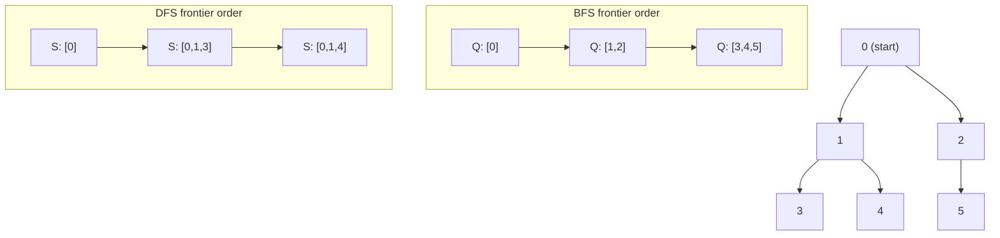

# Tree & Graph Traversal

## Prerequisites

- [BFS](../algorithms/bfs.md) [Must read]
- [DFS](../algorithms/dfs.md) [Must read]
- [Graph](../data-structures/graph.md) [Must read]
- [Queue](../data-structures/queue.md) [Must read]
- [Stack](../data-structures/stack.md) [Must read]

## Table of Contents

- [What it is](#what-it-is)
- [Recognition signals](#recognition-signals)
- [How it works](#how-it-works)
- [Skeleton](#skeleton)
- [Complexity](#complexity)
- [Constraints & approach](#constraints--approach)
- [Variations](#variations)
- [CP-primitives](#cp-primitives)
- [Worked problems](#worked-problems)
- [Pitfalls](#pitfalls)
- [First 30 seconds](#first-30-seconds)
- [Related](#related)
- [Practice problems](#practice-problems)

---

## What it is

**Tree & Graph Traversal** is the transfer layer over BFS and DFS: instead of re-deriving the walk from scratch for every new problem, you recognize "this is a reachability/level/component problem," reach for one of two fixed skeletons (queue-based or stack/recursion-based), and drop your problem-specific logic into the one slot marked for it.

**Mental model:** BFS and DFS are the *engine*; this pattern is the *chassis* you bolt any problem onto. The algorithm articles prove the engine works and derive its complexity - this article is the parts catalog: which chassis for which job, and where the custom logic plugs in.

> **Interview soundbite:** "This is a traversal problem - I need to visit every reachable node exactly once. If it asks for shortest/minimum-steps or level grouping, BFS skeleton; if it asks for structure, paths, or exhaustive exploration, DFS skeleton."

---

## Recognition signals

### (a) Trigger phrases

- *"connected components"* / *"number of provinces/islands"*
- *"shortest path in an unweighted grid"* / *"minimum number of steps"*
- *"level order traversal"* / *"nodes at depth k"*
- *"flood fill"* / *"paint the region"*
- *"clone the graph"* / *"deep copy of a tree/graph"*
- *"does a path exist from A to B"*

### (b) Structural cues

- Input is an explicit tree/graph (adjacency list, `TreeNode` with `left`/`right`, or a grid treated as an implicit graph).
- The task requires visiting **every reachable node** (or every node at a given depth), not searching a sorted key space.
- There is no ordering by value to exploit (that would point to binary search); the only navigable relationship is "which nodes are adjacent."
- Output is one of: a count (components, islands), a grouping (per-level lists), a boolean (path exists / can finish), or a transformed copy (cloned graph, filled grid).

### (c) Not to be confused with

| Pattern / tool | Distinction |
|---|---|
| **Matrix Traversal** ([`../patterns/matrix-traversal.md`](../patterns/matrix-traversal.md)) | Matrix Traversal is this exact pattern specialized to a 2D grid as the implicit graph - same BFS/DFS skeletons, but neighbors are computed via `(±1,0)/(0,±1)` offsets instead of an adjacency list, and bounds-checking replaces the visited-lookup-on-an-explicit-structure step. If the input is literally a grid, reach for Matrix Traversal's grid-specific skeleton; if it's a tree or an adjacency-list graph, use this one. |
| **Union-Find (Disjoint Set Union)** | Union-Find answers "are these two nodes connected?" or "how many components exist?" in near-O(1) per query without ever materializing a path - it's the right tool when you only need connectivity, especially under **online** union/find operations (edges added over time). Traversal is required the moment you need the *actual path*, per-level structure, or any node ordering (discovery/finish time) - Union-Find has no notion of a path or an order. |
| **Backtracking** ([`./backtracking.md`](./backtracking.md)) | Backtracking is also DFS on an implicit tree, but it explores a *search space of decisions* (subsets, permutations, placements) and prunes/undoes state at each step. Tree/graph traversal explores a *given* structure and visits each node once; backtracking explores a *constructed* structure and may visit exponentially many states. |

---

## How it works

The mechanic is the same regardless of which skeleton you pick: maintain a frontier (queue or stack/call-stack), pop one node, do problem-specific work on it, then push its unvisited neighbors. The **only** thing that changes between BFS and DFS is the frontier's discipline - FIFO vs LIFO - and that single difference is what produces level-by-level exploration versus deep-then-backtrack exploration.



Same graph, two disciplines: BFS's queue empties level 0 (`{0}`) completely before touching level 1 (`{1,2}`), then level 2 (`{3,4,5}`) - it never goes deep before going wide. DFS's stack drives straight down one branch (`0→1→3`) to a dead end, backtracks, and only then explores `0→1→4` - it never goes wide before going deep. Both skeletons touch every node exactly once (given a visited set), producing O(V+E) either way; the value each returns per node's *processing order* is what differs.

The full proof that BFS gives shortest-path and DFS gives discovery/finish structure lives in the algorithm articles - see [BFS § Correctness / invariant](../algorithms/bfs.md#correctness--invariant) and [DFS § Correctness / invariant](../algorithms/dfs.md#correctness--invariant). This article assumes that proof and focuses on *when* to invoke which engine and *where* your custom logic goes.

---

## Skeleton

Two structural skeletons cover the overwhelming majority of traversal problems: a **tree** version (no visited set needed - trees are acyclic) and a **graph** version (visited set mandatory - cycles are possible). Both come in BFS and DFS flavors.

### Tree BFS (level order) - pseudocode

```
TREE-BFS(root)
  if root = NIL
      return []
  result ← empty list
  Q ← empty queue
  ENQUEUE(Q, root)
  while Q ≠ ∅
      level_size ← SIZE(Q)         ▷ snapshot: freezes this level's boundary
      level ← empty list
      for i = 1 to level_size
          node ← DEQUEUE(Q)
          APPEND(level, PROCESS(node))     ▷ your logic here
          if node.left ≠ NIL
              ENQUEUE(Q, node.left)
          if node.right ≠ NIL
              ENQUEUE(Q, node.right)
      APPEND(result, level)
  return result
```

### Tree DFS (pre/in/post-order) - pseudocode

```
TREE-DFS(node, path, result)
  if node = NIL
      return
  ▷ pre-order hook: PROCESS(node) here
  APPEND(path, node.val)
  TREE-DFS(node.left, path, result)
  ▷ in-order hook: PROCESS(node) here
  TREE-DFS(node.right, path, result)
  ▷ post-order hook: PROCESS(node) here
  REMOVE-LAST(path)                ▷ backtrack if path is being reused across calls
```

### Graph BFS (visited-set variant) - pseudocode

```
GRAPH-BFS(G, source)
  visited ← {source}               ▷ mark on enqueue, not dequeue
  Q ← empty queue
  ENQUEUE(Q, source)
  while Q ≠ ∅
      u ← DEQUEUE(Q)
      PROCESS(u)                   ▷ your logic here
      for each v ∈ G.Adj[u]
          if v ∉ visited
              visited ← visited ∪ {v}
              ENQUEUE(Q, v)
```

### Graph DFS (visited-set variant) - pseudocode

```
GRAPH-DFS(G, u, visited)
  visited ← visited ∪ {u}
  PROCESS(u)                       ▷ your logic here
  for each v ∈ G.Adj[u]
      if v ∉ visited
          GRAPH-DFS(G, v, visited)
```

### Python templates

```python
from collections import deque
from typing import Optional


# ── Tree BFS: level-by-level ─────────────────────────────────────────────
def tree_bfs(root: Optional["TreeNode"]) -> list[list[int]]:
    if not root:
        return []
    result: list[list[int]] = []
    queue: deque = deque([root])
    while queue:
        level_size = len(queue)          # snapshot the level boundary
        level: list[int] = []
        for _ in range(level_size):
            node = queue.popleft()
            # your logic here (e.g. level.append(node.val))
            level.append(node.val)
            if node.left:
                queue.append(node.left)
            if node.right:
                queue.append(node.right)
        result.append(level)
    return result


# ── Tree DFS: recursive, pick the hook you need ──────────────────────────
def tree_dfs(node: Optional["TreeNode"], acc: list[int]) -> None:
    if node is None:
        return
    # pre-order: your logic here, e.g. acc.append(node.val)
    tree_dfs(node.left, acc)
    # in-order: your logic here
    tree_dfs(node.right, acc)
    # post-order: your logic here


# ── Graph BFS: visited-set variant ───────────────────────────────────────
def graph_bfs(graph: dict[int, list[int]], source: int) -> list[int]:
    visited: set[int] = {source}
    order: list[int] = []
    queue: deque[int] = deque([source])
    while queue:
        u = queue.popleft()
        # your logic here (e.g. order.append(u))
        order.append(u)
        for v in graph.get(u, []):
            if v not in visited:
                visited.add(v)
                queue.append(v)
    return order


# ── Graph DFS: visited-set variant, iterative (production-safe) ─────────
def graph_dfs(graph: dict[int, list[int]], source: int) -> list[int]:
    visited: set[int] = {source}
    order: list[int] = []
    stack: list[int] = [source]
    while stack:
        u = stack.pop()
        # your logic here (e.g. order.append(u))
        order.append(u)
        for v in graph.get(u, []):
            if v not in visited:
                visited.add(v)
                stack.append(v)
    return order
```

The whole pattern-transfer skill is: identify which of these four shapes the problem needs (tree vs graph, level-grouping vs exhaustive-explore), then fill the `# your logic here` slot. For full correctness proofs, complexity derivations, and edge-case handling of the underlying engines, see [BFS](../algorithms/bfs.md) and [DFS](../algorithms/dfs.md) - this article does not re-derive them.

---

## Complexity

| Skeleton | Time | Space |
|---|---|---|
| Tree BFS / DFS | O(n) - each node visited once | O(w) BFS (max width) / O(h) DFS (max height), both ≤ O(n) |
| Graph BFS / DFS | O(V + E) - each vertex once, each edge scanned once | O(V) for visited set + frontier |

These are the same bounds as the underlying BFS/DFS algorithms - the pattern adds no asymptotic overhead, since `PROCESS(node)` is assumed O(1) (or its own cost is added separately if it isn't). See [BFS § Complexity derivation](../algorithms/bfs.md#complexity-derivation) and [DFS § Complexity derivation](../algorithms/dfs.md#complexity-derivation) for the full derivation.

---

## Constraints & approach

| Input size / shape | Reach for this pattern? | Approach | Notes |
|---|---|---|---|
| Tree/graph, n ≤ 10⁵, V+E ≤ 10⁵ | Yes | O(V+E) BFS or DFS skeleton | Adjacency list mandatory, not matrix |
| Grid m·n ≤ 10⁶, "shortest steps"/"flood fill" | Yes, but use the grid-specialized skeleton | O(m·n) BFS/DFS | See [Matrix Traversal](../patterns/matrix-traversal.md) instead - same idea, grid neighbor function |
| "Are nodes X and Y connected?", many queries, edges arrive online | No | Union-Find | O(α(n)) per query beats O(V+E) per traversal when you don't need the path and queries repeat |
| Edge weights differ | Off this pattern → Dijkstra/Bellman-Ford | O((V+E) log V) or O(V·E) | Neither BFS nor DFS skeleton computes weighted shortest path correctly |
| "Topological order", "course prerequisites" | Yes, DFS skeleton (or Kahn's BFS variant) | O(V+E) | See <!-- [Topological Sort](../algorithms/topological-sort.md) --> (not yet written) |
| n ≤ 20, exhaustive subsets/permutations over the structure | Off this pattern → Backtracking | O(2ⁿ) or O(n!) | Not a single-visit traversal; state-space search instead |

**What rules this pattern out:** weighted edges (wrong tool entirely - reach for Dijkstra/Bellman-Ford), pure connectivity queries with no path needed and many repeated queries (Union-Find is asymptotically better per query), and exhaustive search over a constructed decision space rather than a given structure (Backtracking).

---

## Variations

- **Multi-source BFS** - seed the queue with multiple starting nodes at distance 0 instead of one (nearest-gate, rotting-oranges style problems).
- **Level-order with per-level aggregation** - same tree-BFS skeleton, but the level loop computes a max/sum/last-element instead of collecting all values (right-side view, level averages).
- **DFS with path tracking** - carry a mutable `path` list through recursion, appending on entry and popping on exit, to enumerate root-to-leaf paths.
- **DFS with global state via closures** - use a mutable counter/accumulator captured in a nested function, common when the "your logic here" step needs to mutate shared state (component count, max depth seen).
- **0/1-weighted BFS (deque)** - swap the queue for a deque so 0-weight edges are pushed to the front; still fits the "which frontier structure" mental model from this pattern even though it's covered in depth on the [BFS page](../algorithms/bfs.md#graphtree-assumptions).

---

## CP-primitives

### 1. Multi-source BFS as a virtual super-source

**Why for CP:** collapses "distance from any of k sources" from k separate O(V+E) BFS runs (O(k·(V+E)) total) into one O(V+E) run - seed all sources into the queue at distance 0 up front, as if they were all connected to a virtual zero-cost super-node. This is the single highest-leverage BFS trick in contest grids (nearest-zero, rotting-oranges-style spreading, multi-gate shortest distance).

### 2. Iterative DFS with an explicit stack to dodge recursion-limit TLE/RE

**Why for CP:** Python's default recursion limit (1000) and small OS thread stack mean recursive DFS on a path-like graph of 10⁴–10⁵ nodes crashes with `RecursionError` or a native stack overflow - a correctness bug disguised as a performance one. The `(node, neighbor_iterator)` stack pattern from [DFS § Implementation](../algorithms/dfs.md#implementation) replicates recursive semantics (including finish order) with heap-allocated space instead of call-stack space.

### 3. Bitmask visited-state for implicit-graph traversal

**Why for CP:** when the "graph" is a state space (e.g. visiting a subset of cells, TSP-style), encode the visited set as an integer bitmask instead of a hash set of tuples. `visited | (1 << i)` and `visited & (1 << i)` are O(1) and dramatically faster than set operations, making the graph-BFS/DFS skeleton usable on state spaces up to roughly 2²⁰-2²⁴ states.

---

## Worked problems

### 1. Number of Islands (LC 200)

Grid of `'1'`/`'0'`, count connected components of land. **Skeleton mapping:** the grid is the implicit graph (Matrix Traversal specializes the neighbor function to `±row/±col`); the outer double-loop is the disconnected-graph wrapper from the graph skeleton (`for each unvisited node, launch a new traversal`); each launch is one Graph DFS (or BFS) call, and `PROCESS(node)` is simply "mark visited." DFS is the natural choice here since no shortest-path or level information is needed - just exhaustive marking. n up to 300×300 keeps either BFS or DFS well within O(m·n).

### 2. Binary Tree Level Order Traversal (LC 102)

Return node values grouped by depth. **Skeleton mapping:** this *is* the Tree BFS skeleton verbatim - the `level_size = len(queue)` snapshot before the inner loop is exactly what separates one level's output list from the next. No DFS variant does this as cleanly, because DFS's recursion doesn't naturally expose "how many nodes remain at this depth" without passing an explicit depth parameter and bucketing by it.

### 3. Clone Graph (LC 133)

Deep-copy an undirected graph reachable from a given node. **Skeleton mapping:** Graph DFS (or BFS - either works) with `PROCESS(node)` replaced by "look up or create the clone, register it in a visited map *before* recursing into neighbors." The register-before-recurse discipline is what makes the skeleton handle cycles correctly - it is a direct instance of the visited-set rule, just storing a clone reference instead of a boolean.

### 4. Course Schedule (LC 207)

Determine if all courses can be finished given prerequisite edges - i.e., is the prerequisite graph acyclic? **Skeleton mapping:** Graph DFS, but the visited set is upgraded to three colors (WHITE/GRAY/BLACK) instead of a boolean, because "is this neighbor still on my current recursion path" (a cycle) is a different question than "have I ever visited this neighbor." This is the direct bridge to <!-- [Topological Sort](../algorithms/topological-sort.md) --> Topological Sort (not yet written): the same DFS skeleton, run to completion without finding a back edge, yields a valid build order for free via post-order.

### 5. Path Sum II (LC 113)

Find all root-to-leaf paths in a binary tree summing to a target. **Skeleton mapping:** Tree DFS with the pre-order hook appending the current node to a shared `path` list and a post-order hook popping it back off (the explicit backtrack step in the Tree DFS pseudocode). `PROCESS(node)` here is "check if leaf and running sum equals target, and if so snapshot `path` into the result." The append/recurse/pop discipline is what turns a single mutable list into a correct enumeration of every distinct path.

---

## Pitfalls

1. **Forgetting the outer loop for disconnected graphs.** A single BFS/DFS call from one source only reaches its component. Problems like Number of Islands or Number of Provinces need the `for each unvisited node → launch new traversal` wrapper; omitting it silently undercounts.

2. **Marking visited on dequeue instead of enqueue (BFS).** Marking too late lets the same node enter the queue multiple times before it's processed, inflating the queue and, on grids, causing a cell to be "discovered" from multiple directions with inconsistent distances. See [BFS § Edge cases](../algorithms/bfs.md#edge-cases) for the full trap.

3. **Reaching for DFS when the problem says "shortest"/"minimum".** DFS finds *a* path, not the shortest one - it's the single most common misapplication of this pattern. Any "minimum steps"/"shortest path"/"fewest operations" phrasing on an unweighted structure is a BFS signal, not a DFS one.

4. **Using recursive DFS on a chain-shaped input at scale.** A skewed tree or long implicit chain (10⁴+ nodes) blows Python's recursion limit. Swap to the iterative Graph DFS template when depth isn't bounded by `log n`.

5. **Confusing "connectivity only" with "needs the path."** Reaching for a full traversal when a Union-Find would answer a pure "are these connected?" query faster, especially under repeated/online queries, wastes both code and constant factor - see the recognition-signals table above.

---

## First 30 seconds

*"This is a traversal problem over a tree or graph - I need to visit every reachable node. If the question is about levels, minimum steps, or shortest path on unweighted edges, I'll use the BFS skeleton with a queue. If it's about structure - components, paths, cycles, exhaustive exploration - I'll use the DFS skeleton with a stack or recursion. Either way it's O(V+E), and I just need a visited set if it's a graph, none if it's a tree."*

Then clarify: explicit tree/graph or implicit (grid, state space)? Single traversal or one-per-component?

---

## Related

- [BFS](../algorithms/bfs.md) - the queue-based engine this pattern wraps; correctness proof, complexity derivation, and full edge-case treatment live there.
- [DFS](../algorithms/dfs.md) - the stack/recursion-based engine this pattern wraps; correctness proof, complexity derivation, and full edge-case treatment live there.
- [Matrix Traversal](../patterns/matrix-traversal.md) - the grid-specialized sibling pattern: same skeletons, implicit graph via row/col offsets instead of an adjacency list.
<!-- [Topological Sort](../algorithms/topological-sort.md) --> Topological Sort (not yet written) - the DFS skeleton with three-color state, extended to produce a build order on a DAG.
- [Backtracking](./backtracking.md) - a sibling DFS-shaped pattern over a *constructed* decision space rather than a given structure; do not conflate the two.

---

## Practice problems

### 1. Rotting Oranges (LC 994)

**Problem.** A grid contains cells that are empty (0), fresh oranges (1), or rotten oranges (2). Every minute, any fresh orange adjacent (4-directionally) to a rotten orange becomes rotten. Return the minimum number of minutes until no cell has a fresh orange, or -1 if impossible. Grid dimensions up to 10×10 in the classic version, generalizable to m,n ≤ 10³.

**Approach.** Multi-source BFS: seed the queue with every initially-rotten cell at time 0 (the virtual-super-source trick from CP-primitives), then run standard grid BFS, incrementing the timer each time the queue's current level empties. The answer is the timer value when BFS finishes, provided no fresh orange remains unreached (check by counting fresh cells before and after).

```python
from collections import deque

def orangesRotting(grid: list[list[int]]) -> int:
    rows, cols = len(grid), len(grid[0])
    queue: deque[tuple[int, int]] = deque()
    fresh = 0

    for r in range(rows):
        for c in range(cols):
            if grid[r][c] == 2:
                queue.append((r, c))
            elif grid[r][c] == 1:
                fresh += 1

    minutes = 0
    directions = [(0, 1), (0, -1), (1, 0), (-1, 0)]
    while queue and fresh > 0:
        minutes += 1
        for _ in range(len(queue)):          # process one full minute/level
            r, c = queue.popleft()
            for dr, dc in directions:
                nr, nc = r + dr, c + dc
                if 0 <= nr < rows and 0 <= nc < cols and grid[nr][nc] == 1:
                    grid[nr][nc] = 2
                    fresh -= 1
                    queue.append((nr, nc))

    return minutes if fresh == 0 else -1
```

**Complexity.** O(m·n) time (each cell enqueued at most once), O(m·n) space for the queue in the worst case.

**Duplicate problems:**
- 01 Matrix (LC 542) - same multi-source BFS seeding all zero-cells at once instead of rotten oranges.
- Walls and Gates (classic) - multi-source BFS from gate cells; identical mechanic, different terminal condition.

---

### 2. Number of Provinces (LC 547)

**Problem.** Given an n×n adjacency matrix `isConnected` where `isConnected[i][j] = 1` means cities i and j are directly connected, return the number of provinces (connected components). `1 ≤ n ≤ 200`.

**Approach.** This is connected-components DFS on a graph given as an adjacency matrix instead of a list - the outer loop (disconnected-graph wrapper) launches one DFS per unvisited city, and each DFS call marks every city reachable from it. The province count is the number of DFS launches. Since the input is a matrix, each DFS call's neighbor scan is O(n) regardless of actual degree, giving O(n²) total - acceptable at n ≤ 200 but a reminder that adjacency-matrix DFS does not scale the way adjacency-list DFS does.

```python
def findCircleNum(isConnected: list[list[int]]) -> int:
    n = len(isConnected)
    visited = [False] * n

    def dfs(u: int) -> None:
        visited[u] = True
        for v in range(n):
            if isConnected[u][v] == 1 and not visited[v]:
                dfs(v)

    provinces = 0
    for city in range(n):
        if not visited[city]:
            dfs(city)
            provinces += 1
    return provinces
```

**Complexity.** O(n²) time (matrix scan per DFS call), O(n) space for the visited array and recursion stack.

**Duplicate problems:**
- Number of Islands (LC 200) - same connected-components DFS, but on a grid (implicit graph) instead of an explicit adjacency matrix.
- Number of Connected Components in an Undirected Graph (classic) - identical mechanic on an edge-list-to-adjacency-list graph.

---

### 3. Binary Tree Right Side View (LC 199)

**Problem.** Given the root of a binary tree, return the values of the nodes visible from the right side, ordered top to bottom (i.e., the last node at each depth). Up to 100 nodes.

**Approach.** Tree BFS with the level-size snapshot; within each level's inner loop, only the *last* node processed is kept (`level_size - 1`-th iteration), which is the rightmost node at that depth. This is the canonical instance of "level-order BFS, but the per-level aggregation is `last` instead of `all`" - the same skeleton also answers "leftmost per level," "max per level," or "average per level" by swapping which element of the level you keep.

```python
from collections import deque
from typing import Optional

class TreeNode:
    def __init__(self, val: int = 0, left=None, right=None):
        self.val = val
        self.left = left
        self.right = right

def rightSideView(root: Optional[TreeNode]) -> list[int]:
    if not root:
        return []
    result: list[int] = []
    queue: deque[TreeNode] = deque([root])
    while queue:
        level_size = len(queue)
        for i in range(level_size):
            node = queue.popleft()
            if i == level_size - 1:          # last node in this level
                result.append(node.val)
            if node.left:
                queue.append(node.left)
            if node.right:
                queue.append(node.right)
    return result
```

**Complexity.** O(n) time (each node visited once), O(w) space where w is the tree's maximum width (worst case O(n) for a complete binary tree).

**Duplicate problems:**
- Average of Levels in Binary Tree (LC 637) - same level-BFS skeleton, aggregate = mean instead of last.
- Binary Tree Level Order Traversal (LC 102) - same skeleton with no aggregation, keep every value per level.
- Find Bottom Left Tree Value (LC 513) - same skeleton, keep the *first* node of the *last* level instead of the last node of every level.
