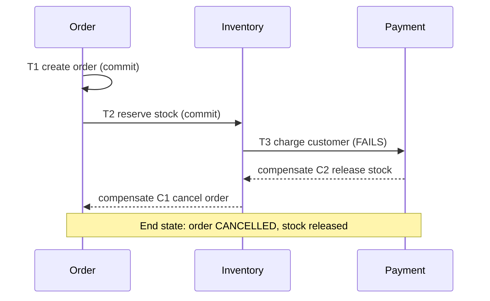
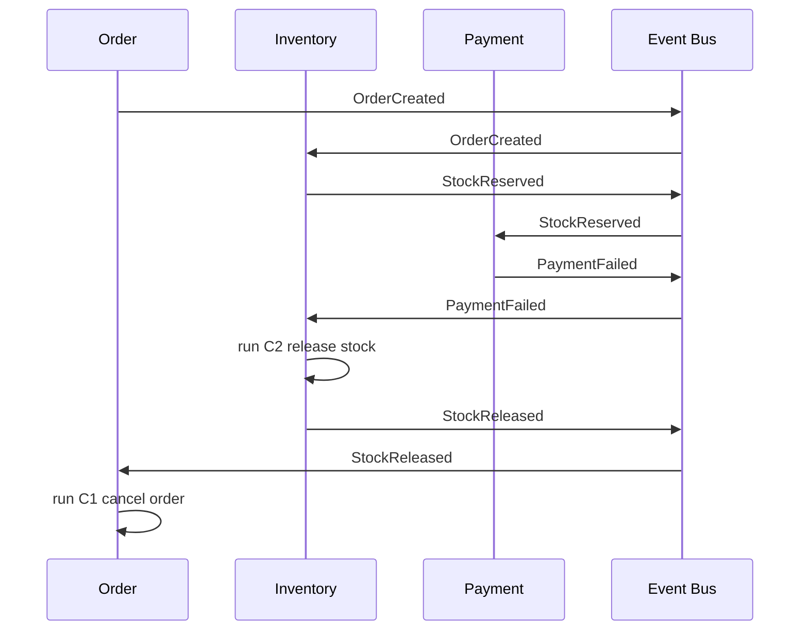
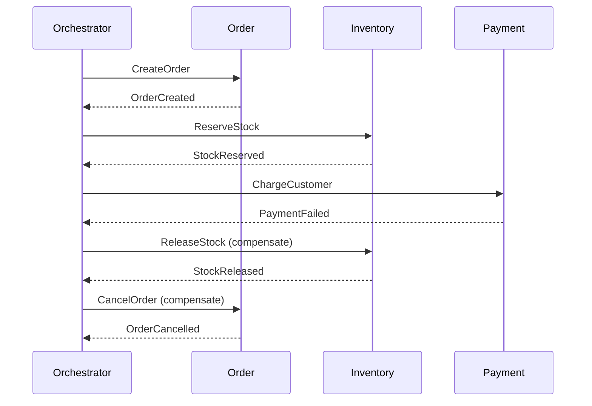

# Saga Pattern

## Prerequisites

- **[ACID vs BASE](./acid-vs-base.md)** [Must read]
- **[Idempotency](./idempotency.md)** [Must read]
- **[Message Queues](../components/message-queues.md)** [Should read]

## Table of Contents

- [Mental Model](#mental-model)
- [Formal Definition](#formal-definition)
- [Assumptions & Preconditions](#assumptions--preconditions)
- [Core Mechanics](#core-mechanics)
- [Choreography vs Orchestration](#choreography-vs-orchestration)
- [Often Confused With](#often-confused-with)
- [Variants & Extensions](#variants--extensions)
- [Real-World Applications](#real-world-applications)
- [Common Misapplications & Gotchas](#common-misapplications--gotchas)
- [Interview Scenario Bank](#interview-scenario-bank)
- [Appendices](#appendices)

## TLDR

A saga is a sequence of local transactions, each committing to its own service's database, where every step has a paired compensating transaction that semantically undoes it if a later step fails. It replaces one distributed ACID transaction (locking, 2PC) with a chain of independent commits plus a rollback story - trading atomicity for availability and service autonomy. The core decision it enables: how a multi-service write (place order → reserve inventory → charge payment → ship) stays consistent without holding cross-service locks. The key trade-off is choreography (each service reacts to the previous service's event, no central brain) versus orchestration (a coordinator tells each service what to do next) - and compensations are semantic undos, not database rollbacks, so they must be designed as carefully as the forward steps themselves.

## Mental Model

**A saga is a chain of falling dominoes you can rebuild backward.** Each domino (local transaction) falls on its own - there's no single hand holding all of them upright at once, the way a distributed lock would. If domino 4 fails to fall, you don't freeze time and undo domino 3 the way a database rolls back an uncommitted write - you stand dominoes 3, 2, and 1 back up, one at a time, in reverse order, using a *different* action than the one that knocked them down. That "standing back up" action is the compensating transaction, and it has to be designed in advance for every domino, because you don't get to choose which one fails.

## Formal Definition

A saga is a sequence of local transactions `T1, T2, ..., Tn`, where each `Ti` commits independently against its own service's data store, and each `Ti` (except possibly the last) has an associated compensating transaction `Ci` that is semantically inverse to it. If `Tk` fails, the saga executes `Ck-1, Ck-2, ..., C1` in reverse order to bring the system to a consistent end-state, though not necessarily the original starting state.

## Assumptions & Preconditions

A saga only produces a consistent outcome when these hold - violate any one and the "eventual consistency" the pattern promises silently breaks:

- **Every step must have a compensating action that is actually possible.** `SendEmail` and `ChargeNonRefundableFee` have no true undo - a saga touching an irreversible external effect must either reorder that step to be last, or accept the effect can't be fully compensated and only mitigated (e.g. an apology email, not an unsend).
- **Compensations must be idempotent and retry-safe**, for the same reason forward steps are: a compensation can itself fail transiently and need retrying, and a network timeout means the caller can't always tell if the first attempt landed. See **[Idempotency](./idempotency.md)** - a compensation is just another operation subject to the same at-least-once-delivery reality.
- **Steps must be individually local-ACID.** Each `Ti` is a normal transaction against one service's own database - the saga's coordination logic assumes that guarantee already holds at the step level and only handles cross-step consistency.
- **The saga must tolerate a period of visible intermediate state.** Between `T1` committing and `T3` failing, other requests can observe order=confirmed while payment hasn't cleared - callers and readers of that data must be built to tolerate this, or the saga needs semantic locks (see [Variants & Extensions](#variants--extensions)) to hide it.

## Core Mechanics

**Forward path.** Each step executes as an independent local transaction against its own service, and only proceeds to the next step after the current one commits:

```
T1: Order Service    - create order, status=PENDING       -> commit
T2: Inventory Service - reserve stock for order             -> commit
T3: Payment Service   - charge customer                     -> commit
T4: Shipping Service  - schedule shipment, order=CONFIRMED  -> commit
```

Nothing holds a lock across these four commits. By the time `T2` runs, `T1`'s effects are already durable and visible to any other reader of the Order Service's database.

**Compensation path.** If `T3` (charge customer) fails - card declined - the saga does not attempt to "roll back" `T1` and `T2` the way a database engine would undo uncommitted writes, because they're already committed. It runs their compensations in reverse order:

```
C2: Inventory Service - release the reserved stock  -> compensates T2
C1: Order Service      - mark order CANCELLED        -> compensates T1
(T4 never ran - nothing to compensate)
```

The end-state is not "as if the saga never happened" - it's a new, deliberately-designed consistent state (order exists, tagged CANCELLED; stock is back in the pool) that is not identical to the pre-saga state.



⚖️ **Decision Framework: when a saga is the right tool.** Use a saga when a business operation spans multiple services that each own their own data and can't share a database or a distributed lock manager. Don't reach for it when the operation is confined to one service's database - that's just a local ACID transaction, and adding saga machinery around it is pure overhead with none of the payoff.

## Choreography vs Orchestration

The two ways to coordinate which step runs next and who triggers compensation - this is the saga's central design decision, not a minor implementation detail.

**Choreography.** Each service publishes an event when its local transaction commits, and subscribes to the events it needs to react to. There is no central coordinator - the "plan" exists only as the sum of each service's subscription logic.



**Orchestration.** A dedicated orchestrator service holds the saga's plan explicitly and issues commands to each participant, waiting for a reply before issuing the next command. Participants don't know about each other - they only know the orchestrator.



| Dimension | Choreography | Orchestration |
| --- | --- | --- |
| Coordination logic | Distributed across every participant's event handlers | Centralized in one orchestrator |
| Coupling | Services coupled to event *contracts*, not each other directly | Services coupled to the orchestrator's command contract |
| Adding a new step | Touch every service that needs to know about it | Touch only the orchestrator's plan |
| Observability | Saga state is implicit - reconstructed from scattered event logs | Saga state is explicit - one place holds "where is this saga right now" |
| Cyclic-dependency risk | Real - service A reacting to B's event which reacts to A's event is easy to create by accident | Not possible - orchestrator is the only source of "what's next" |
| Failure blast radius | A missing/misconfigured subscriber silently stalls the saga with no owner | Orchestrator crash is a single, visible failure point (needs its own HA) |

🧠 **Thought Process.** A senior engineer picks based on step count and change velocity, not taste: 2-3 steps with a stable, rarely-changing flow favors choreography - the overhead of a coordinator service isn't earned yet. 4+ steps, or a flow that product will want to reorder/extend regularly, favors orchestration - the moment you need to *see* "which sagas are stuck at step 3 right now" as an operational question, you want the explicit state an orchestrator gives you for free.

## Often Confused With

**Saga vs Two-Phase Commit (2PC).** 2PC achieves real atomicity - a coordinator asks every participant to "prepare" (lock and vote), and only then tells all of them to commit, so the whole transaction is atomic and isolated. A saga achieves neither: each local transaction commits immediately and independently, so intermediate state is visible to other readers, and "rollback" is a separately-designed compensating action, not a true undo. Sagas trade 2PC's atomicity and isolation for availability - no participant holds a lock waiting on the others, so no single slow/down service blocks everyone else.

**Compensating transaction vs database rollback.** A rollback undoes an *uncommitted* transaction using the database engine's own log - it's mechanical and exact, restoring the exact prior state. A compensating transaction undoes an *already-committed* one using ordinary application logic (another local transaction) - it's semantic, not mechanical, and it produces a new state ("cancelled"), not a restoration of the old one ("as if it never happened"). This is why a payment compensation is `IssueRefund`, not "un-charge the card."

**Saga vs event sourcing.** Event sourcing is a storage model - state is derived by replaying a log of events. A saga is a coordination pattern for a multi-step, multi-service business process. They compose well (a choreographed saga is naturally built from an event-sourced backbone) but solve different problems - one is about how state is stored, the other is about how independent commits are sequenced and undone.

## Variants & Extensions

**Semantic lock.** Instead of leaving intermediate state fully visible, a step marks the record with a pending-ish status (`order.status = PENDING_PAYMENT`) that other business logic treats as "don't act on this yet," even though it's committed and technically readable. Narrows the window where a caller can observe and act on an inconsistent mid-saga state, at the cost of extra status-handling logic in every reader.

**Pivot transaction.** The step in the saga after which the outcome is guaranteed to succeed (business-committed) - steps before it are compensatable, steps after it are only retriable-until-success, never compensated. Useful for the common case where the last few steps (send confirmation, update analytics) genuinely can't fail in a way that should unwind the whole saga - retry them forever instead of compensating everything before them.

**Saga state machine persistence (orchestration only).** The orchestrator persists the saga's current step and status to its own store after each transition, so a crashed orchestrator can resume in-flight sagas from their last known state on restart instead of losing track of them - this durable state machine is what "explicit saga state" in the comparison table above actually refers to.

## Real-World Applications

Order-fulfillment and travel-booking systems (book flight + hotel + car, any one of which can fail and must unwind the others) are the textbook saga use case, and orchestration frameworks like Camunda or Temporal exist specifically to host the coordinator's state machine durably. **At scale**, the failure mode that shows up past a modest number of concurrent in-flight sagas is compensation storms: a downstream outage (payment provider down for 10 minutes) doesn't just fail new sagas, it triggers a burst of compensations across every saga that was mid-flight when the outage started, which itself can overload the very services (inventory release, order cancellation) the compensations depend on - compensation logic needs its own backpressure and retry budget, not just a "run it" path.

## Common Misapplications & Gotchas

- **Designing forward steps first, compensations as an afterthought.** A compensation for `ChargeCustomer` (issue a refund) is a materially different operation with its own failure modes (what if the refund itself fails?) - it needs the same design rigor as the forward step, not a rushed "just undo it" implementation once the happy path works.
- **Assuming compensations run in a bubble of isolation.** Between `T2` committing and `C2` running, other requests may have already acted on the now-stale state `T2` created (another order consumed the "released" stock window differently than expected) - compensations must be written defensively against a world that moved on, not against a frozen snapshot.
- **No timeout/retry budget on a stuck step.** A saga waiting forever on a step that never responds (service down, message lost) never triggers compensation and never completes - every step needs a timeout after which the saga treats it as failed and starts compensating, not an indefinite wait.

### Common Misconceptions

- **"A saga guarantees the same consistency as a distributed transaction, just implemented differently."** No - a saga gives up isolation. Other transactions can read and act on committed-but-not-yet-fully-compensated intermediate state, something a real distributed transaction (2PC) with proper isolation would never expose.
- **"Compensating transactions restore the exact original state."** No - they bring the system to *a* consistent state, not necessarily the pre-saga one. A cancelled order isn't the same as an order that was never created; a refunded charge isn't the same as no charge ever happening (there's a charge-then-refund pair in the ledger).

## Interview Scenario Bank

> 🎯 **Interview Lens**
> **Q:** How would you handle a multi-step "place order" flow across separate Order, Inventory, and Payment services without a distributed transaction?
> **Ideal answer:** Model it as a saga - each service commits its own local transaction, and each step has a compensating action (release stock, refund payment) that runs in reverse order if a later step fails. Choose choreography if the flow is short and stable, orchestration if it's 4+ steps or needs explicit visibility into where each in-flight order is stuck.
> **Common trap:** Proposing 2PC across the three services' databases - technically possible with an XA-style coordinator, but couples the services' uptime together and blocks on the slowest participant, which defeats the reason they were split into separate services in the first place.
> **Next question:** "What happens if the compensation for the Inventory step itself fails?"
> **Next question:** "How do you prevent a customer from seeing a CONFIRMED order for a few seconds before a downstream step fails and it flips to CANCELLED?"

> 🎯 **Interview Lens**
> **Q:** Why can't you just roll back the earlier steps of a saga the way a database rolls back a failed transaction?
> **Ideal answer:** Because those earlier steps already committed - `T1` and `T2` are durable, visible facts in their own services' databases by the time `T3` fails. There's nothing left to roll back mechanically; the only option is a new transaction (`C1`, `C2`) that semantically undoes the effect, which is why compensations are ordinary application logic, not a database-engine feature.
> **Common trap:** Describing compensation as "rollback" - interviewers listen for whether the candidate understands it's a *new* forward-moving transaction, not a mechanical undo, since that distinction is what drives how carefully compensations must be designed.
> **Next question:** "Is a compensating transaction guaranteed to succeed? What do you do if it doesn't?"

> 🎯 **Interview Lens**
> **Q:** Choreography or orchestration for a checkout saga with 6 services involved?
> **Ideal answer:** Orchestration - at 6 steps, choreography's implicit coordination (reconstructing "where is this saga stuck" from scattered event logs across 6 services) becomes an operational liability, while an orchestrator gives a single, explicit, persisted state machine to query and resume from on crash.
> **Common trap:** Picking choreography by default because "it's more decoupled" without weighing that the coupling doesn't disappear - it moves from explicit command contracts to implicit event contracts, which is harder to trace at 6 services.
> **Next question:** "What happens to in-flight sagas if the orchestrator itself crashes mid-flow?"

## Appendices

### Acronyms & Abbreviations

| Acronym | Full Form | One-line meaning |
| --- | --- | --- |
| 2PC | Two-Phase Commit | A distributed-transaction protocol where a coordinator gets all participants to vote-and-lock (prepare) before telling any of them to commit. |
| ACID | Atomicity, Consistency, Isolation, Durability | The guarantees a single local database transaction provides, which a saga deliberately trades away for availability across services. |

### Anti-patterns

- **Compensations bolted on after the forward flow is "done"** - treated as an afterthought, they inherit none of the retry/idempotency rigor of the forward steps - design them alongside, not after.
- **No timeout on saga steps** - a step that hangs forever never triggers compensation, leaving the saga stuck indefinitely - every step needs a bounded wait after which failure (and compensation) is assumed.
- **Choreography with implicit, undocumented event contracts** - works fine until a 3rd service starts listening to an event that was never designed to be public, creating a hidden coupling nobody can trace - treat saga events as a versioned public contract.

### Selection Matrix

| Criterion | Choreography | Orchestration |
| --- | --- | --- |
| Best for | 2-3 stable steps | 4+ steps or frequently changing flow |
| State visibility | Implicit, reconstructed from events | Explicit, queryable state machine |
| New-step cost | Touches every interested service | Touches only the orchestrator |
| Operational debugging | Harder - trace scattered event logs | Easier - single source of saga state |
