# JWT (JSON Web Token)

## Prerequisites

- **[Authentication](./authentication.md)** [Must read]
- **Asymmetric Cryptography** [Must read] <!-- link: ../algorithms/cryptography.md -->

---

## Table of Contents

- [TLDR](#tldr)
- [Mental Model](#mental-model)
- [Structure - Header, Payload, Signature](#structure--header-payload-signature)
- [Claims - Registered, Public, Private](#claims--registered-public-private)
- [Signing Algorithms - HS256 vs RS256 vs ES256](#signing-algorithms--hs256-vs-rs256-vs-es256)
- [Key Distribution - JWKS Endpoint](#key-distribution--jwks-endpoint)
- [Quick Decision Guide](#quick-decision-guide)
- [Comparison Matrix](#comparison-matrix)
- [Verification Gotchas](#verification-gotchas)
- [Production Failure Modes & Gotchas](#production-failure-modes--gotchas)
- [Interview Scenario Bank](#interview-scenario-bank)
- [Appendices](#appendices)

---

## TLDR

A JWT is a self-contained, signed token - three base64url segments encoding claims about a principal - that a service verifies cryptographically without a database lookup. The core decision is the signing algorithm: HS256 shares one secret between issuer and verifier (fine for a single service, dangerous across many), while RS256/ES256 split signing (private key) from verification (public key), so a compromised verifier can never forge a token. The trade-off this buys is revocation: a JWT is valid until `exp` no matter what happens server-side, so anything requiring instant revocation needs an extra layer (blocklist, version counter, or short expiry) bolted back on top of statelessness.

**Interview soundbite:** a JWT doesn't get you out of managing state - it just moves the question from "where's my session store" to "how do I revoke something that was designed to need no lookup at all."

---

## Mental Model

**A JWT is a tamper-evident claim check, not a vault.** The payload is base64url-encoded, not encrypted - anyone holding the token can read every claim inside it. What the signature guarantees is that the claims haven't been altered since the issuer signed them. Treat every JWT payload as public information the moment it leaves the server, and treat the signature as the only thing standing between "this is what the issuer said" and "this is whatever the holder wants it to say."

This mental model resolves most first-instinct mistakes: don't put secrets in the payload, don't trust unsigned fields, and remember that "signed" answers "was this tampered with," not "can everyone see it" or "is this still valid" (see [Authentication § Stateful vs Stateless](./authentication.md#stateful-vs-stateless--the-central-decision) for why that last question is the one JWTs structurally struggle with).

---

## Structure - Header, Payload, Signature

A JWT is three base64url-encoded segments joined by dots: `header.payload.signature`

```text
eyJhbGciOiJSUzI1NiIsInR5cCI6IkpXVCIsImtpZCI6ImtleS0xIn0   ← header
.
eyJzdWIiOiI0MiIsImVtYWlsIjoidXNlckBleGFtcGxlLmNvbSIsInJvbGVzIjpbInVzZXIiXSwiaXNzIjoiYXV0aC5leGFtcGxlLmNvbSIsImF1ZCI6ImFwaS5leGFtcGxlLmNvbSIsImlhdCI6MTcwMDAwMDAwMCwiZXhwIjoxNzAwMDAzNjAwfQ   ← payload
.
SflKxwRJSMeKKF2QT4fwpMeJf36POk6yJV_adQssw5c   ← signature
```

**Header** (decoded):

```json
{
  "alg": "RS256",
  "typ": "JWT",
  "kid": "key-1"
}
```

**Payload** (decoded):

```json
{
  "sub": "42",
  "email": "user@example.com",
  "roles": ["user"],
  "iss": "auth.example.com",
  "aud": "api.example.com",
  "iat": 1700000000,
  "exp": 1700003600
}
```

**Signature:**

```
Base64Url(sign(algorithm, header + "." + payload, secret_or_private_key))
```

The signature covers both header and payload - modifying either byte invalidates it. The payload is base64url-encoded, not encrypted; anyone who intercepts the token can decode and read the claims. JWE (JSON Web Encryption) is the encrypted variant; standard JWTs (JWS, JSON Web Signature) are signed-only and are what "JWT" means in almost every production system and interview context.

---

## Claims - Registered, Public, Private

**Registered claims** (IANA-defined, short names to keep the token compact):

| Claim | Full Name  | Meaning                                               |
| ----- | ---------- | ----------------------------------------------------- |
| `sub` | Subject    | Unique identifier of the principal                    |
| `iss` | Issuer     | Who issued the token (URI)                            |
| `aud` | Audience   | Who the token is intended for                         |
| `exp` | Expiration | Unix timestamp after which the token is invalid       |
| `nbf` | Not Before | Unix timestamp before which the token is invalid      |
| `iat` | Issued At  | Unix timestamp of issuance                             |
| `jti` | JWT ID     | Unique ID for this token - used for replay prevention  |

**Public claims:** custom claims registered with IANA or using collision-resistant URIs (`https://example.com/roles`). Safe to use across systems that don't share an owner.

**Private claims:** agreed-upon between specific parties. Not registered, no collision protection - fine within a closed system, problematic when tokens cross system boundaries and two teams pick the same claim name for different meanings.

> ⚠️ **Warning / Gotcha**
> Always validate `aud`. A token issued for `api.example.com` should be rejected by `admin.example.com`. Many libraries skip audience validation unless explicitly configured. An attacker who obtains a token for a low-privilege service can replay it against a higher-privilege one if `aud` is not checked.

Claims are assertions, not verified facts - see [Authentication § Identity, Principals, Claims](./authentication.md#identity-principals-claims) for the general distinction between identity claims and authorization claims and why long-lived tokens with embedded role claims go stale.

---

## Signing Algorithms - HS256 vs RS256 vs ES256

### HS256 (HMAC-SHA256) - Symmetric

One shared secret both signs and verifies. Fast, simple, no key-distribution infrastructure.

**Critical problem:** any service that can *verify* a token can also *forge* one. In a microservices architecture where all services share the HS256 secret, a single compromised service can mint tokens for any user, for any role.

Use HS256 only when exactly one service both issues and verifies tokens - the moment a second service needs to verify, the shared-secret model becomes the weakest link in the system.

### RS256 (RSA-SHA256) - Asymmetric

The auth server signs with a private key. All other services verify with the corresponding public key, published at a JWKS endpoint.

```
Auth server:   sign(payload, private_key)   → token
API service:   verify(token, public_key)    → claims
```

The public key is safe to distribute freely. A compromised API service cannot forge tokens - it only ever has the public key. This is the correct choice for any multi-service architecture where trust must not be symmetric.

**Downsides:** RSA keys are large (2048+ bits), signing is comparatively slow, and key rotation requires updating the JWKS endpoint and waiting for every consumer's cache to expire.

### ES256 (ECDSA P-256 with SHA-256) - Asymmetric

Same trust model as RS256 (private signs, public verifies) but built on elliptic curve cryptography. Smaller keys (~32 bytes vs ~256 bytes for RSA-2048), faster signing and verification. Preferred over RS256 for new systems; the main reason RS256 remains common is legacy library support and existing key infrastructure, not a technical advantage.

| Algorithm | Type       | Key Size   | Sign Speed | Verify Speed | Use Case                             |
| --------- | ---------- | ---------- | ---------- | ------------ | ------------------------------------- |
| HS256     | Symmetric  | 32 bytes   | Very fast  | Very fast    | Single-service, internal tokens        |
| RS256     | Asymmetric | 2048+ bits | Slow       | Fast         | Multi-service, established ecosystem   |
| ES256     | Asymmetric | 32 bytes   | Fast       | Fast         | Multi-service, new systems             |

> ⚖️ **Decision Framework**
> Does exactly one service issue and verify, with no plan to add a second verifier? → HS256 is fine and simplest. Do multiple services need to verify independently? → Asymmetric, no exceptions - the moment a verifier holds the same secret used to sign, it can impersonate the issuer. Between RS256 and ES256 with no legacy constraint, default to ES256 for the smaller tokens and faster signing.

---

## Key Distribution - JWKS Endpoint

For asymmetric algorithms, the verifier needs the public key. The standard mechanism is a JWKS (JSON Web Key Set) endpoint:

```
GET https://auth.example.com/.well-known/jwks.json

{
  "keys": [
    { "kty": "RSA", "kid": "key-1", "use": "sig", "n": "...", "e": "AQAB" }
  ]
}
```

The `kid` (key ID) in the token header tells the verifier which key to use. Services cache the JWKS and re-fetch only when they encounter an unknown `kid` - fetching on every verification would turn a CPU-only check into a network call per request, erasing the main performance advantage of asymmetric verification.

### Zero-Downtime Key Rotation

1. Generate a new key pair.
2. Publish the new key at the JWKS endpoint alongside the old one.
3. Switch signing to the new key (new tokens carry `kid: key-2`).
4. Wait for every token signed with `kid: key-1` to expire - one full access-token `exp` window.
5. Remove `kid: key-1` from the JWKS.

Services encountering an unknown `kid` attempt a single JWKS cache refresh - this handles the window where a new key appears before the local cache has updated. Do not retry aggressively during an AS outage; a flood of refresh attempts against a degraded auth server compounds the outage instead of recovering from it.

The overlap is the whole point: `key-1` and `key-2` are both valid verifiers at the JWKS endpoint for the entire window between step 2 and step 5, so a token signed at any point in that window - old key or new - verifies successfully no matter which service checks it.

```mermaid
gantt
    title Key Validity Windows During Rotation
    dateFormat  X
    axisFormat %s
    section key-1 (old)
    Signing new tokens      :active, k1sign, 0, 3
    Published, verify-only  :k1verify, 3, 8
    Removed from JWKS       :milestone, k1gone, 8, 0
    section key-2 (new)
    Published alongside old :milestone, k2pub, 3, 0
    Signing new tokens      :active, k2sign, 3, 8
    Verify-only, ongoing    :k2verify, 8, 10
```



Read the chart in steps: at `t=0` only `key-1` signs and verifies. At `t=3`, `key-2` is published and becomes the signing key, but `key-1` stays in the JWKS as verify-only - this is the overlap window. Any `key-1`-signed token issued before `t=3` keeps verifying until its own `exp`, which is why `key-1` must stay published for a full access-token TTL past the cutover, not just until the cutover itself. Only at `t=8`, once the last `key-1` token has expired, is `key-1` safe to remove.

> ⚠️ **Warning / Gotcha**
> Removing an old signing key from the JWKS endpoint before every token signed with it has expired causes valid, recently-issued tokens to be rejected as "unknown kid." Keep the old key published for at least one full access-token TTL after rotating - this is the single most common self-inflicted outage in JWT rollouts.

---

## Quick Decision Guide

**Use a JWT when:** multiple independent services need to verify identity without a shared session store, the system is horizontally scaled behind a load balancer with no sticky sessions, or the client is a mobile/native app that benefits from a self-contained, portable credential.

**Don't use a JWT when:** instant revocation is a hard requirement (financial holds, account suspension, compromised-credential response) and you have no appetite for the blocklist/version-counter machinery that bolts revocability back on - a server-side session is simpler and gets revocation for free. See [Authentication § Stateful vs Stateless](./authentication.md#stateful-vs-stateless--the-central-decision) for the full trade-off table; it is not restated here.

**Choosing a signing algorithm:** see the [Decision Framework](#signing-algorithms--hs256-vs-rs256-vs-es256) above - single-service internal tokens can use HS256, anything with more than one verifier must use RS256 or ES256.

**Cost angle:** the cost difference between algorithms is operational, not infrastructure spend - HS256 needs zero key-management tooling, while RS256/ES256 require a JWKS endpoint, rotation runbooks, and cache-invalidation handling. For a small team standing up their first multi-service system, that operational cost (not raw compute) is often the deciding factor in delaying the JWKS investment - which is exactly the trap the HS256 shared-secret problem above warns against. Budget for it up front rather than retrofitting it after a service boundary already exists.

**Access token expiry:** governed by the same trade-off as any token-based system - see [Authentication § Token Lifecycle](./authentication.md#token-lifecycle---expiry-rotation-revocation-logout) for the full expiry/rotation/revocation reasoning, which applies to JWTs without modification.

---

## Comparison Matrix

| Dimension              | HS256 (Symmetric)                | RS256 (Asymmetric)                    | ES256 (Asymmetric)                    |
| ----------------------- | ------------------------------------ | ----------------------------------------- | ----------------------------------------- |
| Key model               | One shared secret                    | Private signs / public verifies            | Private signs / public verifies            |
| Verifier can forge?     | Yes (holds the signing secret)        | No (only holds the public key)             | No (only holds the public key)             |
| Key size                | 32 bytes                             | 2048+ bits                                  | ~32 bytes                                   |
| Infra required          | None                                  | JWKS endpoint, rotation tooling             | JWKS endpoint, rotation tooling             |
| Best fit                | Single-service, internal tokens       | Multi-service, legacy/established stacks    | Multi-service, greenfield systems           |

**Pick it when:** HS256 - one service both issues and verifies, no plan to add a second verifier. RS256 - multi-service, and the ecosystem (libraries, existing PKI) already standardizes on RSA. ES256 - multi-service, greenfield, no legacy constraint forcing RSA.

For the higher-level "JWT vs session vs OAuth token" decision, see [Authentication § Selection Matrix](./authentication.md#selection-matrix) - that comparison is owned by the hub and not repeated here.

---

## Verification Gotchas

### `alg:none` Attack

The JWT header specifies the algorithm. Some libraries, if not explicitly configured, accept `alg: "none"` - meaning no signature is required at all. An attacker changes the header to `{"alg":"none"}`, strips the signature, and a permissive library accepts the forged token outright.

**Fix:** always explicitly specify the allowed algorithm(s) in the verifier. Never accept `alg: "none"`.

```python
# WRONG - trusts the token's own alg header
jwt.decode(token, key)

# RIGHT - caller dictates allowed algorithms
jwt.decode(token, key, algorithms=["RS256"])
```

### Algorithm Confusion Attack

The attacker changes `alg` from `RS256` to `HS256` in the token header and re-signs using the server's *public key* as the HMAC secret - the public key is not secret, it's published at the JWKS endpoint. If the verifying library reads the algorithm from the token header itself and switches its verification strategy to symmetric, the forged signature validates, because HMAC-SHA256(public_key_bytes, data) is exactly what the attacker just computed.

**Fix:** same principle as `alg:none` - always hardcode the allowed algorithm(s) in the verifier and never let the token dictate its own verification method.

### Clock Skew

JWT expiry is compared against the verifying server's clock. Clocks in a distributed system diverge by tens to hundreds of milliseconds under normal operation, and by much more when NTP sync silently fails on one instance. A token with `exp` exactly at the current time may be accepted by one instance and rejected by another simultaneously.

Standard practice: configure a small `leeway` (30-60 seconds) in JWT verification. All major JWT libraries support this parameter. Monitor clock drift across service instances as an infrastructure health signal - NTP sync failures manifest as intermittent 401s that are difficult to diagnose because they don't correlate with deploys or load.

---

## Production Failure Modes & Gotchas

**`alg:none` and algorithm-confusion acceptance** - see [Verification Gotchas](#verification-gotchas) above; the fix in both cases is the verifier hardcoding its allowed algorithm list rather than trusting the token's own header.

**Stale JWKS cache after rotation** - see [Zero-Downtime Key Rotation](#zero-downtime-key-rotation); removing a key before all tokens signed with it expire rejects valid, recently-issued tokens as "unknown kid."

**JWKS endpoint unavailable** - services cannot verify signatures once their cached key set expires and a refresh fails. Correct behavior is to **fail closed** (reject with 503, not silently accept) rather than fail open and accept unverified tokens. A cache TTL long enough to survive short auth-server outages (5-60 minutes) buys recovery time without weakening the fail-closed guarantee.

**Clock skew cascade** - see [Clock Skew](#clock-skew) above; a subset of instances with failed NTP sync starts rejecting valid tokens intermittently, which is hard to correlate with any deploy or traffic pattern.

**Token leakage via logs** - JWTs in URL query params are logged by every proxy and CDN by default, and error trackers (e.g. Sentry) can capture full request headers including `Authorization`. Never pass a JWT as a query parameter; configure error trackers to scrub auth headers before they're persisted.

**Payload bloat from over-claiming** - adding every attribute a downstream service might someday want (full profile, permission lists, feature flags) grows the token past the point where it fits comfortably in a header, and every one of those claims becomes stale the moment the underlying data changes but the token hasn't expired yet. Keep the payload to identity plus the minimum authorization context actually needed.

### Common Misconceptions

- **"A JWT is encrypted, so it's safe to put a password or secret in the payload."** No - a standard JWT (JWS) is signed, not encrypted. Anyone holding the token can base64url-decode the payload and read it in plaintext. Encryption requires the JWE variant, which is far less commonly used.
- **"Switching to JWTs removes the need for a database of who's logged in."** It removes the *lookup on every request*, not the need to ever revoke access - see [Authentication § Stateful vs Stateless](./authentication.md#stateful-vs-stateless--the-central-decision). Any system with a real revocation requirement re-introduces some state (blocklist, version counter), just smaller and read less often than a full session store.
- **"A longer `exp` is just a convenience trade-off with no security cost."** It directly sets the size of the compromise window - a stolen token is valid, unstoppable short of a revocation mechanism, for the entire remaining `exp` window regardless of what the server-side account state says.

---

## Interview Scenario Bank

> 🎯 **Opening framing:** "Before I design the token, I'd confirm who's verifying it - one service or several - because that decides symmetric vs asymmetric signing, and I'd ask whether the product needs instant revocation, because that decides whether a JWT is even the right tool before I get to algorithm choice."

> 🎯 **Interview Lens**
> **Q:** A service that only ever validates tokens gets compromised. What can the attacker do with what they find in its config?
> **Ideal answer:** Depends entirely on the signing algorithm. If the service was configured with a shared HMAC secret, the attacker can mint arbitrary forged tokens for any user. If it was configured with only a public key, the attacker gains nothing toward forgery - they can read tokens they intercept but cannot sign new ones.
> **Common trap:** Answering "they can forge tokens" without asking which algorithm is in use - the two algorithm families have completely different blast radii for exactly this scenario.
> **Next question:** How would you detect that this had already happened before you noticed the compromise?

> 🎯 **Interview Lens**
> **Q:** Your system just added a second backend service that needs to check who's making a request, and everything so far has used one shared secret to both mint and check these tokens. What has to change, and why can't you just hand the second service the same secret?
> **Ideal answer:** Move to an asymmetric scheme (RS256/ES256) - if the second service holds the same secret used for signing, it can forge tokens for the first service too, since verifying and signing become the same capability. Stand up a JWKS endpoint so each service verifies with a public key it cannot use to sign anything.
> **Common trap:** "Just give the new service the same secret, it's simpler." This is exactly the shared-secret blast-radius problem - a compromise of either service now grants full forgery power to an attacker.
> **Next question:** Once the second service is verifying independently, how does key rotation happen without any service being able to reject a suddenly-unrecognized token?

> 🎯 **Interview Lens**
> **Q:** A customer asks you to log a specific user out of every device right now. Their tokens don't expire for another 40 minutes. What do you do?
> **Ideal answer:** A stateless token by design can't be un-signed - the fix has to reintroduce some server-side check. Cheapest: a per-user version counter bumped on demand, checked against a short-TTL cache on each request. More granular: a `jti` blocklist for that user's outstanding tokens. Most expensive: full introspection on every request. Pick based on how often this needs to happen and how tight the window must be.
> **Common trap:** "Just wait for the token to expire" - this is correct only when the product accepts a 40-minute exposure window, which for many use cases (compromised account, fraud) it does not.
> **Next question:** If you add a version counter, what's the operational cost of checking it on every single request compared to not having one at all?

> 🎯 **Interview Lens**
> **Q:** Two tokens arrive back to back for the same request, one from a mobile client and one that was clearly forwarded through three internal hops. How do you tell, from the token alone, whether it was actually meant for the service that's currently checking it?
> **Ideal answer:** Check the audience claim against this service's own identifier - a token minted for one recipient should be rejected by any other, even though the signature itself is perfectly valid. Many libraries don't enforce this unless the caller opts in explicitly, so it has to be checked deliberately.
> **Common trap:** Trusting the signature alone as proof the request is legitimate here - a valid signature only proves the issuer signed it for *someone*, not that "someone" was this service.
> **Next question:** If a service accidentally skips this check, what's the concrete attack that becomes possible?

> 🎯 **Interview Lens**
> **Q:** You inherit a token verifier that reads which signing method to use from a field inside the token itself. What's wrong with that design, independent of which specific method is configured?
> **Ideal answer:** Letting the token dictate its own verification method means an attacker who knows (or can find) any key material the verifier holds - including a *public* key, which is not secret - can potentially craft a token that validates under a different method than the one actually intended, since a public key's raw bytes can double as an HMAC secret if the verifier blindly switches modes. The verifier, not the token, must decide which algorithm is acceptable.
> **Common trap:** Assuming the risk only applies to genuinely secret key material - the public key being non-secret is exactly what makes this exploitable.
> **Next question:** What's the one-line fix that closes this regardless of which specific algorithms are in play?

---

## Appendices

### Acronyms & Abbreviations

| Acronym | Full Form              | One-line meaning                                                        |
| ------- | ------------------------ | --------------------------------------------------------------------------- |
| JWT     | JSON Web Token            | Self-contained, signed token carrying claims about a principal               |
| JWS     | JSON Web Signature        | The signed (not encrypted) variant - what "JWT" means in almost all systems  |
| JWE     | JSON Web Encryption       | The encrypted variant of a JWT payload; uncommon in practice                  |
| JWKS    | JSON Web Key Set          | Published set of public keys a verifier uses to check token signatures       |
| HMAC    | Hash-based Message Authentication Code | Symmetric signing primitive underlying HS256                    |

### Anti-patterns

- **Trusting the `alg` field from the token header** - lets an attacker downgrade to `none` or trigger algorithm confusion. Hardcode the allowed algorithm(s) in the verifier.
- **Sharing one HS256 secret across multiple independently-deployed services** - any compromised verifier becomes a forgery engine for every other service trusting the same secret. Move to asymmetric signing the moment a second independent verifier exists.
- **Skipping `aud` validation** - a token minted for one service can be replayed against another that shares the same issuer and signing key. Always check audience explicitly.
- **Removing a rotated signing key from JWKS too early** - rejects still-valid tokens signed with it. Keep the old key published for at least one full access-token TTL past rotation.
- **Putting sensitive data in the payload assuming it's encrypted** - a standard JWT is signed, not encrypted; the payload is plainly readable by anyone holding the token.

### Selection Matrix

See [Comparison Matrix](#comparison-matrix) above for the signing-algorithm selection table; see [Authentication § Selection Matrix](./authentication.md#selection-matrix) for JWT vs session vs OAuth at the mechanism-family level.
