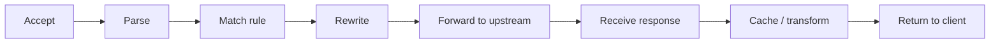

# Proxies

## Prerequisites

- **TCP/IP & OSI Model** [Must read] <!-- link: ./tcp-ip-osi-model.md -->
- **[DNS](./dns.md)** [Should read]
- **HTTP/1.1 vs HTTP/2** [Should read] <!-- link: ./http.md -->

---

## Table of Contents

- [Conceptual Foundations & Mental Models](#conceptual-foundations--mental-models)
- [Forward Proxy vs Reverse Proxy](#forward-proxy-vs-reverse-proxy)
- [Core Mechanisms](#core-mechanisms)
- [Header Rewriting & Client Identity](#header-rewriting--client-identity)
- [Caching at the Proxy](#caching-at-the-proxy)
- [Quick Decision Guide](#quick-decision-guide)
- [Security & Hardening](#security--hardening)
- [Deployment Contexts](#deployment-contexts)
- [Observability & Debugging](#observability--debugging)
- [Production Failure Modes & Gotchas](#production-failure-modes--gotchas)
- [Interview Scenario Bank](#interview-scenario-bank)
- [Appendices](#appendices)

---

## TLDR

A proxy is an intermediary that sits between two parties and relays traffic on their behalf, terminating one connection and originating another. A **forward proxy** hides the client from the destination server; a **reverse proxy** hides the destination server(s) from the client. The core decision a proxy makes on every request is whether to terminate-and-reissue (full L7 visibility, can rewrite anything) or tunnel (opaque passthrough, lower latency, can't inspect). Load balancers, API gateways, and CDN edge nodes are all specialized reverse proxies - this page owns the shared proxy mechanism; those pages own what they add on top.

---

## Conceptual Foundations & Mental Models

**Interviewer TL;DR:** Establish forward vs reverse first - it decides who the proxy is hiding, which is the axis every other design question hangs off.

**Mental model:** A proxy is a stand-in that takes a request on one side, does something with it, and produces a request on the other side. Neither party talks directly to the other - both talk to the proxy.

### Core Problem: Direct Client-Server Coupling

Without an intermediary, a client resolves a server's address and connects directly. That coupling is fine until you need one of: the server's identity to stay unknown to the client, the client's identity to stay unknown to the server, an inspection point between them, or a single reachable endpoint standing in for many backends. A proxy inserts itself at exactly that seam.

### Termination vs Tunneling

Every proxy makes one structural choice per connection: **terminate** the incoming connection (accept it, parse the request, decide what to do, open a fresh outbound connection) or **tunnel** it (relay bytes without parsing, e.g. `CONNECT` for HTTPS through a forward proxy). Termination gives full L7 visibility - the proxy can rewrite headers, cache the body, route by path. Tunneling is opaque - the proxy can't see or modify what's inside, only where the bytes go. This single choice explains most of what a given proxy can and can't do: a forward proxy tunneling `CONNECT` never sees the plaintext request; a TLS-terminating reverse proxy sees everything but adds a re-encryption hop if the backend also wants TLS.

---

## Forward Proxy vs Reverse Proxy

⚖️ **Decision Framework**

| | Forward Proxy | Reverse Proxy |
| --- | --- | --- |
| Sits in front of | The client | The server(s) |
| Hides | Server's identity from the client's network | Server's identity/topology from the client |
| Client is aware of it | Usually yes (configured explicitly) | No - looks like the origin |
| Server is aware of it | No - sees the proxy's IP, not the real client | Yes - it's the server's own infrastructure |
| Typical purpose | Egress control, content filtering, anonymization, geo-unblocking | Ingress routing, TLS termination, load distribution, caching |
| Examples | Corporate web filter, Squid, VPN egress node | nginx, Envoy, HAProxy, [load balancer](./load-balancer.md), [API gateway](./api-gateway.md), [CDN](./cdn.md) edge |

A **forward proxy** sits between a client and the internet at large - the client explicitly points at it (browser proxy settings, corporate egress rule, VPN client) and it fetches on the client's behalf. The origin server sees the proxy's IP, never the real client's. This is the shape behind corporate content filtering, outbound traffic auditing, and "unblock a geo-restricted service" tools.

A **reverse proxy** sits between clients and a server (or pool of servers) that it fronts - the client thinks it's talking to the origin directly and has no visibility into what's behind the proxy. This is the shape behind every [load balancer](./load-balancer.md), [API gateway](./api-gateway.md), and [CDN](./cdn.md) edge node: all three are reverse proxies with a specialization layered on top. A load balancer specializes in backend selection algorithms and health checking; a gateway specializes in the edge policy pipeline (auth, rate limiting, transformation); a CDN specializes in caching static/cacheable responses close to the client. None of that specialized depth belongs here - each linked page owns its own mechanics, algorithms, and scenario bank.

🧠 **Thought Process:** "Which side is hidden?" is the fastest way to classify an unfamiliar proxy setup in an interview. If the server never learns the real client's identity without extra work, it's forward. If the client never learns which of N backends answered, it's reverse.

**Takeaway independent of the split:** the deciding question isn't "forward or reverse" in the abstract, it's **who configures the proxy and who it's meant to protect** - whoever *deploys and controls* the proxy is who it serves. A forward proxy is deployed by the client's own organization to control what its clients can reach; a reverse proxy is deployed by the server's own organization to control who can reach it and how. Given an unfamiliar box in a network diagram, asking "whose infrastructure is this, and whose traffic policy does it enforce?" resolves the classification without needing to already know which side is hidden.

**Open (transparent) vs anonymous forward proxies:** an open forward proxy adds nothing revealing the original client (rare, mostly misconfigured or malicious); most forward proxies still forward `X-Forwarded-For` so the origin can recover the real client if it trusts the proxy - see [Header Rewriting & Client Identity](#header-rewriting--client-identity).

---

## Core Mechanisms

### Connection Handling

A reverse proxy typically runs as an event-driven or worker-process server (nginx's worker processes, Envoy's threads) that accepts inbound connections, and for each one either serves from cache, terminates and reissues a new outbound connection to a backend, or streams bytes through. Keep-alive matters on both sides independently: a proxy may hold a persistent client-facing connection while opening/reusing a separate pool of persistent connections to backends - the two connection lifecycles are decoupled by design, which is what lets the proxy multiplex many client connections onto few backend connections. That backend-facing pool is a finite resource: if it's undersized relative to inbound concurrency, requests queue at the proxy even though the backend itself has spare capacity (see [Connection Pool Exhaustion at the Proxy](#connection-pool-exhaustion-at-the-proxy)).

### Request/Response Pipeline

For a terminating proxy, each request goes through: accept → parse → match a rule (path, host header, ACL) → optionally rewrite (headers, URL, body) → forward to the chosen upstream → receive response → optionally cache or transform → return to client. Every stage after "match a rule" is where a plain proxy graduates into something with a name: match-and-forward-only is a proxy; add backend health/algorithm selection and it's a load balancer; add an auth/rate-limit/transform pipeline and it's a gateway; add response caching by default and it's edge-CDN behavior.

### WebSocket & Protocol-Upgrade Proxying

An `Upgrade: websocket` request starts as a normal HTTP request the proxy matches and forwards like any other, but once the backend responds `101 Switching Protocols` the proxy must stop treating that connection as request/response and hold it open as a raw bidirectional tunnel for the connection's lifetime - the pipeline above runs once, then the proxy gets out of the way. This breaks the short-lived-request assumption most connection-pool tuning is built on: a pool sized for fast HTTP turnover can starve under a moderate number of long-lived WebSocket connections each pinning one backend connection indefinitely, so upgraded connections are typically excluded from normal pool reuse/timeout logic and tracked separately.

### TLS Termination, Passthrough & Re-encryption

Three modes, same trade-off as on [load balancer TLS handling](./load-balancer.md):

- **Termination:** the proxy holds the certificate, decrypts client TLS, and can inspect/route by content. Backend traffic can be plaintext (trusted internal network) or re-encrypted.
- **Passthrough:** the proxy never decrypts - it routes by SNI (the hostname is visible in the unencrypted TLS handshake even though the rest is opaque) and tunnels the encrypted bytes straight through. Used when the backend must terminate its own TLS (e.g. client-cert auth at the origin).
- **Re-encryption:** terminate at the proxy, then open a fresh TLS connection to the backend. Doubles the handshake cost but keeps the whole path encrypted - standard in zero-trust/mesh environments.

⚠️ **Gotcha:** passthrough means the proxy cannot rewrite headers, inject `X-Forwarded-For`, or path-route on anything but SNI - it's giving up L7 control to avoid the extra decrypt/encrypt hop. Picking passthrough for "better security" while also expecting header injection is a contradiction candidates miss.

---

## Header Rewriting & Client Identity

A terminating proxy sits directly in the client's TCP path, so the backend's socket-level peer address is the proxy, not the real client. Recovering the real client requires the proxy to inject it explicitly:

- **`X-Forwarded-For`**: each hop appends its own address, producing a comma-separated chain. The trust rule is precise - if there are N trusted proxy hops between the internet and your app, the real client is the **Nth value counting from the right**; anything further left is client-suppliable and must never be trusted for security decisions (rate limiting keys, IP allowlists). An internet-facing proxy should strip any inbound `X-Forwarded-For` before appending the real client IP, otherwise a client can pre-seed the chain with a fake value.
- **`X-Forwarded-Proto` / `X-Forwarded-Host`**: tell the backend what scheme/host the client actually used, since after termination the backend↔proxy hop may differ (e.g. plaintext internally after TLS termination at the edge).
- **`Forwarded` (RFC 7239)**: a single standardized header meant to replace the `X-Forwarded-*` family; adoption is inconsistent, so most stacks still rely on the `X-Forwarded-*` set.
- **Proxy Protocol**: injects client-address metadata at the TCP layer before any HTTP is parsed, so it works for non-HTTP protocols too and is harder to spoof than a header a client could craft directly (assuming the proxy itself enforces it) - both endpoints must explicitly support it.

This is identical mechanics to what [Load Balancer § Client IP Preservation](./load-balancer.md#client-ip-preservation-x-forwarded-for-proxy-protocol) covers - one canonical explanation, linked rather than restated.

---

## Caching at the Proxy

A reverse proxy can cache responses keyed on request attributes (URL, headers, method) and serve repeat requests without touching the backend at all. This is the same cache-aside-at-a-layer idea as [Caching](./caching.md) and the same edge-caching idea [CDN](./cdn.md) specializes in - a CDN is essentially a globally-distributed fleet of caching reverse proxies. What's specific to a plain proxy: cacheability is governed by response headers (`Cache-Control`, `Vary`), a single proxy instance has one local cache (no multi-region invalidation fanout to reason about), and a cache miss falls straight through to the backend synchronously. See [Caching](./caching.md) for eviction policy and stampede mechanics, and [CDN](./cdn.md) for edge-scale invalidation.

---

## Quick Decision Guide

### Forward or Reverse?

- Need to control/audit/anonymize outbound traffic from a known set of clients → **forward proxy**.
- Need to front a server or pool of servers, hiding topology from inbound clients → **reverse proxy**.
- Need backend selection by algorithm/health → **load balancer** (a specialized reverse proxy) - see [Load Balancer](./load-balancer.md).
- Need an edge policy pipeline (authn, rate limiting, request/response transformation) in front of multiple services → **API gateway** - see [API Gateway](./api-gateway.md).
- Need to cache and serve static/cacheable content close to the client at global scale → **CDN** - see [CDN](./cdn.md).

### Terminate or Tunnel?

Terminate when you need to inspect, rewrite, route by content, or cache. Tunnel when the backend must own its own TLS session (client-cert auth), when protocol opacity is required, or when the extra decrypt/re-encrypt hop isn't worth the latency for a pure pass-through path.

**Cost angle:** a self-managed proxy fleet (nginx/Envoy on your own VMs) trades ops burden for full configuration control and no per-request pricing; a managed reverse proxy/gateway (cloud ALB, managed API gateway) trades some flexibility for zero patching and often per-request or per-hour billing that adds up at very high request volume - the crossover point is usually when you'd otherwise need a dedicated team just to keep the proxy layer patched and tuned.

**Real-world usage & at scale:** nginx and Envoy are the workhorse reverse proxies behind most production ingress layers, from a single-VM setup to a full service mesh data plane. At scale, a forward-proxy or NAT-style egress fleet can hit **SNAT port exhaustion**: every outbound connection consumes an ephemeral source port on the proxy's egress IP, and a fleet fronting enough concurrent outbound connections to a small set of destinations can run out of ports (~64K per IP) well before it runs out of CPU or memory - the fix is scaling egress IPs or connection reuse, not scaling proxy instances.

---

## Security & Hardening

- **Open proxy risk:** a forward proxy that accepts connections from anyone (not just its intended client population) becomes a relay for abuse - attackers use it to mask their origin. Always bind forward proxies to an authenticated or network-scoped client set.
- **Header spoofing:** any client-supplied `X-Forwarded-For` or similar header is untrusted input until a proxy hop overwrites/appends it - never trust the leftmost value for access control.
- **SSRF via proxy misconfiguration:** a reverse proxy that blindly forwards a client-controlled path/host to an internal upstream can be tricked into reaching internal-only services - validate and allowlist upstream targets, don't derive them unchecked from request input.
- **TLS downgrade at passthrough boundaries:** if any hop between client and backend silently drops to plaintext, verify that's an intentional trusted-network segment, not an oversight.

---

## Deployment Contexts

- **Edge / internet-facing:** the outermost reverse proxy a client's request hits - terminates public TLS, is where `X-Forwarded-For` chains should originate cleanly (strip-then-append).
- **Internal / service mesh sidecar:** each service gets a co-located proxy (Envoy in Istio/Linkerd) handling east-west traffic - see [Load Balancer § Service Mesh Integration](./load-balancer.md#service-mesh-integration-sidecar-proxy-vs-centralized-lb) for how this composes with load balancing.
- **Corporate egress:** forward proxies mediating all outbound traffic from an internal network, often paired with content filtering and TLS inspection.

---

## Observability & Debugging

- **Key signals:** proxy-added latency (time in the proxy vs backend), connection reuse rate (keep-alive effectiveness), cache hit ratio if caching is enabled, and 5xx rate attributable to the proxy itself vs the backend.
- **Distinguishing proxy vs backend failure:** a 502/504 originating at the proxy (backend unreachable or timed out) looks identical to the client as a backend 500 unless the proxy's own error pages are distinguishable - always check the proxy's access/error log first, not just backend logs, since the proxy may never have reached the backend at all.
- **Header chain inspection:** when debugging "wrong client IP" or "wrong scheme" bugs, log the full `X-Forwarded-*` chain at each hop - the bug is almost always a hop that didn't strip/append correctly.

---

## Production Failure Modes & Gotchas

### Connection Pool Exhaustion at the Proxy

If the proxy's outbound connection pool to a backend is undersized relative to inbound concurrency, requests queue at the proxy even though the backend has spare capacity - the bottleneck is the proxy's own pool, not the backend. Symptom: backend utilization looks low while client-observed latency climbs.

### Untrusted Header Chain

Trusting `X-Forwarded-For` without knowing exactly how many trusted hops precede your read of it lets a client spoof its own IP for rate-limiting or geo-restriction bypass. Fix: strip inbound `X-Forwarded-For` at the trust boundary (the outermost proxy you control) before appending the real value.

### Timeout Mismatch Across Hops

If the client-facing timeout at the proxy is longer than the proxy-to-backend timeout, a slow backend causes the proxy to silently fail and retry (or hang) in ways that don't match what the client is waiting for - timeouts should be configured to shrink at each hop moving inward, not grow.

### Common Misconceptions

- "A reverse proxy and a load balancer are different things you'd choose between" - a load balancer *is* a reverse proxy with a backend-selection algorithm; the question isn't proxy-or-LB, it's plain-proxy-or-LB-shaped-proxy.
- "TLS termination at the proxy means the rest of the path is insecure" - it means *that specific hop* chose plaintext or re-encryption; re-encryption keeps the full path encrypted at the cost of a second handshake.
- "Tunneling is just a slower way to terminate" - tunneling gives up inspection ability entirely; it's not a strictly worse version of termination, it's a different trade (opacity for lower latency and simpler TLS ownership).

---

## Interview Scenario Bank

> 💬 **Opening framing:** "First I'd ask whether we need to hide the client from the server or the server from the client - that decides forward vs reverse. Then whether this proxy needs to inspect/rewrite content or just relay bytes, since that decides terminate vs tunnel and constrains everything downstream like header injection and caching."

> 🎯 **Interview Lens**
> **Q:** A client reports that requests through your edge layer are intermittently slow, but your backend service's own latency dashboards look flat. Where do you look first, and why?
> **Ideal answer:** Check the proxy's own connection pool and queueing metrics before assuming the backend - if the pool to that backend is undersized, requests queue at the proxy while the backend sits idle, so backend dashboards genuinely show nothing wrong.
> **Common trap:** Immediately scaling the backend, which does nothing because the backend was never the bottleneck.
> **Next question:** How would you size that connection pool, and what happens if you size it too large instead?

> 🎯 **Interview Lens**
> **Q:** You need to rate-limit by client IP at your edge layer, but every request appears to come from the same handful of IPs. What's going on and how do you fix it?
> **Ideal answer:** The rate limiter is almost certainly reading the socket peer address instead of the correct position in the forwarded-address chain - every request is arriving via an upstream hop (proxy, LB) whose IP is what's actually visible at the socket layer. Fix by reading the Nth-from-right trusted value in the forwarded chain, after confirming exactly how many trusted hops precede this point.
> **Common trap:** Trusting the leftmost value in the chain instead, which a client can freely set to anything.
> **Next question:** If a client is several untrusted proxies away from you (public forward proxy, corporate NAT), can you actually recover a reliable client identity at all?

> 🎯 **Interview Lens**
> **Q:** Your service needs mutual TLS with client-presented certificates verified at the origin, but you also want an edge proxy in front for DDoS absorption. How do these requirements interact?
> **Ideal answer:** Client-cert verification requires the origin to see the actual TLS handshake, so the edge layer must pass the connection through (SNI-routed passthrough) rather than terminate it - terminating would mean the edge proxy, not the origin, sees the client cert. The trade-off is losing L7 features (header rewriting, path-based routing, response caching) at that edge hop.
> **Common trap:** Terminating TLS at the edge "for simplicity" and then trying to forward the client cert as a header - fragile and defeats the point of mTLS being cryptographically verified at the endpoint that needs to trust it.
> **Next question:** If you still need DDoS protection at the edge with passthrough TLS, what's left that the edge layer *can* do without decrypting?

> 🎯 **Interview Lens**
> **Q:** A teammate says "we don't need a load balancer, we already have an nginx reverse proxy in front." Do you agree?
> **Ideal answer:** Depends entirely on configuration - nginx acting as a plain reverse proxy to a single backend, or forwarding to multiple backends with no health-aware selection, isn't doing load balancing; nginx configured with an upstream block, multiple backends, and a distribution algorithm is functioning as a load balancer. The label "reverse proxy" describes the mechanism, not the capability set actually configured.
> **Common trap:** Assuming the product name/binary implies the capability, rather than checking what's actually configured.
> **Next question:** What specifically would you check in the config to confirm health-aware backend selection is actually happening?

---

## Appendices

### Acronyms & Abbreviations

| Acronym | Full Form | One-line meaning |
| --- | --- | --- |
| XFF | X-Forwarded-For | Header chain recording each proxy hop's view of the client address |
| SNI | Server Name Indication | Hostname sent unencrypted during TLS handshake, used for passthrough routing |
| SSRF | Server-Side Request Forgery | Attacker tricks a server-side component into making an unintended internal request |

### Anti-patterns

- **Trusting the leftmost `X-Forwarded-For` value for security decisions** - it's client-suppliable; always read from the trusted end of the chain, never the untrusted end.
- **Choosing TLS passthrough then expecting header rewriting to work** - passthrough forfeits L7 visibility entirely; pick termination (with re-encryption if needed) if rewriting or routing-by-content is required.
- **Running an open forward proxy reachable from the public internet** - turns your infrastructure into an anonymization relay for abuse traffic; scope forward proxies to a known, authenticated client population.
