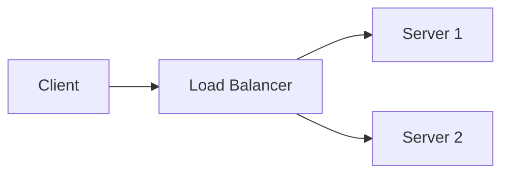
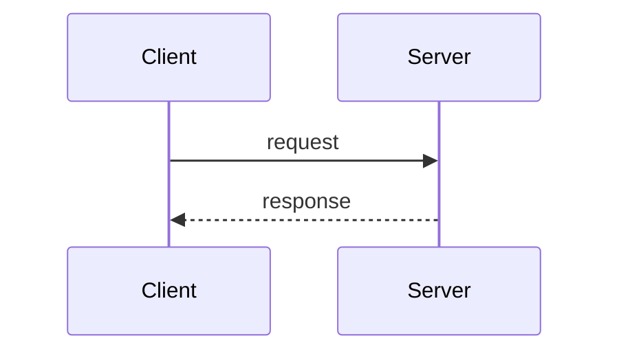

# Diagrams


```mermaid
flowchart LR
  A[Client] --> B[Load Balancer]
  B --> C[Server 1]
  B --> D[Server 2]
```


```mermaid
sequenceDiagram
  Client->>Server: request
  Server-->>Client: response
```

```js
const x = 1;
```
