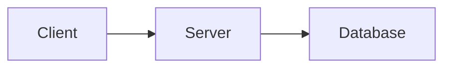

# Canary Media and Diagrams

## Overview

This canary carries an image, a diagram, a video embed and structure visualisations, plus enough prose to count as a real article and to give scroll-based tests a tall page.

## Images

An image with alt text opens in the zoom overlay with that text as its caption:


An image with empty alt text opens without a caption:


## Video

A bare video URL on its own line becomes a responsive embed:

https://www.youtube.com/watch?v=dQw4w9WgXcQ

A bare URL that is not a video stays a plain link:

https://example.com/plain-page

## Diagram



## Structures

```viz
bst
[5, 3, 8, 1, 4]
```

```viz
heap
[9, 7, 8, 3, 2, 5]
```

```viz
linked-list
[1, 2, 3]
```

```viz
array
[10, 20, 30]
```

## Long Form

Below this point the page is plain prose, so the diagram and the structures above sit well inside the document rather than at its edge.

### First Reading Block

A cache stores the results of expensive lookups so a repeat request can be answered without redoing the work. The central trade-off is freshness against speed: the longer an entry lives, the more likely a reader sees stale data, and the shorter it lives, the less the cache helps. Eviction policies such as least-recently-used decide which entry to drop when space runs out, and they work well when recent access predicts future access.

A load balancer spreads requests across several servers so no single machine becomes the bottleneck. Round robin hands each server a turn in order, while least-connections sends work to whichever server is currently the least busy. Health checks remove a failed server from rotation, and sticky sessions pin a client to one server when state is kept in memory.

### Second Reading Block

A message queue decouples the part of a system that produces work from the part that performs it. Producers append messages and move on, and consumers pull them at their own pace, which smooths out bursts and lets either side scale independently. At-least-once delivery means a consumer may see the same message twice, so handlers should be idempotent.

Consistent hashing places both servers and keys on a ring and assigns each key to the next server clockwise. Adding or removing a server then moves only the keys between it and its neighbour, instead of reshuffling nearly everything as a modulo scheme would. Virtual nodes smooth out the distribution by giving each physical server many positions on the ring.

### Third Reading Block

A content delivery network keeps copies of static files on servers close to readers, so a request travels a short distance instead of crossing a continent. The origin only sees a request when the edge copy is missing or expired, which also shields it from traffic spikes. Cache keys, time-to-live headers and explicit purges decide how quickly a change reaches every edge location.

Database replication copies writes from a primary to one or more followers. Reads can be served by followers to spread load, at the price of replication lag: a follower may briefly return data older than the latest write. Synchronous replication waits for a follower to confirm before acknowledging a write, trading latency for the guarantee that an acknowledged write survives the loss of the primary.

### Fourth Reading Block

Rate limiting protects a service from clients that send more requests than it can handle. A token bucket refills at a steady rate and lets short bursts through as long as tokens remain, while a sliding window counts requests over the most recent interval and rejects the excess. Returning a clear status and a retry hint lets well-behaved clients back off instead of hammering the service.

Observability rests on three signals that complement each other: metrics summarise behaviour over time, logs record individual events, and traces follow one request across service boundaries. A useful dashboard starts from the questions an on-call engineer asks first, such as whether errors, latency or saturation changed, and links each answer to the underlying evidence.

### Closing Notes

Everything here is deliberately ordinary prose so that scrolling, sticky headers and anchor links have plain text to work against.
